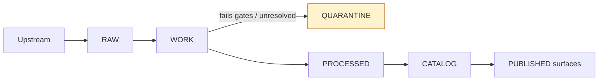

# data/quarantine
Fail-closed holding area for datasets/artifacts that **must not** be promoted or served until issues are resolved.

**Status:** Active  
**Owners:** Data Steward(s) + Pipeline Operator(s) *(fill in per repo governance)*  
`zone: quarantine` `promotion: blocked` `policy: deny-by-default` `runtime: never serve`

---

## Navigation
- [Purpose](#purpose)
- [Where quarantine fits](#where-quarantine-fits)
- [What goes here](#what-goes-here)
- [What must not go here](#what-must-not-go-here)
- [Directory layout](#directory-layout)
- [Quarantine record](#quarantine-record)
- [Workflow](#workflow)
- [Promotion checklist](#promotion-checklist)
- [Safety and sensitive data](#safety-and-sensitive-data)
- [Appendix: templates](#appendix-templates)

---

## Purpose
This directory exists to isolate any dataset version or intermediate artifact that **cannot pass minimum promotion requirements** (e.g., licensing unclear, validation failures, sensitivity concerns, upstream instability). Quarantine is a **fail-closed** safety mechanism: items here are **blocked from promotion** and **must not be served** by any runtime surface (API, Map, Story, Focus).

> **WARNING:** Do not “temporarily promote” quarantined datasets.  
> Quarantine exists specifically to prevent ad hoc publication.

---

## Where quarantine fits
Quarantine is part of the broader “WORK / QUARANTINE” stage of the truth path (between RAW acquisition and PROCESSED publishable artifacts).



---

## What goes here
Put a dataset/artifact in **quarantine** when any of the following are true:

- **License / rights are unclear** (cannot confidently publish)
- **Validation fails** (schema/spatial/temporal/link checks, etc.)
- **Sensitivity classification is unclear** (or indicates restricted categories)
- **Upstream instability prevents reproducible acquisition** (cannot re-fetch deterministically)

Quarantine may contain:
- QA/validation reports
- Normalized intermediate outputs used for debugging and remediation
- Candidate redactions/generalizations (or notes describing them)
- Minimal metadata needed to resolve licensing/sensitivity/reproducibility questions

---

## What must not go here
- Anything already approved for **PROCESSED + CATALOG** release.
- Anything intended to be read by end users or surfaced as “available data”.
- Secrets or credentials of any kind.
- “Temporary” copies meant to bypass gates.

If you need a scratch area for experimentation that is not a governance state, use a workspace elsewhere; **do not overload quarantine** for convenience.

---

## Directory layout
This repo uses `data/quarantine/` as a **hard isolation boundary**. Organize quarantined items so they are easy to audit, review, and resolve.

Suggested layout (adapt if the repo already has conventions):

```text
data/quarantine/
  README.md

  <dataset_slug>/                     # stable dataset identifier (see below)
    <quarantine_id>/                  # short, unique id OR a dataset_version_id
      quarantine.json                 # REQUIRED quarantine record (machine-readable)
      notes.md                        # OPTIONAL human notes / links / discussion

      inputs/                         # OPTIONAL copies if rights allow; otherwise references only
      qa/                             # validation outputs (prefer JSON)
      work/                           # normalized intermediates used for remediation/debug
      redaction_candidates/           # candidate generalizations/redactions, if applicable
```

### Naming: dataset_slug
Keep `dataset_slug` predictable:
- lowercase
- underscore-separated words
- include upstream authority when helpful
- **do not include dates** in the slug (dates belong in version IDs)

Examples:
- `noaa_ncei_storm_events`
- `usgs_nwis_kansas`
- `fema_disaster_declarations`

---

## Quarantine record
Every quarantined item **must** have a machine-readable record that captures *why it is blocked and how it gets unblocked*.

### Required minimum fields
Your `quarantine.json` (or equivalent) must include:

| Field | Required | Meaning |
|---|---:|---|
| `reason_code` | ✅ | A short code explaining why the dataset/artifact is quarantined |
| `remediation` | ✅ | Who resolves it, by when, and what the plan is |
| `policy_default` | ✅ | The default posture while quarantined (must be “deny publish”) |

Recommended additional fields:
- `dataset_slug`
- `dataset_version_id` (if known) and/or `spec_hash` (if used)
- pointers to `raw_manifest`, `validation_report`, `sensitivity_scan`, and upstream references
- `status` (`open`, `in_progress`, `resolved`, `wont_fix`)
- `created_at`, `updated_at`
- `resolution_notes` + links to evidence showing it is safe to promote

### Reason codes (starter set)
Keep reason codes short and audit-friendly:
- `RIGHTS_UNCLEAR`
- `VALIDATION_FAIL`
- `SENSITIVITY_UNCLEAR`
- `UPSTREAM_UNSTABLE`
- `OTHER` (use sparingly; add detail in `summary`)

---

## Workflow
### 1) Quarantine (fail closed)
When a gate fails or a required attribute is unknown:
- Create a new folder under `data/quarantine/<dataset_slug>/<quarantine_id>/`
- Write a `quarantine.json` with **reason + remediation + deny-by-default**
- Add/attach any QA artifacts needed to reproduce and fix the issue

### 2) Remediate
Typical remediation actions:
- **Rights:** obtain explicit license/terms, document attribution, ensure publish compatibility
- **Validation:** fix schema mappings, CRS/geometry issues, temporal precision, link correctness
- **Sensitivity:** classify correctly; design a redaction/generalization plan; document it
- **Reproducibility:** stabilize acquisition (pin versions, snapshot upstream, deterministic ordering)

Keep remediation outputs in `qa/`, `work/`, and/or `redaction_candidates/` so reviewers can confirm.

### 3) Re-run deterministically
Re-run the pipeline in a deterministic way and produce:
- validation outputs (prefer JSON)
- run receipts (inputs/outputs enumerated with checksums)
- updated artifacts and metadata needed for promotion

### 4) Promote (only after gates pass)
Once the minimum promotion gates pass:
- write publishable outputs to **PROCESSED**
- generate/validate catalogs (DCAT/STAC/PROV)
- record policy label assignment and any obligations applied
- close out quarantine as `resolved` (keep the record for audit)

> If license or sensitivity is still unclear: **do not promote**.

### 5) Close and retain
Do not delete quarantine records casually. They are part of the audit trail. If the repo has a retention policy, follow it.

[Back to top](#dataquarantine)

---

## Promotion checklist
A quarantined dataset version is eligible to leave quarantine only when all applicable promotion gates are satisfied:

- [ ] **Identity/versioning** is stable and deterministic (dataset + version IDs)
- [ ] **License/rights** are explicit and compatible *(if unclear → stays quarantined)*
- [ ] **Sensitivity/policy label** assigned; redaction/generalization plan exists if needed
- [ ] **Catalog triplet** validates and cross-links resolve (DCAT + STAC + PROV)
- [ ] **Run receipt + checksums** exist for producing runs (inputs/outputs enumerated)
- [ ] **Policy/contract tests** pass (deny-by-default behavior enforced where applicable)

---

## Safety and sensitive data
- Treat quarantine as **deny-by-default** for publication and access.
- If a dataset may contain sensitive locations or restricted categories:
  - avoid storing precise coordinates in casually accessible derived files
  - prefer candidate generalizations/redactions, then promote only generalized outputs as allowed
- If rights restrict mirroring:
  - store **manifests + references + hashes** rather than copying upstream files

---

## Appendix: templates
### Example `quarantine.json` (starter template)
```json
{
  "kfm_quarantine_record_version": "v1",
  "dataset_slug": "example_dataset",
  "dataset_version_id": null,
  "spec_hash": null,

  "reason_code": "RIGHTS_UNCLEAR",
  "summary": "License terms are not explicit enough to publish; attribution requirements unknown.",

  "policy_default": {
    "decision": "deny",
    "policy_label": "quarantine"
  },

  "remediation": {
    "owner": "<role-or-person>",
    "by": "YYYY-MM-DD",
    "plan": [
      "Locate authoritative license/terms page or written permission",
      "Record attribution and usage constraints in metadata",
      "Re-run validation gate for rights metadata"
    ]
  },

  "evidence": {
    "raw_manifest": "<path-or-ref>",
    "validation_report": "<path-or-ref>",
    "sensitivity_scan": "<path-or-ref>",
    "upstream_reference": "<path-or-ref>"
  },

  "status": "open",
  "created_at": "YYYY-MM-DD",
  "updated_at": "YYYY-MM-DD"
}
```

### Example `notes.md` (optional)
```md
# Quarantine notes — <dataset_slug> / <quarantine_id>

## What broke
- …

## What we need to decide / verify
- …

## Links
- Upstream terms/license: …
- Validation report: …
- Sensitivity discussion: …

## Resolution
- …
```
