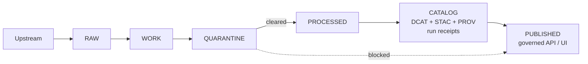

<!-- [KFM_META_BLOCK_V2]
doc_id: kfm://doc/1b9f1c6a-21b9-4c1b-93a4-2c7cbd0fb2a9
title: data/quarantine — Quarantine zone README
type: standard
version: v1
status: draft
owners: kfm-core (TBD)
created: 2026-02-22
updated: 2026-02-22
policy_label: public
related:
  - kfm://doc/kfm-gdg-vnext (TBD)
tags:
  - kfm
  - data-lifecycle
  - quarantine
notes:
  - Quarantined items are not promotable and must remain default-deny.
[/KFM_META_BLOCK_V2] -->

<a id="top"></a>

# `data/quarantine/` — Quarantine zone (promotion blocked)

> **Purpose:** Store dataset versions/artifacts that cannot be promoted due to validation failure, unclear licensing/rights, sensitivity concerns, or upstream instability.  
> **Hard rule:** Anything under `data/quarantine/` is **not** served by runtime surfaces (API/UI) and **must not** be promoted until cleared.


## Quick navigation
- [Why this folder exists](#why-this-folder-exists)
- [What belongs here](#what-belongs-here)
- [What must NOT be here](#what-must-not-be-here)
- [Directory conventions](#directory-conventions)
- [Quarantine record required](#quarantine-record-required)
- [Workflow](#workflow-fail-closed)
- [How to remediate and promote](#how-to-remediate-and-promote)
- [Definition of Done for clearing quarantine](#definition-of-done-for-clearing-quarantine)
- [Appendix: templates](#appendix-templates)

---

## Why this folder exists

KFM’s “truth path” includes a **WORK/QUARANTINE** stage between **RAW** acquisition and **PROCESSED** publishing. Quarantine is the **fail-closed** holding area where we keep intermediate artifacts + evidence while governance/QA issues are resolved.



**Interpretation for this repo:** `data/quarantine/` is an explicit quarantine sub-zone. If your implementation treats quarantine as a subfolder of `data/work/`, adjust paths — the behaviors described here still apply.

---

## What belongs here

Put an item in `data/quarantine/` when **any** of the following is true:

1. **Validation failed** (schema, geometry, completeness, drift thresholds, etc.).
2. **Licensing/rights are unclear** (unknown license, conflicting terms, missing attribution requirements).
3. **Sensitivity classification is unclear** or a **redaction/generalization plan is missing**.
4. **Upstream instability** prevents reproducible acquisition (e.g., non-deterministic responses, frequently changing endpoints without versioning).

Quarantine may include (typical examples):
- normalized/intermediate datasets (e.g., parsed tables, reprojected vectors, OCR outputs)
- QA outputs (machine-readable validation reports)
- candidate redactions/generalizations
- provisional entity resolution outputs

---

## What must NOT be here

### Never store secrets
Do not commit credentials, API tokens, private keys, or other secrets. Use the project’s secret management mechanism.

### Do not replace RAW
Quarantine is **not** a substitute for RAW acquisition. Original source artifacts belong in RAW (immutable). Quarantine can reference RAW artifacts by digest and include derived/intermediate outputs.

### No “temporary promotion”
Do not route quarantined artifacts into PROCESSED/CATALOG/PUBLISHED “just for a demo.” If it’s quarantined, promotion is blocked.

---

## Directory conventions

We keep quarantine organized by **dataset identity** and **blocked version** so it can be audited and cleared deterministically.

Recommended layout (adapt if the repo uses a different convention):

```text
data/quarantine/                                   # Quarantined artifacts (failed gates; never promoted/served)
├─ README.md                                       # What quarantine means, entry/exit criteria, and retention rules
│
└─ <dataset_id>/                                   # Dataset family under quarantine
   └─ <dataset_version_id>/                        # Version identifier (from spec_hash or equivalent; stable)
      ├─ quarantine.json                            # REQUIRED: reason, scope, detection time, remediation plan, owner
      │
      ├─ qa/                                        # Machine-readable diagnostics (why it failed)
      │  ├─ validation.json                         # Validation failures (schemas/geo/time/license/policy)
      │  └─ drift.json                              # Drift/quality deltas (if computed; thresholds breached)
      │
      ├─ work/                                      # Intermediate artifacts captured for debugging (bounded; reproducible)
      │  └─ …                                       # Logs, partial outputs, repro inputs (no secrets; keep small)
      │
      └─ notes/                                     # Optional human notes (no secrets; reviewer-friendly)
         └─ README.md                               # Context + links to issues/PRs + remediation checklist
```

Naming rules:
- `<dataset_id>` SHOULD be stable and match the project’s dataset naming convention.
- `<dataset_version_id>` SHOULD be immutable and derived from the dataset spec hash (or equivalent deterministic ID).

---

## Quarantine record required

Every quarantined dataset version MUST include a `quarantine.json` (or `quarantine.yaml`) containing:

- `reason_code` (machine-parseable)
- `reason_detail` (human explanation)
- `first_quarantined_at`
- `owner` (person/team responsible)
- `remediation_plan`
  - steps
  - who/role
  - due date (if applicable)
- `policy_default` (must be `deny_publish`)
- references to:
  - RAW inputs (digests/URIs)
  - pipeline spec hash / run id (if available)
  - failing QA report paths

**Recommended:** treat `quarantine.json` as a mini audit log (append updates via a `history[]` array rather than overwriting fields).

---

## Workflow (fail-closed)

### 1) Detect → Quarantine
- A pipeline, validator, or reviewer flags a gate failure.
- Move or write outputs into `data/quarantine/<dataset_id>/<dataset_version_id>/`.
- Write `quarantine.json`.
- Ensure any “promotion” automation refuses to proceed.

### 2) Diagnose
- Re-run validators locally/CI with the same RAW inputs and pinned environment.
- Identify the minimal fix (schema mapping, rights clarification, redaction plan, upstream pinning).

### 3) Remediate
Common remediation patterns:
- **License fix:** obtain explicit license, record rights/attribution requirements.
- **Validation fix:** patch the pipeline/schemas, regenerate intermediate outputs.
- **Sensitivity fix:** assign policy label, implement redaction/generalization, record the plan in provenance.
- **Upstream stability fix:** snapshot RAW immutably, pin queries, record versions/checksums.

### 4) Clear → Promote
Only after all required promotion gates pass should outputs be regenerated into PROCESSED and catalog triplet materials created/validated.

---

## How to remediate and promote

Promotion requires producing **publishable artifacts**, **validated catalogs**, **run receipts**, and **policy label assignment**. At a minimum, ensure:

- Stable dataset + dataset version identity
- Explicit license/rights metadata (**fail closed if unclear**)
- Policy label assigned + redaction/generalization plan recorded (if needed)
- DCAT/STAC/PROV triplet exists, validates, and cross-links
- Run receipt exists with input/output checksums and environment details
- Policy tests and contract tests pass in CI

---

## Definition of Done for clearing quarantine

A quarantined dataset version is considered **cleared** when:

- [ ] Quarantine reason is resolved and documented
- [ ] License/rights are explicit and recorded
- [ ] Policy label is assigned; obligations/redactions are implemented and recorded
- [ ] Validators pass (including any drift thresholds)
- [ ] Artifacts regenerated deterministically from RAW inputs
- [ ] Run receipt exists and lists all inputs/outputs with checksums
- [ ] Catalog triplet validates and cross-links
- [ ] Promotion automation/CI gates pass

After clearing:
- [ ] Mark the quarantine record as **resolved** (do not delete it; keep auditability)
- [ ] Promote through PROCESSED → CATALOG in a reviewed change (PR)

---

## Appendix: templates

### `quarantine.json` (minimal)

```json
{
  "dataset_id": "example.dataset",
  "dataset_version_id": "spec_hash:abcdef1234",
  "status": "quarantined",
  "reason_code": "LICENSE_UNCLEAR",
  "reason_detail": "Upstream page does not specify license terms; cannot verify redistribution rights.",
  "first_quarantined_at": "2026-02-22T00:00:00Z",
  "owner": "kfm-data-stewards",
  "policy_default": "deny_publish",
  "references": {
    "raw_inputs": [
      { "uri": "raw://example/source/file.csv", "sha256": "..." }
    ],
    "run_id": "run:20260222-xyz",
    "qa_reports": [
      "qa/validation.json"
    ]
  },
  "remediation_plan": {
    "steps": [
      "Identify rights holder and obtain explicit license grant or compatible terms",
      "Record attribution requirements in dataset metadata",
      "Re-run validation and re-generate artifacts"
    ],
    "due_date": "2026-03-15",
    "assigned_to": "kfm-data-stewards"
  }
}
```

### Reason code suggestions

| Code | When to use |
|---|---|
| `VALIDATION_FAILED` | Any hard validation gate fails |
| `LICENSE_UNCLEAR` | License/terms cannot be confirmed |
| `SENSITIVITY_UNCLEAR` | Sensitivity/policy label cannot be assigned yet |
| `REDACTION_REQUIRED` | Sensitive data needs generalization/redaction work |
| `UPSTREAM_UNSTABLE` | Upstream changes prevent reproducible acquisition |

---

<p align="right"><a href="#top">Back to top</a></p>
