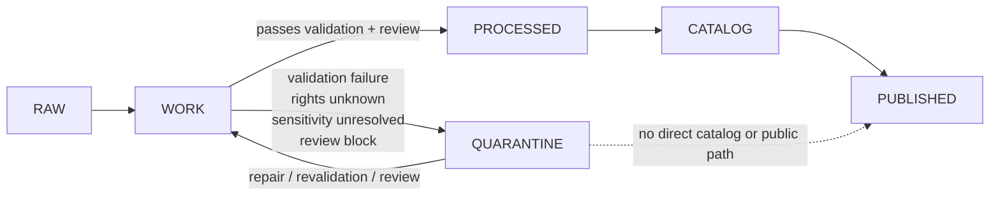

<!-- [KFM_META_BLOCK_V2]
doc_id: <REVIEW: kfm://doc/uuid-pending>
title: data/quarantine
type: standard
version: v1
status: draft
owners: <REVIEW: data stewardship / intake / policy owner(s) pending>
created: <REVIEW: YYYY-MM-DD pending>
updated: <REVIEW: YYYY-MM-DD pending>
policy_label: <REVIEW: policy label pending>
related: [../../README.md, <REVIEW: adjacent data-zone docs pending verification>]
tags: [kfm, data, quarantine]
notes: [Grounded in current KFM doctrine and repo-grounded summary evidence; exact mounted subtree, owners, dates, and adjacent README coverage remain NEEDS VERIFICATION.]
[/KFM_META_BLOCK_V2] -->

# data/quarantine

Fail-closed holding zone for material that has entered KFM but cannot advance safely without review, clarification, repair, or revalidation.

> **Status:** active  
> **Doc maturity:** draft / verification-bounded  
> **Owners:** `<REVIEW: data stewardship / intake / policy owner(s) pending>`  
>      
> **Quick jump:** [Scope](#scope) · [Repo fit](#repo-fit) · [Inputs](#inputs) · [Exclusions](#exclusions) · [Directory tree](#directory-tree) · [Quickstart](#quickstart) · [Usage](#usage) · [Diagram](#diagram) · [Tables](#tables) · [Task list](#task-list) · [FAQ](#faq) · [Appendix](#appendix)

> [!IMPORTANT]
> `data/quarantine/` is a governed lifecycle state, not a convenience dump folder. Material lands here when KFM must remain honest about uncertainty, policy burden, or validation failure instead of smoothing it into premature publication.

> [!NOTE]
> This README keeps **doctrinal certainty** separate from **mounted-repo certainty**. KFM doctrine strongly establishes the role of quarantine. Exact subtree layout, helper scripts, owner assignments, and active enforcement details still require direct repo verification.

## Scope

Quarantine is where KFM keeps blocked material **visible, inspectable, and contained** without granting it more trust than it has earned.

| Statement | Status | Why it matters |
|---|---|---|
| Quarantine is part of the canonical governed path. | **CONFIRMED** | It appears inside the core truth path rather than as an ad hoc side lane. |
| Quarantine is for blocked, failed, ambiguous, or review-held material. | **CONFIRMED** | Validation, rights, sensitivity, and review all have fail-closed consequences in KFM doctrine. |
| Quarantine must not act like pseudo-production. | **CONFIRMED** | Derived/public surfaces must not outrun release state, policy, or evidence status. |
| Review and stewardship operations include quarantine inspection, denial, promotion, rollback, and rights handling. | **CONFIRMED** | Quarantine is an operational review surface, not just a storage location. |
| The exact mounted subtree under `data/quarantine/` is known in this session. | **UNKNOWN / NEEDS VERIFICATION** | Current evidence did not directly inspect the repo tree. |

### What quarantine is for

`data/quarantine/` exists to isolate uncertainty without hiding it. It is the place to hold material that is:

- too important to discard,
- too unresolved to publish,
- too risky to expose directly,
- or too incomplete to treat as canonical.

That makes it a **truth-preserving** zone rather than a failure byproduct.

## Repo fit

**Path:** `data/quarantine/README.md`  
**Upstream:** [`../../README.md`](../../README.md)  
**Lifecycle context:** doctrinally tied to `RAW -> WORK / QUARANTINE -> PROCESSED -> CATALOG -> PUBLISHED`; exact mounted sibling docs and directory coverage remain **NEEDS VERIFICATION**.

| Relationship | Reference | Role here | Verification posture |
|---|---|---|---|
| Self | `data/quarantine/README.md` | Directory contract and operating guide for quarantine handling | Target path supplied by task |
| Repo root | `../../README.md` | Higher-level repo orientation and cross-repo navigation | Linked path supplied by task |
| Lifecycle upstream | `data/raw/`, `data/work/` | Intake and transform staging before or beside quarantine routing | **CONFIRMED** as doctrine / mounted paths **NEEDS VERIFICATION** |
| Lifecycle downstream | `data/processed/`, `data/catalog/`, `data/published/` | Canonical, closure, and outward release states that quarantine must not bypass | **CONFIRMED** as doctrine / mounted paths **NEEDS VERIFICATION** |
| Stewardship surface | review / policy / release artifacts | Human and machine review path for promotion, denial, rollback, and correction | **CONFIRMED** doctrinally / exact repo locations **UNKNOWN** |

> [!WARNING]
> Do not normalize quarantine into “just another intermediate folder.” In KFM, lifecycle state changes are governance events.

## Inputs

### Accepted inputs

Only material that is **blocked, ambiguous, explicitly under review, or awaiting safe transformation** belongs here.

| Accepted input | Why it belongs here | Minimum companion context |
|---|---|---|
| Validation-failed candidate artifacts | They cannot advance to canonical truth or outward release yet. | Subject/source reference, failure summary, validation evidence |
| Rights-unclear material | KFM fails closed when redistribution or publication posture is unresolved. | Rights note or source terms snapshot, steward review need |
| Sensitivity-unclear material | Exact-location, privacy, sovereignty, or cultural-sensitivity risk may still be unresolved. | Sensitivity note, public-safe handling note, review requirement |
| Review-blocked submissions | A human or policy lane has not cleared advancement. | Blocking reason, reviewer role, next action |
| Candidate redaction/generalization outputs | A safer representation may exist, but has not yet been approved. | Comparison context, transform note, review requirement |
| Correction or rollback candidates | A release or candidate may need narrowing, withdrawal, or replacement. | Affected release/candidate reference, correction note |
| QA and triage artifacts for blocked material | They explain why a case is quarantined and what has to happen next. | Stable case/subject reference, timestamps, author/reviewer context |

### Input rule of thumb

If the artifact can already be defended as **public-safe, released, and authoritative**, it does **not** belong here.

If it cannot yet be defended that way but must remain visible, governable, and reviewable, it probably does.

## Exclusions

### What does **not** belong here

| Excluded material | Where it should go instead | Why |
|---|---|---|
| Immutable source captures and original payloads | `data/raw/` | Raw capture should remain source-faithful and append-only. |
| Ordinary transform scratch that is not blocked or ambiguous | `data/work/` | Not every intermediate is a quarantine case. |
| Canonical candidates that have passed required validation and review | `data/processed/` | Processed is for authoritative candidate/published truth states, not unresolved material. |
| Outward metadata closure objects | `data/catalog/` | STAC/DCAT/PROV closure implies a stronger readiness state. |
| Public-safe published outputs | `data/published/` | Published exposure follows promotion, not uncertainty. |
| Release proof packs or release manifests for approved outward releases | The release/review path the repo actually uses | Quarantine explains blocked state; it should not become the default proof store for trusted release artifacts. |
| Personal scratch notes or undocumented local temp files | Local scratch outside governed lanes | They carry no governed lifecycle meaning. |

> [!CAUTION]
> “We know it is questionable, but let's expose it anyway” is exactly the failure mode quarantine is designed to stop.

## Directory tree

The exact mounted subtree was not directly inspected in this session. The safest useful view is therefore the **doctrinal zone map** that contributors need to understand first.

```text
data/
├── raw/          # source-native captures
├── work/         # transform / QA staging
├── quarantine/   # blocked / ambiguous / review-held material
│   └── README.md
├── processed/    # authoritative candidate or promoted subject sets
├── catalog/      # outward STAC / DCAT / PROV closure
└── published/    # public-safe outward release state
```

<details>
<summary><strong>PROPOSED starter substructure for one quarantine case</strong></summary>

```text
data/quarantine/
└── <case_or_subject_id>/
    ├── payload/                  # blocked or review-held artifact(s)
    ├── triage.yaml               # why this case is here
    ├── validation/               # failed checks, diffs, QA evidence
    ├── review/                   # notes, decisions, escalation context
    ├── transforms/               # redaction/generalization candidates
    └── manifest.json             # transfer/intake note
```

Use this only after checking the mounted repo and any established local conventions.

</details>

## Quickstart

Use quarantine when an item **must not move forward yet**, but also **must not disappear into undocumented limbo**.

1. Create or select a stable case or subject identifier.
2. Place the blocked artifact and its minimum context in the case folder.
3. Record why promotion is blocked.
4. Record who must review it and what must change before it can leave quarantine.
5. Keep it off catalog and published surfaces until revalidation and review are complete.

```bash
# Illustrative only — verify actual repo conventions before use.
CASE_ID="q-YYYYMMDD-example-001"
mkdir -p "data/quarantine/${CASE_ID}"

# Add the blocked artifact
cp /path/to/candidate-artifact.ext "data/quarantine/${CASE_ID}/payload/"

# Add a minimal triage note
cat > "data/quarantine/${CASE_ID}/triage.yaml" <<'YAML'
case_id: q-YYYYMMDD-example-001
status: quarantine
reason_codes:
  - rights_unknown
source_ref: raw:source-or-batch-ref
required_review:
  - steward
public_exposure: blocked
candidate_next_step: revalidate_after_review
YAML
```

## Usage

### Entry triggers

Move material into quarantine when one or more of the following is true:

1. **Validation failed**
2. **Rights are unknown or not yet cleared**
3. **Sensitivity or precision handling is unresolved**
4. **Review explicitly blocked advancement**
5. **A correction, rollback, or narrowing path is being assembled**
6. **The item cannot yet support outward identifiers, closure, or public-safe release**

### Minimum quarantine case record

A quarantine case should carry enough information that another steward can understand the block **without guessing**.

| Minimum record | Why it is needed | Confidence |
|---|---|---|
| Source or subject reference | Keeps the case tied to an upstream intake, batch, release, or candidate | **CONFIRMED** doctrinal need |
| Plain-language block reason | Makes the fail-closed state legible | **CONFIRMED** doctrinal need |
| Validation or review evidence | Proves the block is inspectable, not hand-wavy | **CONFIRMED** doctrinal need |
| Rights / sensitivity posture | Explains why public exposure is blocked or limited | **CONFIRMED** doctrinal need |
| Reviewer / steward responsibility | Prevents silent long-term limbo | **CONFIRMED** doctrinal need |
| Next action | Makes the exit path explicit | **CONFIRMED** doctrinal need |
| Candidate safer representation (if any) | Supports redaction/generalization review | **PROPOSED** when applicable |

> [!TIP]
> KFM doctrine confirms object families such as `SourceDescriptor`, `IngestReceipt`, `ValidationReport`, `DecisionEnvelope`, `ReviewRecord`, `EvidenceBundle`, `ReleaseManifest / ReleaseProofPack`, and `CorrectionNotice`. Exact local filenames for those objects are not yet verified for this repo.

### Exit paths

Material should leave quarantine only through a new governed transition, not through quiet folder reshuffling.

| Exit path | When to use it | Expected evidence before exit |
|---|---|---|
| Return to `work/` | More repair or transform work is needed before revalidation | Clear next-step note, retained case history |
| Promote toward `processed/` | Validation and review now support authoritative candidate or promoted state | Updated validation evidence, decision context, no unresolved block reason |
| Issue correction / replacement path | A prior release or candidate must be narrowed, replaced, or superseded | Correction context, affected release refs, rebuild/replacement notes |
| Withdraw / reject | Rights, quality, or sensitivity issues cannot be resolved | Decision note, reason code, retained lineage |
| Remain in quarantine | The case is still open | Current status, owner/reviewer, visible next step |

### Illustrative triage document

```yaml
# Illustrative example only — field names are starter guidance, not a confirmed repo schema.
case_id: q-2026-03-22-demo-001
subject_ref: raw:hydro.batch.0001
status: quarantine
reason_codes:
  - validation.schema_failed
  - rights.unknown
required_review:
  - data_steward
  - policy_review
public_exposure: blocked
notes: >
  Do not catalog or publish. Re-run validation after geometry repair and rights clarification.
```

## Diagram


```mermaid
flowchart LR
    A[RAW] --> B[WORK]
    B -->|passes validation + review| C[PROCESSED]
    B -->|validation failure<br/>rights unknown<br/>sensitivity unresolved<br/>review block| Q[QUARANTINE]
    Q -->|repair / revalidation / review| B
    C --> D[CATALOG]
    D --> E[PUBLISHED]

    Q -. no direct catalog or public path .-> E
```

The operating idea is simple: **quarantine keeps uncertainty visible and contained until the system can either advance safely or refuse cleanly**.

## Tables

### Zone behavior at a glance

| Zone | Primary purpose | What must not happen |
|---|---|---|
| `raw/` | Source-faithful intake and capture | In-place mutation or publication-by-accident |
| `work/` | Repeatable transform and QA staging | Silent promotion without gates |
| `quarantine/` | Isolation of blocked, ambiguous, or review-held material | Warning-only pseudo-production |
| `processed/` | Authoritative candidate or promoted subject state | Carrying unresolved uncertainty as if it were settled |
| `catalog/` | STAC/DCAT/PROV outward closure and release linkage | Declaring closure before release and lineage are ready |
| `published/` | Public-safe outward exposure | Treating publication as a file copy instead of a governed transition |

### Allowed vs blocked operations in `data/quarantine/`

| Operation | Allowed? | Notes |
|---|---|---|
| Store blocked material with context | Yes | This is the core purpose of the zone. |
| Add failure evidence, review notes, and triage context | Yes | Quarantine should increase clarity, not reduce it. |
| Prepare candidate redactions or safer generalized outputs | Yes | Keep them inspectable and clearly non-final. |
| Attach outward catalog closure and public-safe release identifiers | No | Closure belongs downstream after gates pass. |
| Serve quarantine material through normal public UI or public API routes | No | That would violate the trust membrane. |
| Quietly move content forward without updated evidence and review context | No | Every exit must be legible. |

## Task list

Use this as the minimum definition-of-done for a quarantine case.

- [ ] Stable case or subject reference recorded
- [ ] Block reason recorded in plain language
- [ ] Validation and/or review evidence attached
- [ ] Rights and sensitivity posture noted
- [ ] Required reviewer or steward identified
- [ ] Public exposure explicitly marked **blocked** or otherwise constrained
- [ ] Next action recorded: repair, review, revalidate, reject, withdraw, or replace
- [ ] Exit decision captured before any move toward `processed/`, `catalog/`, or `published/`

## FAQ

### Is quarantine just for “bad data”?

No. It is also for unclear rights, unresolved sensitivity, blocked review, correction work, and other cases where KFM must fail closed instead of pretending the material is ready.

### Can something stay here for a while?

Yes, but not silently. Long-lived quarantine cases need visible ownership, a current reason, and a current next step.

### Can the UI or API read directly from quarantine?

Normal public or standard user surfaces should not. Quarantine exists precisely to prevent blocked or ambiguous material from leaking into outward trust surfaces.

### Is quarantine the same as `work/`?

No. `work/` is general transform and QA staging. `quarantine/` is the stricter lane for material that is blocked, ambiguous, or awaiting review.

### Why not just fix the issue downstream?

Because lifecycle states in KFM are governed transitions, not magic folders. Repair should create a legible path forward rather than erasing the fact that the item was previously blocked.

### Where should proof for an approved release live?

With the release/review path the repo actually uses. This README does not assert a specific proof directory that was not directly verified.

## Appendix

<details>
<summary><strong>Status vocabulary used in this README</strong></summary>

| Label | Meaning |
|---|---|
| **CONFIRMED** | Supported directly by current KFM doctrine or repo-grounded summary evidence |
| **INFERRED** | Strongly implied structural completion, but not verified as current repo reality |
| **PROPOSED** | Safe starter pattern or recommended implementation direction |
| **UNKNOWN** | Not directly proven in the current session |
| **NEEDS VERIFICATION** | A direct repo check should be made before treating the detail as settled |

</details>

<details>
<summary><strong>PROPOSED starter reason codes</strong></summary>

| Reason code | Use when |
|---|---|
| `validation.schema_failed` | Structure, type, geometry, or semantic validation failed |
| `rights.unknown` | License, terms, or redistribution basis is unresolved |
| `sensitivity.exact_location` | Exact location is too sensitive for the requested audience |
| `corroboration.conflicted` | Independent admissible sources disagree materially |
| `review.blocked` | A steward or policy review explicitly blocked advancement |
| `correction.pending` | A correction, rollback, or replacement path is being assembled |

</details>

<details>
<summary><strong>Maintenance notes for future editors</strong></summary>

1. Keep lifecycle terminology stable with the wider KFM truth path.
2. Do not upgrade this README from doctrinal guidance to implementation certainty without direct repo verification.
3. If local scripts, schemas, validators, or fixtures are added for quarantine handling, document them here with exact verified paths.
4. When behavior changes, update this README in the same change set.
5. Prefer showing one real proof object or example over adding more abstract prose.

</details>

[Back to top](#dataquarantine)
