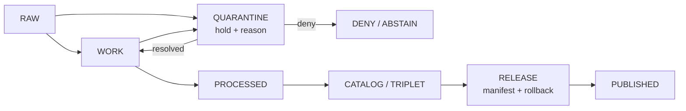

<!-- [KFM_META_BLOCK_V2]
doc_id: kfm://data/quarantine/readme
name: Data Quarantine README
path: data/quarantine/README.md
type: data-lifecycle-index-readme
version: v0.1.0
status: draft
owners:
  - <data-steward>
  - <policy-steward>
  - <sensitivity-reviewer>
  - <release-steward>
created: 2026-06-27
updated: 2026-06-27
policy_label: restricted-review
truth_posture: cite-or-abstain
lifecycle_phase: quarantine
responsibility_root: data/
artifact_family: held-cross-domain-material
sensitivity_posture: fail-closed; no-public-path; release-blocked; proof-required-before-exit; public-clients-denied
related:
  - ../README.md
  - raw/README.md
  - work/README.md
  - processed/README.md
  - catalog/README.md
  - published/README.md
  - proofs/README.md
  - receipts/README.md
  - registry/README.md
  - ../../docs/doctrine/directory-rules.md
  - ../../release/manifests/README.md
tags: [kfm, data, quarantine, lifecycle, hold, deny-by-default, evidence-first, source-role, sensitivity, release-gated]
notes:
  - "This README replaces the greenfield stub and documents the parent `data/quarantine/` lifecycle lane."
  - "Quarantine is a hold state, not a staging shortcut to processed, catalog, triplet, published, reports, layers, PMTiles, stories, graph/vector indexes, generated answers, or public UI."
  - "Domain child README presence does not prove held payload presence, validator wiring, CI enforcement, policy automation, review completion, or release readiness."
  - "Anything here must exit through governed review, evidence, policy, receipt, correction, rollback, and lifecycle placement checks."
[/KFM_META_BLOCK_V2] -->

<a id="top"></a>

# Data Quarantine

Parent lifecycle lane for KFM material that is held because it is not safe or sufficiently governed for normal work, processing, cataloging, triplet projection, publication, reporting, map rendering, story playback, graph/vector indexing, or generated-answer use.

<p>
  
  
  
  
  
  
</p>

**Quick links:** [Scope](#scope) · [Repo fit](#repo-fit) · [Confirmed domain indexes](#confirmed-domain-indexes) · [Common hold reasons](#common-hold-reasons) · [Inputs](#inputs) · [Exclusions](#exclusions) · [Directory map](#directory-map) · [Exit gates](#exit-gates) · [Forbidden shortcuts](#forbidden-shortcuts) · [Required checks](#required-checks-before-use) · [Status notes](#status-notes)

> [!CAUTION]
> `data/quarantine/` is a no-public-path hold lane. Material here is not public, not processed truth, not catalog truth, not proof, not release authority, not policy authority, not source registry authority, not a normal map/API/UI source, and not generated-answer authority. Nothing in this subtree may be consumed by public clients or normal UI surfaces until a governed exit transition leaves inspectable evidence.

---

## Scope

This directory holds material that failed, paused, or has not yet completed governance checks. Common blockers include unresolved source role, unclear rights, unresolved sensitivity, missing evidence, invalid geometry, invalid schema, stale source state, unresolved temporal role, over-precise location, missing receipt closure, missing review state, absent release state, missing correction path, or missing rollback target.

Quarantine preserves material for inspection and correction. It does not make held material true, safe, published, validated, released, cataloged, searchable, indexable, renderable, downloadable, or answerable.

---

## Repo fit

| Field | Value |
|---|---|
| Path | `data/quarantine/` |
| Responsibility root | `data/` |
| Lifecycle phase | `quarantine/` |
| Upstream neighbors | `data/raw/`, `data/work/` |
| Downstream neighbors | `data/processed/`, `data/catalog/`, `data/published/` only after governed exit |
| Artifact role | Held cross-domain material and quarantine-local review sidecars |
| Public access posture | No public path; no normal UI; no governed-public API exposure |
| Release authority | `release/`, not this directory |
| Proof authority | `data/proofs/` and `data/receipts/`, not this directory |
| Catalog authority | `data/catalog/`, not this directory |
| Registry authority | `data/registry/`, not this directory |
| Policy authority | `policy/`, not this directory |
| Default failure posture | `HOLD`, `DENY`, `RESTRICT`, or `ABSTAIN` when evidence, source role, rights, sensitivity, validation, review, correction, rollback, or release support is insufficient |

---

## Confirmed domain indexes

The parent domain README paths below were verified during this documentation sequence. This table confirms README/index presence only; it does **not** prove held payloads, validators, policy automation, CI enforcement, or completed review.

| Domain path | Status | Boundary summary |
|---|---|---|
| [`agriculture/`](agriculture/README.md) | **CONFIRMED README** | Private farm/operator/parcel joins and field-level claims fail closed. |
| [`archaeology/`](archaeology/README.md) | **CONFIRMED README** | Exact site geometry and sensitive archaeology material stay held unless reviewed/redacted. |
| [`atmosphere/`](atmosphere/README.md) | **CONFIRMED README** | Candidate weather/air/climate material stays held when source, role, freshness, or public-safety framing is unresolved. |
| [`fauna/`](fauna/README.md) | **CONFIRMED README** | Sensitive occurrence, site, telemetry, and geoprivacy material are deny-by-default. |
| [`flora/`](flora/README.md) | **CONFIRMED README** | Rights, source-role, rare-plant geometry, taxonomy, and sensitive joins fail closed. |
| [`geology/`](geology/README.md) | **CONFIRMED README** | Rights, source role, exact boreholes/samples, sensitive resources, wells, and interpretation collapse stay held. |
| [`habitat/`](habitat/README.md) | **CONFIRMED README** | Join-induced sensitivity, land cover, ecoregions, and over-precise geometry fail closed. |
| [`hazards/`](hazards/README.md) | **CONFIRMED README** | KFM is not an emergency alert authority; role-collapsed hazard material stays held. |
| [`hydrology/`](hydrology/README.md) | **CONFIRMED README** | NFHL/regulatory context, station identity, source role, and emergency framing require hold when unresolved. |
| [`people-dna-land/`](people-dna-land/README.md) | **CONFIRMED README** | Living-person, DNA/genomic, consent, private person-parcel, and land-ownership exposure fail closed. |
| [`settlement/`](settlement/README.md) | **CONFIRMED README / compatibility** | Singular `settlement` path is compatibility-only, not canonical authority. |
| [`settlements-infrastructure/`](settlements-infrastructure/README.md) | **CONFIRMED README** | Legal status, critical infrastructure, operator detail, dependency, topology, and cross-lane citations require review. |
| [`soil/`](soil/README.md) | **CONFIRMED README** | Support-type separation is mandatory; soil support surfaces cannot masquerade as one another. |

---

## Common hold reasons

| Hold reason | Typical response |
|---|---|
| Source role unresolved | Hold until source role and authority role are explicit. |
| Rights unknown | Hold until terms, attribution, redistribution, consent, and allowed uses are known. |
| Sensitivity unresolved | Hold, restrict, redact, generalize, or deny using the most restrictive applicable rule. |
| Evidence open | Build EvidenceBundle support or abstain/deny. |
| Validation failed | Keep held with reason and corrective path. |
| Over-precise geometry | Generalize, suppress, aggregate, redact, restrict, or deny before public use. |
| Cross-lane citation stale | Re-bind to current evidence or keep held. |
| Temporal role defect | Separate source, observed, valid, retrieval, release, and correction times. |
| Release state absent | No public path until release manifest, correction path, and rollback target exist. |

---

## Inputs

Accepted content is limited to held review material and quarantine-local sidecars: source references, failed validation notes, source-role notes, rights notes, sensitivity notes, review notes, policy-decision drafts, receipt-closure checklists, digest sidecars, correction notes, rollback notes, and local README/index files.

---

## Exclusions

| Do not place here | Correct authority home |
|---|---|
| Clean RAW source mirrors that have not triggered quarantine | `data/raw/` |
| Ordinary WORK material that is safe to process | `data/work/` |
| Validated processed domain objects | `data/processed/` only after quarantine resolution |
| Catalog records, triplets, graph truth, or EvidenceBundle state | `data/catalog/`, `data/triplets/`, or proof lanes |
| EvidenceBundle / ProofPack | `data/proofs/` |
| Final validation, redaction, aggregation, AI, policy, or release receipts | `data/receipts/` |
| Release manifests, promotion decisions, correction records, rollback records, signatures | `release/` |
| Source descriptors, activation records, source registries, registry truth | `data/registry/` |
| Public layers, PMTiles, reports, stories, API payloads, downloads, published artifacts | `data/published/` only after release gates close |
| Contracts, schemas, validators, policy rules, app/API/UI code | `contracts/`, `schemas/`, `tools/`, `policy/`, `apps/`, or UI roots |

---

## Directory map

```text
data/quarantine/
├── README.md
├── agriculture/
├── archaeology/
├── atmosphere/
├── fauna/
├── flora/
├── geology/
├── habitat/
├── hazards/
├── hydrology/
├── people-dna-land/
├── settlement/                    # compatibility path
├── settlements-infrastructure/
├── soil/
├── <future-domain-or-risk-lane>/
│   └── README.md
└── index.local.json
```

`index.local.json` is optional and must remain quarantine-local. It is not a public index, catalog record, release manifest, registry, graph edge source, layer/story/report pointer, search index, vector index, map source, or retrieval source for generated answers.

---

## Exit gates

| Exit route | Minimum requirement |
|---|---|
| Stay held | Any unresolved source role, rights, sensitivity, evidence, validation, temporal, geometry, review, policy, correction, rollback, or release question remains. |
| Deny | PolicyDecision says `DENY`; public/UI/generated-answer surfaces abstain or deny. |
| Restrict | PolicyDecision and ReviewRecord identify allowed audience, purpose, terms, redaction state, correction path, and rollback target. |
| Return to work | Hold reason is resolved, but normal transformation, validation, attribution, or EvidenceBundle work still remains. |
| Promote downstream | Only after required receipts, source descriptors, validation closure, evidence closure, policy/review closure, correction path, rollback target, and lifecycle placement checks exist. |

---

## Forbidden shortcuts

```text
data/quarantine/
→ data/processed/
→ data/catalog/ or data/triplets/
→ data/published/
→ public API / MapLibre / PMTiles / report / story / graph / vector index / generated answer
```

is forbidden unless the appropriate governed transition has actually happened and left inspectable evidence.


```mermaid
flowchart LR
    RAW["RAW"] --> WORK["WORK"]
    RAW --> Q["QUARANTINE<br/>hold + reason"]
    WORK --> Q
    Q -->|resolved| WORK
    Q -->|deny| DENY["DENY / ABSTAIN"]
    WORK --> PROC["PROCESSED"]
    PROC --> CAT["CATALOG / TRIPLET"]
    CAT --> REL["RELEASE<br/>manifest + rollback"]
    REL --> PUB["PUBLISHED"]
```

---

## Required checks before use

- [ ] Confirm the material belongs under `data/quarantine/` rather than `raw`, `work`, `processed`, `catalog`, `receipts`, `proofs`, `registry`, `release`, or `published`.
- [ ] Confirm the domain/risk sublane and hold reason are recorded.
- [ ] Confirm source role, rights, sensitivity, evidence, validation, temporal role, and geometry/precision status.
- [ ] Confirm required receipts are present or explicitly marked missing.
- [ ] Confirm PolicyDecision, ValidationReport, ReviewRecord where required, correction path, and rollback target before any exit.
- [ ] Confirm no public layer, PMTiles, report, story, API payload, graph edge, search index, vector index, or generated answer uses quarantined material.

---

## Status notes

| Claim | Status |
|---|---|
| This README replaces the greenfield stub at `data/quarantine/README.md`. | **CONFIRMED authored** |
| The target path existed in the live repository as a greenfield stub before this edit. | **CONFIRMED by GitHub contents API during this edit** |
| `data/` is documented as a lifecycle data root. | **CONFIRMED by GitHub contents API during this edit** |
| Directory Rules identify `data/` as the RAW → WORK / QUARANTINE → PROCESSED → CATALOG / TRIPLET → PUBLISHED lifecycle authority surface. | **CONFIRMED by GitHub contents API during this edit** |
| The domain paths listed in [Confirmed domain indexes](#confirmed-domain-indexes) have README/index evidence in this documentation sequence. | **CONFIRMED by GitHub contents API during this edit/documentation sequence** |
| Actual quarantined payloads exist under every listed domain subtree. | **UNKNOWN** |
| Policy automation, validators, and CI checks enforce every listed quarantine class. | **NEEDS VERIFICATION** |
| This README is proof, release, catalog, registry, policy, public artifact authority, or generated-answer authority. | **DENY** |

---

## Related files

- [`../README.md`](../README.md)
- [`raw/README.md`](raw/README.md)
- [`work/README.md`](work/README.md)
- [`processed/README.md`](processed/README.md)
- [`catalog/README.md`](catalog/README.md)
- [`published/README.md`](published/README.md)
- [`proofs/README.md`](proofs/README.md)
- [`receipts/README.md`](receipts/README.md)
- [`registry/README.md`](registry/README.md)
- [`../../docs/doctrine/directory-rules.md`](../../docs/doctrine/directory-rules.md)
- [`../../release/manifests/README.md`](../../release/manifests/README.md)

---

KFM rule: this directory is the parent quarantine hold lane only. It is not source authority, proof authority, receipt authority, release authority, catalog authority, registry authority, policy authority, public artifact authority, UI authority, graph authority, vector-index authority, or generated-answer truth.

[Back to top](#top)
