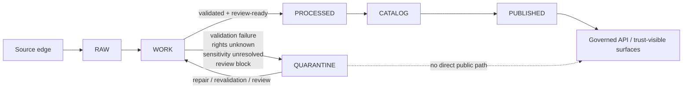

<!-- [KFM_META_BLOCK_V2]
doc_id: <REVIEW: kfm://doc/uuid-pending>
title: data/quarantine
type: standard
version: v1
status: draft
owners: @bartytime4life
created: <REVIEW: YYYY-MM-DD pending>
updated: <REVIEW: YYYY-MM-DD pending>
policy_label: <REVIEW: policy label pending>
related: [../../README.md, ../README.md, ../raw/README.md, ../work/README.md, ../processed/README.md, ../catalog/README.md, ../receipts/README.md, ../proofs/README.md, ../published/README.md, ../../.github/CODEOWNERS]
tags: [kfm, data, quarantine, lifecycle, governance]
notes: [Uses the current public CODEOWNERS fallback for /data/ as the only directly verified owner surface; narrower quarantine stewardship, created/updated dates, and policy_label remain NEEDS VERIFICATION.]
[/KFM_META_BLOCK_V2] -->

# data/quarantine

Fail-closed holding zone for material that has entered KFM but cannot advance safely without review, clarification, repair, or revalidation.

> **Status:** active directory · **Doc state:** draft  
> **Owners:** `@bartytime4life` *(current public `CODEOWNERS` fallback for `/data/`; narrower quarantine stewardship still **NEEDS VERIFICATION**)*  
> **Path:** `data/quarantine/README.md`  
> **Current public tree:** `data/quarantine/` shows `README.md` only on public `main`  
> **Repo fit:** parent [`../README.md`](../README.md) · upstream [`../raw/README.md`](../raw/README.md), [`../work/README.md`](../work/README.md) · downstream [`../processed/README.md`](../processed/README.md), [`../catalog/README.md`](../catalog/README.md), [`../receipts/README.md`](../receipts/README.md), [`../proofs/README.md`](../proofs/README.md), [`../published/README.md`](../published/README.md) · owner surface [`../../.github/CODEOWNERS`](../../.github/CODEOWNERS)  
>         
> **Quick jump:** [Scope](#scope) · [Repo fit](#repo-fit) · [Accepted inputs](#accepted-inputs) · [Exclusions](#exclusions) · [Directory tree](#directory-tree) · [Quickstart](#quickstart) · [Usage](#usage) · [Diagram](#diagram) · [Tables](#tables) · [Task list](#task-list) · [FAQ](#faq) · [Appendix](#appendix)

> [!IMPORTANT]
> `data/quarantine/` is a governed lifecycle state, not a convenience dump folder. Material lands here when KFM must remain honest about unresolved rights, failed validation, unresolved sensitivity, blocked review, or correction pressure instead of smoothing uncertainty into premature publication.

> [!NOTE]
> This README keeps three evidence layers separate on purpose:
>
> - **CONFIRMED current public-main fact**: `data/quarantine/` exists as a real top-level `data/` lane and currently shows `README.md` only.
> - **CONFIRMED doctrine**: quarantine is part of the KFM truth path and must remain fail-closed.
> - **PROPOSED starter structure**: case folders, filenames, and local helper patterns below the README are working guidance until a checked-out branch proves them directly.

| At a glance | Working rule |
|---|---|
| Directory role | Fail-closed holding zone for blocked, ambiguous, or review-held material |
| Truth-path position | `RAW -> WORK / QUARANTINE -> PROCESSED -> CATALOG -> PUBLISHED` |
| Public-path rule | No normal UI or public API path should read quarantine directly |
| Exit rule | Leave quarantine only through a new governed transition |
| Current public inventory | `README.md` only on public `main` |

## Scope

`data/quarantine/` exists to isolate ambiguity and failure **without hiding either one**.

In KFM terms, quarantine is where the system stays honest when material is too real to ignore and too unresolved to promote. It is not a trash bin, not a warning-only parking lot, and not a soft-public staging layer.

### What this README is for

Use this file to answer five questions quickly:

1. What belongs in `data/quarantine/`?
2. What must stay out?
3. What is **CONFIRMED** by doctrine or by the current public tree?
4. What remains **PROPOSED** starter shape rather than live checked-in reality?
5. What minimum evidence should accompany a blocked case?

### What this README is not for

This file is not:

- a dataset-specific repair runbook,
- a substitute for shared contracts or schemas,
- a policy bundle,
- a claim that local scripts, emitted receipts, or merge-blocking automation are already proven for this lane.

### Working claims

| Claim | Status | Meaning here |
|---|---|---|
| Quarantine is part of the core KFM truth path. | **CONFIRMED** | It is a first-class lifecycle state, not an ad hoc exception. |
| Quarantine holds blocked or unresolved material. | **CONFIRMED** | Typical triggers include rights ambiguity, validation failure, sensitivity uncertainty, and review blocks. |
| Quarantine must not behave like pseudo-production. | **CONFIRMED** | No public-safe release, no outward catalog closure, no silent promotion. |
| `data/quarantine/` exists as a live public-tree path. | **CONFIRMED** | The current public `main` tree shows the directory. |
| Current public `main` proves case folders, validators, or helper scripts beneath this README. | **UNKNOWN / NEEDS VERIFICATION** | The inspected public tree shows `README.md` only. |
| A case-folder starter layout can still be documented as operator guidance. | **PROPOSED** | Useful for maintainers, but not yet proven as checked-in branch reality. |

[Back to top](#dataquarantine)

## Repo fit

`data/quarantine/` sits inside the wider governed `data/` lifecycle and between general transform staging and stable processed scope.

### Path and adjacent surfaces

| Relation | Surface | Status | Why it matters here |
|---|---|---|---|
| Parent | [`../README.md`](../README.md) | **CONFIRMED** | Defines the wider `data/` lifecycle, zone family, and truth-path law. |
| Upstream | [`../raw/README.md`](../raw/README.md) | **CONFIRMED** | Source-native captures stay there; quarantine is not raw intake. |
| Peer | [`../work/README.md`](../work/README.md) | **CONFIRMED** | General transform and QA staging happens there until a fail-closed hold is required. |
| Downstream | [`../processed/README.md`](../processed/README.md) | **CONFIRMED** | Stable processed versions belong there only after the block is resolved. |
| Downstream | [`../catalog/README.md`](../catalog/README.md) | **CONFIRMED** | `DCAT + STAC + PROV` closure is downstream of quarantine resolution, not a quarantine-time action. |
| Adjacent process memory | [`../receipts/README.md`](../receipts/README.md) | **CONFIRMED** | Run receipts and replay-facing process memory may need to stay linkable during review and correction. |
| Adjacent release evidence | [`../proofs/README.md`](../proofs/README.md) | **CONFIRMED** | Release proof is a separate surface; quarantine should not silently absorb it. |
| Downstream publication | [`../published/README.md`](../published/README.md) | **CONFIRMED** | Published scope is already release-backed; quarantine is the opposite condition. |
| Owner surface | [`../../.github/CODEOWNERS`](../../.github/CODEOWNERS) | **CONFIRMED** | Public `CODEOWNERS` currently gives `/data/` broad fallback ownership to `@bartytime4life`. |
| Shared controls | [`../../contracts/README.md`](../../contracts/README.md), [`../../schemas/README.md`](../../schemas/README.md), [`../../policy/README.md`](../../policy/README.md), [`../../tests/README.md`](../../tests/README.md), [`../../tools/`](../../tools/) | **CONFIRMED public surfaces** | Shared contract law, executable policy, validation, and helper tooling should remain explicit and reviewable outside quarantine itself. |
| Downstream consumers | [`../../apps/`](../../apps/) | **CONFIRMED path / INFERRED role** | Public and role-limited surfaces should consume release-backed scope through governed APIs, not direct quarantine reads. |

### Current public-main snapshot

| Surface | Current public-main evidence | Reading rule |
|---|---|---|
| `data/quarantine/` | `README.md` only | Confirms the lane exists; do not invent deeper live inventory. |
| `data/` parent | `catalog/`, `processed/`, `proofs/`, `published/`, `quarantine/`, `raw/`, `receipts/`, `registry/`, `work/`, `README.md` | Confirms quarantine is part of an explicit lifecycle family, not an isolated folder. |
| Owner coverage | `/data/` assigned to `@bartytime4life` in public `CODEOWNERS` | Safe as a broad public owner fallback only. |
| Sibling lane docs | `raw/README.md`, `work/README.md`, `processed/README.md`, `catalog/README.md`, `receipts/README.md`, `proofs/README.md`, `published/README.md` | Safe to link as adjacent guidance surfaces. |

### Repo-fit summary

| Question | Answer |
|---|---|
| What is `data/quarantine/` for? | Blocked, ambiguous, review-held, or correction-bound material that must stay inspectable without being promoted. |
| What is it not for? | It is not a raw intake lane, not a general scratch area, not outward catalog closure, and not a public delivery surface. |
| What must stay visible here? | Block reason, review need, rights/sensitivity posture, and next action. |
| What must not happen here? | Quiet promotion, public exposure, or metadata closure that implies the block has already been resolved. |

[Back to top](#dataquarantine)

## Accepted inputs

Only material that is **blocked, ambiguous, explicitly under review, or awaiting safe transform/revalidation** belongs here.

| Accepted input | Why it belongs here | Minimum companion context |
|---|---|---|
| Validation-failed candidate artifacts | They cannot advance safely to processed or published scope yet. | Subject or source reference, failure summary, validation evidence |
| Rights-unclear material | KFM fails closed when redistribution or publication posture is unresolved. | Rights note or source-terms snapshot, reviewer need |
| Sensitivity-unclear material | Exact-location, privacy, sovereignty, or cultural-sensitivity handling is still unresolved. | Sensitivity note, public-safe handling note, review requirement |
| Review-blocked submissions | A steward or policy lane has not cleared advancement. | Blocking reason, reviewer role, next action |
| Candidate redaction or generalization outputs | A safer representation may exist, but it is not yet approved. | Comparison context, transform note, review requirement |
| Correction, rollback, or narrowing candidates | A prior candidate or release needs visible repair, replacement, or withdrawal logic. | Affected release/candidate reference, correction note |
| QA evidence and triage artifacts tied to blocked material | They explain why a case is here and what must happen next. | Stable case or subject reference, timestamps, author/reviewer context |

### Input rule of thumb

If an artifact can already be defended as **stable, release-backed, and public-safe**, it does **not** belong here.

If it cannot yet be defended that way but must remain visible, governable, and reviewable, it probably does.

[Back to top](#dataquarantine)

## Exclusions

### What does **not** belong here

| Excluded material | Put it here instead | Why |
|---|---|---|
| Immutable source captures and original payloads | [`../raw/README.md`](../raw/README.md) | Raw capture should remain source-faithful and append-only. |
| Ordinary transform scratch that is not blocked or ambiguous | [`../work/README.md`](../work/README.md) | Not every intermediate is a quarantine case. |
| Stable processed artifacts or version packs | [`../processed/README.md`](../processed/README.md) | Processed is for stable versioned artifacts, not unresolved material. |
| Outward `DCAT + STAC + PROV` closure objects | [`../catalog/README.md`](../catalog/README.md) | Catalog closure implies a stronger readiness state. |
| Central run receipts or replay-facing process memory | [`../receipts/README.md`](../receipts/README.md) | Quarantine cases may link to receipts, but quarantine is not the receipts surface. |
| Release manifests, proof packs, attestations, rollback bundles | [`../proofs/README.md`](../proofs/README.md) or the release path the branch actually uses | Quarantine explains blocked state; it should not become the default proof store for approved releases. |
| Public-safe published outputs | [`../published/README.md`](../published/README.md) | Published exposure follows promotion, not uncertainty. |
| Personal scratch notes or undocumented temp files | Local scratch outside governed lanes | They carry no governed lifecycle meaning. |

> [!CAUTION]
> “We know it is questionable, but let’s expose it anyway” is exactly the failure mode quarantine is designed to stop.

[Back to top](#dataquarantine)

## Directory tree

### Current public-main shape

```text
data/
├── README.md
├── catalog/
├── processed/
├── proofs/
├── published/
├── quarantine/
│   └── README.md
├── raw/
├── receipts/
├── registry/
└── work/
```

### Doctrine-aligned starter shape

Use the following as **starter guidance**, not as a claim that the current public branch already contains this subtree.

<details>
<summary><strong>PROPOSED case-folder starter layout</strong></summary>

```text
data/quarantine/
└── <case_or_subject_id>/
    ├── payload/                  # blocked or review-held artifact(s)
    ├── triage.yaml               # why the case is here
    ├── validation/               # failed checks, QA evidence, diffs
    ├── review/                   # notes, decisions, escalation context
    ├── transforms/               # redaction/generalization candidates
    └── manifest.json             # transfer/intake note
```

Use this only after checking the active branch and any local house conventions.

</details>

[Back to top](#dataquarantine)

## Quickstart

Use quarantine when an item **must not move forward yet**, but also **must not disappear into undocumented limbo**.

### 1) Inspect the live lane first

```bash
# Verify current public-tree-equivalent shape in your checkout
find data/quarantine -maxdepth 4 -print 2>/dev/null | sort

# Re-read adjacent lifecycle docs before documenting new claims
sed -n '1,240p' data/README.md
sed -n '1,240p' data/raw/README.md
sed -n '1,240p' data/work/README.md
sed -n '1,240p' data/quarantine/README.md
sed -n '1,240p' data/processed/README.md
sed -n '1,240p' data/catalog/README.md
sed -n '1,240p' data/receipts/README.md
sed -n '1,240p' data/proofs/README.md
sed -n '1,240p' data/published/README.md
```

### 2) Create a quarantine case

```bash
# Illustrative only — verify actual repo conventions before use.
CASE_ID="q-YYYYMMDD-example-001"

mkdir -p "data/quarantine/${CASE_ID}/payload"
mkdir -p "data/quarantine/${CASE_ID}/validation"
mkdir -p "data/quarantine/${CASE_ID}/review"

# Add the blocked artifact
cp /path/to/candidate-artifact.ext "data/quarantine/${CASE_ID}/payload/"
```

### 3) Record why promotion is blocked

```yaml
# Illustrative example only — field names are starter guidance,
# not a confirmed branch-side schema.
case_id: q-YYYYMMDD-example-001
status: quarantine
reason_codes:
  - rights.unknown
source_ref: raw:source-or-batch-ref
required_review:
  - steward
public_exposure: blocked
candidate_next_step: revalidate_after_review
```

### 4) Keep the block legible

Before anything moves again, make sure the case shows:

- what is blocked,
- why it is blocked,
- who must review it,
- and what evidence would allow it to leave quarantine.

[Back to top](#dataquarantine)

## Usage

### Entry triggers

Move material into quarantine when one or more of the following is true:

1. **Validation failed**
2. **Rights are unknown or not yet cleared**
3. **Sensitivity or precision handling is unresolved**
4. **Review explicitly blocked advancement**
5. **A correction, rollback, or narrowing path is being assembled**
6. **The item cannot yet support outward identifiers, closure, or public-safe release**

### Minimum quarantine case record

A quarantine case should carry enough information that another steward can understand the block **without guessing**.

| Minimum record | Why it is needed | Confidence |
|---|---|---|
| Source or subject reference | Keeps the case tied to an upstream intake, batch, release, or candidate | **CONFIRMED** doctrinal need |
| Plain-language block reason | Makes the fail-closed state legible | **CONFIRMED** doctrinal need |
| Validation or review evidence | Proves the block is inspectable, not hand-wavy | **CONFIRMED** doctrinal need |
| Rights or sensitivity posture | Explains why public exposure is blocked or constrained | **CONFIRMED** doctrinal need |
| Reviewer or steward responsibility | Prevents silent long-term limbo | **CONFIRMED** doctrinal need |
| Next action | Makes the exit path explicit | **CONFIRMED** doctrinal need |
| Candidate safer representation, if any | Supports redaction/generalization review | **PROPOSED** when applicable |

> [!TIP]
> Current KFM doctrine names trust objects such as `SourceDescriptor`, `IngestReceipt`, `ValidationReport`, `DecisionEnvelope`, `ReviewRecord`, `EvidenceBundle`, `ReleaseManifest`, `ReleaseProofPack`, and `CorrectionNotice`. Exact local filenames or schema homes for quarantine handling are still **NEEDS VERIFICATION** on the active branch.

### Working rules

1. **Quarantine because something is unresolved, not because documentation is inconvenient.**
2. **Keep the blocked state inspectable.** A reviewer should not need tribal memory to understand the case.
3. **Prefer explicit reason codes and visible next steps.**
4. **Do not let quarantine become a silent long-term shadow publication surface.**
5. **Treat every exit as a governed transition, not a folder shuffle.**

### Exit paths

Material should leave quarantine only through a new governed transition.

| Exit path | When to use it | Expected evidence before exit |
|---|---|---|
| Return to `work/` | More repair or transform work is needed before revalidation | Clear next-step note, retained case history |
| Promote toward `processed/` | Validation and review now support stable processed status | Updated validation evidence, decision context, no unresolved block reason |
| Issue correction or replacement path | A prior release or candidate must be narrowed, replaced, or superseded | Correction context, affected release references, rebuild/replacement notes |
| Withdraw or reject | Rights, quality, or sensitivity issues cannot be resolved | Decision note, reason code, retained lineage |
| Remain in quarantine | The case is still open | Current status, owner/reviewer, visible next step |

### Illustrative triage document

```yaml
# Illustrative example only — field names are starter guidance,
# not a confirmed repo schema.
case_id: q-2026-03-22-demo-001
subject_ref: raw:hydro.batch.0001
status: quarantine
reason_codes:
  - validation.schema_failed
  - rights.unknown
required_review:
  - data_steward
  - policy_review
public_exposure: blocked
notes: >
  Do not catalog or publish. Re-run validation after geometry repair
  and rights clarification.
```

[Back to top](#dataquarantine)

## Diagram


```mermaid
flowchart LR
    S[Source edge] --> R[RAW]
    R --> W[WORK]

    W -->|validation failure<br/>rights unknown<br/>sensitivity unresolved<br/>review block| Q[QUARANTINE]
    W -->|validated + review-ready| P[PROCESSED]

    Q -->|repair / revalidation / review| W
    P --> C[CATALOG]
    C --> U[PUBLISHED]
    U --> API[Governed API / trust-visible surfaces]

    Q -. no direct public path .-> API
```

The operating idea is simple: **quarantine keeps uncertainty visible and contained until the system can either advance safely or refuse cleanly**.

## Tables

### Zone behavior at a glance

| Zone | Primary purpose | What must not happen |
|---|---|---|
| `raw/` | Source-faithful intake and capture | In-place mutation or publication-by-accident |
| `work/` | Repeatable transform and QA staging | Silent promotion without gates |
| `quarantine/` | Isolation of blocked, ambiguous, or review-held material | Warning-only pseudo-production |
| `processed/` | Stable processed version state | Carrying unresolved uncertainty as if it were settled |
| `catalog/` | `DCAT + STAC + PROV` outward closure | Declaring closure before release and lineage are ready |
| `published/` | Public-safe outward exposure | Treating publication as a file copy instead of a governed transition |

### Allowed vs blocked operations in `data/quarantine/`

| Operation | Allowed? | Notes |
|---|---|---|
| Store blocked material with context | Yes | This is the core purpose of the lane. |
| Add failure evidence, review notes, and triage context | Yes | Quarantine should increase clarity, not reduce it. |
| Prepare candidate redactions or safer generalized outputs | Yes | Keep them inspectable and clearly non-final. |
| Link to receipts or related case memory | Yes | Helpful when replay, audit, or correction context matters. |
| Attach outward catalog closure and public-safe release identifiers | No | Closure belongs downstream after the block is resolved. |
| Serve quarantine material through normal public UI or public API routes | No | That would violate the trust membrane. |
| Quietly move content forward without updated evidence and review context | No | Every exit must be legible. |

[Back to top](#dataquarantine)

## Task list

Use this as the minimum definition-of-done for a quarantine case.

- [ ] Stable case or subject reference recorded
- [ ] Block reason recorded in plain language
- [ ] Validation and/or review evidence attached
- [ ] Rights and sensitivity posture noted
- [ ] Required reviewer or steward identified
- [ ] Public exposure explicitly marked **blocked** or otherwise constrained
- [ ] Next action recorded: repair, review, revalidate, reject, withdraw, or replace
- [ ] Exit decision captured before any move toward `processed/`, `catalog/`, or `published/`

## FAQ

### Is quarantine just for “bad data”?

No. It is also for unclear rights, unresolved sensitivity, blocked review, correction work, and other cases where KFM must fail closed instead of pretending the material is ready.

### Can something stay here for a while?

Yes, but not silently. Long-lived quarantine cases need visible ownership, a current reason, and a current next step.

### Can the UI or API read directly from quarantine?

Normal public or standard user surfaces should not. Quarantine exists precisely to prevent blocked or ambiguous material from leaking into outward trust surfaces.

### Is quarantine the same as `work/`?

No. `work/` is the general transform and QA staging lane. `quarantine/` is the stricter fail-closed lane for material that is blocked, ambiguous, or awaiting review.

### Why not just fix the issue downstream?

Because lifecycle states in KFM are governed transitions, not magic folders. Repair should create a legible path forward rather than erasing the fact that the item was previously blocked.

### Where should proof for an approved release live?

With the release and proof surfaces the active branch actually uses. This README does not claim a narrower proof emitter or archive pattern than the current evidence supports.

## Appendix

<details>
<summary><strong>Status vocabulary used in this README</strong></summary>

| Label | Meaning |
|---|---|
| **CONFIRMED** | Supported directly by current public repo evidence or stable KFM doctrine |
| **INFERRED** | Strongly implied by confirmed neighboring docs or path relationships |
| **PROPOSED** | Safe starter pattern or recommended implementation direction |
| **UNKNOWN** | Not directly proven in the current session |
| **NEEDS VERIFICATION** | A direct branch or checkout check should be made before treating the detail as settled |

</details>

<details>
<summary><strong>PROPOSED starter reason codes</strong></summary>

| Reason code | Use when |
|---|---|
| `validation.schema_failed` | Structure, type, geometry, or semantic validation failed |
| `rights.unknown` | License, terms, or redistribution basis is unresolved |
| `sensitivity.exact_location` | Exact location is too sensitive for the requested audience |
| `corroboration.conflicted` | Independent admissible sources disagree materially |
| `review.blocked` | A steward or policy review explicitly blocked advancement |
| `correction.pending` | A correction, rollback, or replacement path is being assembled |

</details>

<details>
<summary><strong>Maintenance notes for future editors</strong></summary>

1. Keep lifecycle terminology stable with the wider KFM truth path.
2. Do not upgrade this README from doctrinal guidance to implementation certainty without direct branch or checkout verification.
3. If local scripts, schemas, validators, or fixtures are later added for quarantine handling, document them here with exact verified paths.
4. When behavior changes, update this README in the same change set.
5. Prefer one real proof object, case example, or validator path over more abstract prose once the branch exposes them.

</details>

[Back to top](#dataquarantine)