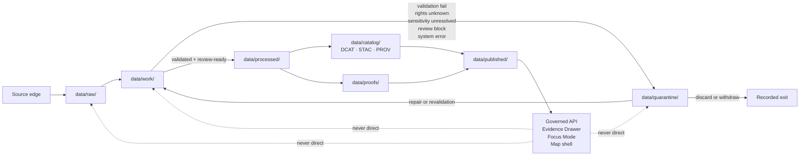

<!-- [KFM_META_BLOCK_V2]
doc_id: kfm://doc/NEEDS_VERIFICATION__data_quarantine_readme
title: data/quarantine/
type: standard
version: v1
status: draft
owners: @bartytime4life
created: NEEDS_VERIFICATION__YYYY-MM-DD
updated: 2026-04-22
policy_label: NEEDS_VERIFICATION
related: [../README.md, ../raw/README.md, ../work/README.md, ../processed/README.md, ../catalog/README.md, ../receipts/README.md, ../proofs/README.md, ../published/README.md, ../registry/README.md, ../../contracts/README.md, ../../schemas/README.md, ../../policy/README.md, ../../tests/README.md, ../../tools/README.md, ../../.github/CODEOWNERS]
tags: [kfm, data, quarantine, lifecycle, governance, fail-closed]
notes: [Owner is grounded to surfaced public /data/ CODEOWNERS coverage; quarantine-specific ownership, doc UUID, created date, policy label, active-branch inventory, and validator wiring remain NEEDS VERIFICATION. This README is public-safe guidance; quarantine payloads should be treated restricted until policy and storage posture are verified.]
[/KFM_META_BLOCK_V2] -->

<a id="top"></a>

# data/quarantine/

Fail-closed holding zone for KFM material that has entered the governed lifecycle but cannot safely advance without review, repair, clarification, or revalidation.

> **Status:** active  
> **Doc state:** draft  
> **Owners:** `@bartytime4life` *(broad `/data/` owner surface; quarantine-specific stewardship still **NEEDS VERIFICATION**)*  
> **Path:** `data/quarantine/README.md`  
> **Repo fit:** parent [`../README.md`](../README.md) · upstream [`../raw/README.md`](../raw/README.md), [`../work/README.md`](../work/README.md) · downstream [`../processed/README.md`](../processed/README.md), [`../catalog/README.md`](../catalog/README.md), [`../published/README.md`](../published/README.md) · adjacent [`../receipts/README.md`](../receipts/README.md), [`../proofs/README.md`](../proofs/README.md), [`../registry/README.md`](../registry/README.md)  
> [](#scope)
> [](#scope)
> [](#repo-fit)
> [](#usage)
> [](#usage)
> [](#diagram)
> [](#appendix)  
> **Quick jumps:** [Scope](#scope) · [Repo fit](#repo-fit) · [Accepted inputs](#accepted-inputs) · [Exclusions](#exclusions) · [Directory tree](#directory-tree) · [Quickstart](#quickstart) · [Usage](#usage) · [Diagram](#diagram) · [Tables](#tables) · [Task list](#task-list) · [FAQ](#faq) · [Appendix](#appendix)

> [!IMPORTANT]
> `data/quarantine/` is a governed lifecycle state, not a convenience dump folder. Material lands here when KFM must stay honest about unresolved rights, failed validation, unresolved sensitivity, blocked review, source conflict, correction pressure, or system error instead of smoothing uncertainty into premature publication.

> [!WARNING]
> Quarantine is **not** permission to commit sensitive payloads into Git. If material includes exact sensitive locations, controlled cultural data, living-person information, DNA-derived information, private infrastructure detail, restricted source records, secrets, or license-restricted data, use approved restricted storage and commit only policy-safe pointers, manifests, or review stubs.

| At a glance | Working rule |
|---|---|
| Directory role | Fail-closed holding zone for blocked, ambiguous, or review-held material |
| Truth-path position | `RAW -> WORK / QUARANTINE -> PROCESSED -> CATALOG / TRIPLET -> PUBLISHED` |
| Public-path rule | No normal UI, public API, Focus Mode, export, or map layer should read quarantine directly |
| Exit rule | Leave quarantine only through a new governed transition with updated evidence |
| Current public inventory | Surfaced repo-facing docs show `README.md` only; active checkout still **NEEDS VERIFICATION** |

---

## Scope

`data/quarantine/` isolates ambiguity and failure **without hiding either one**.

In KFM terms, quarantine is where material is too evidence-bearing to ignore and too unresolved to promote. It is not a trash bin, not ordinary transform scratch, not a quiet staging area, and not soft-public production.

### What this README is for

Use this README to answer five questions quickly:

1. What belongs in `data/quarantine/`?
2. What must stay out?
3. Which claims are **CONFIRMED** by KFM doctrine or surfaced repo-facing docs?
4. Which starter structures remain **PROPOSED** until the active checkout proves them?
5. What minimum evidence should accompany a blocked case?

### What this README is not for

This README is not:

- a dataset-specific repair runbook,
- a substitute for shared schemas, policy, validators, or proof objects,
- a public release manifest,
- a place to document secrets or restricted payload contents,
- a claim that local scripts, emitted receipts, merge-blocking workflows, or runtime enforcement are already proven for this lane.

### Working claims

| Claim | Status | Meaning here |
|---|---|---|
| Quarantine is part of the core KFM truth path. | **CONFIRMED** | It is a first-class lifecycle state, not an ad hoc exception. |
| Quarantine holds blocked or unresolved material. | **CONFIRMED** | Typical triggers include rights ambiguity, validation failure, sensitivity uncertainty, review blocks, and correction pressure. |
| Quarantine must not behave like pseudo-production. | **CONFIRMED** | No public exposure, no outward catalog closure, no direct Focus Mode use, and no silent promotion. |
| `data/quarantine/` is surfaced as a repo-facing path. | **CONFIRMED from surfaced docs / NEEDS VERIFICATION in active checkout** | Treat deeper inventory as unverified until inspected in the branch being changed. |
| Case folders, validators, helper scripts, and emitted records beneath this README exist in the active branch. | **UNKNOWN / NEEDS VERIFICATION** | This README documents starter guidance, not confirmed local implementation. |
| A case-folder starter layout can be documented for maintainers. | **PROPOSED** | Useful as a review pattern, but not yet proof of checked-in branch reality. |

[Back to top](#top)

---

## Repo fit

`data/quarantine/` sits inside the wider governed `data/` lifecycle. It is the fail-closed sibling of `data/work/`, not a downstream publication lane.

### Path and adjacent surfaces

| Relation | Surface | Status | Why it matters here |
|---|---|---:|---|
| Parent | [`../README.md`](../README.md) | **CONFIRMED from surfaced docs** | Defines the wider `data/` lifecycle, zone family, and truth-path law. |
| Upstream | [`../raw/README.md`](../raw/README.md) | **CONFIRMED from surfaced docs** | Source-native captures stay there; quarantine is not raw intake. |
| Peer | [`../work/README.md`](../work/README.md) | **CONFIRMED from surfaced docs** | General transform and QA staging happens there until a fail-closed hold is required. |
| Downstream | [`../processed/README.md`](../processed/README.md) | **CONFIRMED from surfaced docs** | Stable processed versions belong there only after the block is resolved. |
| Downstream | [`../catalog/README.md`](../catalog/README.md) | **CONFIRMED from surfaced docs** | `DCAT + STAC + PROV` closure is downstream of quarantine resolution, not a quarantine-time action. |
| Adjacent process memory | [`../receipts/README.md`](../receipts/README.md) | **CONFIRMED from surfaced docs** | Run receipts and replay-facing process memory may need to stay linkable during review and correction. |
| Adjacent release evidence | [`../proofs/README.md`](../proofs/README.md) | **CONFIRMED from surfaced docs** | Release proof is separate; quarantine must not silently absorb proof-pack responsibilities. |
| Downstream publication | [`../published/README.md`](../published/README.md) | **CONFIRMED from surfaced docs** | Published scope is already release-backed; quarantine is the opposite posture. |
| Source admission | [`../registry/README.md`](../registry/README.md) | **CONFIRMED from surfaced docs** | Source identity, rights posture, and activation status belong in registries, not case folders. |
| Shared controls | [`../../contracts/README.md`](../../contracts/README.md), [`../../schemas/README.md`](../../schemas/README.md), [`../../policy/README.md`](../../policy/README.md), [`../../tests/README.md`](../../tests/README.md), [`../../tools/README.md`](../../tools/README.md) | **NEEDS VERIFICATION in active checkout** | Shared contract law, policy, fixtures, validation, and helper tooling should remain explicit outside quarantine. |
| Owner surface | [`../../.github/CODEOWNERS`](../../.github/CODEOWNERS) | **NEEDS VERIFICATION in active checkout** | Surfaced docs indicate broad `/data/` owner coverage by `@bartytime4life`; recheck before merge. |

### Repo-fit summary

| Question | Answer |
|---|---|
| What is `data/quarantine/` for? | Blocked, ambiguous, review-held, or correction-bound material that must remain inspectable without being promoted. |
| What is it not for? | Raw intake, general scratch, outward catalog closure, proof packs, public delivery, source registration, or secret storage. |
| What must stay visible here? | Block reason, review need, rights/sensitivity posture, evidence references, next action, and exit decision. |
| What must not happen here? | Quiet promotion, direct public exposure, or metadata closure that implies the block has already been resolved. |

[Back to top](#top)

---

## Accepted inputs

Only material that is **blocked, ambiguous, explicitly under review, or awaiting safe transform/revalidation** belongs here.

| Accepted input | Typical trigger | Minimum companion context |
|---|---|---|
| Validation-failed candidate output | Schema, geometry, CRS, timestamp, semantic, checksum, or linkage failure | Failed check, validator output, run reference, upstream artifact reference |
| Rights-unclear material | Missing license, unclear redistribution basis, unresolved attribution, source terms change | Source reference, rights question, publication default, reviewer needed |
| Sensitivity-unclear material | Exact location risk, cultural sensitivity, rare species, critical infrastructure, living-person or controlled access concern | Sensitivity reason, public exposure state, required steward/policy review |
| Source-conflicted material | Identity mismatch, conflicting evidence, duplicate candidates, disputed support | Conflicting source refs, comparison note, open decision |
| Review-blocked candidate | Steward, data owner, policy, or domain review blocks advancement | Reviewer, reason, required action, next review date if known |
| Correction or rollback candidate | Published or processed material needs replacement, withdrawal, or supersession | Prior release or artifact ref, correction reason, rollback target |
| System-error hold | Tool, connector, policy evaluator, or promotion gate failed unsafely | Error summary, run id, artifact refs, retry conditions |

A quarantine case should carry at least:

- stable case or subject reference,
- upstream source or artifact reference,
- `run_id` and `spec_hash` when available,
- block reason in plain language,
- machine-readable reason code when available,
- rights and sensitivity posture,
- required reviewer or steward,
- explicit public exposure state,
- next action: repair, review, revalidate, reject, withdraw, or replace.

[Back to top](#top)

---

## Exclusions

These items do **not** belong in `data/quarantine/`.

| Do not place here | Use instead | Why |
|---|---|---|
| Source-native captures and original downloads | [`../raw/README.md`](../raw/README.md) | Raw is the source-faithful intake lane. |
| Ordinary transform scratch that is not blocked or ambiguous | [`../work/README.md`](../work/README.md) | Not every intermediate is a quarantine case. |
| Stable processed artifacts or version packs | [`../processed/README.md`](../processed/README.md) | Processed is for stable versioned artifacts, not unresolved material. |
| Outward `DCAT + STAC + PROV` closure objects | [`../catalog/README.md`](../catalog/README.md) | Catalog closure implies readiness and release-adjacent traceability. |
| Central run receipts or replay-facing process memory | [`../receipts/README.md`](../receipts/README.md) | Quarantine cases may link receipts; they should not own receipt storage. |
| Release manifests, proof packs, attestations, rollback cards | [`../proofs/README.md`](../proofs/README.md) or the release path the active branch uses | Approved release evidence belongs outside the blocked lane. |
| Public-safe published outputs | [`../published/README.md`](../published/README.md) | Published exposure follows promotion, not uncertainty. |
| Source descriptors, source activation records, rights matrices | [`../registry/README.md`](../registry/README.md) | Source governance must remain reusable and centrally discoverable. |
| Secrets, credentials, access tokens, private notes, restricted payloads unsafe for Git | Approved secret manager or restricted storage | Quarantine is not a security container. |

> [!CAUTION]
> “We know it is questionable, but let’s expose it anyway” is exactly the failure mode quarantine is designed to stop.

[Back to top](#top)

---

## Directory tree

### Surfaced public-main shape

Surfaced repo-facing docs indicate the following lightweight shape. Recheck the active checkout before treating this as branch-local fact.

```text
data/
├── README.md
├── catalog/
├── processed/
├── proofs/
├── published/
├── quarantine/
│   └── README.md
├── raw/
├── receipts/
├── registry/
└── work/
```

### PROPOSED case-folder starter layout

Use this as starter guidance, not as a claim that the current branch already contains this subtree.

<details>
<summary><strong>Review-friendly quarantine case layout</strong></summary>

```text
data/quarantine/
└── <case_or_subject_id>/
    ├── payload/                  # blocked or review-held artifacts; avoid sensitive payloads in Git
    ├── triage.yaml               # why this case is here and what must happen next
    ├── validation/               # failed checks, QA evidence, diffs, validator reports
    ├── review/                   # steward notes, decisions, escalation context
    ├── transforms/               # candidate redaction/generalization/repair outputs, non-final
    └── manifest.json             # intake/transfer note, refs, hashes when safe
```

Use this only after checking active branch conventions, storage policy, and whether payloads are safe to keep in the repository.

</details>

[Back to top](#top)

---

## Quickstart

Use quarantine when an item **must not move forward yet**, but also **must not disappear into undocumented limbo**.

### 1. Inspect the live lane first

```bash
# Verify the active checkout before documenting stronger claims.
find data/quarantine -maxdepth 4 -print 2>/dev/null | sort

# Re-read adjacent lifecycle docs before adding a new case.
sed -n '1,220p' data/README.md
sed -n '1,220p' data/raw/README.md
sed -n '1,220p' data/work/README.md
sed -n '1,220p' data/quarantine/README.md
sed -n '1,220p' data/processed/README.md
sed -n '1,220p' data/catalog/README.md
sed -n '1,220p' data/receipts/README.md
sed -n '1,220p' data/proofs/README.md
sed -n '1,220p' data/published/README.md
```

### 2. Create a reviewable case shell

```bash
# Illustrative only — verify local naming and storage rules before adopting.
CASE_ID="q-$(date -u +%Y%m%d)-<subject>-001"

mkdir -p "data/quarantine/${CASE_ID}"/{validation,review,transforms}

cat > "data/quarantine/${CASE_ID}/triage.yaml" <<'YAML'
# Illustrative starter only. Confirm active schema before treating as a contract.
case_id: q-YYYYMMDD-subject-001
status: quarantine
public_exposure: blocked

subject_ref: NEEDS_VERIFICATION
upstream_ref: NEEDS_VERIFICATION
run_id: NEEDS_VERIFICATION
spec_hash: NEEDS_VERIFICATION

reason_codes:
  - validation.schema_failed
  - rights.unknown

quarantine_class: VALIDATION_FAIL
review_state: PENDING

required_review:
  - data_steward
  - policy_review

next_action: revalidate_after_repair
notes: >
  Do not catalog, publish, export, or expose through normal API/UI routes
  until the block is resolved and the exit decision is recorded.
YAML
```

### 3. Link outward evidence without collapsing ownership

```bash
# Illustrative only — use active branch conventions.
cat > "data/quarantine/${CASE_ID}/review/links.md" <<'MD'
# Review links

- Upstream raw/work artifact: NEEDS_VERIFICATION
- Run receipt: NEEDS_VERIFICATION
- Validation report: NEEDS_VERIFICATION
- Policy decision: NEEDS_VERIFICATION
- Related proof or release object, if any: NEEDS_VERIFICATION
- Reviewer / steward: NEEDS_VERIFICATION
MD
```

### 4. Validate with confirmed local tooling only

Use the checked-out commands documented in [`../../tools/README.md`](../../tools/README.md), [`../../tests/README.md`](../../tests/README.md), and any narrower validator README that the active branch exposes.

Do not assume an unverified `promote`, `gate`, `publish`, `quarantine`, or `resolve` CLI exists just because planning documents mention one.

[Back to top](#top)

---

## Usage

### When to quarantine

| Trigger | Quarantine action | Exit signal |
|---|---|---|
| Validation fails | Preserve failed artifact reference and validator evidence | Repaired candidate passes validation or is rejected |
| Rights are unclear | Block public exposure and request rights review | Rights posture is recorded and policy permits next state |
| Sensitivity is unresolved | Deny direct public path and request steward/policy review | Redaction/generalization/restriction decision is recorded |
| Evidence conflicts | Hold competing claims with source refs | Review resolves support, narrows claim, or marks conflict |
| Promotion gate returns hold/deny/error | Keep candidate out of processed/catalog/published lanes | New decision envelope or equivalent gate result supports exit |
| Correction is pending | Preserve replacement/rollback context | Correction notice, rollback card, or supersession path is recorded |

### How to exit quarantine

Every exit from quarantine must make the prior block legible.

| Exit path | Use when | Required posture |
|---|---|---|
| Return to `work/` | Repair, re-normalization, or further QA is needed | Carry the case reference and prior failure reason forward |
| Move to `processed/` | Validation, rights, sensitivity, and review concerns are resolved | Include updated evidence, review state, and deterministic identity |
| Leave blocked | Review is still pending or obligations remain unsatisfied | Update owner, reason, and next action; do not let the case rot |
| Discard / withdraw | Artifact should not continue | Record reason and preserve safe audit pointer if policy permits |
| Supersede / correct | A published or processed artifact needs replacement | Link correction, rollback, and release evidence outside quarantine |

> [!NOTE]
> A resolved case may reference receipts and proofs, but receipts and proofs should remain in their own governed surfaces. Quarantine explains a blocked state; it does not become the release evidence store.

[Back to top](#top)

---

## Diagram


```mermaid
flowchart LR
    E[Source edge] --> R[data/raw/]
    R --> W[data/work/]

    W -->|validation fail<br/>rights unknown<br/>sensitivity unresolved<br/>review block<br/>system error| Q[data/quarantine/]
    Q -->|repair or revalidation| W
    Q -->|discard or withdraw| X[Recorded exit]

    W -->|validated + review-ready| P[data/processed/]
    P --> C[data/catalog/<br/>DCAT · STAC · PROV]
    P --> PF[data/proofs/]
    C --> U[data/published/]
    PF --> U

    U --> API[Governed API<br/>Evidence Drawer<br/>Focus Mode<br/>Map shell]

    API -. never direct .-> R
    API -. never direct .-> W
    API -. never direct .-> Q
```

The operating idea is simple: **quarantine keeps uncertainty visible, contained, and non-public until KFM can advance safely or refuse cleanly**.

[Back to top](#top)

---

## Tables

### Zone behavior at a glance

| Zone | Primary purpose | What must not happen |
|---|---|---|
| `raw/` | Source-faithful intake and capture | In-place mutation or publication-by-accident |
| `work/` | Repeatable transform and QA staging | Silent promotion without gates |
| `quarantine/` | Isolation of blocked, ambiguous, or review-held material | Warning-only pseudo-production |
| `processed/` | Stable processed version state | Carrying unresolved uncertainty as if it were settled |
| `catalog/` | `DCAT + STAC + PROV` outward closure | Declaring closure before release and lineage are ready |
| `proofs/` | Release evidence, proof packs, rollback/correction support | Hiding unresolved failures as proof |
| `published/` | Public-safe outward exposure | Treating publication as a file copy instead of a governed state transition |

### Allowed vs blocked operations in `data/quarantine/`

| Operation | Allowed? | Notes |
|---|---:|---|
| Store blocked material with safe context | Yes | This is the core purpose of the lane. |
| Add failure evidence, review notes, and triage context | Yes | Quarantine should increase clarity, not reduce it. |
| Prepare candidate redactions or safer generalized outputs | Yes | Keep them inspectable and clearly non-final. |
| Link to receipts or related case memory | Yes | Helpful when replay, audit, or correction context matters. |
| Commit restricted payloads just because they are quarantined | No | Use approved restricted storage and commit only safe pointers. |
| Attach outward catalog closure and public-safe release aliases | No | Closure belongs downstream after the block is resolved. |
| Serve quarantine material through normal public UI or API routes | No | That would violate the trust membrane. |
| Quietly move content forward without updated evidence and review context | No | Every exit must be legible. |

### Minimum case fields

| Field | Status | Why it matters |
|---|---|---|
| `case_id` | **PROPOSED** | Gives reviewers a stable handle for the hold. |
| `subject_ref` | **PROPOSED** | Connects the case to the blocked candidate or source subject. |
| `upstream_ref` | **PROPOSED** | Prevents orphaned quarantine cases. |
| `run_id` | **PROPOSED when available** | Connects to process memory and reproducibility. |
| `spec_hash` | **PROPOSED when available** | Connects to deterministic source-spec identity. |
| `reason_codes` | **PROPOSED** | Makes triage searchable and testable. |
| `quarantine_class` | **PROPOSED** | Aligns with finite quarantine outcomes where schemas exist. |
| `review_state` | **PROPOSED** | Separates review lifecycle from policy decision. |
| `public_exposure` | **REQUIRED BY POSTURE** | Must be `blocked` or otherwise explicitly constrained. |
| `next_action` | **REQUIRED BY POSTURE** | Prevents indefinite silent limbo. |

[Back to top](#top)

---

## Task list

### Definition of done for a quarantine case

- [ ] Stable case or subject reference recorded.
- [ ] Upstream raw/work/artifact reference recorded.
- [ ] Block reason recorded in plain language.
- [ ] Validation, policy, rights, sensitivity, or review evidence attached or linked.
- [ ] Rights posture noted.
- [ ] Sensitivity posture noted.
- [ ] Required reviewer or steward identified.
- [ ] Public exposure explicitly marked **blocked** or otherwise constrained.
- [ ] Next action recorded: repair, review, revalidate, reject, withdraw, replace, or supersede.
- [ ] Exit decision captured before any move toward `processed/`, `catalog/`, `proofs/`, or `published/`.

### Definition of done for this README

- [ ] Active checkout confirms linked sibling READMEs still exist.
- [ ] `../../.github/CODEOWNERS` confirms owner coverage or this README is updated.
- [ ] `doc_id`, `created`, and `policy_label` are replaced with grounded values.
- [ ] Any future schema, validator, fixture, or helper path added to this README is directly verified.
- [ ] Quarantine payload storage policy is reviewed before case folders are used for real data.
- [ ] Relative links are checked from `data/quarantine/README.md`.
- [ ] Changes to lifecycle behavior update adjacent `data/` docs in the same PR.

[Back to top](#top)

---

## FAQ

### Is quarantine only for broken files?

No. It is also for unclear rights, unresolved sensitivity, blocked review, conflicting evidence, correction work, and other cases where KFM must fail closed instead of pretending material is ready.

### Can something stay here for a while?

Yes, but not silently. Long-lived quarantine cases need visible ownership, current reason, current review state, and current next action.

### Can the UI or API read directly from quarantine?

Normal public or standard user surfaces should not. Quarantine exists precisely to prevent blocked or ambiguous material from leaking into outward trust surfaces.

### Can Focus Mode summarize quarantine content?

Not as a normal answer source. AI and Focus Mode are interpretive layers downstream of governed evidence and policy. Quarantine content may inform steward review only through controlled, policy-aware workflows that the active branch explicitly supports.

### Is quarantine the same as `work/`?

No. `work/` is the general transform and QA staging lane. `quarantine/` is the stricter fail-closed lane for material that is blocked, ambiguous, review-held, or unsafe to advance.

### Why not just fix the issue downstream?

Because lifecycle states in KFM are governed transitions, not magic folders. Repair should create a legible path forward rather than erasing the fact that the item was previously blocked.

### Where should proof for an approved release live?

With the release and proof surfaces the active branch actually uses. This README does not claim a narrower proof emitter or archive pattern than current evidence supports.

[Back to top](#top)

---

## Appendix

<details>
<summary><strong>Status vocabulary used in this README</strong></summary>

| Label | Meaning |
|---|---|
| **CONFIRMED** | Supported directly by KFM doctrine, surfaced repo-facing docs, or checked current-session evidence |
| **INFERRED** | Conservative analytical conclusion from confirmed neighboring docs or path relationships |
| **PROPOSED** | Safe starter pattern or recommended implementation direction |
| **UNKNOWN** | Not directly proven in the current session |
| **NEEDS VERIFICATION** | Direct branch, checkout, policy, owner, or runtime check required before treating the detail as settled |
| **CONFLICTED** | Source or convention ambiguity that needs a recorded decision |

</details>

<details>
<summary><strong>PROPOSED starter reason codes</strong></summary>

| Reason code | Use when |
|---|---|
| `validation.schema_failed` | Structure, type, geometry, CRS, timestamp, or semantic validation failed |
| `rights.unknown` | License, terms, attribution, or redistribution basis is unresolved |
| `sensitivity.exact_location` | Exact location is too sensitive for the requested audience |
| `sensitivity.controlled_access` | Source terms or stewardship rules require restricted handling |
| `corroboration.conflicted` | Independent admissible sources disagree materially |
| `identity.ambiguous` | Deterministic identity or source crosswalk cannot be resolved safely |
| `review.blocked` | A steward, policy, rights, or domain review explicitly blocked advancement |
| `correction.pending` | A correction, rollback, withdrawal, or replacement path is being assembled |
| `system.error` | Tooling, policy evaluation, promotion, or connector behavior failed unsafely |

</details>

<details>
<summary><strong>PROPOSED quarantine classes and review states</strong></summary>

| Field | Starter values | Notes |
|---|---|---|
| `quarantine_class` | `VALIDATION_FAIL`, `POLICY_DENY`, `POLICY_ERROR`, `SYSTEM_ERROR`, `UNKNOWN` | Use only if active schemas or local conventions confirm the vocabulary. |
| `review_state` | `PENDING`, `REVIEWED`, `RELEASED`, `DISCARDED` | Review state is not the same as policy decision. |
| `public_exposure` | `blocked`, `restricted`, `generalized_candidate`, `discarded` | Prefer `blocked` until policy says otherwise. |

</details>

<details>
<summary><strong>Maintenance notes for future editors</strong></summary>

1. Keep lifecycle terminology stable with the wider KFM truth path.
2. Do not upgrade this README from doctrinal guidance to implementation certainty without direct branch or checkout verification.
3. If local scripts, schemas, validators, fixtures, or generated quarantine records are added, document them here with exact verified paths.
4. When behavior changes, update adjacent lifecycle docs in the same PR.
5. Prefer one real proof object, case example, or validator path over more abstract prose once the branch exposes them.
6. Keep restricted payload handling separate from repository documentation; never use this README to normalize unsafe commits.

</details>

[Back to top](#top)
