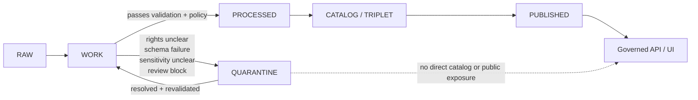

<!-- [KFM_META_BLOCK_V2]
doc_id: <REVIEW: kfm://doc/uuid-pending>
title: data/quarantine
type: standard
version: v1
status: draft
owners: <REVIEW: owner(s) pending>
created: <REVIEW: YYYY-MM-DD pending>
updated: <REVIEW: YYYY-MM-DD pending>
policy_label: <REVIEW: policy label pending>
related: [../../README.md, <REVIEW: adjacent data-zone docs pending verification>]
tags: [kfm, data, quarantine]
notes: [Grounded in current KFM doctrine and repo-grounded inventory; mounted subtree details, owners, and adjacent README coverage remain NEEDS VERIFICATION.]
[/KFM_META_BLOCK_V2] -->

# data/quarantine

Fail-closed holding zone for material that has entered KFM but cannot advance safely without review, clarification, or revalidation.

> **Status:** active  
> **Owners:** `<REVIEW: data stewardship / intake / policy owners pending>`  
>      
> **Quick jump:** [Scope](#scope) · [Repo fit](#repo-fit) · [Inputs](#inputs) · [Exclusions](#exclusions) · [Directory tree](#directory-tree) · [Quickstart](#quickstart) · [Usage](#usage) · [Diagram](#diagram) · [Tables](#tables) · [Task list](#task-list) · [FAQ](#faq) · [Appendix](#appendix)

> [!IMPORTANT]
> `data/quarantine/` is a governed workflow state, not a convenience dump folder. Material lands here when rights are unclear, validation fails, sensitivity is unresolved, or review blocks promotion. Nothing in this zone should be treated as warning-only pseudo-production.

> [!NOTE]
> This README is written to be repo-ready without overstating mounted implementation. KFM doctrine strongly establishes the **role** of quarantine. Actual subtree layout, local helper scripts, active CI enforcement, and owner assignments still need mounted repo verification.

## Scope

`data/quarantine/` exists to isolate ambiguity and failure without hiding either one. In KFM terms, it is where the system remains honest when material is too real to ignore and too uncertain to promote.

| Claim | Status | Meaning here |
|---|---|---|
| Quarantine is part of the core truth path. | **CONFIRMED** | It is a first-class lifecycle state, not an ad hoc exception. |
| Quarantine holds blocked or unresolved material. | **CONFIRMED** | Typical triggers include unclear rights, schema failure, sensitivity uncertainty, and review-blocked submissions. |
| Quarantine must not behave like pseudo-production. | **CONFIRMED** | No catalog completion, no public exposure, no silent promotion. |
| This directory should live beside other explicit data zones. | **PROPOSED** | The replacement-grade repo model keeps zone directories visible even if storage later maps to object stores or databases. |
| The exact mounted file layout under `data/quarantine/` is known. | **UNKNOWN / NEEDS VERIFICATION** | This README avoids claiming an internal subtree that was not directly inspected. |

## Repo fit

**Path:** `data/quarantine/README.md`  
**Repo root:** [`../../README.md`](../../README.md)

This README fits the top-level `data/` area, which project inventory documents describe as the home for registry entries, example datasets, catalog artifacts, and zone manifests. The quarantine lane sits inside the broader governed truth path rather than beside it.

| Relationship | Path | Role | Confidence |
|---|---|---|---|
| Self | `data/quarantine/README.md` | This directory contract and operating guide | Target path confirmed |
| Parent surface | `data/` | Data zones, dataset-facing storage semantics, and related manifests | **CONFIRMED** doctrinally / mounted subtree details **NEEDS VERIFICATION** |
| Upstream | `data/raw/` | Immutable acquisition captures | **CONFIRMED** doctrine / local path **NEEDS VERIFICATION** |
| Peer | `data/work/` | Repeatable transform and QA staging | **CONFIRMED** doctrine / local path **NEEDS VERIFICATION** |
| Downstream | `data/processed/` | Canonical publishable artifacts | **CONFIRMED** doctrine / local path **NEEDS VERIFICATION** |
| Downstream | `data/catalog/` | DCAT/STAC/PROV closure surfaces | **CONFIRMED** doctrine / local path **NEEDS VERIFICATION** |
| Downstream | `data/published/` | Governed exposure state | **CONFIRMED** doctrine / local path **NEEDS VERIFICATION** |
| Adjacent proof storage | `data/proofs/` | Proof, receipt, and related release evidence | **PROPOSED** replacement-grade skeleton |

## Inputs

### Accepted inputs

Only material that is **blocked, ambiguous, or explicitly under review** belongs here.

| Accepted input | Why it belongs here | Minimum companion material |
|---|---|---|
| Validation-failed transform output | It cannot advance to canonical publishable state. | Source or batch reference, failure summary, validation evidence |
| Rights-unclear material | KFM defaults to fail-closed on ambiguous rights. | Source terms snapshot or rights note, reviewer needed |
| Sensitivity-unclear material | Exposure cannot proceed until redaction/generalization or restriction is decided. | Sensitivity note, review requirement, public-safe handling note |
| Review-blocked submission | Human review has not cleared publication or promotion. | Decision context, blocking reason, next reviewer |
| Contributor upload awaiting steward review | Intake occurred, but publication safety is unresolved. | Metadata manifest, source description, intake reference |
| Redaction/generalization candidates | Transform work exists, but public-safe form is not yet approved. | Transform note, comparison context, approval requirement |
| QA evidence and triage artifacts tied to blocked material | They explain why an item is quarantined and what must happen next. | Stable case ID or subject ref, timestamps, author/reviewer context |

### Input rule of thumb

If the artifact can already be defended as canonical and publishable, it does **not** belong here. If it cannot yet be defended but must remain inspectable and governable, it probably does.

## Exclusions

### What does **not** belong here

| Excluded material | Where it should go instead | Why |
|---|---|---|
| Immutable upstream fetches and original payloads | `data/raw/` | Raw capture must remain append-only and intact. |
| Ordinary transform scratch that is not blocked or ambiguous | `data/work/` | Not all intermediate work is quarantine work. |
| Canonical, publishable artifacts with stable identity | `data/processed/` | Processed is for publishable outputs, not uncertain ones. |
| Triplet closure artifacts (DCAT/STAC/PROV) for releasable scope | `data/catalog/` | Catalog closure implies a stronger readiness state. |
| Runtime/public-facing outputs | `data/published/` | Published exposure happens only after promotion gates pass. |
| Proof packs, release manifests, or attestation bundles | `data/proofs/` or other verified proof location | Quarantine explains blocked state; it is not the default home for release proof. |
| Personal scratch notes, one-off experiments, or undocumented local temp files | Local scratch space outside governed data lanes | They do not carry governed lifecycle meaning. |

> [!WARNING]
> Do not use quarantine as a long-term shadow publication surface. “We know it is questionable, but let’s expose it anyway” is exactly what this zone is meant to prevent.

## Directory tree

The exact mounted subtree was not directly inspectable. The safest repo-ready view is therefore the **zone map** KFM doctrine expects contributors to understand.

```text
data/
├── raw/          # immutable acquisition captures
├── work/         # repeatable transform + QA staging
├── quarantine/   # blocked / ambiguous / review-held material
│   └── README.md
├── processed/    # canonical publishable artifacts
├── catalog/      # DCAT/STAC/PROV closure surfaces
├── published/    # governed exposure state
└── proofs/       # proof / receipt / release evidence
```

<details>
<summary><strong>PROPOSED starter substructure for one quarantine case</strong></summary>

```text
data/quarantine/
└── <case_or_subject_id>/
    ├── manifest.json                # intake or transfer note
    ├── triage.yaml                  # why the item is blocked
    ├── validation/                  # failed checks, QA output, diffs
    ├── review/                      # decision notes or review artifacts
    ├── payload/                     # blocked or review-held material
    └── transforms/                  # candidate redaction/generalization outputs
```

Use this only after checking the mounted repo and any existing house conventions.

</details>

## Quickstart

Use quarantine when an item **must not move forward yet**, but also **must not disappear into undocumented limbo**.

1. Create or select a stable quarantine case identifier.
2. Place the blocked material and its minimum context in the case folder.
3. Record *why* promotion is blocked.
4. Record *who* must review it and *what* must change for it to leave quarantine.
5. Keep it off catalog and published surfaces until a new validation and decision path is complete.

```bash
# Illustrative only — verify actual helper scripts, validators, and naming rules first.
CASE_ID="q-YYYYMMDD-example-001"
mkdir -p "data/quarantine/${CASE_ID}"

# Add the blocked artifact
cp /path/to/candidate-artifact.ext "data/quarantine/${CASE_ID}/"

# Add a minimal triage note
cat > "data/quarantine/${CASE_ID}/triage.yaml" <<'YAML'
case_id: q-YYYYMMDD-example-001
status: quarantine
reason_codes:
  - rights_unclear
source_ref: raw:source-or-batch-ref
required_review:
  - steward
public_exposure: blocked
candidate_next_step: revalidate_after_review
YAML
```

## Usage

### Entry rule

Move material into quarantine when one or more of the following is true:

1. **Validation failed**
2. **Rights are unclear**
3. **Sensitivity is unresolved**
4. **Review explicitly blocked advancement**
5. **The artifact cannot honestly support outward identifiers yet**

### Exit rule

Material should leave quarantine only through a new governed transition, not through quiet folder reshuffling.

Illustrative exit paths:

| Exit path | When to use it | Expected evidence before exit |
|---|---|---|
| Return to `work/` | More transform or repair work is needed before revalidation | Clear next-step note, retained case history |
| Promote toward `processed/` | Validation and review now support canonical publishable status | Updated validation evidence and decision context |
| Withdraw or reject | Rights, policy, or quality issues cannot be resolved | Decision note or correction/withdrawal reference |
| Retain in quarantine | The case is still open | Current status note, owner/reviewer, next review date |

### Illustrative triage document

```yaml
# Illustrative example only — field names are starter guidance, not a confirmed mounted schema.
case_id: q-2026-03-22-demo-001
subject_ref: raw:hydro.batch.0001
status: quarantine
reason_codes:
  - schema_failure
  - review_blocked
required_review:
  - data_steward
  - policy_review
public_exposure: blocked
notes: >
  Do not catalog or publish. Re-run validation after geometry repair and rights clarification.
```

## Diagram


```mermaid
flowchart LR
    A[RAW] --> B[WORK]
    B -->|passes validation + policy| C[PROCESSED]
    B -->|rights unclear<br/>schema failure<br/>sensitivity unclear<br/>review block| Q[QUARANTINE]
    Q -->|resolved + revalidated| B
    C --> D[CATALOG / TRIPLET]
    D --> E[PUBLISHED]
    E --> G[Governed API / UI]

    Q -. no direct catalog or public exposure .-> G
```

The main operating idea is simple: **quarantine keeps uncertainty visible and contained** until the system can either advance safely or refuse cleanly.

## Tables

### Zone behavior at a glance

| Zone | What it is for | What must not happen |
|---|---|---|
| `raw/` | Immutable source capture | In-place mutation or public exposure |
| `work/` | Repeatable transform and QA staging | Silent promotion without gates |
| `quarantine/` | Isolation of blocked, ambiguous, or review-held material | Warning-only pseudo-production |
| `processed/` | Canonical publishable artifacts | Publishing artifacts that cannot support valid closure |
| `catalog/` | Cross-linked metadata and lineage closure | Marking a version complete when closure is missing |
| `published/` | Governed exposure state | Treating publication as a file copy instead of a state transition |

### Allowed vs blocked operations in `data/quarantine/`

| Operation | Allowed? | Notes |
|---|---|---|
| Store blocked material with context | Yes | This is the core purpose of the zone. |
| Add failure evidence, review notes, and triage context | Yes | Quarantine should increase clarity, not reduce it. |
| Re-run validation or prepare candidate redaction/generalization outputs | Yes | Keep the work inspectable. |
| Attach catalog closure and outward public identifiers | No | Not before the material is resolved. |
| Serve the material to normal UI or public API surfaces | No | Quarantine is not a trust membrane bypass. |
| Quietly move content forward without updated evidence | No | Every exit must be legible. |

## Task list

Use this as the minimum definition-of-done for a quarantine case.

- [ ] Stable case or subject reference recorded
- [ ] Block reason recorded in plain language
- [ ] Supporting machine-readable or reviewable artifact attached
- [ ] Rights and sensitivity posture noted
- [ ] Required reviewer or steward named
- [ ] Public exposure explicitly marked **blocked**
- [ ] Next action recorded: repair, review, revalidate, reject, or withdraw
- [ ] Exit decision captured before any move toward `processed/`, `catalog/`, or `published/`

## FAQ

### Is quarantine just for “bad data”?

No. It is also for **unclear rights**, **uncertain sensitivity**, and **review-blocked** material. KFM uses quarantine to keep ambiguity explicit instead of smoothing it into publication.

### Can something stay here for a while?

Yes, but it should not stay here **silently**. Long-lived quarantine cases need current ownership, current reason codes, and a visible next step.

### Can the UI or API read directly from quarantine?

Normal governed exposure should come from promoted outputs, not from quarantine. This zone exists specifically to prevent ambiguous material from leaking into outward trust surfaces.

### Is quarantine the same as `work/`?

No. `work/` is general transform and QA staging. `quarantine/` is the stricter fail-closed lane for material that is blocked, ambiguous, or awaiting review.

### Why not just fix the issue in place downstream?

Because KFM treats lifecycle states as governed transitions, not as magic folders. Once a zone implies stronger trust, repair should create a new legible transition rather than erase the fact that the item was previously blocked.

## Appendix

<details>
<summary><strong>Status vocabulary used in this README</strong></summary>

| Label | Meaning |
|---|---|
| **CONFIRMED** | Supported directly by current project doctrine or repo-grounded inventory |
| **PROPOSED** | Safe starter pattern recommended by the doctrine but not verified as mounted implementation |
| **UNKNOWN** | Not directly proven from currently visible evidence |
| **NEEDS VERIFICATION** | A practical check should be made in the mounted repo before treating the detail as settled |

</details>

<details>
<summary><strong>PROPOSED starter reason codes</strong></summary>

| Reason code | Use when |
|---|---|
| `schema_failure` | Structure, type, geometry, or validation checks failed |
| `rights_unclear` | License, terms, or redistribution basis is unresolved |
| `sensitivity_unclear` | Exposure risk is unclear and needs review or redaction |
| `review_blocked` | Steward or policy review explicitly blocked advancement |
| `provenance_incomplete` | Source or lineage context is not sufficient yet |
| `withdrawal_pending` | The item is retained temporarily while a rejection or correction path is finalized |

</details>

<details>
<summary><strong>Maintenance notes for future editors</strong></summary>

1. Keep terminology stable with the wider KFM truth path.
2. Do not upgrade this README from doctrinal guidance to implementation certainty without checking the mounted repo.
3. If local scripts, schemas, or fixtures are later added for quarantine handling, document them here with exact paths.
4. When behavior changes, update this README in the same change set.

</details>

[Back to top](#dataquarantine)
