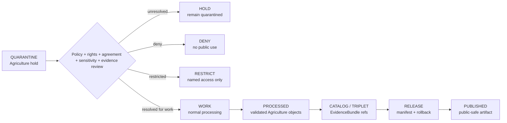

<!-- [KFM_META_BLOCK_V2]
doc_id: kfm://data/quarantine/agriculture/readme
name: Agriculture Quarantine README
path: data/quarantine/agriculture/README.md
type: data-quarantine-index-readme
version: v0.1.0
status: draft
owners:
  - <agriculture-domain-steward>
  - <policy-steward>
  - <rights-reviewer>
  - <privacy-reviewer>
created: 2026-06-27
updated: 2026-06-27
policy_label: restricted-review
truth_posture: cite-or-abstain
lifecycle_phase: quarantine
responsibility_root: data/
domain: agriculture
artifact_family: held-agriculture-material
sensitivity_posture: deny-by-default; no-public-path; most-restrictive-row-wins; review-required; release-blocked
related:
  - field-level-claim/README.md
  - operator-join/README.md
  - proprietary/README.md
  - ../README.md
  - ../../README.md
  - ../../../docs/domains/agriculture/SENSITIVITY.md
  - ../../../docs/domains/agriculture/DATA_LIFECYCLE.md
  - ../../../docs/domains/agriculture/LIFECYCLE.md
  - ../../../docs/domains/agriculture/ARCHITECTURE.md
  - ../../../docs/domains/agriculture/CROSS_LANE.md
  - ../../../docs/domains/agriculture/SOURCE_REGISTRY.md
  - ../../../docs/runbooks/agriculture/PROMOTION_RUNBOOK.md
  - ../../../docs/runbooks/agriculture/ROLLBACK_RUNBOOK.md
  - ../../../release/manifests/README.md
tags:
  - kfm
  - data
  - quarantine
  - agriculture
  - field-level-claim
  - operator-join
  - proprietary
  - privacy
  - rights
  - sensitivity
  - deny-by-default
  - evidence-first
notes:
  - "This README replaces the greenfield stub and documents the parent Agriculture quarantine lane."
  - "Agriculture quarantine is a hold area for material that must not feed processed, catalog, triplet, published, reports, layers, PMTiles, stories, graph/vector indexes, AI answers, or public UI without governed transition evidence."
  - "Private farm/operator/parcel joins fail closed; aggregate and satellite products must not be presented as field- or operator-level truth."
  - "Child lane README presence does not prove held payload presence, policy automation, validator wiring, CI enforcement, or review completion."
[/KFM_META_BLOCK_V2] -->

<a id="top"></a>

# Agriculture Quarantine

Parent hold lane for Agriculture material that is not safe or sufficiently governed for normal processing, cataloging, publication, reporting, map rendering, story playback, indexing, or AI-answer use.

<p>
  
  
  
  
  
  
</p>

**Quick links:** [Scope](#scope) · [Repo fit](#repo-fit) · [Confirmed child lanes](#confirmed-child-lanes) · [Inputs](#inputs) · [Exclusions](#exclusions) · [Directory map](#directory-map) · [Exit gates](#exit-gates) · [Forbidden shortcuts](#forbidden-shortcuts) · [Required checks](#required-checks-before-use) · [Status notes](#status-notes)

> [!CAUTION]
> `data/quarantine/agriculture/` is a no-public-path hold lane. Material here is not public, not processed truth, not catalog truth, not proof, not release authority, not policy authority, not Agriculture truth, and not an AI-answer source. Nothing in this subtree may be consumed by public clients, normal UI surfaces, reports, layers, PMTiles, stories, graph/vector indexes, or model-answer surfaces until a governed exit transition leaves inspectable evidence.

---

## Scope

This directory holds Agriculture material when evidence, source role, rights, agreement, privacy, sensitivity, policy, review, receipt closure, correction path, or rollback path is unresolved.

Agriculture doctrine requires the safest useful representation: aggregate observations and satellite products must not be presented as field- or operator-level truth, and private farm/operator/parcel joins fail closed. The most-restrictive-row rule applies when multiple sensitivity rules touch the same object or join.

This parent lane does not make held content authoritative. It organizes quarantine sublanes so stewards can review, deny, restrict, return to work, or promote only through governed lifecycle transitions.

---

## Repo fit

| Field | Value |
|---|---|
| Path | `data/quarantine/agriculture/` |
| Responsibility root | `data/` |
| Lifecycle phase | `quarantine/` |
| Domain lane | `agriculture` |
| Artifact role | Parent hold lane for Agriculture quarantine sublanes and quarantine-local review sidecars |
| Public access posture | No public path; no normal UI; no governed-public API exposure |
| Exit posture | Only by explicit policy decision, review record, required receipt closure, agreement closure where needed, and corrected lifecycle placement |
| Release authority | `release/`, not this directory |
| Proof authority | `data/proofs/` and `data/receipts/`, not this directory |
| Catalog authority | `data/catalog/`, not this directory |
| Registry authority | `data/registry/`, not this directory |
| Policy authority | `policy/`, not this directory |
| Default failure posture | `HOLD`, `DENY`, `RESTRICT`, or `ABSTAIN` when evidence, source role, rights, agreement, sensitivity, privacy, receipt, policy, review, correction, or rollback support is insufficient |

---

## Confirmed child lanes

The child lanes below are README paths confirmed by current-session GitHub fetches or edits. This table does **not** prove held payloads exist under those lanes.

| Child lane | Held material | Boundary |
|---|---|---|
| [`field-level-claim/`](field-level-claim/README.md) | Field-level crop, rotation, footprint, satellite/model, and generated claim material | Must not become field truth, public map/report/story material, or AI-answer evidence without review and receipt closure. |
| [`operator-join/`](operator-join/README.md) | Farm/operator/parcel/field/well/practice/yield/agreement joins | Private farm/operator/parcel joins fail closed; no graph/vector/public use without governed transition. |
| [`proprietary/`](proprietary/README.md) | Proprietary yield, producer-supplied, research-collaboration, agreement-bound, and commercial-operation material | No public path; named agreement and review state required for restricted use. |

> [!NOTE]
> Add additional Agriculture quarantine sublanes only after confirming the risk class, responsibility-root fit, sensitivity posture, policy decision shape, receipt requirements, reviewer roles, correction path, rollback target, and Directory Rules placement basis.

---

## Inputs

Accepted content is limited to held review material and quarantine-local sidecars such as:

- source excerpts, source pointers, candidate records, join packets, field-level claim packets, proprietary packets, or generated candidates that require quarantine;
- quarantine reason notes and `HOLD` / `DENY` / `RESTRICT` summaries;
- source-role, rights, agreement, sensitivity, privacy, reviewer, and steward notes;
- candidate receipt drafts, such as aggregation, redaction, model-run, citation-validation, join-evaluation, agreement-review, or policy-decision drafts;
- hash/digest sidecars used to preserve chain-of-custody for held material;
- quarantine-local README files and local indexes that explain hold state without becoming proof, catalog, registry, policy, or release authority.

---

## Exclusions

| Do not place here | Correct authority home |
|---|---|
| Clean RAW source mirrors that have not triggered quarantine | `data/raw/agriculture/` or source-specific intake |
| Ordinary WORK material that is safe to process under normal review | `data/work/agriculture/` |
| Validated processed Agriculture objects | `data/processed/agriculture/` |
| Catalog records, triplets, graph truth, or EvidenceBundle state | `data/catalog/`, triplet lanes, or proof lanes |
| EvidenceBundle / ProofPack | `data/proofs/` |
| Final validation, transform, redaction, aggregation, model-run, AI, or release receipts | `data/receipts/` |
| Release manifests, promotion decisions, correction records, rollback records, or signatures | `release/` |
| Source descriptors, source activation records, agreement registries, or registry truth | `data/registry/` |
| Public layers, PMTiles, reports, stories, API payloads, or published artifacts | `data/published/` only after release gates close |
| Semantic contracts, schemas, validators, or policy rules | `contracts/`, `schemas/`, `tools/`, `policy/` |
| Normal public UI, search, vector-index, graph, or AI-answer material | Governed public lanes only after release; otherwise abstain or deny |

---

## Directory map

```text
data/quarantine/agriculture/
├── README.md
├── field-level-claim/
│   └── README.md
├── operator-join/
│   └── README.md
├── proprietary/
│   └── README.md
└── index.local.json
```

`index.local.json` is optional and must remain quarantine-local. It is not a public index, catalog record, release manifest, registry, graph edge source, layer/story/report pointer, search index, vector index, or AI retrieval index.

---

## Exit gates

Agriculture material may leave quarantine only when the exit path is explicit:

| Exit route | Minimum requirement |
|---|---|
| Stay held | Any unresolved source, rights, agreement, sensitivity, privacy, evidence, or policy question remains. |
| Deny | PolicyDecision says `DENY`; public/UI/AI surfaces abstain or deny. |
| Restrict | PolicyDecision, ReviewRecord, and named agreement identify allowed audience, purpose, terms, and revocation path. |
| Return to work | Hold reason is resolved, but normal validation or transformation still remains. |
| Promote to processed/catalog/published | Only after all required receipts, review records, source descriptors, evidence closure, release manifest, correction path, and rollback path exist. |

A more public tier requires the required transform receipt and review record. A more restrictive correction can happen immediately when risk is discovered.

---

## Forbidden shortcuts

```text
data/quarantine/agriculture/
→ data/processed/agriculture/
→ data/catalog/
→ data/published/
→ public API / MapLibre / report / story / graph / vector index / AI answer
```

is forbidden unless the appropriate governed transition has actually happened and left inspectable evidence.



---

## Required checks before use

- [ ] Confirm the material is Agriculture-domain material and belongs under `data/quarantine/agriculture/`.
- [ ] Confirm the correct child sublane: `field-level-claim/`, `operator-join/`, `proprietary/`, or a new documented sublane.
- [ ] Confirm the hold reason is recorded.
- [ ] Confirm source descriptors, source roles, authority, rights posture, agreement state, and current terms.
- [ ] Confirm the most-restrictive-row rule has been applied.
- [ ] Confirm field specificity, operator linkage, parcel linkage, private operational context, proprietary context, and re-identification risk.
- [ ] Confirm whether the material is observed, administrative, modeled, inferred, candidate, generated, or synthetic.
- [ ] Confirm required receipts are present or explicitly marked missing.
- [ ] Confirm PolicyDecision, ReviewRecord, and named agreement state before any exit.
- [ ] Confirm no public layer, PMTiles, report, story, API payload, graph edge, search index, vector index, or AI answer uses the quarantined material.
- [ ] Confirm correction, revocation, and rollback paths are documented before any less-restrictive transition.

---

## Status notes

| Claim | Status |
|---|---|
| This README replaces the greenfield stub at `data/quarantine/agriculture/README.md`. | **CONFIRMED authored** |
| The target path existed in the live repository as a greenfield stub before this edit. | **CONFIRMED by GitHub contents API during this edit** |
| `field-level-claim/README.md`, `operator-join/README.md`, and `proprietary/README.md` exist as Agriculture quarantine child-lane READMEs. | **CONFIRMED by GitHub contents API during this edit** |
| Agriculture sensitivity doctrine says aggregate observations and satellite products must not be presented as field- or operator-level truth. | **CONFIRMED by GitHub contents API during this edit** |
| Agriculture sensitivity doctrine says private farm/operator × parcel joins fail closed and the most-restrictive-row rule applies. | **CONFIRMED by GitHub contents API during this edit** |
| Actual quarantined payloads exist under every listed child lane. | **UNKNOWN** |
| Policy automation, validators, and CI checks enforce every listed Agriculture quarantine lane. | **NEEDS VERIFICATION** |
| This README is proof, release, catalog, registry, policy, Agriculture truth, public artifact authority, or AI authority. | **DENY** |

---

## Related files

- [`field-level-claim/README.md`](field-level-claim/README.md)
- [`operator-join/README.md`](operator-join/README.md)
- [`proprietary/README.md`](proprietary/README.md)
- [`../README.md`](../README.md)
- [`../../README.md`](../../README.md)
- [`../../../docs/domains/agriculture/SENSITIVITY.md`](../../../docs/domains/agriculture/SENSITIVITY.md)
- [`../../../docs/domains/agriculture/DATA_LIFECYCLE.md`](../../../docs/domains/agriculture/DATA_LIFECYCLE.md)
- [`../../../docs/domains/agriculture/LIFECYCLE.md`](../../../docs/domains/agriculture/LIFECYCLE.md)
- [`../../../docs/domains/agriculture/ARCHITECTURE.md`](../../../docs/domains/agriculture/ARCHITECTURE.md)
- [`../../../docs/domains/agriculture/CROSS_LANE.md`](../../../docs/domains/agriculture/CROSS_LANE.md)
- [`../../../docs/domains/agriculture/SOURCE_REGISTRY.md`](../../../docs/domains/agriculture/SOURCE_REGISTRY.md)
- [`../../../docs/runbooks/agriculture/PROMOTION_RUNBOOK.md`](../../../docs/runbooks/agriculture/PROMOTION_RUNBOOK.md)
- [`../../../docs/runbooks/agriculture/ROLLBACK_RUNBOOK.md`](../../../docs/runbooks/agriculture/ROLLBACK_RUNBOOK.md)
- [`../../../release/manifests/README.md`](../../../release/manifests/README.md)

---

KFM rule: this directory is an Agriculture quarantine hold index only. It is not source authority, proof authority, receipt authority, release authority, catalog authority, registry authority, policy authority, Agriculture truth, public artifact authority, UI authority, graph authority, vector-index authority, or AI truth.

[Back to top](#top)
