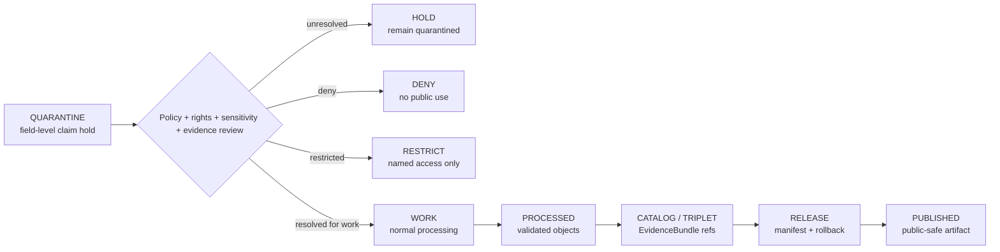

<!-- [KFM_META_BLOCK_V2]
doc_id: kfm://data/quarantine/agriculture/field-level-claim/readme
name: Agriculture Field-Level Claim Quarantine README
path: data/quarantine/agriculture/field-level-claim/README.md
type: data-quarantine-lane-readme
version: v0.1.0
status: draft
owners:
  - <agriculture-domain-steward>
  - <policy-steward>
  - <rights-reviewer>
  - <privacy-reviewer>
created: 2026-06-27
updated: 2026-06-27
policy_label: restricted-review
truth_posture: cite-or-abstain
lifecycle_phase: quarantine
responsibility_root: data/
domain: agriculture
artifact_family: held-agriculture-field-level-claims
sensitivity_posture: deny-by-default; field-level-claims-held; private-farm-operator-parcel-joins-fail-closed; no-publication-without-review
tags:
  - kfm
  - data
  - quarantine
  - agriculture
  - field-level-claim
  - sensitivity
  - privacy
  - rights
  - deny-by-default
  - review-required
  - evidence-first
related:
  - ../../README.md
  - ../README.md
  - ../../../README.md
  - ../../../../docs/domains/agriculture/SENSITIVITY.md
  - ../../../../docs/domains/agriculture/DATA_LIFECYCLE.md
  - ../../../../docs/domains/agriculture/LIFECYCLE.md
  - ../../../../docs/domains/agriculture/ARCHITECTURE.md
  - ../../../../docs/runbooks/agriculture/PROMOTION_RUNBOOK.md
  - ../../../../docs/runbooks/agriculture/ROLLBACK_RUNBOOK.md
  - ../../../../release/manifests/README.md
notes:
  - "This README documents the quarantine lane for Agriculture field-level claim material."
  - "Quarantine is a hold state, not a staging shortcut to processed, catalog, triplet, published, reports, layers, PMTiles, stories, AI answers, or public UI."
  - "Field-level agriculture claims stay held until source role, rights, sensitivity, privacy, receipts, policy decision, review record, evidence closure, and rollback path are resolved."
  - "Actual payload presence, policy automation, validator wiring, and CI enforcement remain UNKNOWN unless verified."
[/KFM_META_BLOCK_V2] -->

<a id="top"></a>

# Agriculture Field-Level Claim Quarantine

Held Agriculture field-level claim material pending source, rights, sensitivity, privacy, evidence, and policy review.

<p>
  
  
  
  
  
  
</p>

**Quick links:** [Scope](#scope) · [Repo fit](#repo-fit) · [Held material](#held-material) · [Inputs](#inputs) · [Exclusions](#exclusions) · [Directory map](#directory-map) · [Exit gates](#exit-gates) · [Forbidden shortcuts](#forbidden-shortcuts) · [Status notes](#status-notes)

> [!CAUTION]
> `data/quarantine/agriculture/field-level-claim/` is a hold lane. Material here is not public, not processed truth, not catalog truth, not proof, not release authority, not field truth, and not an AI-answer source. Nothing in this lane may be used by public clients or normal UI surfaces.

---

## Scope

This directory may hold Agriculture field-level claim material when any material question remains unresolved: source role, authority, rights, privacy, operator or parcel linkage, field specificity, evidence sufficiency, derivation method, review state, policy decision, receipt closure, correction path, or rollback path.

Typical reasons for quarantine include:

- field-level claims whose source role is not yet clear;
- candidate field footprints or boundaries that may imply private operation detail;
- operator-linked, parcel-linked, or agreement-linked Agriculture records;
- field-level satellite, model, or classification outputs that could be misread as field truth;
- field-level NASS-style claims, proprietary yield, irrigation links, conservation-practice details, or other material that Agriculture sensitivity doctrine marks as deny-default or reviewer-only;
- generated claims, joined tables, or map/report/story candidates that have not passed citation, receipt, and policy review.

This lane is a quarantine lane. Its purpose is to preserve evidence for review without allowing accidental promotion, publication, indexing, map rendering, report generation, story playback, vector indexing, or AI-answer use.

---

## Repo fit

| Field | Value |
|---|---|
| Path | `data/quarantine/agriculture/field-level-claim/` |
| Responsibility root | `data/` |
| Lifecycle phase | `quarantine/` |
| Domain lane | `agriculture` |
| Sublane | `field-level-claim` |
| Artifact role | Held Agriculture field-level claim material and quarantine-local review sidecars |
| Public access posture | No public path; no normal UI; no governed-public API exposure |
| Exit posture | Only by explicit policy decision, review record, required receipt closure, and corrected lifecycle placement |
| Release authority | `release/`, not this directory |
| Proof authority | `data/proofs/` and `data/receipts/`, not this directory |
| Catalog authority | `data/catalog/`, not this directory |
| Default failure posture | `HOLD`, `DENY`, `RESTRICT`, or `ABSTAIN` when evidence, source role, rights, sensitivity, privacy, receipt, policy, review, correction, or rollback support is insufficient |

---

## Held material

Material belongs here when it is not safe or sufficiently governed for `work`, `processed`, `catalog`, `published`, report, story, layer, or AI-answer use.

| Held family | Why it is held |
|---|---|
| Field-level crop or rotation claims | May imply private field, operator, or parcel facts. |
| Field-candidate footprints | Need source-role, derivation, sensitivity, and review closure before any less-restrictive state. |
| Field-level satellite or model outputs | Must not be presented as field truth without caveat, role, and review state. |
| Operator-supplied or research-collaboration records | Rights, agreement, privacy, and review state must be explicit. |
| Proprietary yield or practice details | Deny-default unless a named restricted agreement and policy decision apply. |
| Cross-lane joins involving farm, operator, parcel, well, or other private operational context | Most-restrictive-row rule applies; unresolved joins fail closed. |
| Generated narratives, report candidates, map candidates, or story candidates using field-level claims | Must not become public carriers without citation and policy closure. |

---

## Inputs

Accepted content is limited to held review material and quarantine-local sidecars such as:

- source excerpts, source pointers, candidate records, or claim packets that require quarantine;
- quarantine reason notes and `HOLD` / `DENY` / `RESTRICT` policy summaries;
- source-role, rights, sensitivity, privacy, and reviewer notes;
- candidate receipt drafts, such as aggregation, redaction, model-run, citation-validation, or policy-decision drafts;
- hash/digest sidecars used to preserve chain-of-custody for held material;
- quarantine-local README files that explain hold state without becoming proof or release authority.

---

## Exclusions

| Do not place here | Correct authority home |
|---|---|
| Clean RAW source mirrors that have not triggered quarantine | `data/raw/agriculture/` or source-specific intake |
| Ordinary WORK material that is safe to process under normal review | `data/work/agriculture/` |
| Validated processed Agriculture objects | `data/processed/agriculture/` |
| Catalog records, triplets, graph truth, or EvidenceBundle state | `data/catalog/`, triplet lanes, or proof lanes |
| EvidenceBundle / ProofPack | `data/proofs/` |
| Final validation, transform, redaction, aggregation, AI, or release receipts | `data/receipts/` |
| Release manifests, promotion decisions, correction records, rollback records, or signatures | `release/` |
| Public layers, PMTiles, reports, stories, API payloads, or published artifacts | `data/published/` only after release gates close |
| Source descriptors or registry truth | `data/registry/` |
| Semantic contracts, schemas, or policy rules | `contracts/`, `schemas/`, `policy/` |
| Normal public UI or AI-answer material | Governed public lanes only after release; otherwise abstain or deny |

---

## Directory map

```text
data/quarantine/agriculture/field-level-claim/
├── README.md
├── <hold_id>/
│   ├── claim_packet.json
│   ├── source_refs.json
│   ├── quarantine_reason.md
│   ├── sensitivity_review.notes.md
│   ├── rights_review.notes.md
│   ├── policy_decision.draft.json
│   ├── receipt_closure.checklist.md
│   ├── claim_packet.sha256
│   └── README.md
└── index.local.json
```

`index.local.json` is optional and must remain quarantine-local. It is not a public index, catalog record, release manifest, registry, or layer/story/report pointer.

---

## Exit gates

A held field-level claim may leave this lane only when the exit path is explicit:

| Exit route | Minimum requirement |
|---|---|
| Stay held | Any unresolved source, rights, sensitivity, privacy, evidence, or policy question remains. |
| Deny | PolicyDecision says `DENY`; public/UI/AI surfaces abstain or deny. |
| Restrict | PolicyDecision and ReviewRecord identify a named restricted audience and terms. |
| Return to work | Hold reason is resolved, but normal validation or transformation still remains. |
| Promote to processed/catalog/published | Only after all required receipts, review records, source descriptors, evidence closure, release manifest, correction path, and rollback path exist. |

A more public tier requires the required transform receipt and review record. A more restrictive correction can happen immediately when risk is discovered.

---

## Forbidden shortcuts

```text
data/quarantine/agriculture/field-level-claim/
→ data/processed/agriculture/
→ data/catalog/
→ data/published/
→ public API / MapLibre / report / story / AI answer
```

is forbidden unless the appropriate governed transition has actually happened and left inspectable evidence.



---

## Required checks before use

- [ ] Confirm the material is Agriculture-domain material and belongs in this quarantine sublane.
- [ ] Confirm the hold reason is recorded.
- [ ] Confirm source descriptors, source roles, authority, rights posture, and current terms.
- [ ] Confirm the most-restrictive-row rule has been applied.
- [ ] Confirm field specificity, operator linkage, parcel linkage, private operational context, and re-identification risk.
- [ ] Confirm whether the claim is observed, modeled, aggregate, administrative, candidate, or generated.
- [ ] Confirm required receipts are present or explicitly marked missing.
- [ ] Confirm PolicyDecision and ReviewRecord state before any exit.
- [ ] Confirm no public layer, PMTiles, report, story, API payload, search index, vector index, or AI answer uses the quarantined material.
- [ ] Confirm correction and rollback paths are documented before any less-restrictive transition.

---

## Status notes

| Claim | Status |
|---|---|
| This README defines the requested quarantine path boundary. | **CONFIRMED authored** |
| The target path exists in the live repository as an empty file before this edit. | **CONFIRMED by GitHub contents API during this edit** |
| Agriculture sensitivity doctrine says private farm/operator × parcel joins fail closed. | **CONFIRMED by GitHub contents API during this edit** |
| Agriculture sensitivity doctrine marks field-level NASS claims as deny-default / runtime-denied. | **CONFIRMED by GitHub contents API during this edit** |
| The parent `data/quarantine/README.md` is currently only a greenfield stub. | **CONFIRMED by GitHub contents API during this edit** |
| Actual field-level claim payloads exist in this subtree. | **UNKNOWN** |
| Policy automation, validators, and CI checks enforce this exact quarantine lane. | **NEEDS VERIFICATION** |
| This README is proof, release, catalog, registry, policy, field truth, or AI authority. | **DENY** |

---

## Related files

- [`../../README.md`](../../README.md)
- [`../README.md`](../README.md)
- [`../../../README.md`](../../../README.md)
- [`../../../../docs/domains/agriculture/SENSITIVITY.md`](../../../../docs/domains/agriculture/SENSITIVITY.md)
- [`../../../../docs/domains/agriculture/DATA_LIFECYCLE.md`](../../../../docs/domains/agriculture/DATA_LIFECYCLE.md)
- [`../../../../docs/domains/agriculture/LIFECYCLE.md`](../../../../docs/domains/agriculture/LIFECYCLE.md)
- [`../../../../docs/domains/agriculture/ARCHITECTURE.md`](../../../../docs/domains/agriculture/ARCHITECTURE.md)
- [`../../../../docs/runbooks/agriculture/PROMOTION_RUNBOOK.md`](../../../../docs/runbooks/agriculture/PROMOTION_RUNBOOK.md)
- [`../../../../docs/runbooks/agriculture/ROLLBACK_RUNBOOK.md`](../../../../docs/runbooks/agriculture/ROLLBACK_RUNBOOK.md)
- [`../../../../release/manifests/README.md`](../../../../release/manifests/README.md)

---

KFM rule: this directory is an Agriculture quarantine hold lane only. It is not source authority, proof authority, receipt authority, release authority, catalog authority, registry authority, policy authority, field truth, public artifact authority, UI authority, or AI truth.

[Back to top](#top)
