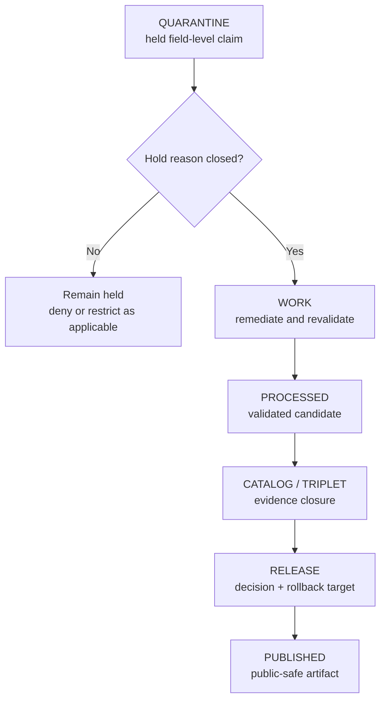

<!-- [KFM_META_BLOCK_V2]
doc_id: kfm://data/quarantine/agriculture/field-level-claim/readme
name: Agriculture Field-Level Claim Quarantine README
path: data/quarantine/agriculture/field-level-claim/README.md
type: data-quarantine-lane-readme
version: v0.2.0
status: draft
owners:
  - "NEEDS VERIFICATION: agriculture domain steward"
  - "NEEDS VERIFICATION: policy steward"
  - "NEEDS VERIFICATION: rights and privacy reviewers"
created: 2026-06-27
updated: 2026-07-26
policy_label: restricted-review
truth_posture: cite-or-abstain
lifecycle_phase: quarantine
responsibility_root: data/
domain: agriculture
artifact_family: held-agriculture-field-level-claims
sensitivity_posture: deny-by-default; field-level-claims-held; private-farm-operator-parcel-joins-fail-closed; no-publication-without-review
related:
  - ../../README.md
  - ../README.md
  - ../../../README.md
  - ../../../../docs/doctrine/directory-rules.md
  - ../../../../docs/adr/ADR-0021-quarantine-has-structured-exit-paths.md
  - ../../../../docs/adr/ADR-0029-adopt-directory-governance-standard-v2.md
  - ../../../../docs/domains/agriculture/CANONICAL_PATHS.md
  - ../../../../docs/domains/agriculture/SENSITIVITY.md
  - ../../../../docs/domains/agriculture/DATA_LIFECYCLE.md
  - ../../../../docs/domains/agriculture/LIFECYCLE.md
  - ../../../../docs/domains/agriculture/ARCHITECTURE.md
  - ../../../../docs/domains/agriculture/VERIFICATION_BACKLOG.md
  - ../../../../docs/runbooks/agriculture/PROMOTION_RUNBOOK.md
  - ../../../../docs/runbooks/agriculture/ROLLBACK_RUNBOOK.md
  - ../../../../release/manifests/README.md
tags:
  - kfm
  - data
  - quarantine
  - agriculture
  - field-level-claim
  - sensitivity
  - privacy
  - rights
  - deny-by-default
  - review-required
  - evidence-first
evidence_snapshot:
  repository: bartytime4life/Kansas-Frontier-Matrix
  base_commit: 9153fa01fa667ded1a06fa6fda727a641bdead78
  prior_blob: b0531678b4f61fac504f31bfb8ba2eef75b99ba7
  inspection_date: 2026-07-26
notes:
  - "This README documents a nested quarantine lane; it does not create policy, proof, receipt, catalog, release, publication, or access authority."
  - "The repository is public. No-public-path means no ordinary runtime or client consumption; it does not make committed repository content private."
  - "Actual payload presence, accepted exit contracts, policy automation, validator wiring, owner assignment, and end-to-end enforcement remain UNKNOWN or NEEDS VERIFICATION as stated below."
  - "Directory Rules v2 and ADR-0029 remain proposed at the evidence snapshot; both doctrine and architecture paths carry the same proposed v2 bytes, and draft PR #1774 proposes a separate ratification and compatibility repair. This same-path update does not resolve, adopt, or amend that authority conflict."
[/KFM_META_BLOCK_V2] -->

<a id="top"></a>

# Agriculture Field-Level Claim Quarantine

Hold Agriculture field-level claim material until its source role, rights, sensitivity, privacy, evidence, review, correction, and rollback obligations are resolved.

[](#status-and-evidence)
[](../../README.md)
[](#exposure-and-sensitivity-boundary)
[](#status-and-evidence)

> [!CAUTION]
> This GitHub repository is public. “No public path” means quarantined material must not feed ordinary APIs, maps, reports, stories, indexes, UI, or AI answers. It does **not** make repository content private. Never commit restricted field, operator, parcel, agreement, precise-location, credential, or proprietary payloads here; use an approved restricted system and retain only public-safe pointers, digests, and review metadata when permitted.

**Quick navigation:** [Scope](#scope) · [Repository fit](#repo-fit) · [Held material](#held-material) · [Exposure boundary](#exposure-and-sensitivity-boundary) · [Inputs](#inputs) · [Exclusions](#exclusions) · [Directory map](#directory-map) · [Exit gates](#exit-gates) · [Shortcuts](#forbidden-shortcuts) · [Required checks](#required-checks-before-use) · [Validation](#validation-and-maintenance) · [Status](#status-and-evidence) · [Related files](#related-files)

## Scope

This lane documents the hold boundary for Agriculture field-level claims when any material question remains unresolved, including:

- source identity, authority, or role;
- rights, consent, agreement, redistribution, or attribution;
- field specificity, operator or parcel linkage, or re-identification risk;
- observed, modeled, inferred, candidate, aggregate, or generated claim status;
- geometry, time, lineage, evidence, or derivation support;
- validation, policy, review, receipt, correction, or rollback closure.

Quarantine preserves a reviewable state. It is not processed truth, catalog truth, proof, release authority, a private storage system, or a staging shortcut to publication.

If operator linkage, agreement restrictions, or proprietary content becomes the controlling hold reason, use the documented sibling lane rather than duplicating the same authority here:

- [`../operator-join/`](../operator-join/README.md) for farm, operator, parcel, field, well, or other identity-bearing joins;
- [`../proprietary/`](../proprietary/README.md) for agreement-bound, producer-supplied, research-collaboration, yield, or other proprietary material.

## Repo fit

| Field | Bounded result |
| --- | --- |
| Path | `data/quarantine/agriculture/field-level-claim/` |
| Responsibility root | `data/` |
| Lifecycle phase | `quarantine/` |
| Domain lane | `agriculture` |
| Document role | Nested lane boundary and reviewer guidance |
| Public-repository posture | README and public-safe metadata only; restricted payloads require approved restricted storage |
| Runtime/public-client posture | No ordinary API, UI, map, report, story, index, or AI-answer consumption |
| Exit posture | Remain held unless the applicable evidence, policy, review, receipt, correction, and rollback requirements close |
| Release authority | `release/`, not this directory |
| Proof and receipt authority | `data/proofs/` and `data/receipts/`, not this directory |
| Catalog and triplet authority | `data/catalog/` and `data/triplets/`, not this directory |
| Policy authority | `policy/`, not this directory |
| Owner assignment | **NEEDS VERIFICATION** |
| Recursive payload inventory | **UNKNOWN** |
| Lane-specific executable enforcement | **UNKNOWN**; the inspected Agriculture workflow is an explicit readiness hold |
| Directory Rules relationship | v2 and ADR-0029 are **PROPOSED**; the doctrine and architecture paths carry duplicate v2 bytes, and this same-path edit makes no adoption claim |

## Held material

The rows below identify review triggers, not proof that a payload exists or that an executable policy currently enforces the stated posture.

| Held family | Why it is held | Routing note |
| --- | --- | --- |
| Field-level NASS-derived claim | Draft Agriculture guidance classifies field-level NASS claims as deny-default and lists policy denial as a verification item. | Keep held; do not extrapolate from county or district aggregates. |
| Field-candidate footprint | May expose a private operational boundary or imply ground truth from a classification. | Hold for source-role, derivation, sensitivity, and steward review. |
| Satellite- or model-derived field value | A downstream interpretation can be mistaken for an observed field fact. | Preserve model/source role and uncertainty; never relabel as field truth. |
| Field-level crop, rotation, irrigation, practice, or yield claim | May reveal operational detail or combine multiple restrictive contexts. | Apply the most-restrictive applicable posture; route identity-bearing joins to `operator-join/`. |
| Agreement-bound or proprietary field claim | Rights, purpose, audience, retention, and revocation may be unresolved. | Route to `proprietary/` when the agreement or proprietary character is the primary hold reason. |
| Generated map, report, story, search, vector-index, or AI candidate | A carrier can amplify an unsupported or sensitive field-level claim. | Keep out of public and retrieval surfaces until governed evidence and release closure. |

## Exposure and sensitivity boundary

The repository’s Agriculture sensitivity and canonical-path documents are both `draft`; they are evidence of documented posture, not proof of accepted policy or runtime enforcement.

| Situation | Review posture documented in the draft Agriculture guidance | Current implementation claim |
| --- | --- | --- |
| Aggregate county- or district-level observation | Potentially public only through the normal evidence, policy, review, and release path | **NEEDS VERIFICATION** |
| Field-level satellite or model context | Generalize where permitted; preserve source role; never present as field truth | **NEEDS VERIFICATION** |
| Field-candidate footprint | Reviewer-bound by default in the draft tier matrix | **NEEDS VERIFICATION** |
| Field-level NASS claim | Deny-default in draft guidance; denial test remains a backlog item | **PROPOSED** enforcement |
| Private farm, operator, or parcel join | Fail closed under the documented most-restrictive-row posture | **PROPOSED** enforcement |
| Unknown rights, consent, agreement, or sensitivity | Remain held; do not infer permission from availability | **CONFIRMED** fail-closed documentation boundary |

> [!IMPORTANT]
> A field boundary, model output, aggregate statistic, map feature, or generated narrative is not sovereign field truth. Evidence and source role remain visible, and fluent language or visual precision must not increase the claim’s authority.

## Inputs

Only public-safe hold metadata and review material belong in this repository path, such as:

- a stable hold identifier and explicit quarantine reason;
- public-safe source references, source-role assertions, and content digests;
- spatial and temporal scope described without harmful precision;
- rights, agreement, sensitivity, privacy, and reviewer status;
- public-safe validation findings and unresolved evidence references;
- draft receipt or decision references clearly labeled as drafts, not final authority;
- correction, withdrawal, revocation, and rollback dependencies;
- a pointer to approved restricted storage when policy and rights permit recording one.

Every pointer must avoid credentials, signed URLs, private endpoints, personal data, or enough joined detail to reconstruct restricted content.

## Exclusions

| Do not place or claim here | Correct home or action |
| --- | --- |
| Restricted field, operator, parcel, agreement, precise-location, or proprietary payloads in this public repository | Approved restricted storage; retain only permitted public-safe pointers and digests |
| Farm/operator/parcel identity joins | [`../operator-join/`](../operator-join/README.md) |
| Agreement-bound or proprietary material as the controlling hold reason | [`../proprietary/`](../proprietary/README.md) |
| Clean source captures that have not triggered quarantine | `data/raw/agriculture/` or the verified source-specific intake |
| Ordinary transformation candidates with no unresolved hold | `data/work/agriculture/` |
| Validated normalized Agriculture objects | `data/processed/agriculture/` |
| Catalog records or relationship projections | `data/catalog/` or `data/triplets/` |
| EvidenceBundle, ProofPack, or final validation evidence | `data/proofs/` |
| Final process, validation, policy, AI, or release receipts | `data/receipts/` |
| Policy definitions or decision contracts | `policy/` and `contracts/` |
| Release decisions, manifests, corrections, withdrawals, or rollback cards | `release/` |
| Public layers, tiles, reports, stories, API payloads, indexes, or published artifacts | Governed `data/published/` outputs only after release closure |
| Normal UI, search, retrieval, or AI-answer input | Released public-safe interfaces; otherwise abstain or deny under the applicable contract |

## Directory map

The current session confirms this README at the target path. It does not establish a recursive payload inventory. The following is a **PROPOSED illustrative pattern**, not a claim that these files or directories exist:

```text
data/quarantine/agriculture/field-level-claim/
├── README.md
└── <hold_id>/
    ├── README.md
    ├── source_refs.json
    ├── quarantine_reason.md
    └── claim_packet.sha256
```

Any future case directory must be backed by a verified contract, generator or intake path, sensitivity review, and repository-visibility decision. File names above are illustrative; do not create them by copying this diagram. Restricted bytes stay outside the public repository.

## Exit gates

[`ADR-0021`](../../../../docs/adr/ADR-0021-quarantine-has-structured-exit-paths.md) proposes a closed quarantine-exit grammar but remains `proposed`. Until an accepted decision and executable contract align the exit set, use the following as bounded review guidance rather than claiming implemented state-machine enforcement.

| Disposition | Minimum review evidence |
| --- | --- |
| Remain held | The unresolved reason, affected scope, next review condition, and preservation needs remain visible. |
| Reclassify within quarantine | The controlling hold reason changed and the sibling lane better owns it; preserve identity, digest, and review lineage. |
| Return to WORK | The quarantine reason is resolved enough for ordinary transformation and revalidation; no public or release implication follows. |
| Advance as a PROCESSED candidate | The applicable validation, source-role, rights, sensitivity, evidence, policy, and review gates close; later catalog and release gates still remain. |
| Deny or restrict use | Use the finite outcome and obligations defined by the applicable accepted contract; record reason, audience, purpose, duration, and correction path as required. |
| Release a safer derivative | Keep the held original non-public; the derivative must traverse normal processing, evidence, catalog, policy, review, release, correction, and rollback gates. |
| Correct or withdraw a downstream release | Use `release/` correction, withdrawal, invalidation, and rollback authority; never rewrite quarantine history to conceal the prior release. |

This README does not define `HOLD` or `RESTRICT` as universal machine enums. Contract-specific vocabularies remain separate.

## Forbidden shortcuts

The following path-only sequence is forbidden:

```text
data/quarantine/agriculture/field-level-claim/
→ data/processed/agriculture/
→ data/catalog/ or data/triplets/
→ data/published/
→ public API, MapLibre, report, story, index, or AI answer
```

A less restrictive state requires the applicable governed transition and inspectable evidence. A file copy, rename, pull request, merge, badge, generated report, or GitHub release is not promotion or KFM publication.


```mermaid
flowchart TD
    Q["QUARANTINE<br/>held field-level claim"] --> R{"Hold reason closed?"}
    R -->|"No"| H["Remain held<br/>deny or restrict as applicable"]
    R -->|"Yes"| W["WORK<br/>remediate and revalidate"]
    W --> P["PROCESSED<br/>validated candidate"]
    P --> C["CATALOG / TRIPLET<br/>evidence closure"]
    C --> L["RELEASE<br/>decision + rollback target"]
    L --> U["PUBLISHED<br/>public-safe artifact"]
```

The diagram is a lifecycle orientation aid. It does not prove that the transitions, validators, policies, reviews, or release controls are implemented.

## Required checks before use

- [ ] Confirm the material is Agriculture-domain material and the field-level claim is the controlling quarantine reason.
- [ ] Confirm no restricted payload, credential, signed URL, private endpoint, precise location, or re-identifying join would enter the public repository.
- [ ] Record the hold identifier, reason, affected scope, source references, and digest.
- [ ] Distinguish observed, administrative, aggregate, modeled, inferred, candidate, generated, and synthetic roles.
- [ ] Verify current source terms, rights, agreement, consent, attribution, redistribution, and retention posture.
- [ ] Evaluate field specificity, operator and parcel linkage, private operational context, harmful precision, and re-identification risk.
- [ ] Apply the most restrictive applicable row when multiple sensitivity contexts intersect.
- [ ] Record required evidence, validation, policy, review, receipt, correction, withdrawal, revocation, and rollback gaps.
- [ ] Confirm no public layer, tile, report, story, API payload, graph edge, search or vector index, UI surface, or AI answer consumes the held material.
- [ ] Before any exit, verify the applicable contract vocabulary and preserve prior identity, digest, hold reason, and review lineage.

## Validation and maintenance

For this README, validate the metadata comment, single H1, heading order, explicit anchors, tables, alert blocks, links, badge destinations, code fences, Mermaid syntax, final newline, and absence of sensitive content. A source-level Markdown check is not a GitHub-rendered visual inspection.

Repository-native workflow evidence is bounded:

- `.github/workflows/domain-agriculture.yml` is an explicit readiness hold; it reports that executable Agriculture validation, proof production, and release dry-run behavior are not established.
- `.github/workflows/docs-build.yml` is an explicit documentation-generator and preview hold.
- `.github/workflows/link-check.yml` is an explicit link-check implementation hold.

A green result from those held workflows does not validate this quarantine lane, prove sensitivity enforcement, close evidence, approve release, or publish anything. No accepted lane-specific validator or complete end-to-end enforcement path was verified at the evidence snapshot.

Re-review this README when the quarantine contract, Agriculture sensitivity policy, owner assignment, validator, workflow, restricted-storage decision, public-consumer inventory, correction path, or Directory Rules adoption state changes.

<a id="status-notes"></a>

## Status and evidence

| Claim | Truth status | Evidence boundary |
| --- | --- | --- |
| This README exists at the requested path. | **CONFIRMED** | `main@9153fa01fa667ded1a06fa6fda727a641bdead78`; prior blob `b0531678b4f61fac504f31bfb8ba2eef75b99ba7` |
| The repository is public. | **CONFIRMED** | GitHub repository metadata at the evidence snapshot |
| The parent Agriculture and root quarantine READMEs exist. | **CONFIRMED** | `data/quarantine/agriculture/README.md` and `data/quarantine/README.md` at the pinned base |
| Draft Agriculture guidance routes field-level NASS-derived claims here and documents deny-default sensitivity. | **CONFIRMED** | `CANONICAL_PATHS.md` and `SENSITIVITY.md`; both documents remain `draft` |
| The documented Agriculture sensitivity posture is accepted and enforced. | **PROPOSED** | Policy, validator, fixture, decision, and observed-run closure were not verified |
| Directory Rules v2 and ADR-0029 are adopted. | **PROPOSED / CONFLICTED** | Both remain proposed at the snapshot; the two rule paths carry identical v2 bytes, while draft PR #1774 separately proposes ratification and restoration of the prior compatibility body |
| Actual field-level claim payloads or case directories exist in this subtree. | **UNKNOWN** | No recursive payload inventory was established |
| A lane-specific validator and CI enforce this exact boundary. | **UNKNOWN** | The inspected Agriculture workflow is an explicit readiness hold |
| Accountable owners and required independent reviewers are assigned. | **NEEDS VERIFICATION** | No verified assignment record was established |
| This README is not proof, policy, catalog, receipt, release, publication, field truth, UI, or AI authority. | **CONFIRMED** | Responsibility-root separation and the document’s bounded role |

## Related files

Lifecycle and parent boundaries:

- [`../README.md`](../README.md) — Agriculture quarantine parent
- [`../../README.md`](../../README.md) — quarantine root
- [`../../../README.md`](../../../README.md) — `data/` root

Agriculture guidance and verification:

- [`CANONICAL_PATHS.md`](../../../../docs/domains/agriculture/CANONICAL_PATHS.md)
- [`SENSITIVITY.md`](../../../../docs/domains/agriculture/SENSITIVITY.md)
- [`DATA_LIFECYCLE.md`](../../../../docs/domains/agriculture/DATA_LIFECYCLE.md)
- [`LIFECYCLE.md`](../../../../docs/domains/agriculture/LIFECYCLE.md)
- [`ARCHITECTURE.md`](../../../../docs/domains/agriculture/ARCHITECTURE.md)
- [`VERIFICATION_BACKLOG.md`](../../../../docs/domains/agriculture/VERIFICATION_BACKLOG.md)

Governance, transition, and rollback:

- [Directory Rules v2 — proposed successor](../../../../docs/doctrine/directory-rules.md)
- [ADR-0021 — proposed structured quarantine exits](../../../../docs/adr/ADR-0021-quarantine-has-structured-exit-paths.md)
- [ADR-0029 — proposed Directory Rules v2 adoption](../../../../docs/adr/ADR-0029-adopt-directory-governance-standard-v2.md)
- [`PROMOTION_RUNBOOK.md`](../../../../docs/runbooks/agriculture/PROMOTION_RUNBOOK.md)
- [`ROLLBACK_RUNBOOK.md`](../../../../docs/runbooks/agriculture/ROLLBACK_RUNBOOK.md)
- [`release/manifests/README.md`](../../../../release/manifests/README.md)

---

KFM rule: this directory is an Agriculture quarantine hold lane only. It is not private storage, source authority, proof authority, receipt authority, catalog authority, policy authority, release authority, field truth, public artifact authority, UI authority, or AI truth.

[Back to top](#top)
