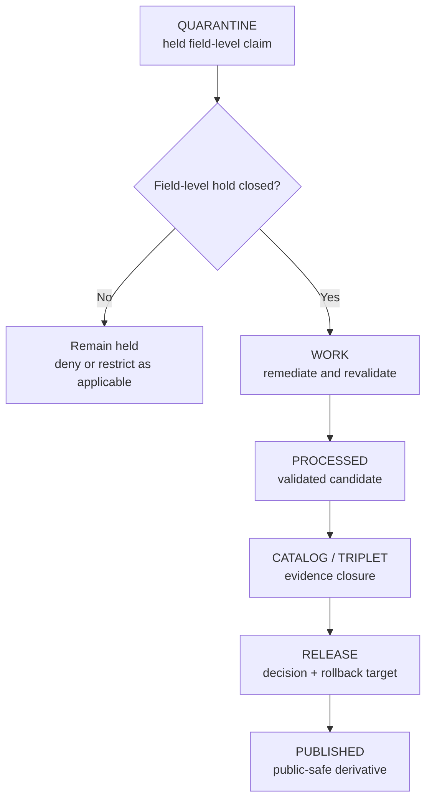

<!-- [KFM_META_BLOCK_V2]
doc_id: kfm://data/quarantine/agriculture/field-level-claim/readme
name: Agriculture Field-Level Claim Quarantine README
path: data/quarantine/agriculture/field-level-claim/README.md
type: data-quarantine-lane-readme
version: v0.3.0
status: draft
owners:
  - "NEEDS VERIFICATION: agriculture domain steward"
  - "NEEDS VERIFICATION: policy steward"
  - "NEEDS VERIFICATION: rights and privacy reviewers"
created: 2026-06-27
updated: 2026-07-26
policy_label: restricted-review
truth_posture: cite-or-abstain
lifecycle_phase: quarantine
responsibility_root: data/
domain: agriculture
artifact_family: held-agriculture-field-level-claims
sensitivity_posture: deny-by-default; field-level-claims-held; private-farm-operator-parcel-joins-fail-closed; no-publication-without-review
related:
  - ../operator-join/README.md
  - ../proprietary/README.md
  - ../README.md
  - ../../README.md
  - ../../../README.md
  - ../../../../docs/doctrine/directory-rules.md
  - ../../../../docs/adr/ADR-0021-quarantine-has-structured-exit-paths.md
  - ../../../../docs/adr/ADR-0029-adopt-directory-governance-standard-v2.md
  - ../../../../docs/domains/agriculture/CANONICAL_PATHS.md
  - ../../../../docs/domains/agriculture/SENSITIVITY.md
  - ../../../../docs/domains/agriculture/DATA_LIFECYCLE.md
  - ../../../../docs/domains/agriculture/LIFECYCLE.md
  - ../../../../docs/domains/agriculture/ARCHITECTURE.md
  - ../../../../docs/domains/agriculture/VERIFICATION_BACKLOG.md
  - ../../../../docs/runbooks/agriculture/PROMOTION_RUNBOOK.md
  - ../../../../docs/runbooks/agriculture/ROLLBACK_RUNBOOK.md
  - ../../../../release/manifests/README.md
tags:
  - kfm
  - data
  - quarantine
  - agriculture
  - field-level-claim
  - sensitivity
  - privacy
  - rights
  - deny-by-default
  - review-required
  - evidence-first
evidence_snapshot:
  repository: bartytime4life/Kansas-Frontier-Matrix
  base_commit: a6b8b422bb6c7bd891695da95f1a9c2fd59cf9cd
  prior_blob: 95995b1ed75bfd6e78464f8e7c0e1615bca690b6
  directory_rules_blob: fd49a0b83e55cef52c1124281f093e263526898d
  adr_0029_blob: cd044a38047cc9b3725d2e083eb201eb86109308
  parent_blob: 7a14641887f0193a6cbb169b95710ec4e2dc49dc
  operator_join_blob: fa03aaf422ad9aea4b7ce26e2f9adc6d1fe61765
  inspection_date: 2026-07-26
notes:
  - "This README documents a nested quarantine boundary; it does not create policy, proof, receipt, catalog, registry, release, publication, or access authority."
  - "The repository is public. No-public-path means no ordinary runtime or client consumption; it does not make committed repository content private."
  - "Directory Rules v2 is adopted through accepted ADR-0029 at this evidence snapshot. The source file's PROPOSED_FOR_ADOPTION label remains part of the exact pinned artifact bytes."
  - "Actual payload presence, accepted lane-specific exit contracts, policy automation, validator wiring, owner assignment, retention rules, and end-to-end enforcement remain UNKNOWN or NEEDS VERIFICATION as stated below."
[/KFM_META_BLOCK_V2] -->

<a id="top"></a>

# Agriculture Field-Level Claim Quarantine

Hold Agriculture field-level claim material until its source role, rights, sensitivity, privacy, evidence, review, correction, and rollback obligations are resolved.

[](#status-and-evidence)
[](../../README.md)
[](#exposure-and-sensitivity-boundary)
[](#status-and-evidence)

> [!CAUTION]
> This GitHub repository is public. "No public path" means quarantined material must not feed ordinary APIs, maps, reports, stories, graphs, indexes, UI, or AI answers. It does **not** make repository content private. Never commit restricted field, operator, parcel, agreement, precise-location, credential, or proprietary payloads here. Use an approved restricted system and retain only permitted public-safe pointers, digests, and review metadata.

**Quick navigation:** [Scope](#scope) · [Repository fit](#repo-fit) · [Held material](#held-material) · [Exposure boundary](#exposure-and-sensitivity-boundary) · [Inputs](#inputs) · [Outputs](#outputs-mutation-and-retention) · [Exclusions](#exclusions) · [Directory map](#directory-map) · [Exit gates](#exit-gates) · [Shortcuts](#forbidden-shortcuts) · [Required checks](#required-checks-before-use) · [Validation](#validation-and-maintenance) · [Review](#review-burden-and-rollback) · [Status](#status-and-evidence) · [Related files](#related-files)

## Scope

This lane documents the hold boundary for Agriculture field-level claims when the field-level claim is the controlling quarantine reason and any material question remains unresolved, including:

- source identity, authority, or role;
- rights, consent, agreement, redistribution, attribution, retention, or revocation;
- field specificity, operator or parcel linkage, harmful precision, or re-identification risk;
- observed, administrative, aggregate, modeled, inferred, candidate, generated, or synthetic claim status;
- geometry, time, lineage, evidence, uncertainty, or derivation support;
- validation, policy, review, receipt, correction, withdrawal, or rollback closure.

Quarantine preserves a reviewable state. It is not processed truth, field truth, catalog truth, proof, release authority, private storage, or a staging shortcut to publication.

Use a documented sibling lane when another risk owns the hold:

- [`../operator-join/`](../operator-join/README.md) for farm, operator, parcel, field, well, or other identity-bearing joins;
- [`../proprietary/`](../proprietary/README.md) for agreement-bound, producer-supplied, research-collaboration, yield, or other proprietary material.

## Repo fit

| Field | Bounded result |
| --- | --- |
| Path | `data/quarantine/agriculture/field-level-claim/` |
| Inherited parent | `data/quarantine/agriculture/` |
| Responsibility root | `data/` |
| Lifecycle phase | `quarantine/` |
| Scope | Agriculture field-level claims without another controlling quarantine reason |
| README profile | Sensitive `BOUNDARY_COMPACT` lane under adopted Directory Rules v2 |
| Document role | Boundary, routing, and reviewer guidance |
| Public-repository posture | README and public-safe metadata only; restricted payloads require approved restricted storage |
| Runtime/public-client posture | No ordinary API, UI, map, report, story, graph, index, or AI-answer consumption |
| Exit posture | Remain held unless the applicable evidence, policy, review, receipt, correction, and rollback requirements close |
| Release authority | `release/`, not this directory |
| Proof and receipt authority | `data/proofs/` and `data/receipts/`, not this directory |
| Catalog and triplet authority | `data/catalog/` and `data/triplets/`, not this directory |
| Registry authority | `data/registry/`, not this directory |
| Policy authority | `policy/`, not this directory |
| Owner assignment | **NEEDS VERIFICATION** |
| Recursive payload inventory | **UNKNOWN** |
| Lane-specific executable enforcement | **UNKNOWN**; the inspected Agriculture workflow is an explicit readiness hold |
| Directory Rules relationship | Exact v2 bytes are adopted by accepted ADR-0029; the source artifact's internal proposal label remains unchanged |

The accepted placement basis is the `data/` QUARANTINE responsibility boundary, including `DIR-DATA-003`, `DIR-PLACE-002`, `DIR-PLACE-007`, `DIR-STORAGE-003`, `DIR-README-001`, and the sensitive-boundary `BOUNDARY_COMPACT` profile in Directory Rules v2. This same-path documentation update creates no new lane or authority.

## Held material

The rows below identify review triggers and routing guidance. They do not prove that a payload exists or that executable policy currently enforces the documented Agriculture posture.

| Held family | Why it is held | Routing note |
| --- | --- | --- |
| Field-level NASS-derived claim | Draft Agriculture guidance classifies field-level NASS claims as deny-default and lists policy denial as a verification item. | Keep held; do not extrapolate from county or district aggregates. |
| Field-candidate footprint | May expose a private operational boundary or imply ground truth from a classification. | Hold for source-role, derivation, sensitivity, and steward review. |
| Satellite- or model-derived field value | A downstream interpretation can be mistaken for an observed field fact. | Preserve model/source role and uncertainty; never relabel it as field truth. |
| Field-level crop, rotation, irrigation, practice, or yield claim | May reveal operational detail or combine multiple restrictive contexts. | Apply the most-restrictive applicable posture; route identity-bearing joins to `operator-join/`. |
| Agreement-bound or proprietary field claim | Rights, purpose, audience, retention, and revocation may be unresolved. | Route to `proprietary/` when the agreement or proprietary character is the primary hold reason. |
| Generated map, report, story, graph, search, vector-index, or AI candidate | A carrier can amplify an unsupported or sensitive field-level claim. | Keep out of public and retrieval surfaces until governed evidence and release closure. |

## Exposure and sensitivity boundary

Adopted Directory Rules v2 prohibits ordinary public consumers from reading QUARANTINE (`DIR-PLACE-002`), requires recorded remediation before a return to WORK (`DIR-DATA-003`), and states that path placement cannot make sensitive geometry public-safe (`DIR-PLACE-007`). Restricted bytes must remain outside ordinary Git storage unless separately approved and controlled (`DIR-STORAGE-003`).

The repository's Agriculture sensitivity and canonical-path documents remain `draft`; they are evidence of documented review posture, not proof of accepted machine policy or runtime enforcement.

| Situation | Review posture documented in the draft Agriculture guidance | Current implementation claim |
| --- | --- | --- |
| Aggregate county- or district-level observation | Potentially public only through the normal evidence, policy, review, and release path | **NEEDS VERIFICATION** |
| Field-level satellite or model context | Generalize where permitted; preserve source role; never present as field truth | **NEEDS VERIFICATION** |
| Field-candidate footprint | Reviewer-bound by default in the draft tier matrix | **NEEDS VERIFICATION** |
| Field-level NASS claim | Deny-default in draft guidance; the denial test remains a backlog item | **NEEDS VERIFICATION** |
| Private farm, operator, or parcel join | Fail closed under the documented most-restrictive-row posture | **NEEDS VERIFICATION** |
| Unknown rights, consent, agreement, source role, or sensitivity | Remain held; availability does not imply permission | **CONFIRMED** fail-closed directory boundary |
| Restricted bytes in this public repository | Prohibited; retain only permitted public-safe pointers and digests | **CONFIRMED** by adopted `DIR-STORAGE-003` |

> [!IMPORTANT]
> A field boundary, model output, aggregate statistic, map feature, graph edge, similarity score, or generated narrative is not sovereign field truth. Evidence, source role, uncertainty, rights, and review state remain visible; fluent language or visual precision must not increase authority.

## Inputs

Only permitted public-safe hold metadata and review material belong in this repository path, such as:

- a stable hold identifier and explicit quarantine reason;
- public-safe source references, source-role assertions, and content digests;
- spatial and temporal scope described without harmful precision;
- rights, agreement, sensitivity, privacy, purpose, audience, retention, revocation, and reviewer status;
- public-safe validation findings and unresolved evidence references;
- draft receipt or decision references clearly labeled as drafts, not final authority;
- correction, withdrawal, revocation, and rollback dependencies;
- a pointer to approved restricted storage when policy and rights permit recording one.

Every pointer must avoid credentials, signed URLs, private endpoints, personal data, stable private identifiers, or enough joined detail to reconstruct restricted content.

## Outputs, mutation, and retention

This lane may support public-safe hold metadata, review obligations, and disposition references. It does not emit final policy decisions, receipts, proofs, catalog or registry records, release manifests, published carriers, graph edges, indexes, or AI context.

| Concern | Boundary |
| --- | --- |
| Mutation | Preserve the prior hold reason, digest, source role, derivation, evidence gaps, and review lineage when metadata changes; do not silently overwrite identity or history. |
| Retention | **NEEDS VERIFICATION** for each governed object; do not infer a deletion schedule from this README. |
| Legal or contractual hold | Preserve the applicable hold and approved restricted-storage record; Git placement does not satisfy retention or access control. |
| Safer derivative | Create a separately identified candidate that traverses normal WORK, validation, evidence, policy, review, release, correction, and rollback gates. |
| Disposition record | Reference the accepted contract-specific decision and canonical receipt or release family; do not invent a universal enum here. |

## Exclusions

| Do not place or claim here | Correct home or action |
| --- | --- |
| Restricted field, operator, parcel, agreement, precise-location, or proprietary payloads in this public repository | Approved restricted storage; retain only permitted public-safe pointers and digests |
| Farm/operator/parcel identity joins | [`../operator-join/`](../operator-join/README.md) |
| Agreement-bound or proprietary material as the controlling hold reason | [`../proprietary/`](../proprietary/README.md) |
| Clean source captures that have not triggered quarantine | `data/raw/agriculture/` or the verified source-specific intake |
| Ordinary transformation candidates with no unresolved hold | `data/work/agriculture/` |
| Validated normalized Agriculture objects | `data/processed/agriculture/` |
| Catalog records or relationship projections | `data/catalog/` or `data/triplets/` |
| EvidenceBundle, ProofPack, or final validation evidence | `data/proofs/` |
| Final process, validation, policy, AI, or release receipts | `data/receipts/` |
| Source, dataset, layer, rights, sensitivity, or crosswalk registry truth | `data/registry/` |
| Policy definitions or decision contracts | `policy/` and `contracts/` |
| Release decisions, manifests, corrections, withdrawals, or rollback cards | `release/` |
| Public layers, tiles, reports, stories, API payloads, graphs, indexes, or published artifacts | Governed `data/published/` carriers only after release closure |
| Normal UI, search, retrieval, graph, index, or AI-answer input | Released public-safe interfaces; otherwise abstain or deny under the applicable contract |

## Directory map

The current session confirms this README at the target path. It does not establish a recursive payload inventory. The following direct-child tree is a **PROPOSED illustrative pattern**, not a claim that a case directory exists:

```text
data/quarantine/agriculture/field-level-claim/
├── README.md
└── <hold_id>/    # proposed public-safe pointer, digest, and review metadata only
```

Any future case directory needs its own inherited boundary, verified contract or intake path, sensitivity review, retention decision, and repository-visibility approval. Do not create it by copying this diagram. Restricted bytes stay outside the public repository.

## Exit gates

Directory Rules v2 establishes QUARANTINE as held material with recorded remediation before a return to WORK. [`ADR-0021`](../../../../docs/adr/ADR-0021-quarantine-has-structured-exit-paths.md) proposes a more specific closed exit grammar but remains `proposed`. Until an accepted lane-specific contract and executable policy align the exact exit set, use the table below as review guidance rather than claiming implemented state-machine enforcement.

| Disposition | Minimum review evidence |
| --- | --- |
| Remain held | The unresolved reason, affected scope, next review condition, access boundary, and preservation needs remain visible. |
| Reclassify within quarantine | Another sibling lane now owns the controlling hold; preserve identity, digest, source references, and review lineage. |
| Return to WORK | The field-level-claim quarantine reason is resolved enough for ordinary transformation and revalidation; no public or release implication follows. |
| Advance as a PROCESSED candidate | Applicable source-role, identity, validation, rights, sensitivity, evidence, policy, and review gates close; catalog and release gates still remain. |
| Deny or restrict use | Use the finite outcome and obligations defined by the applicable accepted contract; record reason, audience, purpose, duration, revocation, and correction behavior as required. |
| Release a safer derivative | Keep the held original non-public; the derivative traverses normal processing, evidence, catalog, policy, review, release, correction, and rollback gates. |
| Correct or withdraw a downstream release | Use `release/` correction, withdrawal, invalidation, and rollback authority; never rewrite quarantine history to conceal the prior release. |

This README does not define `HOLD`, `RESTRICT`, or any other term as a universal machine enum. Contract-specific vocabularies remain separate.

## Forbidden shortcuts

The following path-only sequence is forbidden:

```text
data/quarantine/agriculture/field-level-claim/
→ data/processed/agriculture/
→ data/catalog/ or data/triplets/
→ data/published/
→ public API, MapLibre, report, story, graph, index, or AI answer
```

A less restrictive state requires the applicable governed transition and inspectable evidence. A copy, rename, pull request, merge, badge, generated report, or GitHub release is not promotion or KFM publication.


```mermaid
flowchart TD
    Q["QUARANTINE<br/>held field-level claim"] --> R{"Field-level hold closed?"}
    R -->|"No"| H["Remain held<br/>deny or restrict as applicable"]
    R -->|"Yes"| W["WORK<br/>remediate and revalidate"]
    W --> P["PROCESSED<br/>validated candidate"]
    P --> C["CATALOG / TRIPLET<br/>evidence closure"]
    C --> L["RELEASE<br/>decision + rollback target"]
    L --> U["PUBLISHED<br/>public-safe derivative"]
```

The diagram is a lifecycle orientation aid. It does not prove that the transitions, validators, policies, reviews, or release controls are implemented.

## Required checks before use

- [ ] Confirm the material is Agriculture-domain material and a field-level claim is the controlling quarantine reason.
- [ ] Confirm no restricted payload, credential, signed URL, private endpoint, precise location, stable private identifier, or re-identifying combination would enter the public repository.
- [ ] Record the hold identifier, reason, affected scope, public-safe source references, and digest.
- [ ] Distinguish observed, administrative, aggregate, modeled, inferred, candidate, generated, and synthetic roles.
- [ ] Verify current source terms, rights, agreement, consent, purpose, audience, attribution, redistribution, retention, and revocation posture.
- [ ] Evaluate field specificity, operator and parcel linkage, private operational context, harmful precision, and re-identification risk.
- [ ] Apply the most restrictive applicable posture when multiple sensitivity contexts intersect.
- [ ] Record required evidence, validation, policy, review, receipt, correction, withdrawal, revocation, retention, and rollback gaps.
- [ ] Confirm no public layer, tile, report, story, API payload, graph edge, search or vector index, UI surface, or AI answer consumes the held material.
- [ ] Before any exit, verify the applicable contract vocabulary and preserve prior identity, digest, hold reason, source role, derivation, and review lineage.

## Validation and maintenance

For this README, validate the metadata comment, single H1, heading order, explicit anchors, tables, alerts, links, badge destinations, code fences, Mermaid syntax, LF endings, final newline, and absence of sensitive content. A source-level Markdown check is not a GitHub-rendered visual inspection.

Repository-native workflow evidence is bounded:

- `.github/workflows/domain-agriculture.yml` is an explicit readiness hold; it reports that executable Agriculture validation, proof production, and release dry-run behavior are not established.
- `.github/workflows/docs-build.yml` is an explicit documentation-generator and preview hold.
- `.github/workflows/link-check.yml` is an explicit link-check implementation hold.

A green result from those held workflows does not validate this field-level-claim boundary, prove privacy or sensitivity enforcement, close evidence, approve release, or publish anything. No accepted lane-specific validator or complete end-to-end enforcement path was verified at the evidence snapshot.

Re-review this README when Directory Rules, ADR-0029, the quarantine contract, Agriculture sensitivity policy, owner assignment, validator, workflow, restricted-storage decision, payload inventory, public-consumer inventory, retention rule, correction path, or rollback procedure changes.

## Review burden and rollback

The current metadata names reviewer classes, but no accountable steward assignments were verified. Before any less-restrictive disposition, resolve the reviewers required by the accepted contract, affected object families, rights or agreement terms, and cross-domain sensitivity. CODEOWNERS routing or a README owner string is not proof that review occurred.

This documentation change is reversible independently of held material because it changes only this README. Before merge, close the draft pull request and leave the branch unmerged. After merge, revert the implementation commit as a transparent documentation correction and re-run the same checks. Do not delete or rewrite held records merely to roll back prose.

<a id="status-notes"></a>

## Status and evidence

| Claim | Truth status | Evidence boundary |
| --- | --- | --- |
| This README exists at the requested path. | **CONFIRMED** | Baseline `main@a6b8b422bb6c7bd891695da95f1a9c2fd59cf9cd`; prior blob `95995b1ed75bfd6e78464f8e7c0e1615bca690b6` |
| The repository is public. | **CONFIRMED** | GitHub repository metadata at the evidence snapshot |
| The parent quarantine READMEs and both sibling lane READMEs exist. | **CONFIRMED** | `data/quarantine/README.md`, `data/quarantine/agriculture/README.md`, `operator-join/README.md`, and `proprietary/README.md` |
| Directory Rules v2 is adopted as the single writable human placement authority. | **CONFIRMED** | Accepted ADR-0029 at the pinned base; exact rules blob `fd49a0b83e55cef52c1124281f093e263526898d` |
| Draft Agriculture guidance routes field-level NASS-derived claims here and documents deny-default sensitivity. | **CONFIRMED documentation state** | `CANONICAL_PATHS.md` and `SENSITIVITY.md`; both remain `draft` |
| The documented Agriculture field-level sensitivity posture is implemented and enforced. | **NEEDS VERIFICATION** | Policy, validator, fixture, decision, and observed-run closure were not established |
| Actual field-level claim payloads or case directories exist in this subtree. | **UNKNOWN** | No recursive payload inventory was established |
| A lane-specific validator and CI enforce this exact boundary. | **UNKNOWN** | The inspected Agriculture workflow is an explicit readiness hold |
| Accountable owners and required independent reviewers are assigned. | **NEEDS VERIFICATION** | No verified assignment record was established |
| This README is not private storage, proof, policy, catalog, registry, receipt, release, publication, field truth, UI, graph, index, or AI authority. | **CONFIRMED** | Adopted responsibility-root separation and this document's bounded role |

## Related files

Lifecycle and sibling boundaries:

- [`../operator-join/README.md`](../operator-join/README.md) - operator and identity-bearing join quarantine
- [`../proprietary/README.md`](../proprietary/README.md) - proprietary material quarantine
- [`../README.md`](../README.md) - Agriculture quarantine parent
- [`../../README.md`](../../README.md) - quarantine root
- [`../../../README.md`](../../../README.md) - `data/` root

Agriculture guidance and verification:

- [`CANONICAL_PATHS.md`](../../../../docs/domains/agriculture/CANONICAL_PATHS.md)
- [`SENSITIVITY.md`](../../../../docs/domains/agriculture/SENSITIVITY.md)
- [`DATA_LIFECYCLE.md`](../../../../docs/domains/agriculture/DATA_LIFECYCLE.md)
- [`LIFECYCLE.md`](../../../../docs/domains/agriculture/LIFECYCLE.md)
- [`ARCHITECTURE.md`](../../../../docs/domains/agriculture/ARCHITECTURE.md)
- [`VERIFICATION_BACKLOG.md`](../../../../docs/domains/agriculture/VERIFICATION_BACKLOG.md)

Governance, transition, and rollback:

- [Directory Rules v2 - adopted placement standard](../../../../docs/doctrine/directory-rules.md)
- [ADR-0029 - accepted Directory Rules v2 adoption](../../../../docs/adr/ADR-0029-adopt-directory-governance-standard-v2.md)
- [ADR-0021 - proposed structured quarantine exits](../../../../docs/adr/ADR-0021-quarantine-has-structured-exit-paths.md)
- [`PROMOTION_RUNBOOK.md`](../../../../docs/runbooks/agriculture/PROMOTION_RUNBOOK.md)
- [`ROLLBACK_RUNBOOK.md`](../../../../docs/runbooks/agriculture/ROLLBACK_RUNBOOK.md)
- [`release/manifests/README.md`](../../../../release/manifests/README.md)

---

KFM rule: this directory is an Agriculture quarantine hold lane only. It is not private storage, source authority, proof authority, receipt authority, catalog authority, registry authority, policy authority, release authority, field truth, public artifact authority, UI authority, graph authority, index authority, or AI truth.

[Back to top](#top)
