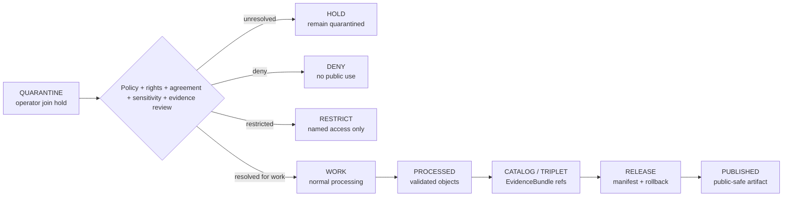

<!-- [KFM_META_BLOCK_V2]
doc_id: kfm://data/quarantine/agriculture/operator-join/readme
name: Agriculture Operator Join Quarantine README
path: data/quarantine/agriculture/operator-join/README.md
type: data-quarantine-lane-readme
version: v0.1.0
status: draft
owners:
  - <agriculture-domain-steward>
  - <policy-steward>
  - <rights-reviewer>
  - <privacy-reviewer>
created: 2026-06-27
updated: 2026-06-27
policy_label: restricted-review
truth_posture: cite-or-abstain
lifecycle_phase: quarantine
responsibility_root: data/
domain: agriculture
artifact_family: held-agriculture-operator-joins
sensitivity_posture: deny-by-default; private-farm-operator-parcel-joins-fail-closed; named-agreement-or-review-required; no-publication-without-review
tags:
  - kfm
  - data
  - quarantine
  - agriculture
  - operator-join
  - farm-operator
  - parcel-join
  - privacy
  - rights
  - deny-by-default
  - review-required
  - evidence-first
related:
  - ../field-level-claim/README.md
  - ../../README.md
  - ../README.md
  - ../../../README.md
  - ../../../../docs/domains/agriculture/SENSITIVITY.md
  - ../../../../docs/domains/agriculture/DATA_LIFECYCLE.md
  - ../../../../docs/domains/agriculture/LIFECYCLE.md
  - ../../../../docs/domains/agriculture/ARCHITECTURE.md
  - ../../../../docs/domains/agriculture/CROSS_LANE.md
  - ../../../../docs/domains/agriculture/SOURCE_REGISTRY.md
  - ../../../../docs/runbooks/agriculture/PROMOTION_RUNBOOK.md
  - ../../../../docs/runbooks/agriculture/ROLLBACK_RUNBOOK.md
  - ../../../../release/manifests/README.md
notes:
  - "This README documents the quarantine lane for Agriculture operator-join material."
  - "Operator joins are held when they connect, imply, or may re-identify farm, operator, parcel, field, well, practice, yield, agreement, or private operational context."
  - "Quarantine is a hold state, not a staging shortcut to processed, catalog, triplet, published, reports, layers, PMTiles, stories, AI answers, or public UI."
  - "Operator-join material stays held until source role, rights, sensitivity, privacy, receipts, policy decision, review record, evidence closure, named agreement where needed, and rollback path are resolved."
  - "Actual payload presence, policy automation, validator wiring, and CI enforcement remain UNKNOWN unless verified."
[/KFM_META_BLOCK_V2] -->

<a id="top"></a>

# Agriculture Operator Join Quarantine

Held Agriculture material involving farm, operator, parcel, field, well, practice, yield, agreement, or other private operational joins.

<p>
  
  
  
  
  
  
</p>

**Quick links:** [Scope](#scope) · [Repo fit](#repo-fit) · [Held material](#held-material) · [Inputs](#inputs) · [Exclusions](#exclusions) · [Directory map](#directory-map) · [Exit gates](#exit-gates) · [Forbidden shortcuts](#forbidden-shortcuts) · [Required checks](#required-checks-before-use) · [Status notes](#status-notes)

> [!CAUTION]
> `data/quarantine/agriculture/operator-join/` is a hold lane for high-risk Agriculture joins. Material here is not public, not processed truth, not catalog truth, not proof, not release authority, not operator truth, and not an AI-answer source. Nothing in this lane may be used by public clients or normal UI surfaces.

---

## Scope

This directory may hold Agriculture join material when the join connects, implies, or may re-identify a farm, operator, parcel, field, well, practice, yield, agreement, research participant, account, facility, supply-chain relation, or other private operational context.

Typical reasons for quarantine include:

- operator-linked Agriculture records whose release terms are unclear;
- joins between Agriculture objects and parcel, ownership, address, well, field, conservation, practice, yield, or private facility context;
- research-collaboration, producer-supplied, or agreement-bound records that require named access terms;
- supply-chain or operator-chain joins that could expose private commercial relationships;
- irrigation, conservation-practice, pesticide, yield, or other operational joins that Agriculture sensitivity doctrine marks as deny-default or reviewer-only;
- generated joins, inferred joins, linkage tables, embeddings, indexes, map/report/story candidates, or AI-drafted claims that have not passed citation, receipt, and policy review.

This lane preserves held material for review while preventing accidental promotion, publication, indexing, map rendering, report generation, story playback, vector indexing, or AI-answer use.

---

## Repo fit

| Field | Value |
|---|---|
| Path | `data/quarantine/agriculture/operator-join/` |
| Responsibility root | `data/` |
| Lifecycle phase | `quarantine/` |
| Domain lane | `agriculture` |
| Sublane | `operator-join` |
| Artifact role | Held Agriculture operator/farm/parcel/field join material and quarantine-local review sidecars |
| Public access posture | No public path; no normal UI; no governed-public API exposure |
| Sibling quarantine lane | `data/quarantine/agriculture/field-level-claim/` |
| Exit posture | Only by explicit policy decision, review record, required receipt closure, agreement closure where needed, and corrected lifecycle placement |
| Release authority | `release/`, not this directory |
| Proof authority | `data/proofs/` and `data/receipts/`, not this directory |
| Catalog authority | `data/catalog/`, not this directory |
| Registry authority | `data/registry/`, not this directory |
| Default failure posture | `HOLD`, `DENY`, `RESTRICT`, or `ABSTAIN` when evidence, source role, rights, sensitivity, privacy, agreement, receipt, policy, review, correction, or rollback support is insufficient |

---

## Held material

Material belongs here when the join is not safe or sufficiently governed for `work`, `processed`, `catalog`, `published`, report, story, layer, or AI-answer use.

| Held family | Why it is held |
|---|---|
| Farm/operator joins | May identify a private operator or private operational relationship. |
| Operator/parcel joins | Private farm/operator × parcel joins fail closed until a policy decision says otherwise. |
| Field/operator joins | May convert generalized field context into private operator-level truth. |
| Well/field/operator joins | Crosses Agriculture, Hydrology, and People/Land-style sensitivity boundaries. |
| Practice/yield/operator joins | May expose proprietary or agreement-bound farm operations. |
| Research or producer-supplied joins | Named agreement, rights, consent, and review state must be explicit. |
| Supply-chain operator joins | May expose private commercial relationships or operational dependencies. |
| Generated/inferred linkage tables | Must not become authoritative without source role, evidence, and review closure. |

---

## Inputs

Accepted content is limited to held review material and quarantine-local sidecars such as:

- source excerpts, source pointers, candidate join tables, or claim packets that require quarantine;
- quarantine reason notes and `HOLD` / `DENY` / `RESTRICT` policy summaries;
- source-role, rights, agreement, sensitivity, privacy, and reviewer notes;
- candidate receipt drafts, such as redaction, aggregation, join-evaluation, citation-validation, or policy-decision drafts;
- hash/digest sidecars used to preserve chain-of-custody for held material;
- quarantine-local README files that explain hold state without becoming proof, registry, policy, or release authority.

---

## Exclusions

| Do not place here | Correct authority home |
|---|---|
| Clean RAW source mirrors that have not triggered quarantine | `data/raw/agriculture/` or source-specific intake |
| Ordinary WORK material that is safe to process under normal review | `data/work/agriculture/` |
| Validated processed Agriculture objects | `data/processed/agriculture/` |
| Catalog records, triplets, graph truth, or EvidenceBundle state | `data/catalog/`, triplet lanes, or proof lanes |
| EvidenceBundle / ProofPack | `data/proofs/` |
| Final validation, transform, redaction, aggregation, AI, or release receipts | `data/receipts/` |
| Release manifests, promotion decisions, correction records, rollback records, or signatures | `release/` |
| Source descriptors, activation records, agreement registries, or registry truth | `data/registry/` |
| Public layers, PMTiles, reports, stories, API payloads, or published artifacts | `data/published/` only after release gates close |
| Semantic contracts, schemas, or policy rules | `contracts/`, `schemas/`, `policy/` |
| Normal public UI, search, vector-index, graph, or AI-answer material | Governed public lanes only after release; otherwise abstain or deny |

---

## Directory map

```text
data/quarantine/agriculture/operator-join/
├── README.md
├── <hold_id>/
│   ├── join_packet.json
│   ├── source_refs.json
│   ├── quarantine_reason.md
│   ├── sensitivity_review.notes.md
│   ├── rights_review.notes.md
│   ├── agreement_review.notes.md
│   ├── policy_decision.draft.json
│   ├── receipt_closure.checklist.md
│   ├── join_packet.sha256
│   └── README.md
└── index.local.json
```

`index.local.json` is optional and must remain quarantine-local. It is not a public index, catalog record, release manifest, registry, graph edge source, layer/story/report pointer, or AI retrieval index.

---

## Exit gates

An operator join may leave this lane only when the exit path is explicit:

| Exit route | Minimum requirement |
|---|---|
| Stay held | Any unresolved source, rights, agreement, sensitivity, privacy, evidence, or policy question remains. |
| Deny | PolicyDecision says `DENY`; public/UI/AI surfaces abstain or deny. |
| Restrict | PolicyDecision, ReviewRecord, and named agreement identify allowed audience, purpose, and terms. |
| Return to work | Hold reason is resolved, but normal validation or transformation still remains. |
| Promote to processed/catalog/published | Only after all required receipts, review records, source descriptors, evidence closure, release manifest, correction path, and rollback path exist. |

A more public tier requires the required transform receipt and review record. A more restrictive correction can happen immediately when risk is discovered.

---

## Forbidden shortcuts

```text
data/quarantine/agriculture/operator-join/
→ data/processed/agriculture/
→ data/catalog/
→ data/published/
→ public API / MapLibre / report / story / graph / vector index / AI answer
```

is forbidden unless the appropriate governed transition has actually happened and left inspectable evidence.



---

## Required checks before use

- [ ] Confirm the material is Agriculture-domain join material and belongs in this quarantine sublane.
- [ ] Confirm the hold reason is recorded.
- [ ] Confirm source descriptors, source roles, authority, rights posture, agreement state, and current terms.
- [ ] Confirm the most-restrictive-row rule has been applied.
- [ ] Confirm farm/operator linkage, parcel linkage, field specificity, private operational context, and re-identification risk.
- [ ] Confirm whether the join is observed, administrative, modeled, inferred, candidate, generated, or synthetic.
- [ ] Confirm required receipts are present or explicitly marked missing.
- [ ] Confirm PolicyDecision, ReviewRecord, and named agreement state before any exit.
- [ ] Confirm no public layer, PMTiles, report, story, API payload, graph edge, search index, vector index, or AI answer uses the quarantined join.
- [ ] Confirm correction and rollback paths are documented before any less-restrictive transition.

---

## Status notes

| Claim | Status |
|---|---|
| This README defines the requested quarantine path boundary. | **CONFIRMED authored** |
| The target path exists in the live repository as an empty file before this edit. | **CONFIRMED by GitHub contents API during this edit** |
| Agriculture sensitivity doctrine says private farm/operator × parcel joins fail closed. | **CONFIRMED by GitHub contents API during this edit** |
| Agriculture sensitivity doctrine marks several operator-linked or private operational classes as deny-default or restricted. | **CONFIRMED by GitHub contents API during this edit** |
| The sibling `field-level-claim` quarantine README exists and documents the shared Agriculture quarantine posture. | **CONFIRMED by GitHub contents API during this edit** |
| Actual operator-join payloads exist in this subtree. | **UNKNOWN** |
| Policy automation, validators, and CI checks enforce this exact quarantine lane. | **NEEDS VERIFICATION** |
| This README is proof, release, catalog, registry, policy, operator truth, join truth, public artifact authority, or AI authority. | **DENY** |

---

## Related files

- [`../field-level-claim/README.md`](../field-level-claim/README.md)
- [`../../README.md`](../../README.md)
- [`../README.md`](../README.md)
- [`../../../README.md`](../../../README.md)
- [`../../../../docs/domains/agriculture/SENSITIVITY.md`](../../../../docs/domains/agriculture/SENSITIVITY.md)
- [`../../../../docs/domains/agriculture/DATA_LIFECYCLE.md`](../../../../docs/domains/agriculture/DATA_LIFECYCLE.md)
- [`../../../../docs/domains/agriculture/LIFECYCLE.md`](../../../../docs/domains/agriculture/LIFECYCLE.md)
- [`../../../../docs/domains/agriculture/ARCHITECTURE.md`](../../../../docs/domains/agriculture/ARCHITECTURE.md)
- [`../../../../docs/domains/agriculture/CROSS_LANE.md`](../../../../docs/domains/agriculture/CROSS_LANE.md)
- [`../../../../docs/domains/agriculture/SOURCE_REGISTRY.md`](../../../../docs/domains/agriculture/SOURCE_REGISTRY.md)
- [`../../../../docs/runbooks/agriculture/PROMOTION_RUNBOOK.md`](../../../../docs/runbooks/agriculture/PROMOTION_RUNBOOK.md)
- [`../../../../docs/runbooks/agriculture/ROLLBACK_RUNBOOK.md`](../../../../docs/runbooks/agriculture/ROLLBACK_RUNBOOK.md)
- [`../../../../release/manifests/README.md`](../../../../release/manifests/README.md)

---

KFM rule: this directory is an Agriculture quarantine hold lane only. It is not source authority, proof authority, receipt authority, release authority, catalog authority, registry authority, policy authority, operator truth, join truth, public artifact authority, UI authority, graph authority, vector-index authority, or AI truth.

[Back to top](#top)
