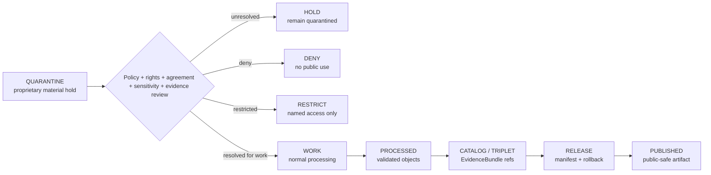

<!-- [KFM_META_BLOCK_V2]
doc_id: kfm://data/quarantine/agriculture/proprietary/readme
name: Agriculture Proprietary Quarantine README
path: data/quarantine/agriculture/proprietary/README.md
type: data-quarantine-lane-readme
version: v0.1.0
status: draft
owners:
  - <agriculture-domain-steward>
  - <policy-steward>
  - <rights-reviewer>
  - <privacy-reviewer>
created: 2026-06-27
updated: 2026-06-27
policy_label: restricted-review
truth_posture: cite-or-abstain
lifecycle_phase: quarantine
responsibility_root: data/
domain: agriculture
artifact_family: held-agriculture-proprietary-material
sensitivity_posture: deny-by-default; proprietary-material-held; named-agreement-required; no-publication-without-review
tags:
  - kfm
  - data
  - quarantine
  - agriculture
  - proprietary
  - yield
  - practice-detail
  - producer-supplied
  - research-collaboration
  - agreement-bound
  - rights
  - privacy
  - deny-by-default
  - review-required
  - evidence-first
related:
  - ../field-level-claim/README.md
  - ../operator-join/README.md
  - ../../README.md
  - ../README.md
  - ../../../README.md
  - ../../../../docs/domains/agriculture/SENSITIVITY.md
  - ../../../../docs/domains/agriculture/DATA_LIFECYCLE.md
  - ../../../../docs/domains/agriculture/LIFECYCLE.md
  - ../../../../docs/domains/agriculture/ARCHITECTURE.md
  - ../../../../docs/domains/agriculture/SOURCE_REGISTRY.md
  - ../../../../docs/runbooks/agriculture/PROMOTION_RUNBOOK.md
  - ../../../../docs/runbooks/agriculture/ROLLBACK_RUNBOOK.md
  - ../../../../release/manifests/README.md
notes:
  - "This README documents the quarantine lane for proprietary Agriculture material."
  - "Proprietary material is held when it includes or may imply private yield, operator-supplied detail, agreement-bound records, research-collaboration records, private commercial relationships, or private operational context."
  - "Quarantine is a hold state, not a staging shortcut to processed, catalog, triplet, published, reports, layers, PMTiles, stories, AI answers, or public UI."
  - "Proprietary material stays held until source role, rights, agreement, sensitivity, privacy, receipts, policy decision, review record, evidence closure, and rollback path are resolved."
  - "Actual payload presence, policy automation, validator wiring, and CI enforcement remain UNKNOWN unless verified."
[/KFM_META_BLOCK_V2] -->

<a id="top"></a>

# Agriculture Proprietary Quarantine

Held Agriculture material involving proprietary, producer-supplied, agreement-bound, research-collaboration, private commercial, or private operational information.

<p>
  
  
  
  
  
  
  
</p>

**Quick links:** [Scope](#scope) · [Repo fit](#repo-fit) · [Held material](#held-material) · [Inputs](#inputs) · [Exclusions](#exclusions) · [Directory map](#directory-map) · [Exit gates](#exit-gates) · [Forbidden shortcuts](#forbidden-shortcuts) · [Required checks](#required-checks-before-use) · [Status notes](#status-notes)

> [!CAUTION]
> `data/quarantine/agriculture/proprietary/` is a hold lane for proprietary Agriculture material. Material here is not public, not processed truth, not catalog truth, not proof, not release authority, not proprietary truth, and not an AI-answer source. Nothing in this lane may be used by public clients or normal UI surfaces.

---

## Scope

This directory may hold Agriculture material when it contains or may imply proprietary yield, operator-supplied detail, agreement-bound research/collaboration data, private commercial relationships, private operational context, or non-public producer-supplied records.

Typical reasons for quarantine include:

- proprietary or operator-supplied yield observations;
- producer-supplied conservation, practice, application, management, input, or operational details;
- research-collaboration records that require named agreements or restricted audience terms;
- private operator-chain, supply-chain, or commercial relationship records;
- proprietary model inputs, parameters, validation sets, or derived summaries whose release terms are unclear;
- generated claims, joined tables, model outputs, maps, reports, stories, search indexes, vector indexes, or AI-drafted text that may expose proprietary Agriculture material.

This lane preserves held material for review while preventing accidental promotion, publication, indexing, map rendering, report generation, story playback, vector indexing, or AI-answer use.

---

## Repo fit

| Field | Value |
|---|---|
| Path | `data/quarantine/agriculture/proprietary/` |
| Responsibility root | `data/` |
| Lifecycle phase | `quarantine/` |
| Domain lane | `agriculture` |
| Sublane | `proprietary` |
| Artifact role | Held proprietary Agriculture material and quarantine-local review sidecars |
| Public access posture | No public path; no normal UI; no governed-public API exposure |
| Sibling quarantine lanes | `data/quarantine/agriculture/field-level-claim/`, `data/quarantine/agriculture/operator-join/` |
| Exit posture | Only by explicit policy decision, review record, required receipt closure, agreement closure where needed, and corrected lifecycle placement |
| Release authority | `release/`, not this directory |
| Proof authority | `data/proofs/` and `data/receipts/`, not this directory |
| Catalog authority | `data/catalog/`, not this directory |
| Registry authority | `data/registry/`, not this directory |
| Default failure posture | `HOLD`, `DENY`, `RESTRICT`, or `ABSTAIN` when evidence, source role, rights, agreement, sensitivity, privacy, receipt, policy, review, correction, or rollback support is insufficient |

---

## Held material

Material belongs here when it is not safe or sufficiently governed for `work`, `processed`, `catalog`, `published`, report, story, layer, or AI-answer use.

| Held family | Why it is held |
|---|---|
| Proprietary yield records | Agriculture doctrine marks proprietary/operator-supplied yield as deny-default for public release. |
| Operator-supplied practice details | May expose private farm operations or agreement-bound information. |
| Producer-supplied datasets | Rights, consent, agreement, and review state must be explicit. |
| Research-collaboration records | Named audience, purpose, and terms must be resolved before any less-restrictive use. |
| Proprietary model inputs or validation data | May encode private operational or commercial facts. |
| Private commercial or supply-chain records | May expose private relationships or dependencies. |
| Generated summaries or AI-drafted claims using proprietary material | Must not become public carriers without evidence, policy, and review closure. |

---

## Inputs

Accepted content is limited to held review material and quarantine-local sidecars such as:

- source excerpts, source pointers, candidate records, proprietary data packets, or claim packets that require quarantine;
- quarantine reason notes and `HOLD` / `DENY` / `RESTRICT` policy summaries;
- source-role, rights, agreement, sensitivity, privacy, and reviewer notes;
- candidate receipt drafts, such as redaction, aggregation, model-run, citation-validation, agreement-review, or policy-decision drafts;
- hash/digest sidecars used to preserve chain-of-custody for held material;
- quarantine-local README files that explain hold state without becoming proof, registry, policy, or release authority.

---

## Exclusions

| Do not place here | Correct authority home |
|---|---|
| Clean RAW source mirrors that have not triggered quarantine | `data/raw/agriculture/` or source-specific intake |
| Ordinary WORK material that is safe to process under normal review | `data/work/agriculture/` |
| Validated processed Agriculture objects | `data/processed/agriculture/` |
| Catalog records, triplets, graph truth, or EvidenceBundle state | `data/catalog/`, triplet lanes, or proof lanes |
| EvidenceBundle / ProofPack | `data/proofs/` |
| Final validation, transform, redaction, aggregation, model-run, AI, or release receipts | `data/receipts/` |
| Release manifests, promotion decisions, correction records, rollback records, or signatures | `release/` |
| Source descriptors, activation records, agreement registries, or registry truth | `data/registry/` |
| Public layers, PMTiles, reports, stories, API payloads, or published artifacts | `data/published/` only after release gates close |
| Semantic contracts, schemas, or policy rules | `contracts/`, `schemas/`, `policy/` |
| Normal public UI, search, vector-index, graph, or AI-answer material | Governed public lanes only after release; otherwise abstain or deny |

---

## Directory map

```text
data/quarantine/agriculture/proprietary/
├── README.md
├── <hold_id>/
│   ├── proprietary_packet.json
│   ├── source_refs.json
│   ├── quarantine_reason.md
│   ├── rights_review.notes.md
│   ├── agreement_review.notes.md
│   ├── sensitivity_review.notes.md
│   ├── policy_decision.draft.json
│   ├── receipt_closure.checklist.md
│   ├── proprietary_packet.sha256
│   └── README.md
└── index.local.json
```

`index.local.json` is optional and must remain quarantine-local. It is not a public index, catalog record, release manifest, registry, graph edge source, layer/story/report pointer, search index, vector index, or AI retrieval index.

---

## Exit gates

Proprietary Agriculture material may leave this lane only when the exit path is explicit:

| Exit route | Minimum requirement |
|---|---|
| Stay held | Any unresolved source, rights, agreement, sensitivity, privacy, evidence, or policy question remains. |
| Deny | PolicyDecision says `DENY`; public/UI/AI surfaces abstain or deny. |
| Restrict | PolicyDecision, ReviewRecord, and named agreement identify allowed audience, purpose, terms, and revocation path. |
| Return to work | Hold reason is resolved, but normal validation or transformation still remains. |
| Promote to processed/catalog/published | Only after all required receipts, review records, source descriptors, evidence closure, release manifest, correction path, and rollback path exist. |

A more public tier requires the required transform receipt and review record. A more restrictive correction can happen immediately when risk is discovered.

---

## Forbidden shortcuts

```text
data/quarantine/agriculture/proprietary/
→ data/processed/agriculture/
→ data/catalog/
→ data/published/
→ public API / MapLibre / report / story / graph / vector index / AI answer
```

is forbidden unless the appropriate governed transition has actually happened and left inspectable evidence.



---

## Required checks before use

- [ ] Confirm the material is Agriculture-domain proprietary material and belongs in this quarantine sublane.
- [ ] Confirm the hold reason is recorded.
- [ ] Confirm source descriptors, source roles, authority, rights posture, agreement state, and current terms.
- [ ] Confirm the most-restrictive-row rule has been applied.
- [ ] Confirm whether the material includes yield, practice detail, producer-supplied data, research-collaboration data, commercial relationships, proprietary model material, or private operational context.
- [ ] Confirm whether the material is observed, administrative, modeled, inferred, candidate, generated, or synthetic.
- [ ] Confirm required receipts are present or explicitly marked missing.
- [ ] Confirm PolicyDecision, ReviewRecord, and named agreement state before any exit.
- [ ] Confirm no public layer, PMTiles, report, story, API payload, graph edge, search index, vector index, or AI answer uses the quarantined material.
- [ ] Confirm correction, revocation, and rollback paths are documented before any less-restrictive transition.

---

## Status notes

| Claim | Status |
|---|---|
| This README defines the requested quarantine path boundary. | **CONFIRMED authored** |
| The target path exists in the live repository as an empty file before this edit. | **CONFIRMED by GitHub contents API during this edit** |
| Agriculture sensitivity doctrine marks proprietary/operator-supplied yield as T4 and not public-releaseable. | **CONFIRMED by GitHub contents API during this edit** |
| Agriculture sensitivity doctrine marks operator-supplied conservation detail and private operator chains as deny-default or review-limited. | **CONFIRMED by GitHub contents API during this edit** |
| Sibling Agriculture quarantine READMEs exist for `field-level-claim` and `operator-join`. | **CONFIRMED by GitHub contents API during this edit** |
| Actual proprietary payloads exist in this subtree. | **UNKNOWN** |
| Policy automation, validators, and CI checks enforce this exact quarantine lane. | **NEEDS VERIFICATION** |
| This README is proof, release, catalog, registry, policy, proprietary truth, public artifact authority, or AI authority. | **DENY** |

---

## Related files

- [`../field-level-claim/README.md`](../field-level-claim/README.md)
- [`../operator-join/README.md`](../operator-join/README.md)
- [`../../README.md`](../../README.md)
- [`../README.md`](../README.md)
- [`../../../README.md`](../../../README.md)
- [`../../../../docs/domains/agriculture/SENSITIVITY.md`](../../../../docs/domains/agriculture/SENSITIVITY.md)
- [`../../../../docs/domains/agriculture/DATA_LIFECYCLE.md`](../../../../docs/domains/agriculture/DATA_LIFECYCLE.md)
- [`../../../../docs/domains/agriculture/LIFECYCLE.md`](../../../../docs/domains/agriculture/LIFECYCLE.md)
- [`../../../../docs/domains/agriculture/ARCHITECTURE.md`](../../../../docs/domains/agriculture/ARCHITECTURE.md)
- [`../../../../docs/domains/agriculture/SOURCE_REGISTRY.md`](../../../../docs/domains/agriculture/SOURCE_REGISTRY.md)
- [`../../../../docs/runbooks/agriculture/PROMOTION_RUNBOOK.md`](../../../../docs/runbooks/agriculture/PROMOTION_RUNBOOK.md)
- [`../../../../docs/runbooks/agriculture/ROLLBACK_RUNBOOK.md`](../../../../docs/runbooks/agriculture/ROLLBACK_RUNBOOK.md)
- [`../../../../release/manifests/README.md`](../../../../release/manifests/README.md)

---

KFM rule: this directory is an Agriculture quarantine hold lane only. It is not source authority, proof authority, receipt authority, release authority, catalog authority, registry authority, policy authority, proprietary truth, public artifact authority, UI authority, graph authority, vector-index authority, or AI truth.

[Back to top](#top)
