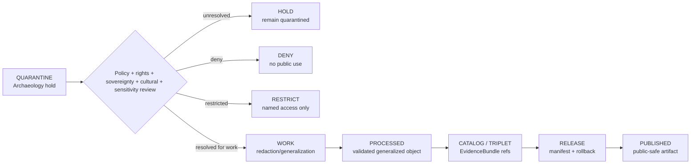

<!-- [KFM_META_BLOCK_V2]
doc_id: kfm://data/quarantine/archaeology/readme
name: Archaeology Quarantine README
path: data/quarantine/archaeology/README.md
type: data-quarantine-index-readme
version: v0.1.0
status: draft
owners:
  - <archaeology-domain-steward>
  - <cultural-review-liaison>
  - <sensitivity-reviewer>
  - <rights-holder-representative>
  - <release-steward>
created: 2026-06-27
updated: 2026-06-27
policy_label: restricted-review
truth_posture: cite-or-abstain
lifecycle_phase: quarantine
responsibility_root: data/
domain: archaeology
artifact_family: held-archaeology-material
sensitivity_posture: fail-closed; no-public-path; cultural-review-required; sovereignty-review-required; review-required; release-blocked
related:
  - exact_geometry/README.md
  - ../README.md
  - ../../README.md
  - ../../../docs/domains/archaeology/SENSITIVITY.md
  - ../../../docs/domains/archaeology/CULTURAL_REVIEW.md
  - ../../../docs/domains/archaeology/DATA_LIFECYCLE.md
  - ../../../docs/domains/archaeology/ARCHITECTURE.md
  - ../../../docs/domains/archaeology/PUBLICATION_AND_POLICY.md
  - ../../../docs/runbooks/archaeology/PROMOTION_RUNBOOK.md
  - ../../../docs/runbooks/archaeology/ROLLBACK_RUNBOOK.md
  - ../../../release/manifests/README.md
tags:
  - kfm
  - data
  - quarantine
  - archaeology
  - exact-geometry
  - cultural-review
  - sovereignty
  - sensitivity
  - fail-closed
  - no-public-path
  - evidence-first
notes:
  - "This README replaces the greenfield stub and documents the parent Archaeology quarantine lane."
  - "Archaeology quarantine is a hold area for material that must not feed processed, catalog, triplet, published, reports, layers, PMTiles, stories, graph/vector indexes, search indexes, AI answers, or public UI without governed transition evidence."
  - "Exact site geometry, burial/human-remains context, sacred sites, looting-risk exposure, unresolved cultural sensitivity, and missing sensitivity rank fail closed."
  - "Child lane README presence does not prove held payload presence, policy automation, validator wiring, CI enforcement, or review completion."
[/KFM_META_BLOCK_V2] -->

<a id="top"></a>

# Archaeology Quarantine

Parent hold lane for archaeology material that is not safe or sufficiently governed for normal processing, cataloging, publication, reporting, map rendering, story playback, indexing, or AI-answer use.

<p>
  
  
  
  
  
  
  
</p>

**Quick links:** [Scope](#scope) · [Repo fit](#repo-fit) · [Confirmed child lanes](#confirmed-child-lanes) · [Inputs](#inputs) · [Exclusions](#exclusions) · [Directory map](#directory-map) · [Exit gates](#exit-gates) · [Forbidden shortcuts](#forbidden-shortcuts) · [Required checks](#required-checks-before-use) · [Status notes](#status-notes)

> [!CAUTION]
> `data/quarantine/archaeology/` is a no-public-path hold lane. Material here is not public, not processed truth, not catalog truth, not proof, not release authority, not policy authority, not archaeology truth, not site truth, not map truth, and not an AI-answer source. Nothing in this subtree may be consumed by public clients, normal UI surfaces, map layers, PMTiles, reports, stories, graph/vector indexes, search indexes, model-answer surfaces, or direct downloads until a governed exit transition leaves inspectable evidence.

---

## Scope

This directory holds archaeology and cultural-heritage material when evidence, source role, rights, cultural review, sovereignty review, sensitivity rank, redaction profile, policy decision, review record, receipt closure, correction path, or rollback path is unresolved.

Archaeology doctrine defaults to fail-closed for exact site geometry, sacred sites, burials/human remains, looting-risk exposure, unresolved cultural sensitivity, collection-security records, and missing sensitivity rank. The named authority controls the substance of cultural or community-controlled material; this quarantine lane only records and routes governance state.

This parent lane does not make held content authoritative. It organizes quarantine sublanes so stewards can review, deny, restrict, return to work, or promote only through governed lifecycle transitions.

---

## Repo fit

| Field | Value |
|---|---|
| Path | `data/quarantine/archaeology/` |
| Responsibility root | `data/` |
| Lifecycle phase | `quarantine/` |
| Domain lane | `archaeology` |
| Artifact role | Parent hold lane for archaeology quarantine sublanes and quarantine-local review sidecars |
| Public access posture | No public path; no normal UI; no governed-public API exposure |
| Exit posture | Only by explicit policy decision, review record, required receipt closure, cultural/sovereignty review where applicable, and corrected lifecycle placement |
| Release authority | `release/`, not this directory |
| Proof authority | `data/proofs/` and `data/receipts/`, not this directory |
| Catalog authority | `data/catalog/`, not this directory |
| Registry authority | `data/registry/`, not this directory |
| Policy authority | `policy/`, not this directory |
| Default failure posture | `HOLD`, `DENY`, `RESTRICT`, or `ABSTAIN` when evidence, source role, rights, sovereignty, cultural review, sensitivity rank, redaction receipt, policy, review, correction, or rollback support is insufficient |

---

## Confirmed child lanes

The child lanes below are README paths confirmed by current-session GitHub fetches or edits. This table does **not** prove held payloads exist under those lanes.

| Child lane | Held material | Boundary |
|---|---|---|
| [`exact_geometry/`](exact_geometry/README.md) | Exact site geometry, address-like location, provenience geometry, excavation geometry, high-resolution survey geometry, and geometry that could reconstruct sensitive archaeology locations | No public path; no map/report/story/graph/vector/search/AI use without governed transition, redaction/generalization, review, release, correction, and rollback support. |

> [!NOTE]
> Add additional archaeology quarantine sublanes only after confirming the risk class, responsibility-root fit, sensitivity posture, cultural/sovereignty review path, redaction profile, receipt requirements, reviewer roles, correction path, rollback target, and Directory Rules placement basis.

---

## Inputs

Accepted content is limited to held review material and quarantine-local sidecars such as:

- source excerpts, source pointers, candidate packets, geometry packets, site packets, cultural-review packets, or generated candidates that require quarantine;
- quarantine reason notes and `HOLD` / `DENY` / `RESTRICT` policy summaries;
- source-role, rights, sovereignty, cultural-review, sensitivity-rank, redaction-profile, reviewer, and steward notes;
- candidate receipt drafts, such as redaction, representation, reality-boundary, citation-validation, cultural-review, or policy-decision drafts;
- hash/digest sidecars used to preserve chain-of-custody for held material;
- quarantine-local README files and local indexes that explain hold state without becoming proof, catalog, registry, policy, or release authority.

---

## Exclusions

| Do not place here | Correct authority home |
|---|---|
| Clean RAW source mirrors that have not triggered quarantine | `data/raw/archaeology/` or source-specific intake |
| Ordinary WORK material that is safe to process under normal review | `data/work/archaeology/` |
| Validated processed archaeology objects | `data/processed/archaeology/` only after quarantine resolution |
| Catalog records, triplets, graph truth, or EvidenceBundle state | `data/catalog/`, triplet lanes, or proof lanes |
| EvidenceBundle / ProofPack | `data/proofs/` |
| Final validation, transform, redaction, representation, cultural-review, AI, or release receipts | `data/receipts/` |
| Release manifests, promotion decisions, correction records, rollback records, or signatures | `release/` |
| Source descriptors, activation records, consent/custodial registries, or registry truth | `data/registry/` |
| Public layers, PMTiles, reports, stories, API payloads, downloads, or published artifacts | `data/published/` only after release gates close |
| Semantic contracts, schemas, validators, or policy rules | `contracts/`, `schemas/`, `tools/`, `policy/` |
| Normal public UI, search, vector-index, graph, or AI-answer material | Governed public lanes only after release; otherwise abstain or deny |

---

## Directory map

```text
data/quarantine/archaeology/
├── README.md
├── exact_geometry/
│   └── README.md
└── index.local.json
```

`index.local.json` is optional and must remain quarantine-local. It is not a public index, catalog record, release manifest, registry, graph edge source, layer/story/report pointer, search index, vector index, map source, or AI retrieval index.

---

## Exit gates

Archaeology material may leave quarantine only when the exit path is explicit:

| Exit route | Minimum requirement |
|---|---|
| Stay held | Any unresolved source, rights, sovereignty, cultural-review, sensitivity, evidence, or policy question remains. |
| Deny | PolicyDecision says `DENY`; public/UI/AI surfaces abstain or deny. |
| Restrict | PolicyDecision, ReviewRecord, and named agreement identify allowed audience, purpose, terms, and revocation path. |
| Return to work | Hold reason is resolved, but normal validation, redaction, representation, or transformation still remains. |
| Promote to processed/catalog/published | Only after required receipts, review records, source descriptors, evidence closure, release manifest, correction path, rollback path, and approved public-safe transform exist. |

A more public tier requires the required transform receipt and review record. A more restrictive correction can happen immediately when risk is discovered.

---

## Forbidden shortcuts

```text
data/quarantine/archaeology/
→ data/processed/archaeology/
→ data/catalog/
→ data/published/
→ public API / MapLibre / PMTiles / report / story / graph / vector index / AI answer
```

is forbidden unless the appropriate governed transition has actually happened and left inspectable evidence.



---

## Required checks before use

- [ ] Confirm the material is archaeology-domain material and belongs under `data/quarantine/archaeology/`.
- [ ] Confirm the correct child sublane: `exact_geometry/` or a new documented sublane.
- [ ] Confirm the hold reason is recorded.
- [ ] Confirm source descriptors, source roles, authority, rights posture, custodial posture, and current terms.
- [ ] Confirm sensitivity rank and audience tier; missing rank defaults to fail-closed until reviewed.
- [ ] Confirm cultural review, sovereignty review, rights-holder review, and steward review state where applicable.
- [ ] Confirm whether the material involves exact site geometry, sacred sites, burials/human remains, culturally controlled content, collection-security context, private landowner detail, active-risk context, or candidate/anomaly content.
- [ ] Confirm whether the material is observed, derived, modeled, inferred, candidate, generated, synthetic, or representation-derived.
- [ ] Confirm quarantined material has not entered map tiles, reports, stories, graph edges, search indexes, vector indexes, or AI answer retrieval.
- [ ] Confirm required receipts are present or explicitly marked missing.
- [ ] Confirm PolicyDecision, ReviewRecord, redaction/generalization profile, correction path, and rollback target before any exit.

---

## Status notes

| Claim | Status |
|---|---|
| This README replaces the greenfield stub at `data/quarantine/archaeology/README.md`. | **CONFIRMED authored** |
| The target path existed in the live repository as a greenfield stub before this edit. | **CONFIRMED by GitHub contents API during this edit** |
| `exact_geometry/README.md` exists as an Archaeology quarantine child-lane README. | **CONFIRMED by GitHub contents API during this edit** |
| Archaeology sensitivity doctrine defaults exact site geometry, sacred sites, burials/human remains, and looting-risk exposure to fail-closed / denied posture. | **CONFIRMED by GitHub contents API during this edit** |
| Archaeology cultural review doctrine says the named authority controls the substance of cultural/community-controlled material and this protocol does not authorize release. | **CONFIRMED by GitHub contents API during this edit** |
| Actual quarantined payloads exist under every listed child lane. | **UNKNOWN** |
| Policy automation, validators, and CI checks enforce every listed Archaeology quarantine lane. | **NEEDS VERIFICATION** |
| This README is proof, release, catalog, registry, policy, archaeology truth, site truth, map truth, public artifact authority, or AI authority. | **DENY** |

---

## Related files

- [`exact_geometry/README.md`](exact_geometry/README.md)
- [`../README.md`](../README.md)
- [`../../README.md`](../../README.md)
- [`../../../docs/domains/archaeology/SENSITIVITY.md`](../../../docs/domains/archaeology/SENSITIVITY.md)
- [`../../../docs/domains/archaeology/CULTURAL_REVIEW.md`](../../../docs/domains/archaeology/CULTURAL_REVIEW.md)
- [`../../../docs/domains/archaeology/DATA_LIFECYCLE.md`](../../../docs/domains/archaeology/DATA_LIFECYCLE.md)
- [`../../../docs/domains/archaeology/ARCHITECTURE.md`](../../../docs/domains/archaeology/ARCHITECTURE.md)
- [`../../../docs/domains/archaeology/PUBLICATION_AND_POLICY.md`](../../../docs/domains/archaeology/PUBLICATION_AND_POLICY.md)
- [`../../../docs/runbooks/archaeology/PROMOTION_RUNBOOK.md`](../../../docs/runbooks/archaeology/PROMOTION_RUNBOOK.md)
- [`../../../docs/runbooks/archaeology/ROLLBACK_RUNBOOK.md`](../../../docs/runbooks/archaeology/ROLLBACK_RUNBOOK.md)
- [`../../../release/manifests/README.md`](../../../release/manifests/README.md)

---

KFM rule: this directory is an Archaeology quarantine hold index only. It is not source authority, proof authority, receipt authority, release authority, catalog authority, registry authority, policy authority, archaeology truth, site truth, map truth, public artifact authority, UI authority, graph authority, vector-index authority, or AI truth.

[Back to top](#top)
