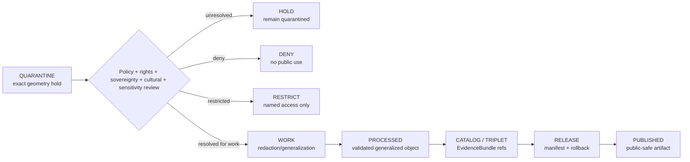

<!-- [KFM_META_BLOCK_V2]
doc_id: kfm://data/quarantine/archaeology/exact-geometry/readme
name: Archaeology Exact Geometry Quarantine README
path: data/quarantine/archaeology/exact_geometry/README.md
type: data-quarantine-lane-readme
version: v0.1.0
status: draft
owners:
  - <archaeology-domain-steward>
  - <cultural-review-liaison>
  - <sensitivity-reviewer>
  - <rights-holder-representative>
  - <release-steward>
created: 2026-06-27
updated: 2026-06-27
policy_label: restricted-review
truth_posture: cite-or-abstain
lifecycle_phase: quarantine
responsibility_root: data/
domain: archaeology
artifact_family: held-archaeology-exact-geometry
sensitivity_posture: fail-closed; exact-location-held; cultural-review-required; sovereignty-review-required; no-publication-without-redaction-and-release
related:
  - ../README.md
  - ../../README.md
  - ../../../README.md
  - ../../processed/archaeology/README.md
  - ../../catalog/domain/archaeology/README.md
  - ../../proofs/archaeology/README.md
  - ../../../../docs/domains/archaeology/SENSITIVITY.md
  - ../../../../docs/domains/archaeology/CULTURAL_REVIEW.md
  - ../../../../docs/domains/archaeology/DATA_LIFECYCLE.md
  - ../../../../docs/domains/archaeology/ARCHITECTURE.md
  - ../../../../docs/domains/archaeology/PUBLICATION_AND_POLICY.md
  - ../../../../docs/runbooks/archaeology/PROMOTION_RUNBOOK.md
  - ../../../../docs/runbooks/archaeology/ROLLBACK_RUNBOOK.md
  - ../../../../release/manifests/README.md
tags:
  - kfm
  - data
  - quarantine
  - archaeology
  - exact-geometry
  - exact-location
  - cultural-review
  - sovereignty
  - sensitivity
  - fail-closed
  - no-public-path
  - evidence-first
notes:
  - "This README documents the quarantine lane for Archaeology exact-geometry material."
  - "Exact archaeology geometry is held by default; this lane does not authorize map, report, story, graph, search, vector, AI, or public API use."
  - "Any less-restrictive transition requires source descriptors, rights posture, sensitivity rank, cultural/sovereignty review where applicable, redaction/generalization receipts, policy decision, evidence closure, release state, correction path, and rollback target."
  - "Actual payload presence, policy automation, validator wiring, CI enforcement, and review completion remain UNKNOWN unless verified."
[/KFM_META_BLOCK_V2] -->

<a id="top"></a>

# Archaeology Exact Geometry Quarantine

Held archaeology exact-geometry material pending sensitivity, cultural, sovereignty, rights, evidence, redaction, review, and release decisions.

<p>
  
  
  
  
  
  
  
</p>

**Quick links:** [Scope](#scope) · [Repo fit](#repo-fit) · [Held material](#held-material) · [Inputs](#inputs) · [Exclusions](#exclusions) · [Directory map](#directory-map) · [Exit gates](#exit-gates) · [Forbidden shortcuts](#forbidden-shortcuts) · [Required checks](#required-checks-before-use) · [Status notes](#status-notes)

> [!CAUTION]
> `data/quarantine/archaeology/exact_geometry/` is a no-public-path hold lane. Material here is not public, not processed truth, not catalog truth, not proof, not release authority, not policy authority, not site truth, not map truth, and not an AI-answer source. Nothing in this lane may be consumed by public clients, normal UI surfaces, map layers, PMTiles, reports, stories, graph/vector indexes, search indexes, model-answer surfaces, or direct downloads.

---

## Scope

This directory may hold archaeology records or sidecars that contain, imply, preserve, or can reconstruct exact geometry for archaeology or cultural-heritage material when any sensitivity, rights, cultural, sovereignty, evidence, redaction, review, policy, correction, or rollback question remains unresolved.

Typical reasons for quarantine include:

- exact site geometry, point geometry, polygon geometry, address-like location, provenience geometry, excavation-unit geometry, or high-resolution survey geometry;
- geometry associated with sacred, burial, human-remains, culturally controlled, sovereignty-restricted, collection-security, or active-risk contexts;
- exact geometry for candidate features, remote-sensing anomalies, LiDAR candidates, 3D documentation, or preservation-state observations that might be misread as confirmed site truth;
- geometry joined to private landowner, repository, collection, custody, access, or stewardship details;
- generated map/report/story candidates, vector/search indexes, or AI-drafted claims that carry or imply exact geometry;
- any record missing a sensitivity rank, source descriptor, rights status, redaction profile, review record, or policy decision.

This lane preserves held material for review while preventing accidental promotion, publication, rendering, indexing, downloading, story playback, or AI-answer use.

---

## Repo fit

| Field | Value |
|---|---|
| Path | `data/quarantine/archaeology/exact_geometry/` |
| Responsibility root | `data/` |
| Lifecycle phase | `quarantine/` |
| Domain lane | `archaeology` |
| Sublane | `exact_geometry` |
| Artifact role | Held archaeology exact-geometry material and quarantine-local review sidecars |
| Public access posture | No public path; no normal UI; no governed-public API exposure |
| Exit posture | Only by explicit policy decision, review record, required receipt closure, cultural/sovereignty review where applicable, and corrected lifecycle placement |
| Release authority | `release/`, not this directory |
| Proof authority | `data/proofs/` and `data/receipts/`, not this directory |
| Catalog authority | `data/catalog/`, not this directory |
| Registry authority | `data/registry/`, not this directory |
| Policy authority | `policy/`, not this directory |
| Default failure posture | `HOLD`, `DENY`, `RESTRICT`, or `ABSTAIN` when evidence, source role, rights, sovereignty, cultural review, sensitivity rank, redaction receipt, policy, review, correction, or rollback support is insufficient |

---

## Held material

Material belongs here when exact geometry is not safe or sufficiently governed for `work`, `processed`, `catalog`, `published`, report, story, layer, graph, search, vector-index, or AI-answer use.

| Held family | Why it is held |
|---|---|
| Exact site geometry | Archaeology sensitivity doctrine treats exact site location as fail-closed. |
| Sacred, burial, or human-remains geometry | Cultural, sovereignty, rights-holder, and review controls are mandatory. |
| Provenience or excavation geometry | May expose sensitive location or record-level context. |
| Candidate/anomaly exact geometry | Candidate role must not collapse into confirmed site truth. |
| 3D or high-fidelity documentation geometry | Representation may expose sensitive spatial detail even when narrative text is safe. |
| Geometry joined to landowner, collection, access, or custody details | Cross-domain sensitivity and privacy controls apply. |
| Generated or indexed geometry carriers | Search, vector, story, report, map, or AI artifacts must not leak held geometry. |

---

## Inputs

Accepted content is limited to held review material and quarantine-local sidecars such as:

- source excerpts, source pointers, candidate packets, geometry packets, or claim packets that require quarantine;
- quarantine reason notes and `HOLD` / `DENY` / `RESTRICT` policy summaries;
- source-role, rights, sovereignty, cultural-review, sensitivity-rank, and reviewer notes;
- candidate receipt drafts, such as redaction, representation, reality-boundary, citation-validation, cultural-review, or policy-decision drafts;
- hash/digest sidecars used to preserve chain-of-custody for held material;
- quarantine-local README files that explain hold state without becoming proof, catalog, registry, policy, or release authority.

---

## Exclusions

| Do not place here | Correct authority home |
|---|---|
| Clean RAW source mirrors that have not triggered quarantine | `data/raw/archaeology/` or source-specific intake |
| Ordinary WORK material that is safe to process under normal review | `data/work/archaeology/` |
| Validated processed archaeology objects | `data/processed/archaeology/` only after quarantine resolution |
| Catalog records, triplets, graph truth, or EvidenceBundle state | `data/catalog/`, triplet lanes, or proof lanes |
| EvidenceBundle / ProofPack | `data/proofs/` |
| Final validation, transform, redaction, representation, cultural-review, AI, or release receipts | `data/receipts/` |
| Release manifests, promotion decisions, correction records, rollback records, or signatures | `release/` |
| Source descriptors, activation records, consent/custodial registries, or registry truth | `data/registry/` |
| Public layers, PMTiles, reports, stories, API payloads, downloads, or published artifacts | `data/published/` only after release gates close |
| Semantic contracts, schemas, validators, or policy rules | `contracts/`, `schemas/`, `tools/`, `policy/` |
| Normal public UI, search, vector-index, graph, or AI-answer material | Governed public lanes only after release; otherwise abstain or deny |

---

## Directory map

```text
data/quarantine/archaeology/exact_geometry/
├── README.md
├── <hold_id>/
│   ├── geometry_packet.json
│   ├── source_refs.json
│   ├── quarantine_reason.md
│   ├── sensitivity_review.notes.md
│   ├── cultural_review.notes.md
│   ├── sovereignty_review.notes.md
│   ├── redaction_profile.review.md
│   ├── policy_decision.draft.json
│   ├── receipt_closure.checklist.md
│   ├── geometry_packet.sha256
│   └── README.md
└── index.local.json
```

`index.local.json` is optional and must remain quarantine-local. It is not a public index, catalog record, release manifest, registry, graph edge source, layer/story/report pointer, search index, vector index, map source, or AI retrieval index.

---

## Exit gates

Exact-geometry archaeology material may leave this lane only when the exit path is explicit:

| Exit route | Minimum requirement |
|---|---|
| Stay held | Any unresolved source, rights, sovereignty, cultural-review, sensitivity, evidence, or policy question remains. |
| Deny | PolicyDecision says `DENY`; public/UI/AI surfaces abstain or deny. |
| Restrict | PolicyDecision, ReviewRecord, and named agreement identify allowed audience, purpose, terms, and revocation path. |
| Return to work | Hold reason is resolved, but normal validation, redaction, or transformation still remains. |
| Promote to processed/catalog/published | Only after required receipts, review records, source descriptors, evidence closure, release manifest, correction path, rollback path, and approved public-safe geometry transform exist. |

A more public tier requires the required transform receipt and review record. A more restrictive correction can happen immediately when risk is discovered.

---

## Forbidden shortcuts

```text
data/quarantine/archaeology/exact_geometry/
→ data/processed/archaeology/
→ data/catalog/
→ data/published/
→ public API / MapLibre / PMTiles / report / story / graph / vector index / AI answer
```

is forbidden unless the appropriate governed transition has actually happened and left inspectable evidence.



---

## Required checks before use

- [ ] Confirm the material is archaeology-domain exact-geometry material and belongs in this quarantine sublane.
- [ ] Confirm the hold reason is recorded.
- [ ] Confirm source descriptors, source roles, authority, rights posture, custodial posture, and current terms.
- [ ] Confirm sensitivity rank and audience tier; missing rank defaults to fail-closed until reviewed.
- [ ] Confirm cultural review, sovereignty review, rights-holder review, and steward review state where applicable.
- [ ] Confirm whether the material involves sacred, burial, human-remains, culturally controlled, collection-security, or active-risk context.
- [ ] Confirm whether the geometry is observed, derived, modeled, inferred, candidate, generated, synthetic, or representation-derived.
- [ ] Confirm exact geometry has not entered map tiles, reports, stories, graph edges, search indexes, vector indexes, or AI answer retrieval.
- [ ] Confirm required receipts are present or explicitly marked missing.
- [ ] Confirm PolicyDecision, ReviewRecord, redaction/generalization profile, correction path, and rollback target before any exit.

---

## Status notes

| Claim | Status |
|---|---|
| This README defines the requested quarantine path boundary. | **CONFIRMED authored** |
| The target path exists in the live repository as an empty file before this edit. | **CONFIRMED by GitHub contents API during this edit** |
| Archaeology sensitivity doctrine defaults exact site geometry, sacred sites, burials/human remains, and looting-risk exposure to fail-closed / denied posture. | **CONFIRMED by GitHub contents API during this edit** |
| Archaeology sensitivity doctrine requires named redaction profiles and review-backed receipts for public-safe transformations. | **CONFIRMED by GitHub contents API during this edit** |
| Archaeology cultural review doctrine says the named authority controls the substance of cultural/community-controlled material and this protocol does not authorize release. | **CONFIRMED by GitHub contents API during this edit** |
| Actual exact-geometry payloads exist in this subtree. | **UNKNOWN** |
| Policy automation, validators, and CI checks enforce this exact quarantine lane. | **NEEDS VERIFICATION** |
| This README is proof, release, catalog, registry, policy, site truth, map truth, public artifact authority, or AI authority. | **DENY** |

---

## Related files

- [`../README.md`](../README.md)
- [`../../README.md`](../../README.md)
- [`../../../README.md`](../../../README.md)
- [`../../processed/archaeology/README.md`](../../processed/archaeology/README.md)
- [`../../catalog/domain/archaeology/README.md`](../../catalog/domain/archaeology/README.md)
- [`../../proofs/archaeology/README.md`](../../proofs/archaeology/README.md)
- [`../../../../docs/domains/archaeology/SENSITIVITY.md`](../../../../docs/domains/archaeology/SENSITIVITY.md)
- [`../../../../docs/domains/archaeology/CULTURAL_REVIEW.md`](../../../../docs/domains/archaeology/CULTURAL_REVIEW.md)
- [`../../../../docs/domains/archaeology/DATA_LIFECYCLE.md`](../../../../docs/domains/archaeology/DATA_LIFECYCLE.md)
- [`../../../../docs/domains/archaeology/ARCHITECTURE.md`](../../../../docs/domains/archaeology/ARCHITECTURE.md)
- [`../../../../docs/domains/archaeology/PUBLICATION_AND_POLICY.md`](../../../../docs/domains/archaeology/PUBLICATION_AND_POLICY.md)
- [`../../../../docs/runbooks/archaeology/PROMOTION_RUNBOOK.md`](../../../../docs/runbooks/archaeology/PROMOTION_RUNBOOK.md)
- [`../../../../docs/runbooks/archaeology/ROLLBACK_RUNBOOK.md`](../../../../docs/runbooks/archaeology/ROLLBACK_RUNBOOK.md)
- [`../../../../release/manifests/README.md`](../../../../release/manifests/README.md)

---

KFM rule: this directory is an Archaeology exact-geometry quarantine hold lane only. It is not source authority, proof authority, receipt authority, release authority, catalog authority, registry authority, policy authority, site truth, map truth, public artifact authority, UI authority, graph authority, vector-index authority, or AI truth.

[Back to top](#top)
