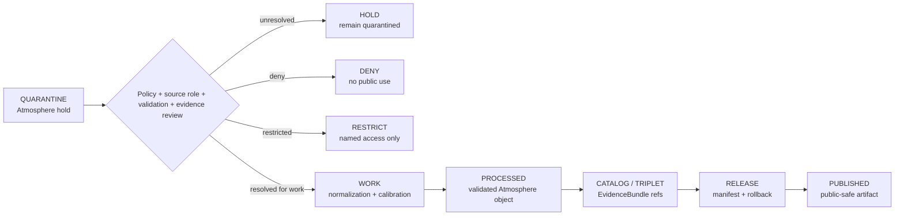

<!-- [KFM_META_BLOCK_V2]
doc_id: kfm://data/quarantine/atmosphere/readme
name: Atmosphere Quarantine README
path: data/quarantine/atmosphere/README.md
type: data-quarantine-index-readme
version: v0.1.0
status: draft
owners:
  - <atmosphere-domain-steward>
  - <data-steward>
  - <policy-steward>
  - <release-steward>
created: 2026-06-27
updated: 2026-06-27
policy_label: restricted-review
truth_posture: cite-or-abstain
lifecycle_phase: quarantine
responsibility_root: data/
domain: atmosphere
artifact_family: held-atmosphere-material
sensitivity_posture: fail-closed; no-public-path; source-role-preservation-required; validation-required; release-blocked
related:
  - candidate/README.md
  - ../README.md
  - ../../README.md
  - ../../../docs/domains/atmosphere/ARCHITECTURE.md
  - ../../../docs/domains/atmosphere/DATA_LIFECYCLE.md
  - ../../../docs/runbooks/atmosphere/PROMOTION_RUNBOOK.md
  - ../../../docs/runbooks/atmosphere/ROLLBACK_RUNBOOK.md
  - ../../../release/manifests/README.md
tags:
  - kfm
  - data
  - quarantine
  - atmosphere
  - candidate
  - air-quality
  - sensor
  - model-field
  - source-role
  - fail-closed
  - evidence-first
notes:
  - "This README replaces the greenfield stub and documents the parent Atmosphere quarantine lane."
  - "Atmosphere quarantine is a hold area, not a staging shortcut to processed, catalog, published, reports, layers, PMTiles, stories, graph/vector indexes, AI answers, or public UI."
  - "Atmosphere quarantine preserves knowledge-character separation: AQI is not concentration, AOD is not PM2.5, model fields are not observations, and low-cost sensors require caveats before release."
  - "Child lane README presence does not prove held payload presence, policy automation, validator wiring, CI enforcement, or review completion."
[/KFM_META_BLOCK_V2] -->

<a id="top"></a>

# Atmosphere Quarantine

Parent hold lane for Atmosphere material that is not safe or sufficiently governed for normal processing, cataloging, publication, reporting, map rendering, story playback, indexing, or AI-answer use.

<p>
  
  
  
  
  
  
</p>

**Quick links:** [Scope](#scope) · [Repo fit](#repo-fit) · [Confirmed child lanes](#confirmed-child-lanes) · [Inputs](#inputs) · [Exclusions](#exclusions) · [Directory map](#directory-map) · [Exit gates](#exit-gates) · [Forbidden shortcuts](#forbidden-shortcuts) · [Required checks](#required-checks-before-use) · [Status notes](#status-notes)

> [!CAUTION]
> `data/quarantine/atmosphere/` is a no-public-path hold lane. Material here is not public, not processed truth, not catalog truth, not proof, not release authority, not policy authority, not AQI truth, not concentration truth, not observation truth, not model truth, and not an AI-answer source. Nothing in this subtree may be consumed by public clients or normal UI surfaces until a governed exit transition leaves inspectable evidence.

---

## Scope

This directory holds Atmosphere material when evidence, source role, knowledge character, rights, authority, validation, calibration, freshness, units, policy decision, review record, receipt closure, correction path, or rollback path is unresolved.

Atmosphere doctrine serves evidence-labeled observations, official context, and derived products. It does not replace the issuing authority for alerts or advisories. The lane also preserves knowledge-character separation: AQI is not concentration, AOD is not PM2.5, model fields are not observations, and low-cost sensor data requires correction, caveats, confidence, and limitations before release.

This parent lane does not make held content authoritative. It organizes quarantine sublanes so stewards can review, deny, restrict, return to work, or promote only through governed lifecycle transitions.

---

## Repo fit

| Field | Value |
|---|---|
| Path | `data/quarantine/atmosphere/` |
| Responsibility root | `data/` |
| Lifecycle phase | `quarantine/` |
| Domain lane | `atmosphere` |
| Artifact role | Parent hold lane for Atmosphere quarantine sublanes and quarantine-local review sidecars |
| Public access posture | No public path; no normal UI; no governed-public API exposure |
| Exit posture | Only by explicit policy decision, validation closure, source-role closure, evidence closure, required receipts, and corrected lifecycle placement |
| Release authority | `release/`, not this directory |
| Proof authority | `data/proofs/` and `data/receipts/`, not this directory |
| Catalog authority | `data/catalog/`, not this directory |
| Registry authority | `data/registry/`, not this directory |
| Policy authority | `policy/`, not this directory |
| Default failure posture | `HOLD`, `DENY`, `RESTRICT`, or `ABSTAIN` when source role, knowledge character, evidence, validation, rights, authority, calibration, freshness, policy, review, correction, or rollback support is insufficient |

---

## Confirmed child lanes

The child lanes below are README paths confirmed by current-session GitHub fetches or edits. This table does **not** prove held payloads exist under those lanes.

| Child lane | Held material | Boundary |
|---|---|---|
| [`candidate/`](candidate/README.md) | Candidate station, sensor, AQI, concentration, smoke, AOD, weather, climate, forecast, advisory-context, model-field, and generated Atmosphere material | No public path; no map/report/story/graph/vector/search/AI use without governed transition, validation, source-role closure, release, correction, and rollback support. |

---

## Inputs

Accepted content is limited to held review material and quarantine-local sidecars such as:

- source pointers, candidate records, sensor packets, model packets, advisory-context packets, freshness packets, unit-conversion packets, or generated candidates that require quarantine;
- quarantine reason notes and `HOLD` / `DENY` / `RESTRICT` summaries;
- source-role, knowledge-character, authority, rights, time/freshness, unit, calibration, validation, reviewer, and steward notes;
- candidate receipt drafts, such as transform, validation, model-run, aggregation, redaction, citation-validation, source-role review, or policy-decision drafts;
- hash/digest sidecars used to preserve chain-of-custody for held material;
- quarantine-local README files and local indexes that explain hold state without becoming proof, catalog, registry, policy, or release authority.

---

## Exclusions

| Do not place here | Correct authority home |
|---|---|
| Clean RAW source mirrors that have not triggered quarantine | `data/raw/atmosphere/` or source-specific intake |
| Ordinary WORK material that is safe to process under normal review | `data/work/atmosphere/` |
| Validated processed Atmosphere objects | `data/processed/atmosphere/` only after quarantine resolution |
| Catalog records, triplets, graph truth, or EvidenceBundle state | `data/catalog/`, triplet lanes, or proof lanes |
| EvidenceBundle / ProofPack | `data/proofs/` |
| Final validation, transform, model-run, aggregation, redaction, AI, or release receipts | `data/receipts/` |
| Release manifests, promotion decisions, correction records, rollback records, or signatures | `release/` |
| Source descriptors, activation records, source registries, or registry truth | `data/registry/` |
| Public layers, PMTiles, reports, stories, API payloads, downloads, or published artifacts | `data/published/` only after release gates close |
| Semantic contracts, schemas, validators, or policy rules | `contracts/`, `schemas/`, `tools/`, `policy/` |
| Normal public UI, search, vector-index, graph, or AI-answer material | Governed public lanes only after release; otherwise abstain or deny |

---

## Directory map

```text
data/quarantine/atmosphere/
├── README.md
├── candidate/
│   └── README.md
└── index.local.json
```

`index.local.json` is optional and must remain quarantine-local. It is not a public index, catalog record, release manifest, registry, graph edge source, layer/story/report pointer, search index, vector index, map source, or AI retrieval index.

---

## Exit gates

Atmosphere material may leave quarantine only when the exit path is explicit:

| Exit route | Minimum requirement |
|---|---|
| Stay held | Any unresolved source-role, validation, authority, rights, freshness, calibration, evidence, or policy question remains. |
| Deny | PolicyDecision says `DENY`; public/UI/AI surfaces abstain or deny. |
| Restrict | PolicyDecision and ReviewRecord identify allowed audience, purpose, terms, and correction path. |
| Return to work | Hold reason is resolved, but normal validation, transformation, calibration, attribution, or source-role work still remains. |
| Promote to processed/catalog/published | Only after required receipts, source descriptors, validation closure, evidence closure, release manifest, correction path, rollback path, and approved public-safe transform exist. |

---

## Forbidden shortcuts

```text
data/quarantine/atmosphere/
→ data/processed/atmosphere/
→ data/catalog/
→ data/published/
→ public API / MapLibre / PMTiles / report / story / graph / vector index / AI answer
```

is forbidden unless the appropriate governed transition has actually happened and left inspectable evidence.



---

## Required checks before use

- [ ] Confirm the material is Atmosphere-domain material and belongs under `data/quarantine/atmosphere/`.
- [ ] Confirm the correct child sublane: `candidate/` or a new documented sublane.
- [ ] Confirm the hold reason is recorded.
- [ ] Confirm source descriptors, source roles, authority, rights posture, cadence, and current terms.
- [ ] Confirm observed time, valid time, issue time, expiry time, model-run time, freshness threshold, and stale-state status where applicable.
- [ ] Confirm units, transformations, calibration, correction, confidence, and limitations.
- [ ] Confirm AQI is not treated as concentration, AOD is not treated as PM2.5, and model fields are not treated as observations.
- [ ] Confirm required receipts are present or explicitly marked missing.
- [ ] Confirm PolicyDecision, ValidationReport, source-role closure, correction path, and rollback target before any exit.
- [ ] Confirm no public layer, PMTiles, report, story, API payload, graph edge, search index, vector index, or AI answer uses the quarantined material.

---

## Status notes

| Claim | Status |
|---|---|
| This README replaces the greenfield stub at `data/quarantine/atmosphere/README.md`. | **CONFIRMED authored** |
| The target path existed in the live repository as a greenfield stub before this edit. | **CONFIRMED by GitHub contents API during this edit** |
| `candidate/README.md` exists as an Atmosphere quarantine child-lane README. | **CONFIRMED by GitHub contents API during this edit** |
| Atmosphere doctrine says the domain serves evidence-labeled context and does not replace official alert/advisory authority. | **CONFIRMED by GitHub contents API during this edit** |
| Atmosphere doctrine requires AQI/concentration, AOD/PM2.5, model/observation, and low-cost-sensor caveat separation. | **CONFIRMED by GitHub contents API during this edit** |
| Atmosphere lifecycle doctrine says quarantine holds source-role, validation, evidence, temporal, rights, and policy defects and is not publishable. | **CONFIRMED by GitHub contents API during this edit** |
| Actual quarantined payloads exist under every listed child lane. | **UNKNOWN** |
| Policy automation, validators, and CI checks enforce every listed Atmosphere quarantine lane. | **NEEDS VERIFICATION** |
| This README is proof, release, catalog, registry, policy, AQI truth, concentration truth, observation truth, model truth, public artifact authority, or AI authority. | **DENY** |

---

## Related files

- [`candidate/README.md`](candidate/README.md)
- [`../README.md`](../README.md)
- [`../../README.md`](../../README.md)
- [`../../processed/atmosphere/README.md`](../../processed/atmosphere/README.md)
- [`../../catalog/domain/atmosphere/README.md`](../../catalog/domain/atmosphere/README.md)
- [`../../proofs/evidence_bundle/atmosphere/README.md`](../../proofs/evidence_bundle/atmosphere/README.md)
- [`../../proofs/validation_report/atmosphere/README.md`](../../proofs/validation_report/atmosphere/README.md)
- [`../../../docs/domains/atmosphere/ARCHITECTURE.md`](../../../docs/domains/atmosphere/ARCHITECTURE.md)
- [`../../../docs/domains/atmosphere/DATA_LIFECYCLE.md`](../../../docs/domains/atmosphere/DATA_LIFECYCLE.md)
- [`../../../docs/domains/atmosphere/SOURCE_REGISTRY.md`](../../../docs/domains/atmosphere/SOURCE_REGISTRY.md)
- [`../../../docs/domains/atmosphere/API_CONTRACTS.md`](../../../docs/domains/atmosphere/API_CONTRACTS.md)
- [`../../../docs/runbooks/atmosphere/PROMOTION_RUNBOOK.md`](../../../docs/runbooks/atmosphere/PROMOTION_RUNBOOK.md)
- [`../../../docs/runbooks/atmosphere/ROLLBACK_RUNBOOK.md`](../../../docs/runbooks/atmosphere/ROLLBACK_RUNBOOK.md)
- [`../../../release/manifests/README.md`](../../../release/manifests/README.md)

---

KFM rule: this directory is an Atmosphere quarantine hold index only. It is not source authority, proof authority, receipt authority, release authority, catalog authority, registry authority, policy authority, AQI truth, concentration truth, observation truth, model truth, public artifact authority, UI authority, graph authority, vector-index authority, or AI truth.

[Back to top](#top)
