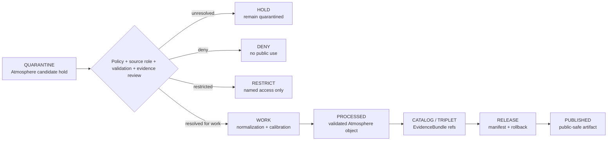

<!-- [KFM_META_BLOCK_V2]
doc_id: kfm://data/quarantine/atmosphere/candidate/readme
name: Atmosphere Candidate Quarantine README
path: data/quarantine/atmosphere/candidate/README.md
type: data-quarantine-lane-readme
version: v0.1.0
status: draft
owners:
  - <atmosphere-domain-steward>
  - <data-steward>
  - <policy-steward>
  - <release-steward>
created: 2026-06-27
updated: 2026-06-27
policy_label: restricted-review
truth_posture: cite-or-abstain
lifecycle_phase: quarantine
responsibility_root: data/
domain: atmosphere
artifact_family: held-atmosphere-candidates
sensitivity_posture: fail-closed; candidate-held; source-role-preservation-required; no-publication-without-validation-and-release
related:
  - ../README.md
  - ../../README.md
  - ../../../README.md
  - ../../../processed/atmosphere/README.md
  - ../../../catalog/domain/atmosphere/README.md
  - ../../../proofs/evidence_bundle/atmosphere/README.md
  - ../../../proofs/validation_report/atmosphere/README.md
  - ../../../../docs/domains/atmosphere/ARCHITECTURE.md
  - ../../../../docs/domains/atmosphere/DATA_LIFECYCLE.md
  - ../../../../docs/domains/atmosphere/SOURCE_REGISTRY.md
  - ../../../../docs/domains/atmosphere/API_CONTRACTS.md
  - ../../../../docs/runbooks/atmosphere/PROMOTION_RUNBOOK.md
  - ../../../../docs/runbooks/atmosphere/ROLLBACK_RUNBOOK.md
  - ../../../../release/manifests/README.md
tags:
  - kfm
  - data
  - quarantine
  - atmosphere
  - candidate
  - air-quality
  - sensor
  - model-field
  - aqi
  - aod
  - advisory-context
  - source-role
  - fail-closed
  - evidence-first
notes:
  - "This README documents the quarantine lane for Atmosphere candidate material."
  - "Candidate atmosphere material is held when validation, source role, knowledge character, time/freshness, units, calibration, authority, rights, evidence, policy, or release state is unresolved."
  - "Quarantine is a hold state, not a staging shortcut to processed, catalog, triplet, published, reports, layers, PMTiles, stories, AI answers, or public UI."
  - "Atmosphere candidates must not be treated as emergency instructions, official advisories, observed truth, AQI truth, concentration truth, model truth, or life-safety guidance."
  - "Actual payload presence, policy automation, validator wiring, CI enforcement, and review completion remain UNKNOWN unless verified."
[/KFM_META_BLOCK_V2] -->

<a id="top"></a>

# Atmosphere Candidate Quarantine

Held Atmosphere candidate material pending source-role, validation, knowledge-character, time/freshness, calibration, authority, evidence, policy, and release review.

<p>
  
  
  
  
  
  
</p>

**Quick links:** [Scope](#scope) · [Repo fit](#repo-fit) · [Held material](#held-material) · [Inputs](#inputs) · [Exclusions](#exclusions) · [Directory map](#directory-map) · [Exit gates](#exit-gates) · [Forbidden shortcuts](#forbidden-shortcuts) · [Required checks](#required-checks-before-use) · [Status notes](#status-notes)

> [!CAUTION]
> `data/quarantine/atmosphere/candidate/` is a no-public-path hold lane. Material here is not public, not processed truth, not catalog truth, not proof, not release authority, not policy authority, not advisory authority, not AQI truth, not concentration truth, not observation truth, not model truth, and not an AI-answer source. Nothing in this lane may be consumed by public clients, normal UI surfaces, map layers, PMTiles, reports, stories, graph/vector indexes, search indexes, model-answer surfaces, or direct downloads.

---

## Scope

This directory may hold Atmosphere candidate material when any source-role, knowledge-character, validation, authority, rights, time/freshness, unit, calibration, evidence, policy, correction, or rollback question remains unresolved.

Typical reasons for quarantine include:

- candidate station, sensor, AQI, concentration, smoke, AOD, weather, climate, forecast, advisory-context, or model-field records whose source role is not yet resolved;
- AQI values that could be confused with concentration values;
- AOD or remote-sensing masks that could be confused with surface PM2.5 observations;
- model or forecast fields that could be misread as observed truth;
- low-cost sensor records lacking correction, caveats, confidence, limitations, calibration, or trust state;
- stale sources, missing observed/valid/issue/expiry/model-run time, impossible values, unit ambiguity, channel divergence, or station/network identity conflict;
- advisory text or alert-like context without authoritative source attribution and explicit redirect posture;
- generated maps, reports, stories, indexes, or AI-drafted claims that use unresolved Atmosphere candidates.

This lane preserves held material for review while preventing accidental promotion, publication, rendering, indexing, downloading, story playback, advisory-like presentation, or AI-answer use.

---

## Repo fit

| Field | Value |
|---|---|
| Path | `data/quarantine/atmosphere/candidate/` |
| Responsibility root | `data/` |
| Lifecycle phase | `quarantine/` |
| Domain lane | `atmosphere` |
| Sublane | `candidate` |
| Artifact role | Held Atmosphere candidate material and quarantine-local review sidecars |
| Public access posture | No public path; no normal UI; no governed-public API exposure |
| Exit posture | Only by explicit policy decision, validation closure, source-role closure, evidence closure, review record where required, receipt closure, and corrected lifecycle placement |
| Release authority | `release/`, not this directory |
| Proof authority | `data/proofs/` and `data/receipts/`, not this directory |
| Catalog authority | `data/catalog/`, not this directory |
| Registry authority | `data/registry/`, not this directory |
| Policy authority | `policy/`, not this directory |
| Default failure posture | `HOLD`, `DENY`, `RESTRICT`, or `ABSTAIN` when source role, knowledge character, evidence, validation, rights, authority, calibration, freshness, policy, review, correction, or rollback support is insufficient |

---

## Held material

Material belongs here when the candidate is not safe or sufficiently governed for `work`, `processed`, `catalog`, `published`, report, story, layer, graph, search, vector-index, or AI-answer use.

| Held family | Why it is held |
|---|---|
| Candidate air observations | Need source role, station/network identity, units, time, and validation closure. |
| AQI candidates | AQI must not collapse into concentration truth. |
| AOD / smoke candidates | Remote-sensing masks must not collapse into surface PM2.5 observations. |
| Model or forecast candidates | Model fields must not collapse into observed truth. |
| Low-cost sensor candidates | Correction, caveats, confidence, limitations, and calibration state are mandatory before release. |
| Advisory-context candidates | KFM does not issue or replace official advisories, watches, warnings, or life-safety instructions. |
| Generated or indexed candidate carriers | Search, vector, story, report, map, graph, or AI artifacts must not leak unresolved candidate state. |

---

## Inputs

Accepted content is limited to held review material and quarantine-local sidecars such as:

- source excerpts, source pointers, candidate packets, sensor packets, model packets, advisory-context packets, or claim packets that require quarantine;
- quarantine reason notes and `HOLD` / `DENY` / `RESTRICT` policy summaries;
- source-role, knowledge-character, authority, rights, time/freshness, unit, calibration, validation, and reviewer notes;
- candidate receipt drafts, such as transform, validation, model-run, aggregation, redaction, citation-validation, or policy-decision drafts;
- hash/digest sidecars used to preserve chain-of-custody for held material;
- quarantine-local README files that explain hold state without becoming proof, catalog, registry, policy, or release authority.

---

## Exclusions

| Do not place here | Correct authority home |
|---|---|
| Clean RAW source mirrors that have not triggered quarantine | `data/raw/atmosphere/` or source-specific intake |
| Ordinary WORK material that is safe to process under normal review | `data/work/atmosphere/` |
| Validated processed Atmosphere objects | `data/processed/atmosphere/` only after quarantine resolution |
| Catalog records, triplets, graph truth, or EvidenceBundle state | `data/catalog/`, triplet lanes, or proof lanes |
| EvidenceBundle / ProofPack | `data/proofs/` |
| Final validation, transform, model-run, aggregation, redaction, AI, or release receipts | `data/receipts/` |
| Release manifests, promotion decisions, correction records, rollback records, or signatures | `release/` |
| Source descriptors, activation records, source registries, or registry truth | `data/registry/` |
| Public layers, PMTiles, reports, stories, API payloads, downloads, or published artifacts | `data/published/` only after release gates close |
| Semantic contracts, schemas, validators, or policy rules | `contracts/`, `schemas/`, `tools/`, `policy/` |
| Official advisory issuance, emergency instructions, or life-safety guidance | The issuing authority, not KFM |
| Normal public UI, search, vector-index, graph, or AI-answer material | Governed public lanes only after release; otherwise abstain or deny |

---

## Directory map

```text
data/quarantine/atmosphere/candidate/
├── README.md
├── <hold_id>/
│   ├── candidate_packet.json
│   ├── source_refs.json
│   ├── quarantine_reason.md
│   ├── source_role_review.notes.md
│   ├── validation_review.notes.md
│   ├── freshness_review.notes.md
│   ├── calibration_review.notes.md
│   ├── policy_decision.draft.json
│   ├── receipt_closure.checklist.md
│   ├── candidate_packet.sha256
│   └── README.md
└── index.local.json
```

`index.local.json` is optional and must remain quarantine-local. It is not a public index, catalog record, release manifest, registry, graph edge source, layer/story/report pointer, search index, vector index, map source, or AI retrieval index.

---

## Exit gates

Atmosphere candidate material may leave this lane only when the exit path is explicit:

| Exit route | Minimum requirement |
|---|---|
| Stay held | Any unresolved source-role, validation, authority, rights, freshness, calibration, evidence, or policy question remains. |
| Deny | PolicyDecision says `DENY`; public/UI/AI surfaces abstain or deny. |
| Restrict | PolicyDecision and ReviewRecord identify allowed audience, purpose, terms, and revocation/correction path. |
| Return to work | Hold reason is resolved, but normal validation, transformation, calibration, or attribution still remains. |
| Promote to processed/catalog/published | Only after required receipts, source descriptors, validation closure, evidence closure, release manifest, correction path, rollback path, and approved public-safe transform exist. |

A more public tier requires required validation, receipts, source-role preservation, and release state. A more restrictive correction can happen immediately when risk is discovered.

---

## Forbidden shortcuts

```text
data/quarantine/atmosphere/candidate/
→ data/processed/atmosphere/
→ data/catalog/
→ data/published/
→ public API / MapLibre / PMTiles / report / story / graph / vector index / AI answer
```

is forbidden unless the appropriate governed transition has actually happened and left inspectable evidence.



---

## Required checks before use

- [ ] Confirm the material is Atmosphere-domain candidate material and belongs in this quarantine sublane.
- [ ] Confirm the hold reason is recorded.
- [ ] Confirm source descriptors, source roles, authority, rights posture, cadence, and current terms.
- [ ] Confirm observed time, valid time, issue time, expiry time, model-run time, freshness threshold, and stale-state status where applicable.
- [ ] Confirm units, transformations, calibration, correction, confidence, and limitations.
- [ ] Confirm AQI is not treated as concentration, AOD is not treated as PM2.5, and model fields are not treated as observations.
- [ ] Confirm advisory-like content redirects to the issuing authority and does not become emergency instruction or life-safety guidance.
- [ ] Confirm required receipts are present or explicitly marked missing.
- [ ] Confirm PolicyDecision, ValidationReport, source-role closure, correction path, and rollback target before any exit.
- [ ] Confirm no public layer, PMTiles, report, story, API payload, graph edge, search index, vector index, or AI answer uses the quarantined candidate.

---

## Status notes

| Claim | Status |
|---|---|
| This README defines the requested quarantine path boundary. | **CONFIRMED authored** |
| The target path exists in the live repository as an empty file before this edit. | **CONFIRMED by GitHub contents API during this edit** |
| Atmosphere doctrine says the domain serves evidence-labeled context and is not an emergency alerting system. | **CONFIRMED by GitHub contents API during this edit** |
| Atmosphere doctrine requires AQI/concentration, AOD/PM2.5, model/observation, and low-cost-sensor caveat separation. | **CONFIRMED by GitHub contents API during this edit** |
| Atmosphere lifecycle doctrine says quarantine holds source-role, validation, evidence, temporal, rights, and policy defects and is not publishable. | **CONFIRMED by GitHub contents API during this edit** |
| The parent `data/quarantine/atmosphere/README.md` is currently only a greenfield stub. | **CONFIRMED by GitHub contents API during this edit** |
| Actual candidate payloads exist in this subtree. | **UNKNOWN** |
| Policy automation, validators, and CI checks enforce this exact quarantine lane. | **NEEDS VERIFICATION** |
| This README is proof, release, catalog, registry, policy, advisory authority, AQI truth, concentration truth, observation truth, model truth, public artifact authority, or AI authority. | **DENY** |

---

## Related files

- [`../README.md`](../README.md)
- [`../../README.md`](../../README.md)
- [`../../../README.md`](../../../README.md)
- [`../../../processed/atmosphere/README.md`](../../../processed/atmosphere/README.md)
- [`../../../catalog/domain/atmosphere/README.md`](../../../catalog/domain/atmosphere/README.md)
- [`../../../proofs/evidence_bundle/atmosphere/README.md`](../../../proofs/evidence_bundle/atmosphere/README.md)
- [`../../../proofs/validation_report/atmosphere/README.md`](../../../proofs/validation_report/atmosphere/README.md)
- [`../../../../docs/domains/atmosphere/ARCHITECTURE.md`](../../../../docs/domains/atmosphere/ARCHITECTURE.md)
- [`../../../../docs/domains/atmosphere/DATA_LIFECYCLE.md`](../../../../docs/domains/atmosphere/DATA_LIFECYCLE.md)
- [`../../../../docs/domains/atmosphere/SOURCE_REGISTRY.md`](../../../../docs/domains/atmosphere/SOURCE_REGISTRY.md)
- [`../../../../docs/domains/atmosphere/API_CONTRACTS.md`](../../../../docs/domains/atmosphere/API_CONTRACTS.md)
- [`../../../../docs/runbooks/atmosphere/PROMOTION_RUNBOOK.md`](../../../../docs/runbooks/atmosphere/PROMOTION_RUNBOOK.md)
- [`../../../../docs/runbooks/atmosphere/ROLLBACK_RUNBOOK.md`](../../../../docs/runbooks/atmosphere/ROLLBACK_RUNBOOK.md)
- [`../../../../release/manifests/README.md`](../../../../release/manifests/README.md)

---

KFM rule: this directory is an Atmosphere candidate quarantine hold lane only. It is not source authority, proof authority, receipt authority, release authority, catalog authority, registry authority, policy authority, advisory authority, AQI truth, concentration truth, observation truth, model truth, public artifact authority, UI authority, graph authority, vector-index authority, or AI truth.

[Back to top](#top)
