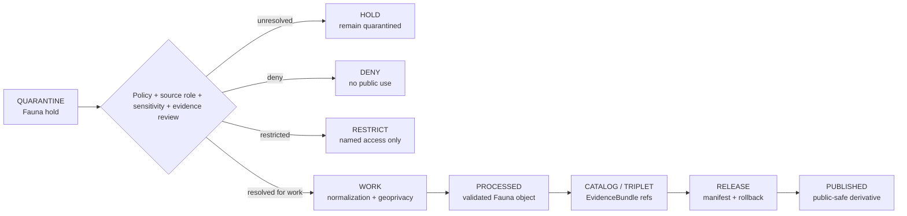

<!-- [KFM_META_BLOCK_V2]
doc_id: kfm://data/quarantine/fauna/readme
name: Fauna Quarantine README
path: data/quarantine/fauna/README.md
type: data-quarantine-index-readme
version: v0.1.0
status: draft
owners:
  - <fauna-lane-steward>
  - <data-steward>
  - <sensitivity-reviewer>
  - <geoprivacy-steward>
  - <release-steward>
created: 2026-06-27
updated: 2026-06-27
policy_label: restricted-review
truth_posture: cite-or-abstain
lifecycle_phase: quarantine
responsibility_root: data/
domain: fauna
artifact_family: held-fauna-material
sensitivity_posture: deny-by-default; no-public-path; geoprivacy-required; source-role-preservation-required; release-blocked
related:
  - ../README.md
  - ../../README.md
  - ../../processed/fauna/README.md
  - ../../catalog/domain/fauna/public/README.md
  - ../../catalog/domain/fauna/restricted/README.md
  - ../../published/layers/fauna/README.md
  - ../../../docs/domains/fauna/ARCHITECTURE.md
  - ../../../docs/domains/fauna/README.md
  - ../../../docs/domains/fauna/API_CONTRACTS.md
  - ../../../docs/domains/fauna/MAP_UI_CONTRACTS.md
  - ../../../docs/runbooks/fauna/SOURCE_REFRESH_RUNBOOK.md
  - ../../../release/manifests/README.md
tags:
  - kfm
  - data
  - quarantine
  - fauna
  - biodiversity
  - occurrence
  - sensitive-site
  - telemetry
  - geoprivacy
  - redaction
  - deny-by-default
  - evidence-first
notes:
  - "This README replaces the greenfield stub and documents the parent Fauna quarantine lane."
  - "Fauna quarantine is a hold area, not a staging shortcut to processed, catalog, triplet, published, reports, layers, PMTiles, stories, graph/vector indexes, AI answers, or public UI."
  - "Exact sensitive occurrence, sensitive site, restricted telemetry, steward-controlled record, and unresolved sensitivity material stays held unless governed geoprivacy/redaction, evidence, review, and release gates close."
  - "No child quarantine README lanes were confirmed in this session; future child lanes require Directory Rules placement and risk-class review."
  - "Actual held payload presence, policy automation, validator wiring, CI enforcement, and review completion remain UNKNOWN unless verified."
[/KFM_META_BLOCK_V2] -->

<a id="top"></a>

# Fauna Quarantine

Parent hold lane for Fauna material that is not safe or sufficiently governed for normal processing, cataloging, publication, reporting, map rendering, story playback, indexing, or AI-answer use.

<p>
  
  
  
  
  
  
</p>

**Quick links:** [Scope](#scope) · [Repo fit](#repo-fit) · [Confirmed child lanes](#confirmed-child-lanes) · [Inputs](#inputs) · [Exclusions](#exclusions) · [Directory map](#directory-map) · [Exit gates](#exit-gates) · [Forbidden shortcuts](#forbidden-shortcuts) · [Required checks](#required-checks-before-use) · [Status notes](#status-notes)

> [!CAUTION]
> `data/quarantine/fauna/` is a no-public-path hold lane. Material here is not public, not processed truth, not catalog truth, not proof, not release authority, not policy authority, not occurrence truth, not sensitive-site truth, not range truth, and not an AI-answer source. Nothing in this subtree may be consumed by public clients or normal UI surfaces until a governed exit transition leaves inspectable evidence.

---

## Scope

This directory holds Fauna material when evidence, source role, rights, sensitivity, geoprivacy, redaction, taxonomy, observation time, geometry, uncertainty, review record, policy decision, receipt closure, correction path, or rollback path is unresolved.

Fauna doctrine is deny-by-default for sensitive occurrence material. Exact sensitive occurrence, sensitive site, restricted telemetry, and steward-controlled material must not become public unless a governed public-safe derivative exists with geoprivacy/redaction evidence, `RedactionReceipt` support, review state where required, evidence closure, release state, correction path, and rollback target.

This parent lane does not make held content authoritative. It organizes quarantine material so stewards can review, deny, restrict, return to work, or promote only through governed lifecycle transitions.

---

## Repo fit

| Field | Value |
|---|---|
| Path | `data/quarantine/fauna/` |
| Responsibility root | `data/` |
| Lifecycle phase | `quarantine/` |
| Domain lane | `fauna` |
| Artifact role | Parent hold lane for Fauna quarantine material and quarantine-local review sidecars |
| Public access posture | No public path; no normal UI; no governed-public API exposure |
| Exit posture | Only by explicit policy decision, source-role closure, evidence closure, geoprivacy/redaction closure where needed, review record where required, receipt closure, and corrected lifecycle placement |
| Release authority | `release/`, not this directory |
| Proof authority | `data/proofs/` and `data/receipts/`, not this directory |
| Catalog authority | `data/catalog/`, not this directory |
| Registry authority | `data/registry/`, not this directory |
| Policy authority | `policy/`, not this directory |
| Default failure posture | `HOLD`, `DENY`, `RESTRICT`, or `ABSTAIN` when source role, evidence, rights, sensitivity, taxonomy, geoprivacy, redaction, review, correction, or rollback support is insufficient |

---

## Confirmed child lanes

No Fauna quarantine child README lanes were confirmed in this session.

| Child lane | Status | Boundary |
|---|---|---|
| `candidate/` | **PROPOSED / NEEDS VERIFICATION** | For unresolved candidate occurrence, range, monitoring, status, or invasive-record material. |
| `exact_occurrence/` | **PROPOSED / NEEDS VERIFICATION** | For held exact occurrence geometry or restricted observation detail. |
| `sensitive_site/` | **PROPOSED / NEEDS VERIFICATION** | For held sensitive site classes and steward-controlled locations. |
| `telemetry/` | **PROPOSED / NEEDS VERIFICATION** | For held telemetry or movement records that require geoprivacy review. |

> [!NOTE]
> Add child lanes only after confirming the risk class, responsibility-root fit, geoprivacy posture, source-role burden, receipt requirements, reviewer roles, correction path, rollback target, and Directory Rules placement basis.

---

## Inputs

Accepted content is limited to held review material and quarantine-local sidecars such as:

- source pointers, candidate records, occurrence packets, monitoring packets, telemetry packets, sensitive-site packets, taxonomy-review packets, or generated candidates that require quarantine;
- quarantine reason notes and `HOLD` / `DENY` / `RESTRICT` summaries;
- source-role, rights, sensitivity, taxonomy, geometry, uncertainty, geoprivacy, redaction, reviewer, and steward notes;
- candidate receipt drafts, such as transform, validation, redaction, aggregation, citation-validation, source-role review, or policy-decision drafts;
- hash/digest sidecars used to preserve chain-of-custody for held material;
- quarantine-local README files and local indexes that explain hold state without becoming proof, catalog, registry, policy, or release authority.

---

## Exclusions

| Do not place here | Correct authority home |
|---|---|
| Clean RAW source mirrors that have not triggered quarantine | `data/raw/fauna/` or source-specific intake |
| Ordinary WORK material that is safe to process under normal review | `data/work/fauna/` |
| Validated processed Fauna objects | `data/processed/fauna/` only after quarantine resolution |
| Catalog records, triplets, graph truth, or EvidenceBundle state | `data/catalog/`, triplet lanes, or proof lanes |
| EvidenceBundle / ProofPack | `data/proofs/` |
| Final validation, transform, redaction, geoprivacy, aggregation, AI, or release receipts | `data/receipts/` |
| Release manifests, promotion decisions, correction records, rollback records, or signatures | `release/` |
| Source descriptors, activation records, source registries, or registry truth | `data/registry/` |
| Public layers, PMTiles, reports, stories, API payloads, downloads, or published artifacts | `data/published/` only after release gates close |
| Semantic contracts, schemas, validators, or policy rules | `contracts/`, `schemas/`, `tools/`, `policy/` |
| Normal public UI, search, vector-index, graph, or AI-answer material | Governed public lanes only after release; otherwise abstain or deny |

---

## Directory map

```text
data/quarantine/fauna/
├── README.md
├── <future-risk-sublane>/
│   └── README.md
└── index.local.json
```

`index.local.json` is optional and must remain quarantine-local. It is not a public index, catalog record, release manifest, registry, graph edge source, layer/story/report pointer, search index, vector index, map source, or AI retrieval index.

---

## Exit gates

Fauna material may leave quarantine only when the exit path is explicit:

| Exit route | Minimum requirement |
|---|---|
| Stay held | Any unresolved source-role, rights, sensitivity, taxonomy, evidence, geoprivacy, or policy question remains. |
| Deny | PolicyDecision says `DENY`; public/UI/AI surfaces abstain or deny. |
| Restrict | PolicyDecision and ReviewRecord identify allowed audience, purpose, terms, and correction path. |
| Return to work | Hold reason is resolved, but normal validation, transformation, taxonomy, geoprivacy, or source-role work still remains. |
| Promote to processed/catalog/published | Only after required receipts, source descriptors, validation closure, evidence closure, release manifest, correction path, rollback path, and approved public-safe transform exist. |

---

## Forbidden shortcuts

```text
data/quarantine/fauna/
→ data/processed/fauna/
→ data/catalog/
→ data/published/
→ public API / MapLibre / PMTiles / report / story / graph / vector index / AI answer
```

is forbidden unless the appropriate governed transition has actually happened and left inspectable evidence.



---

## Required checks before use

- [ ] Confirm the material is Fauna-domain material and belongs under `data/quarantine/fauna/`.
- [ ] Confirm the hold reason is recorded.
- [ ] Confirm source descriptors, source roles, authority, rights posture, cadence, and current terms.
- [ ] Confirm taxon identity, source-role support, observation time, geometry uncertainty, and citation state.
- [ ] Confirm sensitivity class, geoprivacy posture, redaction/generalization requirement, and review state.
- [ ] Confirm sensitive material has not entered public tiles, reports, stories, graph edges, search indexes, vector indexes, or AI answer retrieval.
- [ ] Confirm required receipts are present or explicitly marked missing.
- [ ] Confirm PolicyDecision, ValidationReport, ReviewRecord where required, correction path, and rollback target before any exit.
- [ ] Confirm no public layer, PMTiles, report, story, API payload, graph edge, search index, vector index, or AI answer uses quarantined material.

---

## Status notes

| Claim | Status |
|---|---|
| This README replaces the greenfield stub at `data/quarantine/fauna/README.md`. | **CONFIRMED authored** |
| The target path existed in the live repository as a greenfield stub before this edit. | **CONFIRMED by GitHub contents API during this edit** |
| Fauna architecture says the domain follows RAW → WORK / QUARANTINE → PROCESSED → CATALOG / TRIPLET → PUBLISHED and promotion is a governed state transition, not a file move. | **CONFIRMED by GitHub contents API during this edit** |
| Fauna architecture says exact sensitive occurrence, sensitive sites, restricted telemetry, and steward-controlled material fail closed or require geoprivacy/redaction evidence before any public-safe derivative. | **CONFIRMED by GitHub contents API during this edit** |
| `data/published/layers/fauna/README.md` exists and documents released public-safe layer lanes only. | **CONFIRMED by GitHub contents API during this edit** |
| Fauna quarantine child README lanes exist under this subtree. | **UNKNOWN** |
| Actual quarantined payloads exist under this lane. | **UNKNOWN** |
| Policy automation, validators, and CI checks enforce this exact Fauna quarantine lane. | **NEEDS VERIFICATION** |
| This README is proof, release, catalog, registry, policy, occurrence truth, sensitive-site truth, range truth, public artifact authority, or AI authority. | **DENY** |

---

## Related files

- [`../README.md`](../README.md)
- [`../../README.md`](../../README.md)
- [`../../processed/fauna/README.md`](../../processed/fauna/README.md)
- [`../../catalog/domain/fauna/public/README.md`](../../catalog/domain/fauna/public/README.md)
- [`../../catalog/domain/fauna/restricted/README.md`](../../catalog/domain/fauna/restricted/README.md)
- [`../../published/layers/fauna/README.md`](../../published/layers/fauna/README.md)
- [`../../../docs/domains/fauna/ARCHITECTURE.md`](../../../docs/domains/fauna/ARCHITECTURE.md)
- [`../../../docs/domains/fauna/README.md`](../../../docs/domains/fauna/README.md)
- [`../../../docs/domains/fauna/API_CONTRACTS.md`](../../../docs/domains/fauna/API_CONTRACTS.md)
- [`../../../docs/domains/fauna/MAP_UI_CONTRACTS.md`](../../../docs/domains/fauna/MAP_UI_CONTRACTS.md)
- [`../../../docs/runbooks/fauna/SOURCE_REFRESH_RUNBOOK.md`](../../../docs/runbooks/fauna/SOURCE_REFRESH_RUNBOOK.md)
- [`../../../release/manifests/README.md`](../../../release/manifests/README.md)

---

KFM rule: this directory is a Fauna quarantine hold index only. It is not source authority, proof authority, receipt authority, release authority, catalog authority, registry authority, policy authority, occurrence truth, sensitive-site truth, range truth, public artifact authority, UI authority, graph authority, vector-index authority, or AI truth.

[Back to top](#top)
