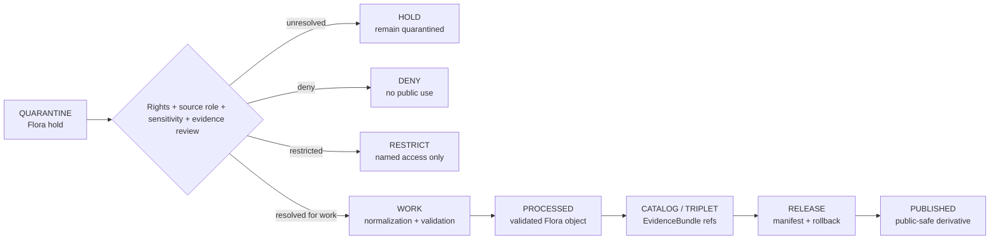

<!-- [KFM_META_BLOCK_V2]
doc_id: kfm://data/quarantine/flora/readme
name: Flora Quarantine README
path: data/quarantine/flora/README.md
type: data-quarantine-index-readme
version: v0.1.0
status: draft
owners:
  - <flora-domain-steward>
  - <data-steward>
  - <rights-reviewer>
  - <sensitivity-reviewer>
  - <release-steward>
created: 2026-06-27
updated: 2026-06-27
policy_label: restricted-review
truth_posture: cite-or-abstain
lifecycle_phase: quarantine
responsibility_root: data/
domain: flora
artifact_family: held-flora-material
sensitivity_posture: fail-closed; no-public-path; rare-plant-deny-default; rights-review-required; source-role-preservation-required; release-blocked
related:
  - rights_unresolved/README.md
  - source_role_mismatch/README.md
  - ../README.md
  - ../../README.md
  - ../../processed/flora/README.md
  - ../../proofs/proof_pack/flora/README.md
  - ../../proofs/validation_report/flora/README.md
  - ../../../docs/domains/flora/DATA_LIFECYCLE.md
  - ../../../docs/domains/flora/README.md
  - ../../../docs/domains/flora/SENSITIVITY.md
  - ../../../docs/domains/flora/EVIDENCE_DRAWER.md
  - ../../../docs/runbooks/flora/PROMOTION_RUNBOOK.md
  - ../../../release/manifests/README.md
tags:
  - kfm
  - data
  - quarantine
  - flora
  - rare-plants
  - rights-unresolved
  - source-role-mismatch
  - sensitivity
  - geoprivacy
  - evidence-first
  - deny-by-default
notes:
  - "This README replaces the greenfield stub and documents the parent Flora quarantine lane."
  - "Flora quarantine is a hold area, not a staging shortcut to processed, catalog, triplet, published, reports, layers, PMTiles, stories, graph/vector indexes, AI answers, or public UI."
  - "Confirmed child README lanes in this session: rights_unresolved and source_role_mismatch."
  - "Other Flora quarantine classes such as sensitive exact geometry, join-induced sensitivity, taxonomy drift, temporal defects, evidence-open, and schema failures remain proposed unless matching README paths are verified."
  - "Actual held payload presence, policy automation, validator wiring, CI enforcement, and review completion remain UNKNOWN unless verified."
[/KFM_META_BLOCK_V2] -->

<a id="top"></a>

# Flora Quarantine

Parent hold lane for Flora material that is not safe or sufficiently governed for normal processing, cataloging, publication, reporting, map rendering, story playback, indexing, or AI-answer use.

<p>
  
  
  
  
  
  
</p>

**Quick links:** [Scope](#scope) · [Repo fit](#repo-fit) · [Confirmed child lanes](#confirmed-child-lanes) · [Proposed quarantine classes](#proposed-quarantine-classes) · [Inputs](#inputs) · [Exclusions](#exclusions) · [Directory map](#directory-map) · [Exit gates](#exit-gates) · [Forbidden shortcuts](#forbidden-shortcuts) · [Required checks](#required-checks-before-use) · [Status notes](#status-notes)

> [!CAUTION]
> `data/quarantine/flora/` is a no-public-path hold lane. Material here is not public, not processed truth, not catalog truth, not proof, not release authority, not policy authority, not taxon truth, not occurrence truth, not rare-plant truth, not legal-status truth, not model truth, and not an AI-answer source. Nothing in this subtree may be consumed by public clients or normal UI surfaces until a governed exit transition leaves inspectable evidence.

---

## Scope

This directory holds Flora material when rights, sensitivity, source role, schema, taxonomy, temporal state, evidence support, geoprivacy, redaction, review record, policy decision, receipt closure, correction path, or rollback path is unresolved.

Flora doctrine treats quarantine as a structured holding pen. It is not a stage to skip past. Flora records involving rare-plant exact geometry, culturally sensitive taxa, rights-unclear feeds, source-role collapse, join-induced sensitivity, taxonomy drift, temporal defects, missing EvidenceBundle support, or schema failures stay held until a governed path resolves them, denies them, restricts them, returns them to work, or promotes only public-safe derivatives.

This parent lane does not make held content authoritative. It organizes quarantine material so stewards can review, deny, restrict, return to work, or promote only through governed lifecycle transitions.

---

## Repo fit

| Field | Value |
|---|---|
| Path | `data/quarantine/flora/` |
| Responsibility root | `data/` |
| Lifecycle phase | `quarantine/` |
| Domain lane | `flora` |
| Artifact role | Parent hold lane for Flora quarantine material and quarantine-local review sidecars |
| Public access posture | No public path; no normal UI; no governed-public API exposure |
| Exit posture | Only by explicit policy decision, rights/source-role/sensitivity/evidence closure, required receipt closure, and corrected lifecycle placement |
| Release authority | `release/`, not this directory |
| Proof authority | `data/proofs/` and `data/receipts/`, not this directory |
| Catalog authority | `data/catalog/`, not this directory |
| Registry authority | `data/registry/`, not this directory |
| Policy authority | `policy/`, not this directory |
| Default failure posture | `HOLD`, `DENY`, `RESTRICT`, or `ABSTAIN` when rights, source role, evidence, sensitivity, taxonomy, schema, temporal state, review, correction, or rollback support is insufficient |

---

## Confirmed child lanes

The child lanes below are README paths confirmed by current-session GitHub fetches or edits. This table does **not** prove held payloads exist under those lanes.

| Child lane | Canonical reason | Held material | Boundary |
|---|---|---|---|
| [`rights_unresolved/`](rights_unresolved/README.md) | `RIGHTS_UNKNOWN` | Source license, terms, consent, stewardship, or reuse authority unresolved | No public path until rights review, evidence closure, receipt closure, release state, correction path, and rollback target are resolved. |
| [`source_role_mismatch/`](source_role_mismatch/README.md) | `ROLE_COLLAPSE` / `ROLE_DOWNCAST_FORBIDDEN` | Source-role collapse, forbidden upcast/downcast, model-as-observation, aggregator-as-authority, or context-as-evidence cases | No public path until permitted source role and evidence role are restored or the claim is denied. |

---

## Proposed quarantine classes

The Flora lifecycle doctrine also names the quarantine classes below. They are listed here as routing guidance, not as proof that child README paths or payloads exist.

| Class | Canonical reason | Status | Typical handling |
|---|---|---|---|
| Sensitive exact geometry | `SENSITIVITY_UNRESOLVED` | **PROPOSED / NEEDS VERIFICATION** | Apply redaction/generalization with receipt; release only public-safe derivative. |
| Join-induced sensitivity | `SENSITIVITY_UNRESOLVED` | **PROPOSED / NEEDS VERIFICATION** | Treat join product as deny-by-default until reviewed. |
| Taxonomy drift | `CONTRACT_DRIFT` | **PROPOSED / NEEDS VERIFICATION** | Hold pending tie-breaker policy and crosswalk closure. |
| Temporal defect | `SCHEMA_MISMATCH` | **PROPOSED / NEEDS VERIFICATION** | Re-derive source, observed, valid, retrieval, and release times distinctly. |
| Evidence open | `MISSING_EVIDENCE` | **PROPOSED / NEEDS VERIFICATION** | Build EvidenceBundle or deny the claim. |
| Schema failure | `SCHEMA_MISMATCH` | **PROPOSED / NEEDS VERIFICATION** | Fix or drop the candidate. |

> [!NOTE]
> Add child lanes only after confirming the risk class, responsibility-root fit, canonical reason code, reviewer roles, receipt requirements, correction path, rollback target, and Directory Rules placement basis.

---

## Inputs

Accepted content is limited to held review material and quarantine-local sidecars such as:

- source pointers, candidate records, occurrence packets, specimen packets, taxon/status packets, vegetation-community packets, source-role packets, rights packets, sensitivity packets, schema-failure packets, or generated candidates that require quarantine;
- quarantine reason notes and `HOLD` / `DENY` / `RESTRICT` summaries;
- source-role, rights, sensitivity, taxonomy, temporal, schema, geoprivacy, redaction, reviewer, and steward notes;
- candidate receipt drafts, such as rights-review, source-role review, transform, validation, redaction, citation-validation, authority-review, or policy-decision drafts;
- hash/digest sidecars used to preserve chain-of-custody for held material;
- quarantine-local README files and local indexes that explain hold state without becoming proof, catalog, registry, policy, or release authority.

---

## Exclusions

| Do not place here | Correct authority home |
|---|---|
| Clean RAW source mirrors that have not triggered quarantine | `data/raw/flora/` or source-specific intake |
| Ordinary WORK material that is safe to process under normal review | `data/work/flora/` |
| Validated processed Flora objects | `data/processed/flora/` only after quarantine resolution |
| Catalog records, triplets, graph truth, or EvidenceBundle state | `data/catalog/`, triplet lanes, or proof lanes |
| EvidenceBundle / ProofPack | `data/proofs/` |
| Final validation, transform, redaction, geoprivacy, source-role-review, rights-review, AI, or release receipts | `data/receipts/` |
| Release manifests, promotion decisions, correction records, rollback records, or signatures | `release/` |
| Source descriptors, activation records, source registries, or registry truth | `data/registry/` |
| Public layers, PMTiles, reports, stories, API payloads, downloads, or published artifacts | `data/published/` only after release gates close |
| Semantic contracts, schemas, validators, or policy rules | `contracts/`, `schemas/`, `tools/`, `policy/` |
| Normal public UI, search, vector-index, graph, or AI-answer material | Governed public lanes only after release; otherwise abstain or deny |

---

## Directory map

```text
data/quarantine/flora/
├── README.md
├── rights_unresolved/
│   └── README.md
├── source_role_mismatch/
│   └── README.md
├── <future-risk-sublane>/
│   └── README.md
└── index.local.json
```

`index.local.json` is optional and must remain quarantine-local. It is not a public index, catalog record, release manifest, registry, graph edge source, layer/story/report pointer, search index, vector index, map source, or AI retrieval index.

---

## Exit gates

Flora material may leave quarantine only when the exit path is explicit:

| Exit route | Minimum requirement |
|---|---|
| Stay held | Any unresolved rights, source-role, sensitivity, taxonomy, schema, temporal, evidence, geoprivacy, or policy question remains. |
| Deny | PolicyDecision says `DENY`; public/UI/AI surfaces abstain or deny. |
| Restrict | PolicyDecision and ReviewRecord identify allowed audience, purpose, terms, and correction path. |
| Return to work | Hold reason is resolved, but normal validation, transformation, taxonomy, geoprivacy, source-role, or evidence-bundle work still remains. |
| Promote to processed/catalog/published | Only after required receipts, source descriptors, validation closure, evidence closure, release manifest, correction path, rollback path, and approved public-safe transform exist. |

---

## Forbidden shortcuts

```text
data/quarantine/flora/
→ data/processed/flora/
→ data/catalog/
→ data/published/
→ public API / MapLibre / PMTiles / report / story / graph / vector index / AI answer
```

is forbidden unless the appropriate governed transition has actually happened and left inspectable evidence.



---

## Required checks before use

- [ ] Confirm the material is Flora-domain material and belongs under `data/quarantine/flora/`.
- [ ] Confirm the correct child sublane: `rights_unresolved/`, `source_role_mismatch/`, or a new documented sublane.
- [ ] Confirm the hold reason is recorded using a governed reason code.
- [ ] Confirm source descriptors, source roles, authority roles, rights posture, license, consent, cadence, and current terms.
- [ ] Confirm taxon identity, source-role support, observation time, geometry uncertainty, and citation state.
- [ ] Confirm sensitivity class, rare-plant posture, geoprivacy posture, redaction/generalization requirement, and review state.
- [ ] Confirm role and rights inheritance across derivatives, joins, indexes, reports, stories, maps, graph edges, and AI carriers.
- [ ] Confirm required receipts are present or explicitly marked missing.
- [ ] Confirm PolicyDecision, ValidationReport, ReviewRecord where required, correction path, and rollback target before any exit.
- [ ] Confirm no public layer, PMTiles, report, story, API payload, graph edge, search index, vector index, or AI answer uses quarantined material.

---

## Status notes

| Claim | Status |
|---|---|
| This README replaces the greenfield stub at `data/quarantine/flora/README.md`. | **CONFIRMED authored** |
| The target path existed in the live repository as a greenfield stub before this edit. | **CONFIRMED by GitHub contents API during this edit** |
| `rights_unresolved/README.md` exists as a Flora quarantine child-lane README. | **CONFIRMED by GitHub contents API during this edit** |
| `source_role_mismatch/README.md` exists as a Flora quarantine child-lane README. | **CONFIRMED by GitHub contents API during this edit** |
| Flora lifecycle doctrine says QUARANTINE is a structured holding pen and not a stage to skip past. | **CONFIRMED by GitHub contents API during this edit** |
| Flora lifecycle doctrine maps quarantine mnemonics to canonical gate-failure reason codes. | **CONFIRMED by GitHub contents API during this edit** |
| Actual quarantined payloads exist under every listed child lane. | **UNKNOWN** |
| Policy automation, validators, and CI checks enforce every listed Flora quarantine lane. | **NEEDS VERIFICATION** |
| This README is proof, release, catalog, registry, policy, rights authority, source-role authority, taxon truth, occurrence truth, rare-plant truth, public artifact authority, or AI authority. | **DENY** |

---

## Related files

- [`rights_unresolved/README.md`](rights_unresolved/README.md)
- [`source_role_mismatch/README.md`](source_role_mismatch/README.md)
- [`../README.md`](../README.md)
- [`../../README.md`](../../README.md)
- [`../../processed/flora/README.md`](../../processed/flora/README.md)
- [`../../proofs/proof_pack/flora/README.md`](../../proofs/proof_pack/flora/README.md)
- [`../../proofs/validation_report/flora/README.md`](../../proofs/validation_report/flora/README.md)
- [`../../../docs/domains/flora/DATA_LIFECYCLE.md`](../../../docs/domains/flora/DATA_LIFECYCLE.md)
- [`../../../docs/domains/flora/README.md`](../../../docs/domains/flora/README.md)
- [`../../../docs/domains/flora/SENSITIVITY.md`](../../../docs/domains/flora/SENSITIVITY.md)
- [`../../../docs/domains/flora/EVIDENCE_DRAWER.md`](../../../docs/domains/flora/EVIDENCE_DRAWER.md)
- [`../../../docs/runbooks/flora/PROMOTION_RUNBOOK.md`](../../../docs/runbooks/flora/PROMOTION_RUNBOOK.md)
- [`../../../release/manifests/README.md`](../../../release/manifests/README.md)

---

KFM rule: this directory is a Flora quarantine hold index only. It is not source authority, proof authority, receipt authority, release authority, catalog authority, registry authority, policy authority, rights authority, source-role authority, taxon truth, occurrence truth, rare-plant truth, public artifact authority, UI authority, graph authority, vector-index authority, or AI truth.

[Back to top](#top)
