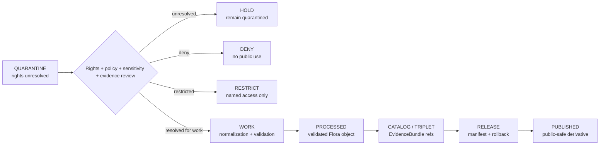

<!-- [KFM_META_BLOCK_V2]
doc_id: kfm://data/quarantine/flora/rights-unresolved/readme
name: Flora Rights Unresolved Quarantine README
path: data/quarantine/flora/rights_unresolved/README.md
type: data-quarantine-lane-readme
version: v0.1.0
status: draft
owners:
  - <flora-domain-steward>
  - <data-steward>
  - <rights-reviewer>
  - <sensitivity-reviewer>
  - <release-steward>
created: 2026-06-27
updated: 2026-06-27
policy_label: restricted-review
truth_posture: cite-or-abstain
lifecycle_phase: quarantine
responsibility_root: data/
domain: flora
artifact_family: held-flora-rights-unresolved-material
sensitivity_posture: rights-unresolved; fail-closed; no-public-path; review-required; release-blocked
related:
  - ../README.md
  - ../../README.md
  - ../../../README.md
  - ../../../processed/flora/README.md
  - ../../../proofs/proof_pack/flora/README.md
  - ../../../proofs/validation_report/flora/README.md
  - ../../../../docs/domains/flora/DATA_LIFECYCLE.md
  - ../../../../docs/domains/flora/README.md
  - ../../../../docs/domains/flora/SENSITIVITY.md
  - ../../../../docs/domains/flora/EVIDENCE_DRAWER.md
  - ../../../../docs/runbooks/flora/PROMOTION_RUNBOOK.md
  - ../../../../release/manifests/README.md
tags:
  - kfm
  - data
  - quarantine
  - flora
  - rights-unresolved
  - rights-review
  - license
  - source-terms
  - rare-plants
  - geoprivacy
  - fail-closed
  - evidence-first
notes:
  - "This README documents the quarantine lane for Flora material with unresolved rights, license, consent, source terms, or reuse authority."
  - "This lane corresponds to the Flora lifecycle mnemonic Q-RIGHTS-UNCLEAR and canonical reason code RIGHTS_UNKNOWN."
  - "Quarantine is a hold state, not a staging shortcut to processed, catalog, triplet, published, reports, layers, PMTiles, stories, AI answers, or public UI."
  - "Rights-unresolved Flora material remains held until source terms, rights posture, sensitivity, evidence, review, receipts, correction path, and rollback target are resolved."
  - "Actual payload presence, policy automation, validator wiring, CI enforcement, and review completion remain UNKNOWN unless verified."
[/KFM_META_BLOCK_V2] -->

<a id="top"></a>

# Flora Rights-Unresolved Quarantine

Held Flora material where source license, access terms, reuse rights, consent, stewardship authority, or publication permission is unresolved.

<p>
  
  
  
  
  
  
</p>

**Quick links:** [Scope](#scope) · [Repo fit](#repo-fit) · [Held material](#held-material) · [Inputs](#inputs) · [Exclusions](#exclusions) · [Directory map](#directory-map) · [Exit gates](#exit-gates) · [Forbidden shortcuts](#forbidden-shortcuts) · [Required checks](#required-checks-before-use) · [Status notes](#status-notes)

> [!CAUTION]
> `data/quarantine/flora/rights_unresolved/` is a no-public-path hold lane. Material here is not public, not processed truth, not catalog truth, not proof, not release authority, not policy authority, not taxon truth, not occurrence truth, not rare-plant truth, and not an AI-answer source. Nothing in this lane may be consumed by public clients or normal UI surfaces until a governed exit transition leaves inspectable evidence.

---

## Scope

This directory may hold Flora material when the rights posture is unresolved at intake, transformation, catalog closure, publication review, correction, or rollback review.

Typical reasons for quarantine include:

- source license, source terms, or reuse permission cannot be resolved;
- source terms conflict with intended KFM use, public display, redistribution, AI summarization, map-layer generation, or report/story publication;
- stewarded rare-plant records, herbarium records, protected-species records, vegetation-community records, or occurrence packets require rights review before use;
- NatureServe-style, KDWP-stewarded, herbarium, community-science, research, or partner-supplied data carries unclear access terms;
- a derivative, join, map candidate, report candidate, story candidate, search index, vector index, or AI-drafted claim may inherit unresolved rights from upstream Flora material;
- rights uncertainty overlaps with rare-plant exact geometry, cultural sensitivity, source-role uncertainty, taxonomy drift, or missing EvidenceBundle closure.

This lane corresponds to the Flora lifecycle mnemonic `Q-RIGHTS-UNCLEAR` and canonical reason code `RIGHTS_UNKNOWN`. Its purpose is to preserve held material for review without allowing accidental promotion, publication, indexing, rendering, downloading, story playback, or AI-answer use.

---

## Repo fit

| Field | Value |
|---|---|
| Path | `data/quarantine/flora/rights_unresolved/` |
| Responsibility root | `data/` |
| Lifecycle phase | `quarantine/` |
| Domain lane | `flora` |
| Sublane | `rights_unresolved` |
| Artifact role | Held Flora rights-unresolved material and quarantine-local review sidecars |
| Canonical reason code | `RIGHTS_UNKNOWN` |
| Public access posture | No public path; no normal UI; no governed-public API exposure |
| Exit posture | Only by explicit rights review, policy decision, evidence closure, required receipt closure, and corrected lifecycle placement |
| Release authority | `release/`, not this directory |
| Proof authority | `data/proofs/` and `data/receipts/`, not this directory |
| Catalog authority | `data/catalog/`, not this directory |
| Registry authority | `data/registry/`, not this directory |
| Policy authority | `policy/`, not this directory |
| Default failure posture | `HOLD`, `DENY`, `RESTRICT`, or `ABSTAIN` when rights, source role, evidence, sensitivity, review, correction, or rollback support is insufficient |

---

## Held material

Material belongs here when rights are not safe or sufficiently governed for `work`, `processed`, `catalog`, `published`, report, story, layer, graph, search, vector-index, or AI-answer use.

| Held family | Why it is held |
|---|---|
| Rights-unclear source packets | License, terms, consent, stewardship, or reuse authority is unresolved. |
| Rights-unclear occurrence records | Public display, redistribution, or derivative use may not be allowed. |
| Rights-unclear herbarium/specimen records | Collection terms, image rights, locality handling, or citation obligations may need review. |
| Rights-unclear rare-plant records | Rights uncertainty may combine with exact-geometry and sensitivity controls. |
| Partner, research, or steward-supplied records | Access terms and allowed audience must be explicit before use. |
| Rights-unclear derivatives or joins | Downstream artifacts inherit unresolved upstream rights until reviewed. |
| Generated or indexed carriers | Search, vector, story, report, map, graph, or AI artifacts must not leak unresolved-rights material. |

---

## Inputs

Accepted content is limited to held review material and quarantine-local sidecars such as:

- source pointers, candidate packets, occurrence packets, specimen packets, vegetation-community packets, rights packets, or generated candidates that require quarantine;
- quarantine reason notes and `HOLD` / `DENY` / `RESTRICT` summaries;
- source-role, source-terms, license, rights, consent, stewardship, sensitivity, reviewer, and steward notes;
- candidate receipt drafts, such as rights-review, transform, validation, redaction, citation-validation, source-role review, or policy-decision drafts;
- hash/digest sidecars used to preserve chain-of-custody for held material;
- quarantine-local README files that explain hold state without becoming proof, catalog, registry, policy, or release authority.

---

## Exclusions

| Do not place here | Correct authority home |
|---|---|
| Clean RAW source mirrors that have not triggered quarantine | `data/raw/flora/` or source-specific intake |
| Ordinary WORK material that is safe to process under normal review | `data/work/flora/` |
| Validated processed Flora objects | `data/processed/flora/` only after quarantine resolution |
| Catalog records, triplets, graph truth, or EvidenceBundle state | `data/catalog/`, triplet lanes, or proof lanes |
| EvidenceBundle / ProofPack | `data/proofs/` |
| Final validation, transform, redaction, geoprivacy, rights-review, AI, or release receipts | `data/receipts/` |
| Release manifests, promotion decisions, correction records, rollback records, or signatures | `release/` |
| Source descriptors, activation records, source registries, or registry truth | `data/registry/` |
| Public layers, PMTiles, reports, stories, API payloads, downloads, or published artifacts | `data/published/` only after release gates close |
| Semantic contracts, schemas, validators, or policy rules | `contracts/`, `schemas/`, `tools/`, `policy/` |
| Normal public UI, search, vector-index, graph, or AI-answer material | Governed public lanes only after release; otherwise abstain or deny |

---

## Directory map

```text
data/quarantine/flora/rights_unresolved/
├── README.md
├── <hold_id>/
│   ├── rights_packet.json
│   ├── source_refs.json
│   ├── quarantine_reason.md
│   ├── source_terms_review.notes.md
│   ├── license_review.notes.md
│   ├── sensitivity_review.notes.md
│   ├── policy_decision.draft.json
│   ├── receipt_closure.checklist.md
│   ├── rights_packet.sha256
│   └── README.md
└── index.local.json
```

`index.local.json` is optional and must remain quarantine-local. It is not a public index, catalog record, release manifest, registry, graph edge source, layer/story/report pointer, search index, vector index, map source, or AI retrieval index.

---

## Exit gates

Rights-unresolved Flora material may leave this lane only when the exit path is explicit:

| Exit route | Minimum requirement |
|---|---|
| Stay held | Any unresolved source-license, source-terms, consent, stewardship, reuse, sensitivity, evidence, or policy question remains. |
| Deny | PolicyDecision says `DENY`; public/UI/AI surfaces abstain or deny. |
| Restrict | PolicyDecision and ReviewRecord identify allowed audience, purpose, terms, and correction path. |
| Return to work | Rights issue is resolved, but normal validation, transformation, taxonomy, geoprivacy, or source-role work still remains. |
| Promote to processed/catalog/published | Only after required receipts, source descriptors, rights closure, validation closure, evidence closure, release manifest, correction path, rollback path, and approved public-safe transform exist. |

---

## Forbidden shortcuts

```text
data/quarantine/flora/rights_unresolved/
→ data/processed/flora/
→ data/catalog/
→ data/published/
→ public API / MapLibre / PMTiles / report / story / graph / vector index / AI answer
```

is forbidden unless the appropriate governed transition has actually happened and left inspectable evidence.



---

## Required checks before use

- [ ] Confirm the material is Flora-domain material and belongs under `data/quarantine/flora/rights_unresolved/`.
- [ ] Confirm the hold reason is recorded as `RIGHTS_UNKNOWN` or a compatible governed reason code.
- [ ] Confirm source descriptors, source roles, authority, rights posture, license, consent, cadence, and current terms.
- [ ] Confirm intended use: internal review, processing, cataloging, map layer, report, story, download, AI summary, or public API.
- [ ] Confirm rights inheritance across derivatives, joins, indexes, reports, stories, maps, and AI carriers.
- [ ] Confirm rare-plant, exact-geometry, cultural sensitivity, taxonomy, and source-role overlays are checked.
- [ ] Confirm required receipts are present or explicitly marked missing.
- [ ] Confirm PolicyDecision, rights review, ValidationReport, ReviewRecord where required, correction path, and rollback target before any exit.
- [ ] Confirm no public layer, PMTiles, report, story, API payload, graph edge, search index, vector index, or AI answer uses rights-unresolved material.

---

## Status notes

| Claim | Status |
|---|---|
| This README defines the requested quarantine path boundary. | **CONFIRMED authored** |
| The target path exists in the live repository as an empty file before this edit. | **CONFIRMED by GitHub contents API during this edit** |
| Flora lifecycle doctrine lists rights-unclear feeds as a quarantine condition with canonical reason code `RIGHTS_UNKNOWN`. | **CONFIRMED by GitHub contents API during this edit** |
| Flora lifecycle doctrine says QUARANTINE is a structured holding pen and not a stage to skip past. | **CONFIRMED by GitHub contents API during this edit** |
| The parent `data/quarantine/flora/README.md` is currently only a greenfield stub. | **CONFIRMED by GitHub contents API during this edit** |
| Actual rights-unresolved payloads exist in this subtree. | **UNKNOWN** |
| Policy automation, validators, and CI checks enforce this exact quarantine lane. | **NEEDS VERIFICATION** |
| This README is proof, release, catalog, registry, policy, rights authority, taxon truth, occurrence truth, public artifact authority, or AI authority. | **DENY** |

---

## Related files

- [`../README.md`](../README.md)
- [`../../README.md`](../../README.md)
- [`../../../README.md`](../../../README.md)
- [`../../../processed/flora/README.md`](../../../processed/flora/README.md)
- [`../../../proofs/proof_pack/flora/README.md`](../../../proofs/proof_pack/flora/README.md)
- [`../../../proofs/validation_report/flora/README.md`](../../../proofs/validation_report/flora/README.md)
- [`../../../../docs/domains/flora/DATA_LIFECYCLE.md`](../../../../docs/domains/flora/DATA_LIFECYCLE.md)
- [`../../../../docs/domains/flora/README.md`](../../../../docs/domains/flora/README.md)
- [`../../../../docs/domains/flora/SENSITIVITY.md`](../../../../docs/domains/flora/SENSITIVITY.md)
- [`../../../../docs/domains/flora/EVIDENCE_DRAWER.md`](../../../../docs/domains/flora/EVIDENCE_DRAWER.md)
- [`../../../../docs/runbooks/flora/PROMOTION_RUNBOOK.md`](../../../../docs/runbooks/flora/PROMOTION_RUNBOOK.md)
- [`../../../../release/manifests/README.md`](../../../../release/manifests/README.md)

---

KFM rule: this directory is a Flora rights-unresolved quarantine hold lane only. It is not source authority, proof authority, receipt authority, release authority, catalog authority, registry authority, policy authority, rights authority, taxon truth, occurrence truth, public artifact authority, UI authority, graph authority, vector-index authority, or AI truth.

[Back to top](#top)
