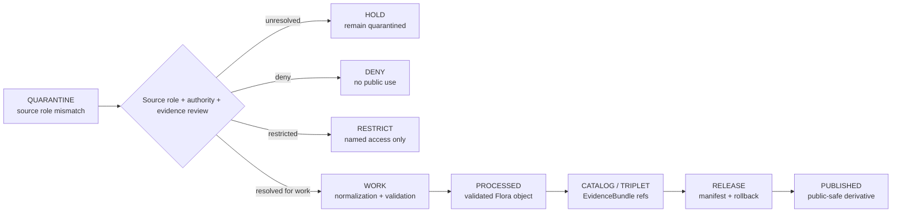

<!-- [KFM_META_BLOCK_V2]
doc_id: kfm://data/quarantine/flora/source-role-mismatch/readme
name: Flora Source Role Mismatch Quarantine README
path: data/quarantine/flora/source_role_mismatch/README.md
type: data-quarantine-lane-readme
version: v0.1.0
status: draft
owners:
  - <flora-domain-steward>
  - <data-steward>
  - <source-steward>
  - <sensitivity-reviewer>
  - <release-steward>
created: 2026-06-27
updated: 2026-06-27
policy_label: restricted-review
truth_posture: cite-or-abstain
lifecycle_phase: quarantine
responsibility_root: data/
domain: flora
artifact_family: held-flora-source-role-mismatch-material
sensitivity_posture: source-role-mismatch; fail-closed; no-public-path; review-required; release-blocked
related:
  - ../README.md
  - ../rights_unresolved/README.md
  - ../../README.md
  - ../../../README.md
  - ../../../processed/flora/README.md
  - ../../../proofs/proof_pack/flora/README.md
  - ../../../proofs/validation_report/flora/README.md
  - ../../../../docs/domains/flora/DATA_LIFECYCLE.md
  - ../../../../docs/domains/flora/README.md
  - ../../../../docs/domains/flora/SENSITIVITY.md
  - ../../../../docs/domains/flora/EVIDENCE_DRAWER.md
  - ../../../../docs/runbooks/flora/PROMOTION_RUNBOOK.md
  - ../../../../release/manifests/README.md
tags:
  - kfm
  - data
  - quarantine
  - flora
  - source-role-mismatch
  - role-collapse
  - role-downcast-forbidden
  - source-role
  - rare-plants
  - geoprivacy
  - fail-closed
  - evidence-first
notes:
  - "This README documents the quarantine lane for Flora material with source-role mismatch, source-role collapse, or forbidden role upcast/downcast risk."
  - "This lane corresponds to the Flora lifecycle mnemonic Q-SOURCE-ROLE-COLLAPSE and canonical reason codes ROLE_COLLAPSE / ROLE_DOWNCAST_FORBIDDEN."
  - "Quarantine is a hold state, not a staging shortcut to processed, catalog, triplet, published, reports, layers, PMTiles, stories, AI answers, or public UI."
  - "Source-role-mismatched Flora material remains held until permitted role, source authority, evidence support, sensitivity, review, receipts, correction path, and rollback target are resolved."
  - "Actual payload presence, policy automation, validator wiring, CI enforcement, and review completion remain UNKNOWN unless verified."
[/KFM_META_BLOCK_V2] -->

<a id="top"></a>

# Flora Source-Role Mismatch Quarantine

Held Flora material where the source role, authority role, evidence role, model role, observation role, or derived-product role is unresolved or misapplied.

<p>
  
  
  
  
  
  
</p>

**Quick links:** [Scope](#scope) · [Repo fit](#repo-fit) · [Held material](#held-material) · [Inputs](#inputs) · [Exclusions](#exclusions) · [Directory map](#directory-map) · [Exit gates](#exit-gates) · [Forbidden shortcuts](#forbidden-shortcuts) · [Required checks](#required-checks-before-use) · [Status notes](#status-notes)

> [!CAUTION]
> `data/quarantine/flora/source_role_mismatch/` is a no-public-path hold lane. Material here is not public, not processed truth, not catalog truth, not proof, not release authority, not policy authority, not taxon truth, not occurrence truth, not legal-status truth, not model truth, and not an AI-answer source. Nothing in this lane may be consumed by public clients or normal UI surfaces until a governed exit transition leaves inspectable evidence.

---

## Scope

This directory may hold Flora material when the source role or knowledge role is unresolved, contradicted, overclaimed, or collapsed across source families.

Typical reasons for quarantine include:

- a community-science observation is cited as legal-status authority;
- a model surface, vegetation index, or habitat/suitability output is cited as observed Flora evidence;
- a county checklist, range layer, or derived summary is treated as exact occurrence evidence;
- a source aggregator is treated as the original authority without preserving upstream citation and role;
- a partner, steward, herbarium, or research source has an unresolved authority role for the claim being made;
- a generated map, report, story, graph edge, search index, vector index, or AI-drafted claim upcasts a context source into evidence authority;
- role uncertainty overlaps with rights uncertainty, rare-plant exact geometry, cultural sensitivity, taxonomy drift, temporal defect, or missing EvidenceBundle closure.

This lane corresponds to the Flora lifecycle mnemonic `Q-SOURCE-ROLE-COLLAPSE` and canonical reason codes `ROLE_COLLAPSE` / `ROLE_DOWNCAST_FORBIDDEN`. Its purpose is to preserve held material for review without allowing accidental promotion, publication, indexing, rendering, downloading, story playback, or AI-answer use.

---

## Repo fit

| Field | Value |
|---|---|
| Path | `data/quarantine/flora/source_role_mismatch/` |
| Responsibility root | `data/` |
| Lifecycle phase | `quarantine/` |
| Domain lane | `flora` |
| Sublane | `source_role_mismatch` |
| Artifact role | Held Flora source-role-mismatch material and quarantine-local review sidecars |
| Canonical reason codes | `ROLE_COLLAPSE` / `ROLE_DOWNCAST_FORBIDDEN` |
| Public access posture | No public path; no normal UI; no governed-public API exposure |
| Exit posture | Only by explicit source-role review, policy decision, evidence closure, required receipt closure, and corrected lifecycle placement |
| Release authority | `release/`, not this directory |
| Proof authority | `data/proofs/` and `data/receipts/`, not this directory |
| Catalog authority | `data/catalog/`, not this directory |
| Registry authority | `data/registry/`, not this directory |
| Policy authority | `policy/`, not this directory |
| Default failure posture | `HOLD`, `DENY`, `RESTRICT`, or `ABSTAIN` when source role, authority role, evidence, rights, sensitivity, review, correction, or rollback support is insufficient |

---

## Held material

Material belongs here when source role is not safe or sufficiently governed for `work`, `processed`, `catalog`, `published`, report, story, layer, graph, search, vector-index, or AI-answer use.

| Held family | Why it is held |
|---|---|
| Community-science observations used as authority | Observation evidence cannot be upcast into legal/status authority without authoritative support. |
| Model or index outputs used as observations | Model surfaces and derived rasters must not be cited as observed Flora occurrences. |
| Aggregator records used as original authority | Aggregators require preserved upstream source role and citation chain. |
| Checklist or range summaries used as exact occurrence | Coarse summary products cannot become exact locality evidence without supporting occurrence evidence. |
| Herbarium or specimen records with role conflict | Collection, specimen, observer, identifier, and publisher roles may differ. |
| Partner or steward-supplied records with role uncertainty | Permitted claim role must be explicit before use. |
| Generated or indexed role-collapsed carriers | Search, vector, story, report, map, graph, or AI artifacts must not leak overclaimed source roles. |

---

## Inputs

Accepted content is limited to held review material and quarantine-local sidecars such as:

- source pointers, candidate packets, occurrence packets, specimen packets, taxon/status packets, vegetation-community packets, model packets, or generated candidates that require quarantine;
- quarantine reason notes and `HOLD` / `DENY` / `RESTRICT` summaries;
- source-role, authority-role, source-chain, upstream-citation, evidence-role, rights, sensitivity, reviewer, and steward notes;
- candidate receipt drafts, such as source-role review, transform, validation, redaction, citation-validation, authority-review, or policy-decision drafts;
- hash/digest sidecars used to preserve chain-of-custody for held material;
- quarantine-local README files that explain hold state without becoming proof, catalog, registry, policy, or release authority.

---

## Exclusions

| Do not place here | Correct authority home |
|---|---|
| Clean RAW source mirrors that have not triggered quarantine | `data/raw/flora/` or source-specific intake |
| Ordinary WORK material that is safe to process under normal review | `data/work/flora/` |
| Validated processed Flora objects | `data/processed/flora/` only after quarantine resolution |
| Catalog records, triplets, graph truth, or EvidenceBundle state | `data/catalog/`, triplet lanes, or proof lanes |
| EvidenceBundle / ProofPack | `data/proofs/` |
| Final validation, transform, redaction, geoprivacy, source-role-review, AI, or release receipts | `data/receipts/` |
| Release manifests, promotion decisions, correction records, rollback records, or signatures | `release/` |
| Source descriptors, activation records, source registries, or registry truth | `data/registry/` |
| Public layers, PMTiles, reports, stories, API payloads, downloads, or published artifacts | `data/published/` only after release gates close |
| Semantic contracts, schemas, validators, or policy rules | `contracts/`, `schemas/`, `tools/`, `policy/` |
| Normal public UI, search, vector-index, graph, or AI-answer material | Governed public lanes only after release; otherwise abstain or deny |

---

## Directory map

```text
data/quarantine/flora/source_role_mismatch/
├── README.md
├── <hold_id>/
│   ├── source_role_packet.json
│   ├── source_refs.json
│   ├── upstream_citation_chain.json
│   ├── quarantine_reason.md
│   ├── source_role_review.notes.md
│   ├── authority_review.notes.md
│   ├── evidence_review.notes.md
│   ├── policy_decision.draft.json
│   ├── receipt_closure.checklist.md
│   ├── source_role_packet.sha256
│   └── README.md
└── index.local.json
```

`index.local.json` is optional and must remain quarantine-local. It is not a public index, catalog record, release manifest, registry, graph edge source, layer/story/report pointer, search index, vector index, map source, or AI retrieval index.

---

## Exit gates

Source-role-mismatched Flora material may leave this lane only when the exit path is explicit:

| Exit route | Minimum requirement |
|---|---|
| Stay held | Any unresolved source-role, authority-role, upstream citation, rights, sensitivity, evidence, or policy question remains. |
| Deny | PolicyDecision says `DENY`; public/UI/AI surfaces abstain or deny. |
| Restrict | PolicyDecision and ReviewRecord identify allowed audience, purpose, terms, and correction path. |
| Return to work | Source role is resolved, but normal validation, transformation, taxonomy, geoprivacy, or evidence-bundle work still remains. |
| Promote to processed/catalog/published | Only after required receipts, source descriptors, source-role closure, validation closure, evidence closure, release manifest, correction path, rollback path, and approved public-safe transform exist. |

---

## Forbidden shortcuts

```text
data/quarantine/flora/source_role_mismatch/
→ data/processed/flora/
→ data/catalog/
→ data/published/
→ public API / MapLibre / PMTiles / report / story / graph / vector index / AI answer
```

is forbidden unless the appropriate governed transition has actually happened and left inspectable evidence.



---

## Required checks before use

- [ ] Confirm the material is Flora-domain material and belongs under `data/quarantine/flora/source_role_mismatch/`.
- [ ] Confirm the hold reason is recorded as `ROLE_COLLAPSE`, `ROLE_DOWNCAST_FORBIDDEN`, or a compatible governed reason code.
- [ ] Confirm source descriptors, source roles, authority roles, upstream citation chain, cadence, and current terms.
- [ ] Confirm claim type: observation, taxonomic status, legal/conservation status, model output, range summary, vegetation community, derivative, or context.
- [ ] Confirm the source is being used only for the claim role it is permitted to support.
- [ ] Confirm role inheritance across derivatives, joins, indexes, reports, stories, maps, graph edges, and AI carriers.
- [ ] Confirm rare-plant, exact-geometry, cultural sensitivity, taxonomy, rights, and temporal overlays are checked.
- [ ] Confirm required receipts are present or explicitly marked missing.
- [ ] Confirm PolicyDecision, source-role review, ValidationReport, ReviewRecord where required, correction path, and rollback target before any exit.
- [ ] Confirm no public layer, PMTiles, report, story, API payload, graph edge, search index, vector index, or AI answer uses source-role-mismatched material.

---

## Status notes

| Claim | Status |
|---|---|
| This README defines the requested quarantine path boundary. | **CONFIRMED authored** |
| The target path exists in the live repository as an empty file before this edit. | **CONFIRMED by GitHub contents API during this edit** |
| Flora lifecycle doctrine lists source-role collapse as a quarantine condition with canonical reason codes `ROLE_COLLAPSE` / `ROLE_DOWNCAST_FORBIDDEN`. | **CONFIRMED by GitHub contents API during this edit** |
| Flora lifecycle doctrine says role-collapse path forward is to restore the permitted source role or refuse the upcast. | **CONFIRMED by GitHub contents API during this edit** |
| The sibling `rights_unresolved/README.md` exists and documents the shared Flora quarantine posture. | **CONFIRMED by GitHub contents API during this edit** |
| Actual source-role-mismatch payloads exist in this subtree. | **UNKNOWN** |
| Policy automation, validators, and CI checks enforce this exact quarantine lane. | **NEEDS VERIFICATION** |
| This README is proof, release, catalog, registry, policy, source-role authority, taxon truth, occurrence truth, legal-status truth, model truth, public artifact authority, or AI authority. | **DENY** |

---

## Related files

- [`../README.md`](../README.md)
- [`../rights_unresolved/README.md`](../rights_unresolved/README.md)
- [`../../README.md`](../../README.md)
- [`../../../README.md`](../../../README.md)
- [`../../../processed/flora/README.md`](../../../processed/flora/README.md)
- [`../../../proofs/proof_pack/flora/README.md`](../../../proofs/proof_pack/flora/README.md)
- [`../../../proofs/validation_report/flora/README.md`](../../../proofs/validation_report/flora/README.md)
- [`../../../../docs/domains/flora/DATA_LIFECYCLE.md`](../../../../docs/domains/flora/DATA_LIFECYCLE.md)
- [`../../../../docs/domains/flora/README.md`](../../../../docs/domains/flora/README.md)
- [`../../../../docs/domains/flora/SENSITIVITY.md`](../../../../docs/domains/flora/SENSITIVITY.md)
- [`../../../../docs/domains/flora/EVIDENCE_DRAWER.md`](../../../../docs/domains/flora/EVIDENCE_DRAWER.md)
- [`../../../../docs/runbooks/flora/PROMOTION_RUNBOOK.md`](../../../../docs/runbooks/flora/PROMOTION_RUNBOOK.md)
- [`../../../../release/manifests/README.md`](../../../../release/manifests/README.md)

---

KFM rule: this directory is a Flora source-role-mismatch quarantine hold lane only. It is not source authority, proof authority, receipt authority, release authority, catalog authority, registry authority, policy authority, source-role authority, taxon truth, occurrence truth, legal-status truth, model truth, public artifact authority, UI authority, graph authority, vector-index authority, or AI truth.

[Back to top](#top)
