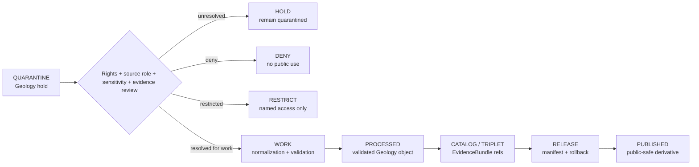

<!-- [KFM_META_BLOCK_V2]
doc_id: kfm://data/quarantine/geology/readme
name: Geology Quarantine README
path: data/quarantine/geology/README.md
type: data-quarantine-index-readme
version: v0.1.0
status: draft
owners:
  - <geology-domain-steward>
  - <data-steward>
  - <rights-reviewer>
  - <sensitivity-reviewer>
  - <release-steward>
created: 2026-06-27
updated: 2026-06-27
policy_label: restricted-review
truth_posture: cite-or-abstain
lifecycle_phase: quarantine
responsibility_root: data/
domain: geology
artifact_family: held-geology-material
sensitivity_posture: fail-closed; no-public-path; rights-review-required; source-role-preservation-required; resource-class-anti-collapse-required; release-blocked
related:
  - rights_unknown/README.md
  - ../README.md
  - ../../README.md
  - ../../processed/geology/README.md
  - ../../published/layers/geology/README.md
  - ../../proofs/validation_report/geology/README.md
  - ../../../docs/domains/geology/ARCHITECTURE.md
  - ../../../docs/domains/geology/README.md
  - ../../../docs/runbooks/geology/PROMOTION_RUNBOOK.md
  - ../../../release/manifests/README.md
tags:
  - kfm
  - data
  - quarantine
  - geology
  - natural-resources
  - rights-unknown
  - source-role
  - resource-class
  - borehole
  - well-log
  - mineral-occurrence
  - resource-estimate
  - fail-closed
  - evidence-first
notes:
  - "This README replaces the greenfield stub and documents the parent Geology quarantine lane."
  - "Geology quarantine is a hold area, not a staging shortcut to processed, catalog, triplet, published, reports, layers, PMTiles, stories, graph/vector indexes, AI answers, or public UI."
  - "Confirmed child README lane in this session: rights_unknown."
  - "Other Geology quarantine classes such as source-role collapse, resource-class collapse, sensitive exact geometry, evidence-open, schema/temporal defects, and proprietary/private-well material remain proposed unless matching README paths are verified."
  - "Actual held payload presence, policy automation, validator wiring, CI enforcement, and review completion remain UNKNOWN unless verified."
[/KFM_META_BLOCK_V2] -->

<a id="top"></a>

# Geology Quarantine

Parent hold lane for Geology and Natural Resources material that is not safe or sufficiently governed for normal processing, cataloging, publication, reporting, map rendering, 3D scene use, story playback, indexing, or AI-answer use.

<p>
  
  
  
  
  
  
</p>

**Quick links:** [Scope](#scope) · [Repo fit](#repo-fit) · [Confirmed child lanes](#confirmed-child-lanes) · [Proposed quarantine classes](#proposed-quarantine-classes) · [Inputs](#inputs) · [Exclusions](#exclusions) · [Directory map](#directory-map) · [Exit gates](#exit-gates) · [Forbidden shortcuts](#forbidden-shortcuts) · [Required checks](#required-checks-before-use) · [Status notes](#status-notes)

> [!CAUTION]
> `data/quarantine/geology/` is a no-public-path hold lane. Material here is not public, not processed truth, not catalog truth, not proof, not release authority, not policy authority, not geologic truth, not mineral/resource truth, not borehole truth, not well-log truth, not resource-estimate truth, and not an AI-answer source. Nothing in this subtree may be consumed by public clients or normal UI surfaces until a governed exit transition leaves inspectable evidence.

---

## Scope

This directory holds Geology and Natural Resources material when rights, sensitivity, source role, resource class, schema, geometry, time, evidence support, redaction, aggregation, representation, review record, policy decision, receipt closure, correction path, or rollback path is unresolved.

Geology doctrine treats the lane as interpretation-heavy. Occurrence, deposit, estimate, permit, production, reserve, regulatory, administrative, modeled, aggregate, candidate, and synthetic records must remain distinct at every stage. Exact borehole, sample, sensitive resource, well-log, private-well, proprietary-log, and active extraction-site detail can require restriction, generalization, named terms, or denial.

This parent lane does not make held content authoritative. It organizes quarantine material so stewards can review, deny, restrict, return to work, or promote only through governed lifecycle transitions.

---

## Repo fit

| Field | Value |
|---|---|
| Path | `data/quarantine/geology/` |
| Responsibility root | `data/` |
| Lifecycle phase | `quarantine/` |
| Domain lane | `geology` |
| Artifact role | Parent hold lane for Geology quarantine material and quarantine-local review sidecars |
| Public access posture | No public path; no normal UI; no governed-public API exposure |
| Exit posture | Only by explicit policy decision, rights/source-role/sensitivity/evidence closure, required receipt closure, and corrected lifecycle placement |
| Release authority | `release/`, not this directory |
| Proof authority | `data/proofs/` and `data/receipts/`, not this directory |
| Catalog authority | `data/catalog/`, not this directory |
| Registry authority | `data/registry/`, not this directory |
| Policy authority | `policy/`, not this directory |
| Default failure posture | `HOLD`, `DENY`, `RESTRICT`, or `ABSTAIN` when rights, source role, evidence, sensitivity, resource class, schema, geometry, time, review, correction, or rollback support is insufficient |

---

## Confirmed child lanes

The child lane below is a README path confirmed by current-session GitHub fetches or edits. This table does **not** prove held payloads exist under that lane.

| Child lane | Held material | Boundary |
|---|---|---|
| [`rights_unknown/`](rights_unknown/README.md) | Source license, current terms, reuse rights, proprietary status, access terms, attribution, or publication permission unknown or unresolved | No public path until rights review, evidence closure, receipt closure, release state, correction path, and rollback target are resolved. |

---

## Proposed quarantine classes

The Geology architecture names or implies the quarantine classes below. They are listed as routing guidance, not as proof that child README paths or payloads exist.

| Class | Status | Typical handling |
|---|---|---|
| Source-role collapse | **PROPOSED / NEEDS VERIFICATION** | Hold when modeled, regulatory, aggregate, administrative, candidate, or synthetic material is upcast into observation or per-place truth. |
| Resource-class collapse | **PROPOSED / NEEDS VERIFICATION** | Hold when mineral occurrence, resource deposit, resource estimate, extraction site, permit, production, or reserve claims are conflated. |
| Sensitive exact geometry | **PROPOSED / NEEDS VERIFICATION** | Hold exact borehole, sample, sensitive resource, well-log, private-well, or active extraction-site geometry pending redaction/generalization. |
| Evidence open | **PROPOSED / NEEDS VERIFICATION** | Build EvidenceBundle or deny the claim. |
| Schema / geometry / time defect | **PROPOSED / NEEDS VERIFICATION** | Correct shape, coordinate, unit, depth, time, or versioning defect before work/processed promotion. |
| Proprietary / named-agreement material | **PROPOSED / NEEDS VERIFICATION** | Restrict or deny unless named terms, policy decision, review, and receipt closure exist. |

> [!NOTE]
> Add child lanes only after confirming the risk class, responsibility-root fit, reviewer roles, receipt requirements, correction path, rollback target, and Directory Rules placement basis.

---

## Inputs

Accepted content is limited to held review material and quarantine-local sidecars such as:

- source pointers, candidate records, geology packets, well-log packets, borehole packets, sample packets, mineral/resource packets, extraction/reclamation packets, rights packets, role-collapse packets, sensitivity packets, geometry-failure packets, or generated candidates that require quarantine;
- quarantine reason notes and `HOLD` / `DENY` / `RESTRICT` summaries;
- source-role, rights, sensitivity, resource-class, geometry, depth, time, aggregation, representation, reviewer, and steward notes;
- candidate receipt drafts, such as rights-review, source-role review, transform, validation, redaction, aggregation, representation, citation-validation, authority-review, or policy-decision drafts;
- hash/digest sidecars used to preserve chain-of-custody for held material;
- quarantine-local README files and local indexes that explain hold state without becoming proof, catalog, registry, policy, or release authority.

---

## Exclusions

| Do not place here | Correct authority home |
|---|---|
| Clean RAW source mirrors that have not triggered quarantine | `data/raw/geology/` or source-specific intake |
| Ordinary WORK material that is safe to process under normal review | `data/work/geology/` |
| Validated processed Geology objects | `data/processed/geology/` only after quarantine resolution |
| Catalog records, triplets, graph truth, or EvidenceBundle state | `data/catalog/`, triplet lanes, or proof lanes |
| EvidenceBundle / ProofPack | `data/proofs/` |
| Final validation, transform, redaction, aggregation, representation, rights-review, AI, or release receipts | `data/receipts/` |
| Release manifests, promotion decisions, correction records, rollback records, or signatures | `release/` |
| Source descriptors, activation records, source registries, or registry truth | `data/registry/` |
| Public layers, PMTiles, reports, stories, API payloads, downloads, 3D scenes, or published artifacts | `data/published/` only after release gates close |
| Semantic contracts, schemas, validators, or policy rules | `contracts/`, `schemas/`, `tools/`, `policy/` |
| Normal public UI, search, vector-index, graph, or AI-answer material | Governed public lanes only after release; otherwise abstain or deny |

---

## Directory map

```text
data/quarantine/geology/
├── README.md
├── rights_unknown/
│   └── README.md
├── <future-risk-sublane>/
│   └── README.md
└── index.local.json
```

`index.local.json` is optional and must remain quarantine-local. It is not a public index, catalog record, release manifest, registry, graph edge source, layer/story/report pointer, search index, vector index, map source, 3D scene source, or AI retrieval index.

---

## Exit gates

Geology material may leave quarantine only when the exit path is explicit:

| Exit route | Minimum requirement |
|---|---|
| Stay held | Any unresolved rights, source-role, sensitivity, resource-class, schema, geometry, time, evidence, redaction, aggregation, representation, or policy question remains. |
| Deny | PolicyDecision says `DENY`; public/UI/AI surfaces abstain or deny. |
| Restrict | PolicyDecision and ReviewRecord identify allowed audience, purpose, terms, and correction path. |
| Return to work | Hold reason is resolved, but normal validation, transformation, source-role, redaction, aggregation, representation, or EvidenceBundle work still remains. |
| Promote to processed/catalog/published | Only after required receipts, source descriptors, validation closure, evidence closure, release manifest, correction path, rollback path, and approved public-safe transform exist. |

---

## Forbidden shortcuts

```text
data/quarantine/geology/
→ data/processed/geology/
→ data/catalog/
→ data/published/
→ public API / MapLibre / PMTiles / report / story / graph / vector index / AI answer
```

is forbidden unless the appropriate governed transition has actually happened and left inspectable evidence.



---

## Required checks before use

- [ ] Confirm the material is Geology-domain material and belongs under `data/quarantine/geology/`.
- [ ] Confirm the correct child sublane: `rights_unknown/` or a new documented sublane.
- [ ] Confirm the hold reason is recorded using a governed reason code.
- [ ] Confirm source descriptors, source roles, authority roles, rights posture, license, attribution, cadence, and current terms.
- [ ] Confirm object class: geologic unit, surficial unit, borehole, well log, core, sample, geochemistry, geophysics, mineral occurrence, resource deposit, resource estimate, extraction site, reclamation record, cross-section, or 3D representation.
- [ ] Confirm source-role and resource-class anti-collapse: occurrence, deposit, estimate, permit, production, reserve, regulatory, administrative, modeled, aggregate, candidate, and synthetic material remain distinct.
- [ ] Confirm exact geometry, private well, proprietary log, active extraction, resource sensitivity, operator/land, and source-term overlays are checked.
- [ ] Confirm required receipts are present or explicitly marked missing.
- [ ] Confirm PolicyDecision, ValidationReport, ReviewRecord where required, correction path, and rollback target before any exit.
- [ ] Confirm no public layer, PMTiles, report, story, 3D scene, API payload, graph edge, search index, vector index, or AI answer uses quarantined material.

---

## Status notes

| Claim | Status |
|---|---|
| This README replaces the greenfield stub at `data/quarantine/geology/README.md`. | **CONFIRMED authored** |
| The target path existed in the live repository as a greenfield stub before this edit. | **CONFIRMED by GitHub contents API during this edit** |
| `rights_unknown/README.md` exists as a Geology quarantine child-lane README. | **CONFIRMED by GitHub contents API during this edit** |
| Geology architecture says Geology follows the canonical lifecycle and promotion is a governed state transition, not a file move. | **CONFIRMED by GitHub contents API during this edit** |
| Geology architecture says unclear rights, unresolved source role, missing evidence, unresolved sensitivity, or absent release state blocks public promotion. | **CONFIRMED by GitHub contents API during this edit** |
| Geology architecture says exact borehole, sample, sensitive resource, well-log, and private-well locations default to restricted or generalized public geometry. | **CONFIRMED by GitHub contents API during this edit** |
| Actual quarantined payloads exist under every listed child lane. | **UNKNOWN** |
| Policy automation, validators, and CI checks enforce every listed Geology quarantine lane. | **NEEDS VERIFICATION** |
| This README is proof, release, catalog, registry, policy, rights authority, geologic truth, mineral/resource truth, borehole truth, well-log truth, resource-estimate truth, public artifact authority, or AI authority. | **DENY** |

---

## Related files

- [`rights_unknown/README.md`](rights_unknown/README.md)
- [`../README.md`](../README.md)
- [`../../README.md`](../../README.md)
- [`../../processed/geology/README.md`](../../processed/geology/README.md)
- [`../../published/layers/geology/README.md`](../../published/layers/geology/README.md)
- [`../../proofs/validation_report/geology/README.md`](../../proofs/validation_report/geology/README.md)
- [`../../../docs/domains/geology/ARCHITECTURE.md`](../../../docs/domains/geology/ARCHITECTURE.md)
- [`../../../docs/domains/geology/README.md`](../../../docs/domains/geology/README.md)
- [`../../../docs/runbooks/geology/PROMOTION_RUNBOOK.md`](../../../docs/runbooks/geology/PROMOTION_RUNBOOK.md)
- [`../../../release/manifests/README.md`](../../../release/manifests/README.md)

---

KFM rule: this directory is a Geology quarantine hold index only. It is not source authority, proof authority, receipt authority, release authority, catalog authority, registry authority, policy authority, rights authority, geologic truth, mineral/resource truth, borehole truth, well-log truth, resource-estimate truth, public artifact authority, UI authority, graph authority, vector-index authority, or AI truth.

[Back to top](#top)
