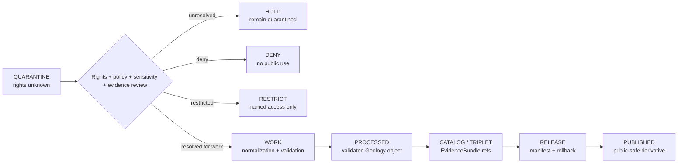

<!-- [KFM_META_BLOCK_V2]
doc_id: kfm://data/quarantine/geology/rights-unknown/readme
name: Geology Rights Unknown Quarantine README
path: data/quarantine/geology/rights_unknown/README.md
type: data-quarantine-lane-readme
version: v0.1.0
status: draft
owners:
  - <geology-domain-steward>
  - <data-steward>
  - <rights-reviewer>
  - <sensitivity-reviewer>
  - <release-steward>
created: 2026-06-27
updated: 2026-06-27
policy_label: restricted-review
truth_posture: cite-or-abstain
lifecycle_phase: quarantine
responsibility_root: data/
domain: geology
artifact_family: held-geology-rights-unknown-material
sensitivity_posture: rights-unknown; fail-closed; no-public-path; review-required; release-blocked
related:
  - ../README.md
  - ../../README.md
  - ../../../README.md
  - ../../../processed/geology/README.md
  - ../../../published/layers/geology/README.md
  - ../../../proofs/validation_report/geology/README.md
  - ../../../../docs/domains/geology/ARCHITECTURE.md
  - ../../../../docs/domains/geology/README.md
  - ../../../../docs/runbooks/geology/PROMOTION_RUNBOOK.md
  - ../../../../release/manifests/README.md
tags:
  - kfm
  - data
  - quarantine
  - geology
  - natural-resources
  - rights-unknown
  - rights-review
  - license
  - source-terms
  - well-log
  - borehole
  - mineral-occurrence
  - resource-estimate
  - fail-closed
  - evidence-first
notes:
  - "This README documents the quarantine lane for Geology material with unknown source rights, license terms, reuse authority, or publication permission."
  - "Geology architecture marks source rights and current terms as NEEDS VERIFICATION for multiple source families and says unclear rights block public promotion."
  - "Quarantine is a hold state, not a staging shortcut to processed, catalog, triplet, published, reports, layers, PMTiles, stories, AI answers, or public UI."
  - "Rights-unknown Geology material remains held until source terms, rights posture, sensitivity, evidence, review, receipts, correction path, and rollback target are resolved."
  - "Actual payload presence, policy automation, validator wiring, CI enforcement, and review completion remain UNKNOWN unless verified."
[/KFM_META_BLOCK_V2] -->

<a id="top"></a>

# Geology Rights-Unknown Quarantine

Held Geology and Natural Resources material where source license, current terms, reuse rights, proprietary status, access terms, or publication permission is unknown or unresolved.

<p>
  
  
  
  
  
  
</p>

**Quick links:** [Scope](#scope) · [Repo fit](#repo-fit) · [Held material](#held-material) · [Inputs](#inputs) · [Exclusions](#exclusions) · [Directory map](#directory-map) · [Exit gates](#exit-gates) · [Forbidden shortcuts](#forbidden-shortcuts) · [Required checks](#required-checks-before-use) · [Status notes](#status-notes)

> [!CAUTION]
> `data/quarantine/geology/rights_unknown/` is a no-public-path hold lane. Material here is not public, not processed truth, not catalog truth, not proof, not release authority, not policy authority, not geologic truth, not mineral/resource truth, not borehole truth, not well-log truth, and not an AI-answer source. Nothing in this lane may be consumed by public clients or normal UI surfaces until a governed exit transition leaves inspectable evidence.

---

## Scope

This directory may hold Geology and Natural Resources material when the source rights posture is unknown, incomplete, contradicted, stale, unreviewed, or incompatible with the proposed KFM use.

Typical reasons for quarantine include:

- source rights, current terms, license, attribution, redistribution, or derivative-use permission cannot be resolved;
- KGS, KCC, USGS, MRDS, WWC5, LAS, well-log, borehole, core, sample, geochemistry, geophysical, mineral, resource, extraction, reclamation, or partner-supplied material requires rights review before use;
- private-well, proprietary-log, operator-supplied, consultant, research, commercial, or restricted-access material has unknown reuse terms;
- a derivative, join, map candidate, cross-section, 3D scene, report candidate, story candidate, search index, vector index, or AI-drafted claim may inherit unresolved upstream rights;
- rights uncertainty overlaps with exact borehole/well/sample locations, sensitive resource information, source-role collapse, private operator/land joins, missing EvidenceBundle closure, or absent release state.

This lane preserves held material for review without allowing accidental promotion, publication, indexing, rendering, downloading, story playback, graph/vector use, or AI-answer use.

---

## Repo fit

| Field | Value |
|---|---|
| Path | `data/quarantine/geology/rights_unknown/` |
| Responsibility root | `data/` |
| Lifecycle phase | `quarantine/` |
| Domain lane | `geology` |
| Sublane | `rights_unknown` |
| Artifact role | Held Geology rights-unknown material and quarantine-local review sidecars |
| Public access posture | No public path; no normal UI; no governed-public API exposure |
| Exit posture | Only by explicit rights review, policy decision, evidence closure, required receipt closure, and corrected lifecycle placement |
| Release authority | `release/`, not this directory |
| Proof authority | `data/proofs/` and `data/receipts/`, not this directory |
| Catalog authority | `data/catalog/`, not this directory |
| Registry authority | `data/registry/`, not this directory |
| Policy authority | `policy/`, not this directory |
| Default failure posture | `HOLD`, `DENY`, `RESTRICT`, or `ABSTAIN` when rights, source role, evidence, sensitivity, review, correction, or rollback support is insufficient |

---

## Held material

Material belongs here when rights are not safe or sufficiently governed for `work`, `processed`, `catalog`, `published`, report, story, layer, graph, search, vector-index, or AI-answer use.

| Held family | Why it is held |
|---|---|
| Rights-unknown source packets | License, current terms, attribution, redistribution, or derivative-use authority is unresolved. |
| Well-log / LAS / borehole records | Geology architecture flags rights review and proprietary-content risk for well logs and private/subsurface data. |
| Private well or proprietary log content | May require named-agreement access and must not be public by default. |
| Mineral occurrence or resource datasets | Source terms and resource-class sensitivity must be resolved before public use. |
| Extraction or reclamation records | Regulatory/administrative reuse and source-role posture must be explicit. |
| Rights-unknown derivatives or joins | Downstream artifacts inherit unresolved upstream rights until reviewed. |
| Generated or indexed carriers | Search, vector, story, report, map, graph, 3D scene, or AI artifacts must not leak rights-unknown material. |

---

## Inputs

Accepted content is limited to held review material and quarantine-local sidecars such as:

- source pointers, candidate packets, well-log packets, borehole packets, sample packets, mineral/resource packets, extraction/reclamation packets, rights packets, or generated candidates that require quarantine;
- quarantine reason notes and `HOLD` / `DENY` / `RESTRICT` summaries;
- source-role, source-terms, license, rights, attribution, reuse, sensitivity, reviewer, and steward notes;
- candidate receipt drafts, such as rights-review, transform, validation, redaction, aggregation, representation, citation-validation, source-role review, or policy-decision drafts;
- hash/digest sidecars used to preserve chain-of-custody for held material;
- quarantine-local README files that explain hold state without becoming proof, catalog, registry, policy, or release authority.

---

## Exclusions

| Do not place here | Correct authority home |
|---|---|
| Clean RAW source mirrors that have not triggered quarantine | `data/raw/geology/` or source-specific intake |
| Ordinary WORK material that is safe to process under normal review | `data/work/geology/` |
| Validated processed Geology objects | `data/processed/geology/` only after quarantine resolution |
| Catalog records, triplets, graph truth, or EvidenceBundle state | `data/catalog/`, triplet lanes, or proof lanes |
| EvidenceBundle / ProofPack | `data/proofs/` |
| Final validation, transform, redaction, aggregation, representation, rights-review, AI, or release receipts | `data/receipts/` |
| Release manifests, promotion decisions, correction records, rollback records, or signatures | `release/` |
| Source descriptors, activation records, source registries, or registry truth | `data/registry/` |
| Public layers, PMTiles, reports, stories, API payloads, downloads, 3D scenes, or published artifacts | `data/published/` only after release gates close |
| Semantic contracts, schemas, validators, or policy rules | `contracts/`, `schemas/`, `tools/`, `policy/` |
| Normal public UI, search, vector-index, graph, or AI-answer material | Governed public lanes only after release; otherwise abstain or deny |

---

## Directory map

```text
data/quarantine/geology/rights_unknown/
├── README.md
├── <hold_id>/
│   ├── rights_packet.json
│   ├── source_refs.json
│   ├── quarantine_reason.md
│   ├── source_terms_review.notes.md
│   ├── license_review.notes.md
│   ├── sensitivity_review.notes.md
│   ├── policy_decision.draft.json
│   ├── receipt_closure.checklist.md
│   ├── rights_packet.sha256
│   └── README.md
└── index.local.json
```

`index.local.json` is optional and must remain quarantine-local. It is not a public index, catalog record, release manifest, registry, graph edge source, layer/story/report pointer, search index, vector index, map source, 3D scene source, or AI retrieval index.

---

## Exit gates

Rights-unknown Geology material may leave this lane only when the exit path is explicit:

| Exit route | Minimum requirement |
|---|---|
| Stay held | Any unresolved source-license, source-terms, attribution, reuse, proprietary, sensitivity, evidence, or policy question remains. |
| Deny | PolicyDecision says `DENY`; public/UI/AI surfaces abstain or deny. |
| Restrict | PolicyDecision and ReviewRecord identify allowed audience, purpose, terms, and correction path. |
| Return to work | Rights issue is resolved, but normal validation, transformation, source-role, redaction, aggregation, representation, or evidence-bundle work still remains. |
| Promote to processed/catalog/published | Only after required receipts, source descriptors, rights closure, validation closure, evidence closure, release manifest, correction path, rollback path, and approved public-safe transform exist. |

---

## Forbidden shortcuts

```text
data/quarantine/geology/rights_unknown/
→ data/processed/geology/
→ data/catalog/
→ data/published/
→ public API / MapLibre / PMTiles / report / story / graph / vector index / AI answer
```

is forbidden unless the appropriate governed transition has actually happened and left inspectable evidence.



---

## Required checks before use

- [ ] Confirm the material is Geology-domain material and belongs under `data/quarantine/geology/rights_unknown/`.
- [ ] Confirm the hold reason is recorded as rights unknown / rights unresolved or a compatible governed reason code.
- [ ] Confirm source descriptors, source roles, authority, rights posture, license, attribution, cadence, and current terms.
- [ ] Confirm intended use: internal review, processing, cataloging, map layer, report, story, 3D scene, download, AI summary, or public API.
- [ ] Confirm rights inheritance across derivatives, joins, indexes, reports, stories, maps, 3D scenes, graph edges, and AI carriers.
- [ ] Confirm borehole, well-log, private-well, proprietary-log, mineral-resource, extraction-site, operator/land, source-role, and sensitivity overlays are checked.
- [ ] Confirm required receipts are present or explicitly marked missing.
- [ ] Confirm PolicyDecision, rights review, ValidationReport, ReviewRecord where required, correction path, and rollback target before any exit.
- [ ] Confirm no public layer, PMTiles, report, story, 3D scene, API payload, graph edge, search index, vector index, or AI answer uses rights-unknown material.

---

## Status notes

| Claim | Status |
|---|---|
| This README defines the requested quarantine path boundary. | **CONFIRMED authored** |
| The target path exists in the live repository as an empty file before this edit. | **CONFIRMED by GitHub contents API during this edit** |
| Geology architecture says source rights, KGS/KCC terms, and validator language need verification. | **CONFIRMED by GitHub contents API during this edit** |
| Geology architecture says unclear rights block public promotion. | **CONFIRMED by GitHub contents API during this edit** |
| Geology architecture says rights tests should verify denial paths for BoreholeReference and WellLogReference. | **CONFIRMED by GitHub contents API during this edit** |
| The parent `data/quarantine/geology/README.md` is currently only a greenfield stub. | **CONFIRMED by GitHub contents API during this edit** |
| Actual rights-unknown payloads exist in this subtree. | **UNKNOWN** |
| Policy automation, validators, and CI checks enforce this exact quarantine lane. | **NEEDS VERIFICATION** |
| This README is proof, release, catalog, registry, policy, rights authority, geologic truth, mineral/resource truth, borehole truth, well-log truth, public artifact authority, or AI authority. | **DENY** |

---

## Related files

- [`../README.md`](../README.md)
- [`../../README.md`](../../README.md)
- [`../../../README.md`](../../../README.md)
- [`../../../processed/geology/README.md`](../../../processed/geology/README.md)
- [`../../../published/layers/geology/README.md`](../../../published/layers/geology/README.md)
- [`../../../proofs/validation_report/geology/README.md`](../../../proofs/validation_report/geology/README.md)
- [`../../../../docs/domains/geology/ARCHITECTURE.md`](../../../../docs/domains/geology/ARCHITECTURE.md)
- [`../../../../docs/domains/geology/README.md`](../../../../docs/domains/geology/README.md)
- [`../../../../docs/runbooks/geology/PROMOTION_RUNBOOK.md`](../../../../docs/runbooks/geology/PROMOTION_RUNBOOK.md)
- [`../../../../release/manifests/README.md`](../../../../release/manifests/README.md)

---

KFM rule: this directory is a Geology rights-unknown quarantine hold lane only. It is not source authority, proof authority, receipt authority, release authority, catalog authority, registry authority, policy authority, rights authority, geologic truth, mineral/resource truth, borehole truth, well-log truth, public artifact authority, UI authority, graph authority, vector-index authority, or AI truth.

[Back to top](#top)
