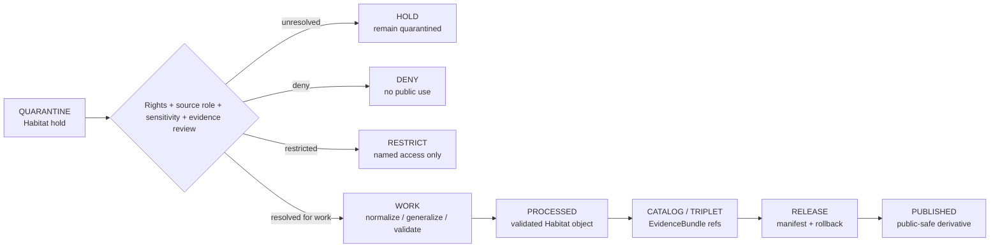

<!-- [KFM_META_BLOCK_V2]
doc_id: kfm://data/quarantine/habitat/readme
name: Habitat Quarantine README
path: data/quarantine/habitat/README.md
type: data-quarantine-index-readme
version: v0.1.0
status: draft
owners:
  - <habitat-lane-steward>
  - <data-steward>
  - <sensitivity-reviewer>
  - <wildlife-steward>
  - <release-steward>
created: 2026-06-27
updated: 2026-06-27
policy_label: restricted-review
truth_posture: cite-or-abstain
lifecycle_phase: quarantine
responsibility_root: data/
domain: habitat
artifact_family: held-habitat-material
sensitivity_posture: fail-closed; no-public-path; join-induced-sensitivity; geoprivacy-required; source-role-preservation-required; release-blocked
related:
  - ecoregions/README.md
  - land_cover/README.md
  - over_precise_geometry/README.md
  - ../README.md
  - ../../README.md
  - ../../processed/habitat/README.md
  - ../../published/layers/habitat/README.md
  - ../../../docs/domains/habitat/SENSITIVITY.md
  - ../../../docs/domains/habitat/DATA_LIFECYCLE.md
  - ../../../docs/domains/habitat/REASON_CODES.md
  - ../../../docs/domains/habitat/sublanes/ecoregions.md
  - ../../../docs/domains/habitat/sublanes/land_cover.md
  - ../../../release/manifests/README.md
tags:
  - kfm
  - data
  - quarantine
  - habitat
  - ecoregions
  - land-cover
  - over-precise-geometry
  - sensitive-joins
  - geoprivacy
  - redaction
  - source-role
  - evidence-first
notes:
  - "This README replaces the greenfield stub and documents the parent Habitat quarantine lane."
  - "Confirmed child README lanes in this session: ecoregions, land_cover, and over_precise_geometry."
  - "Habitat quarantine is a hold area, not a staging shortcut to processed, catalog, triplet, published, reports, layers, PMTiles, stories, graph/vector indexes, AI answers, or public UI."
  - "Habitat sensitivity is often join-induced; low-risk inputs can produce restricted or denied outputs when combined with Fauna, Flora, archaeology, stewardship, private-land, agriculture, or infrastructure context."
  - "Actual held payload presence, policy automation, validator wiring, CI enforcement, and review completion remain UNKNOWN unless verified."
[/KFM_META_BLOCK_V2] -->

<a id="top"></a>

# Habitat Quarantine

Parent hold lane for Habitat material that is not safe or sufficiently governed for normal processing, cataloging, publication, reporting, map rendering, story playback, indexing, or AI-answer use.

<p>
  
  
  
  
  
  
</p>

**Quick links:** [Scope](#scope) · [Repo fit](#repo-fit) · [Confirmed child lanes](#confirmed-child-lanes) · [Proposed quarantine classes](#proposed-quarantine-classes) · [Inputs](#inputs) · [Exclusions](#exclusions) · [Directory map](#directory-map) · [Exit gates](#exit-gates) · [Forbidden shortcuts](#forbidden-shortcuts) · [Required checks](#required-checks-before-use) · [Status notes](#status-notes)

> [!CAUTION]
> `data/quarantine/habitat/` is a no-public-path hold lane. Material here is not public, not processed truth, not catalog truth, not proof, not release authority, not policy authority, not habitat truth, not species occurrence truth, not rare-plant truth, not habitat-patch truth, not suitability truth, not stewardship-zone truth, and not an AI-answer source. Nothing in this subtree may be consumed by public clients or normal UI surfaces until a governed exit transition leaves inspectable evidence.

---

## Scope

This directory holds Habitat material when rights, source role, sensitivity, geoprivacy, geometry precision, class scheme, crosswalk, raster validity, source vintage, temporal state, evidence support, validation, review record, policy decision, receipt closure, correction path, or rollback path is unresolved.

Habitat sensitivity is often a property of the output, not merely the inputs. A land-cover layer, ecoregion context, patch, suitability surface, corridor, restoration candidate, or stewardship zone can become sensitive when it is joined to or reveals Fauna, Flora, archaeology, private land, agriculture, infrastructure, or other higher-sensitivity context.

This parent lane does not make held content authoritative. It routes quarantine material so stewards can review, deny, restrict, return to work, or promote only through governed lifecycle transitions.

---

## Repo fit

| Field | Value |
|---|---|
| Path | `data/quarantine/habitat/` |
| Responsibility root | `data/` |
| Lifecycle phase | `quarantine/` |
| Domain lane | `habitat` |
| Artifact role | Parent hold lane for Habitat quarantine material and quarantine-local review sidecars |
| Public access posture | No public path; no normal UI; no governed-public API exposure |
| Exit posture | Only by explicit policy decision, rights/source-role/sensitivity/evidence closure, required receipt closure, and corrected lifecycle placement |
| Release authority | `release/`, not this directory |
| Proof authority | `data/proofs/` and `data/receipts/`, not this directory |
| Catalog authority | `data/catalog/`, not this directory |
| Registry authority | `data/registry/`, not this directory |
| Policy authority | `policy/`, not this directory |
| Default failure posture | `HOLD`, `DENY`, `RESTRICT`, or `ABSTAIN` when rights, source role, evidence, sensitivity, geoprivacy, geometry, class scheme, crosswalk, raster, temporal state, review, correction, or rollback support is insufficient |

---

## Confirmed child lanes

The child lanes below are README paths confirmed by current-session GitHub fetches or edits. This table does **not** prove held payloads exist under those lanes.

| Child lane | Held material | Boundary |
|---|---|---|
| [`ecoregions/`](ecoregions/README.md) | Ecoregion and ecological-regionalization material with unresolved source role, rights, geometry, crosswalks, sensitive joins, evidence, validation, release state, correction path, or rollback target | Ecoregions are regionalization context, not species occurrence truth, habitat-patch truth, regulatory critical-habitat truth, or suitability truth by themselves. |
| [`land_cover/`](land_cover/README.md) | Land-cover material with unresolved source role, rights, class scheme, raster validity, crosswalks, temporal state, sensitive joins, evidence, validation, release state, correction path, or rollback target | Land-cover classes are source classifications and context evidence, not species occurrence truth, crop truth, soil truth, hydrology truth, regulatory truth, or habitat assertion by themselves. |
| [`over_precise_geometry/`](over_precise_geometry/README.md) | Habitat material whose geometry is too exact for its evidence, source role, sensitivity tier, geoprivacy posture, review state, release state, or intended public surface | Exact or inference-enabling geometry stays held until public-safe geometry, receipts, review, release, correction, and rollback support exist. |

---

## Proposed quarantine classes

The Habitat doctrine and child-lane READMEs imply additional hold classes below. They are routing guidance, not proof that child README paths or payloads exist.

| Class | Status | Typical handling |
|---|---|---|
| Sensitive occurrence join | **PROPOSED / NEEDS VERIFICATION** | Hold Habitat × Fauna / Flora / rare-species joins until geoprivacy/redaction receipt and review close. |
| Restricted-source-derived fields | **PROPOSED / NEEDS VERIFICATION** | Strip, restrict, or deny when source terms do not permit public redistribution. |
| Suitability model support leakage | **PROPOSED / NEEDS VERIFICATION** | Hold models that can reconstruct sensitive training support or unreviewed occurrence context. |
| Stewardship / sovereign zone | **PROPOSED / NEEDS VERIFICATION** | Hold until rights-holder or sovereignty review explicitly permits the intended audience and use. |
| Private parcel / ownership join | **PROPOSED / NEEDS VERIFICATION** | Hold or generalize private-land joins unless rights and sensitivity review approve the output. |
| Evidence open | **PROPOSED / NEEDS VERIFICATION** | Build EvidenceBundle or deny/abstain. |
| Schema / temporal / raster defect | **PROPOSED / NEEDS VERIFICATION** | Correct source time, valid time, release time, geometry, CRS, raster validity, nodata, class scheme, or crosswalk state before exit. |

> [!NOTE]
> Add child lanes only after confirming the risk class, responsibility-root fit, reviewer roles, receipt requirements, correction path, rollback target, and Directory Rules placement basis.

---

## Inputs

Accepted content is limited to held review material and quarantine-local sidecars such as:

- source pointers, habitat candidate packets, ecoregion packets, land-cover packets, geometry packets, join packets, source-role packets, rights packets, sensitivity packets, redaction packets, model-support packets, raster-validation packets, class-scheme packets, or generated candidates that require quarantine;
- quarantine reason notes and `HOLD` / `DENY` / `RESTRICT` summaries;
- source-role, rights, sensitivity, geoprivacy, redaction, aggregation, clipping, model-support, geometry, raster, temporal, reviewer, and steward notes;
- candidate receipt drafts, such as redaction, aggregation, representation, model-run, validation, citation-validation, source-role review, rights-review, or policy-decision drafts;
- hash/digest sidecars used to preserve chain-of-custody for held material;
- quarantine-local README files and local indexes that explain hold state without becoming proof, catalog, registry, policy, or release authority.

---

## Exclusions

| Do not place here | Correct authority home |
|---|---|
| Clean RAW source mirrors that have not triggered quarantine | `data/raw/habitat/` or source-specific intake |
| Ordinary WORK material that is safe to process under normal review | `data/work/habitat/` |
| Validated processed Habitat objects | `data/processed/habitat/` only after quarantine resolution |
| Catalog records, triplets, graph truth, or EvidenceBundle state | `data/catalog/`, triplet lanes, or proof lanes |
| EvidenceBundle / ProofPack | `data/proofs/` |
| Final validation, transform, redaction, aggregation, representation, model-run, geoprivacy, rights-review, AI, or release receipts | `data/receipts/` |
| Release manifests, promotion decisions, correction records, rollback records, or signatures | `release/` |
| Source descriptors, activation records, source registries, or registry truth | `data/registry/` |
| Public layers, PMTiles, COGs, reports, stories, API payloads, downloads, or published artifacts | `data/published/` only after release gates close |
| Fauna, Flora, archaeology, land, agriculture, infrastructure, soil, hydrology, or hazard truth | Owning domain lane, not Habitat quarantine |
| Policy bundles, generalization parameters, schemas, validators, or enforcement rules | `policy/`, `schemas/`, `tools/`, or contract roots as appropriate |
| Normal public UI, search, vector-index, graph, or AI-answer material | Governed public lanes only after release; otherwise abstain or deny |

---

## Directory map

```text
data/quarantine/habitat/
├── README.md
├── ecoregions/
│   └── README.md
├── land_cover/
│   └── README.md
├── over_precise_geometry/
│   └── README.md
├── <future-risk-sublane>/
│   └── README.md
└── index.local.json
```

`index.local.json` is optional and must remain quarantine-local. It is not a public index, catalog record, release manifest, registry, graph edge source, layer/story/report pointer, search index, vector index, map source, tile source, or AI retrieval index.

---

## Exit gates

Habitat material may leave quarantine only when the exit path is explicit:

| Exit route | Minimum requirement |
|---|---|
| Stay held | Any unresolved rights, source-role, sensitivity, geoprivacy, geometry precision, evidence, validation, review, or policy question remains. |
| Deny | PolicyDecision says `DENY`; public/UI/AI surfaces abstain or deny. |
| Restrict | PolicyDecision and ReviewRecord identify allowed audience, purpose, terms, and correction path. |
| Return to work | Hold reason is resolved, but normal validation, transformation, redaction, aggregation, clipping, attribution, source-role, or EvidenceBundle work still remains. |
| Promote to processed/catalog/published | Only after required receipts, source descriptors, validation closure, evidence closure, public-safe geometry where required, release manifest, correction path, rollback path, and approved public-safe transform exist. |

A more public tier requires transform receipt and review record. A more restrictive correction can happen immediately when risk is discovered.

---

## Forbidden shortcuts

```text
data/quarantine/habitat/
→ data/processed/habitat/
→ data/catalog/
→ data/published/
→ public API / MapLibre / PMTiles / COG / report / story / graph / vector index / AI answer
```

is forbidden unless the appropriate governed transition has actually happened and left inspectable evidence.



---

## Required checks before use

- [ ] Confirm the material is Habitat-domain material and belongs under `data/quarantine/habitat/`.
- [ ] Confirm the correct child sublane: `ecoregions/`, `land_cover/`, `over_precise_geometry/`, or a new documented sublane.
- [ ] Confirm the hold reason is recorded using a governed reason code.
- [ ] Confirm source descriptors, source roles, authority roles, rights posture, license, attribution, cadence, and current terms.
- [ ] Confirm object class: ecoregion, land-cover observation, patch, suitability surface, connectivity edge, corridor, restoration candidate, stewardship zone, ecological-system assignment, biotope, critical-habitat context, or generated carrier.
- [ ] Confirm whether the output joins to or reveals Fauna, Flora, archaeology, private land, agriculture, infrastructure, or other sensitive-domain context.
- [ ] Confirm public-safe geometry exists whenever geoprivacy status, joined sensitivity, or source terms require it.
- [ ] Confirm no style-only hiding is used as a sensitivity control.
- [ ] Confirm required receipts are present or explicitly marked missing.
- [ ] Confirm PolicyDecision, ValidationReport, ReviewRecord where required, correction path, and rollback target before any exit.
- [ ] Confirm no public layer, PMTiles, COG, report, story, API payload, graph edge, search index, vector index, or AI answer uses quarantined material.

---

## Status notes

| Claim | Status |
|---|---|
| This README replaces the greenfield stub at `data/quarantine/habitat/README.md`. | **CONFIRMED authored** |
| The target path existed in the live repository as a greenfield stub before this edit. | **CONFIRMED by GitHub contents API during this edit** |
| `ecoregions/README.md` exists as a Habitat quarantine child-lane README. | **CONFIRMED by GitHub contents API during this edit** |
| `land_cover/README.md` exists as a Habitat quarantine child-lane README. | **CONFIRMED by GitHub contents API during this edit** |
| `over_precise_geometry/README.md` exists as a Habitat quarantine child-lane README. | **CONFIRMED by GitHub contents API during this edit** |
| Habitat sensitivity doctrine says Habitat sensitivity is often join-induced and sensitive joins fail closed. | **CONFIRMED by GitHub contents API during this edit** |
| Habitat sensitivity doctrine requires public-safe geometry when geoprivacy/source/join state requires it and says style-only hiding is not a sensitivity control. | **CONFIRMED by GitHub contents API during this edit** |
| Actual quarantined payloads exist under every listed child lane. | **UNKNOWN** |
| Policy automation, validators, and CI checks enforce every listed Habitat quarantine lane. | **NEEDS VERIFICATION** |
| This README is proof, release, catalog, registry, policy, habitat truth, species occurrence truth, rare-plant truth, habitat-patch truth, suitability truth, stewardship-zone truth, public artifact authority, or AI authority. | **DENY** |

---

## Related files

- [`ecoregions/README.md`](ecoregions/README.md)
- [`land_cover/README.md`](land_cover/README.md)
- [`over_precise_geometry/README.md`](over_precise_geometry/README.md)
- [`../README.md`](../README.md)
- [`../../README.md`](../../README.md)
- [`../../processed/habitat/README.md`](../../processed/habitat/README.md)
- [`../../published/layers/habitat/README.md`](../../published/layers/habitat/README.md)
- [`../../../docs/domains/habitat/SENSITIVITY.md`](../../../docs/domains/habitat/SENSITIVITY.md)
- [`../../../docs/domains/habitat/DATA_LIFECYCLE.md`](../../../docs/domains/habitat/DATA_LIFECYCLE.md)
- [`../../../docs/domains/habitat/REASON_CODES.md`](../../../docs/domains/habitat/REASON_CODES.md)
- [`../../../docs/domains/habitat/sublanes/ecoregions.md`](../../../docs/domains/habitat/sublanes/ecoregions.md)
- [`../../../docs/domains/habitat/sublanes/land_cover.md`](../../../docs/domains/habitat/sublanes/land_cover.md)
- [`../../../release/manifests/README.md`](../../../release/manifests/README.md)

---

KFM rule: this directory is a Habitat quarantine hold index only. It is not source authority, proof authority, receipt authority, release authority, catalog authority, registry authority, policy authority, habitat truth, species occurrence truth, rare-plant truth, habitat-patch truth, suitability truth, stewardship-zone truth, public artifact authority, UI authority, graph authority, vector-index authority, or AI truth.

[Back to top](#top)
