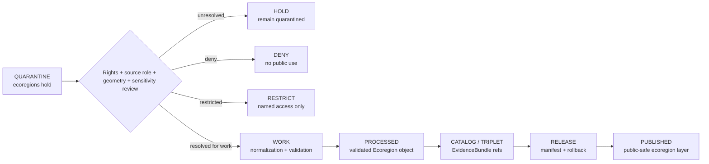

<!-- [KFM_META_BLOCK_V2]
doc_id: kfm://data/quarantine/habitat/ecoregions/readme
name: Habitat Ecoregions Quarantine README
path: data/quarantine/habitat/ecoregions/README.md
type: data-quarantine-lane-readme
version: v0.1.0
status: draft
owners:
  - <habitat-lane-steward>
  - <ecoregions-sublane-steward>
  - <data-steward>
  - <sensitivity-reviewer>
  - <release-steward>
created: 2026-06-27
updated: 2026-06-27
policy_label: restricted-review
truth_posture: cite-or-abstain
lifecycle_phase: quarantine
responsibility_root: data/
domain: habitat
sublane: ecoregions
artifact_family: held-habitat-ecoregion-material
sensitivity_posture: fail-closed; no-public-path; ecoregions-are-context-not-occurrence-truth; sensitive-joins-deny-by-default; release-blocked
related:
  - ../README.md
  - ../../README.md
  - ../../../README.md
  - ../../../processed/habitat/ecoregions/README.md
  - ../../../published/layers/habitat/ecoregions/README.md
  - ../../../catalog/domain/habitat/ecoregions/README.md
  - ../../../../docs/domains/habitat/sublanes/ecoregions.md
  - ../../../../docs/domains/habitat/README.md
  - ../../../../docs/domains/habitat/API_CONTRACTS.md
  - ../../../../release/manifests/README.md
tags:
  - kfm
  - data
  - quarantine
  - habitat
  - ecoregions
  - ecological-systems
  - regionalization
  - landscape-context
  - source-role
  - geoprivacy
  - sensitive-joins
  - evidence-first
notes:
  - "This README documents the quarantine lane for Habitat ecoregion material."
  - "Ecoregions are regionalization context, not species occurrence truth, habitat patch truth, regulatory critical-habitat truth, or suitability truth by themselves."
  - "Quarantine is a hold state, not a staging shortcut to processed, catalog, triplet, published, reports, layers, PMTiles, stories, graph/vector indexes, AI answers, or public UI."
  - "Ecoregion material remains held when rights, source role, crosswalks, geometry, attributes, sensitive joins, evidence, validation, release state, correction path, or rollback target are unresolved."
  - "Actual payload presence, policy automation, validator wiring, CI enforcement, and review completion remain UNKNOWN unless verified."
[/KFM_META_BLOCK_V2] -->

<a id="top"></a>

# Habitat Ecoregions Quarantine

Held Habitat ecoregion and ecological-regionalization material pending source-role, rights, geometry, crosswalk, sensitivity, evidence, validation, release, correction, and rollback review.

<p>
  
  
  
  
  
  
</p>

**Quick links:** [Scope](#scope) · [Repo fit](#repo-fit) · [Held material](#held-material) · [Inputs](#inputs) · [Exclusions](#exclusions) · [Directory map](#directory-map) · [Exit gates](#exit-gates) · [Forbidden shortcuts](#forbidden-shortcuts) · [Required checks](#required-checks-before-use) · [Status notes](#status-notes)

> [!CAUTION]
> `data/quarantine/habitat/ecoregions/` is a no-public-path hold lane. Material here is not public, not processed truth, not catalog truth, not proof, not release authority, not policy authority, not occurrence truth, not habitat-patch truth, not regulatory critical-habitat truth, not suitability truth, and not an AI-answer source. Nothing in this lane may be consumed by public clients or normal UI surfaces until a governed exit transition leaves inspectable evidence.

---

## Scope

This directory may hold Habitat ecoregion material when source role, rights, source version, geometry validity, CRS handling, crosswalk state, attribute allowlist, sensitive join status, evidence support, validation, policy decision, release state, correction path, or rollback path is unresolved.

Typical reasons for quarantine include:

- ecoregion framework, level, version, source URI, authority role, or source descriptor is missing or unresolved;
- source license, current terms, redistribution permission, attribution, or access posture is unknown;
- geometry validation, CRS provenance, reprojection, simplification, area drift, or make-valid behavior is unresolved;
- EPA, Bailey, NatureServe/USNVC, GAP/LANDFIRE, NLCD, NWI, or other context sources have unresolved crosswalks or role boundaries;
- an ecoregion polygon is treated as species occurrence truth, habitat patch condition, suitability truth, restoration priority, regulatory critical habitat, or management-action authority;
- an ecoregion context join touches rare-plant records, fauna occurrences, sensitive habitat, archaeology, critical infrastructure, private land, agriculture operations, or other higher-sensitivity lanes without geoprivacy/redaction review;
- public PMTiles, reports, stories, graph edges, vector indexes, search indexes, or AI-drafted claims could leak non-allowlisted attributes or unresolved joins.

This lane preserves held material for review without allowing accidental promotion, publication, rendering, indexing, downloading, story playback, graph/vector use, or AI-answer use.

---

## Repo fit

| Field | Value |
|---|---|
| Path | `data/quarantine/habitat/ecoregions/` |
| Responsibility root | `data/` |
| Lifecycle phase | `quarantine/` |
| Domain lane | `habitat` |
| Sublane | `ecoregions` |
| Artifact role | Held Habitat ecoregion material and quarantine-local review sidecars |
| Public access posture | No public path; no normal UI; no governed-public API exposure |
| Exit posture | Only by explicit policy decision, source-role/rights/sensitivity/evidence closure, required receipt closure, and corrected lifecycle placement |
| Release authority | `release/`, not this directory |
| Proof authority | `data/proofs/` and `data/receipts/`, not this directory |
| Catalog authority | `data/catalog/`, not this directory |
| Registry authority | `data/registry/`, not this directory |
| Policy authority | `policy/`, not this directory |
| Default failure posture | `HOLD`, `DENY`, `RESTRICT`, or `ABSTAIN` when source role, rights, evidence, sensitivity, geometry, crosswalk, validation, review, correction, or rollback support is insufficient |

---

## Held material

Material belongs here when ecoregion material is not safe or sufficiently governed for `work`, `processed`, `catalog`, `published`, report, story, layer, graph, search, vector-index, or AI-answer use.

| Held family | Why it is held |
|---|---|
| Rights/source-role unresolved ecoregion packets | Framework, version, attribution, source terms, or authority/context role is unresolved. |
| Geometry or CRS failure packets | Invalid geometry, CRS ambiguity, reprojection uncertainty, simplification drift, or tiling transform uncertainty remains open. |
| Crosswalk candidates | Framework-to-framework or ecoregion-to-ecological-system crosswalks are not validated. |
| Sensitive join products | Ecoregion joins to Fauna, Flora, archaeology, private land, agriculture, or infrastructure may raise sensitivity. |
| Attribute allowlist failures | Public tiles or exports may carry extra fields, internal QA notes, or source fields not cleared for public release. |
| Evidence-open candidates | EvidenceRef does not resolve to an EvidenceBundle or citation support is incomplete. |
| Generated or indexed carriers | Search, vector, story, report, map, graph, or AI artifacts must not leak unresolved ecoregion context or join claims. |

---

## Inputs

Accepted content is limited to held review material and quarantine-local sidecars such as:

- source pointers, ecoregion packets, geometry packets, crosswalk packets, join packets, source-role packets, rights packets, sensitivity packets, attribute-allowlist packets, or generated candidates that require quarantine;
- quarantine reason notes and `HOLD` / `DENY` / `RESTRICT` summaries;
- source-role, rights, source-version, geometry, CRS, crosswalk, sensitivity, geoprivacy, redaction, reviewer, and steward notes;
- candidate receipt drafts, such as rights-review, source-role review, transform, validation, redaction, aggregation, representation, citation-validation, or policy-decision drafts;
- hash/digest sidecars used to preserve chain-of-custody for held material;
- quarantine-local README files that explain hold state without becoming proof, catalog, registry, policy, or release authority.

---

## Exclusions

| Do not place here | Correct authority home |
|---|---|
| Clean RAW source mirrors that have not triggered quarantine | `data/raw/habitat/` or source-specific intake |
| Ordinary WORK material that is safe to process under normal review | `data/work/habitat/` |
| Validated processed Habitat ecoregion objects | `data/processed/habitat/ecoregions/` only after quarantine resolution |
| Catalog records, triplets, graph truth, or EvidenceBundle state | `data/catalog/`, triplet lanes, or proof lanes |
| EvidenceBundle / ProofPack | `data/proofs/` |
| Final validation, transform, redaction, aggregation, representation, rights-review, AI, or release receipts | `data/receipts/` |
| Release manifests, promotion decisions, correction records, rollback records, or signatures | `release/` |
| Source descriptors, activation records, source registries, or registry truth | `data/registry/` |
| Public ecoregion layers, PMTiles, reports, stories, API payloads, downloads, or published artifacts | `data/published/layers/habitat/ecoregions/` only after release gates close |
| Habitat patch, suitability, connectivity, restoration, or critical-habitat authority | The relevant Habitat sibling lane, not this ecoregion quarantine lane |
| Species occurrence, rare-plant, archaeology, hydrology, soil, hazard, agriculture, or people/land truth | Owning domain lane, not Habitat ecoregions |
| Semantic contracts, schemas, validators, or policy rules | `contracts/`, `schemas/`, `tools/`, `policy/` |
| Normal public UI, search, vector-index, graph, or AI-answer material | Governed public lanes only after release; otherwise abstain or deny |

---

## Directory map

```text
data/quarantine/habitat/ecoregions/
├── README.md
├── <hold_id>/
│   ├── ecoregion_packet.json
│   ├── source_refs.json
│   ├── quarantine_reason.md
│   ├── source_role_review.notes.md
│   ├── geometry_review.notes.md
│   ├── crosswalk_review.notes.md
│   ├── sensitivity_join_review.notes.md
│   ├── attribute_allowlist_review.notes.md
│   ├── policy_decision.draft.json
│   ├── receipt_closure.checklist.md
│   ├── ecoregion_packet.sha256
│   └── README.md
└── index.local.json
```

`index.local.json` is optional and must remain quarantine-local. It is not a public index, catalog record, release manifest, registry, graph edge source, layer/story/report pointer, search index, vector index, map source, or AI retrieval index.

---

## Exit gates

Habitat ecoregion material may leave this lane only when the exit path is explicit:

| Exit route | Minimum requirement |
|---|---|
| Stay held | Any unresolved source-role, rights, geometry, CRS, crosswalk, sensitivity, evidence, validation, or policy question remains. |
| Deny | PolicyDecision says `DENY`; public/UI/AI surfaces abstain or deny. |
| Restrict | PolicyDecision and ReviewRecord identify allowed audience, purpose, terms, and correction path. |
| Return to work | Hold reason is resolved, but normal validation, transformation, crosswalk, redaction, attribution, or EvidenceBundle work still remains. |
| Promote to processed/catalog/published | Only after required receipts, source descriptors, validation closure, evidence closure, release manifest, correction path, rollback path, and approved public-safe transform exist. |

---

## Forbidden shortcuts

```text
data/quarantine/habitat/ecoregions/
→ data/processed/habitat/ecoregions/
→ data/catalog/
→ data/published/layers/habitat/ecoregions/
→ public API / MapLibre / PMTiles / report / story / graph / vector index / AI answer
```

is forbidden unless the appropriate governed transition has actually happened and left inspectable evidence.



---

## Required checks before use

- [ ] Confirm the material is Habitat ecoregion material and belongs under `data/quarantine/habitat/ecoregions/`.
- [ ] Confirm the hold reason is recorded using a governed reason code.
- [ ] Confirm source descriptors, source roles, authority roles, rights posture, license, attribution, cadence, and current terms.
- [ ] Confirm framework, level, version, extent, source URI, valid time, retrieval time, release time, and correction time remain distinct.
- [ ] Confirm geometry validity, CRS provenance, reprojection, simplification, area drift, and tiling transform status.
- [ ] Confirm ecoregion context is not treated as species occurrence truth, habitat patch truth, regulatory critical-habitat truth, suitability truth, restoration priority, or management-action authority.
- [ ] Confirm sensitive joins to Fauna, Flora, archaeology, private land, agriculture, infrastructure, or other higher-sensitivity lanes fail closed unless reviewed.
- [ ] Confirm public field allowlist and attribute leakage checks are complete before any published-layer path.
- [ ] Confirm required receipts are present or explicitly marked missing.
- [ ] Confirm PolicyDecision, ValidationReport, ReviewRecord where required, correction path, and rollback target before any exit.
- [ ] Confirm no public layer, PMTiles, report, story, API payload, graph edge, search index, vector index, or AI answer uses quarantined material.

---

## Status notes

| Claim | Status |
|---|---|
| This README defines the requested quarantine path boundary. | **CONFIRMED authored** |
| The target path exists in the live repository as an empty file before this edit. | **CONFIRMED by GitHub contents API during this edit** |
| Habitat ecoregions doctrine says ecoregion polygons are regionalization context, not species occurrence or habitat patch truth. | **CONFIRMED by GitHub contents API during this edit** |
| Habitat ecoregions doctrine says sensitive joins fail closed until a documented geoprivacy transform and review state allow release. | **CONFIRMED by GitHub contents API during this edit** |
| Habitat ecoregions doctrine says unclear rights, unresolved source role, missing evidence, unresolved sensitivity, or absent release state blocks public promotion. | **CONFIRMED by GitHub contents API during this edit** |
| `data/published/layers/habitat/ecoregions/README.md` exists and documents released public-safe ecoregion layer artifacts only. | **CONFIRMED by GitHub contents API during this edit** |
| The parent `data/quarantine/habitat/README.md` is currently only a greenfield stub. | **CONFIRMED by GitHub contents API during this edit** |
| Actual Habitat ecoregion quarantine payloads exist in this subtree. | **UNKNOWN** |
| Policy automation, validators, and CI checks enforce this exact quarantine lane. | **NEEDS VERIFICATION** |
| This README is proof, release, catalog, registry, policy, occurrence truth, habitat patch truth, critical-habitat truth, suitability truth, public artifact authority, or AI authority. | **DENY** |

---

## Related files

- [`../README.md`](../README.md)
- [`../../README.md`](../../README.md)
- [`../../../README.md`](../../../README.md)
- [`../../../processed/habitat/ecoregions/README.md`](../../../processed/habitat/ecoregions/README.md)
- [`../../../published/layers/habitat/ecoregions/README.md`](../../../published/layers/habitat/ecoregions/README.md)
- [`../../../catalog/domain/habitat/ecoregions/README.md`](../../../catalog/domain/habitat/ecoregions/README.md)
- [`../../../../docs/domains/habitat/sublanes/ecoregions.md`](../../../../docs/domains/habitat/sublanes/ecoregions.md)
- [`../../../../docs/domains/habitat/README.md`](../../../../docs/domains/habitat/README.md)
- [`../../../../docs/domains/habitat/API_CONTRACTS.md`](../../../../docs/domains/habitat/API_CONTRACTS.md)
- [`../../../../release/manifests/README.md`](../../../../release/manifests/README.md)

---

KFM rule: this directory is a Habitat ecoregions quarantine hold lane only. It is not source authority, proof authority, receipt authority, release authority, catalog authority, registry authority, policy authority, occurrence truth, habitat patch truth, regulatory critical-habitat truth, suitability truth, public artifact authority, UI authority, graph authority, vector-index authority, or AI truth.

[Back to top](#top)
