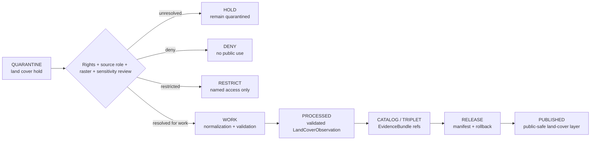

<!-- [KFM_META_BLOCK_V2]
doc_id: kfm://data/quarantine/habitat/land-cover/readme
name: Habitat Land Cover Quarantine README
path: data/quarantine/habitat/land_cover/README.md
type: data-quarantine-lane-readme
version: v0.1.0
status: draft
owners:
  - <habitat-lane-steward>
  - <land-cover-sublane-steward>
  - <data-steward>
  - <sensitivity-reviewer>
  - <release-steward>
created: 2026-06-27
updated: 2026-06-27
policy_label: restricted-review
truth_posture: cite-or-abstain
lifecycle_phase: quarantine
responsibility_root: data/
domain: habitat
sublane: land_cover
artifact_family: held-habitat-land-cover-material
sensitivity_posture: fail-closed; no-public-path; land-cover-is-context-not-habitat-truth; sensitive-joins-deny-by-default; release-blocked
related:
  - ../README.md
  - ../../README.md
  - ../../../README.md
  - ../../../processed/habitat/land_cover/README.md
  - ../../../published/layers/habitat/land_cover/README.md
  - ../../../catalog/domain/habitat/README.md
  - ../../../../docs/domains/habitat/sublanes/land_cover.md
  - ../../../../docs/domains/habitat/README.md
  - ../../../../docs/domains/habitat/API_CONTRACTS.md
  - ../../../../release/manifests/README.md
tags:
  - kfm
  - data
  - quarantine
  - habitat
  - land-cover
  - land-cover-observation
  - nlcd
  - landfire
  - gap
  - nwi
  - raster
  - source-role
  - sensitive-joins
  - evidence-first
notes:
  - "This README documents the quarantine lane for Habitat land-cover material."
  - "Land-cover classes are source classifications and context evidence, not species occurrence truth, habitat patch truth, suitability truth, crop truth, soil truth, hydrology truth, or regulatory truth by themselves."
  - "Quarantine is a hold state, not a staging shortcut to processed, catalog, triplet, published, reports, layers, PMTiles, stories, graph/vector indexes, AI answers, or public UI."
  - "Land-cover material remains held when source role, rights, class scheme, crosswalk, raster validity, temporal state, sensitive joins, evidence, validation, release state, correction path, or rollback target are unresolved."
  - "Actual payload presence, policy automation, validator wiring, CI enforcement, and review completion remain UNKNOWN unless verified."
[/KFM_META_BLOCK_V2] -->

<a id="top"></a>

# Habitat Land Cover Quarantine

Held Habitat land-cover material pending source-role, rights, class-scheme, raster, crosswalk, temporal, sensitivity, evidence, validation, release, correction, and rollback review.

<p>
  
  
  
  
  
  
</p>

**Quick links:** [Scope](#scope) · [Repo fit](#repo-fit) · [Held material](#held-material) · [Inputs](#inputs) · [Exclusions](#exclusions) · [Directory map](#directory-map) · [Exit gates](#exit-gates) · [Forbidden shortcuts](#forbidden-shortcuts) · [Required checks](#required-checks-before-use) · [Status notes](#status-notes)

> [!CAUTION]
> `data/quarantine/habitat/land_cover/` is a no-public-path hold lane. Material here is not public, not processed truth, not catalog truth, not proof, not release authority, not policy authority, not habitat-patch truth, not species occurrence truth, not suitability truth, not crop truth, not soil truth, not hydrology truth, not regulatory truth, and not an AI-answer source. Nothing in this lane may be consumed by public clients or normal UI surfaces until a governed exit transition leaves inspectable evidence.

---

## Scope

This directory may hold Habitat land-cover material when source role, rights, source vintage, class scheme, crosswalk, raster validity, valid-pixel footprint, nodata handling, CRS, resampling, temporal state, sensitive join status, evidence support, validation, policy decision, release state, correction path, or rollback path is unresolved.

Typical reasons for quarantine include:

- NLCD, LANDFIRE, GAP, NWI, NatureServe, state inventory, remote-sensing, field-survey, or other land-cover source material lacks an active `SourceDescriptor`, declared source role, current terms, or activation decision;
- source license, current terms, redistribution permission, attribution, or access posture is unknown;
- a categorical raster was resampled incorrectly, has invalid nodata/valid-pixel handling, lacks CRS provenance, mixes source and delivery CRS, or has unresolved overviews/delivery checks;
- class scheme, class-code legend, crosswalk, reclassification, threshold profile, materiality profile, or class-histogram delta is unresolved;
- a land-cover label is treated as species occurrence truth, habitat patch condition, suitability truth, restoration priority, crop truth, soil truth, hydrology measurement, regulatory critical habitat, or management-action authority;
- land-cover joins touch rare-plant records, fauna occurrences, nests/dens/roosts/hibernacula/spawning sites, private land, agriculture operations, archaeology, infrastructure, or other higher-sensitivity lanes without geoprivacy/redaction review;
- public PMTiles, COGs, reports, stories, graph edges, vector indexes, search indexes, or AI-drafted claims could leak non-allowlisted attributes, silent recodes, unreviewed classifications, or unresolved joins.

This lane preserves held material for review without allowing accidental promotion, publication, rendering, indexing, downloading, story playback, graph/vector use, or AI-answer use.

---

## Repo fit

| Field | Value |
|---|---|
| Path | `data/quarantine/habitat/land_cover/` |
| Responsibility root | `data/` |
| Lifecycle phase | `quarantine/` |
| Domain lane | `habitat` |
| Sublane | `land_cover` |
| Artifact role | Held Habitat land-cover material and quarantine-local review sidecars |
| Public access posture | No public path; no normal UI; no governed-public API exposure |
| Exit posture | Only by explicit policy decision, source-role/rights/sensitivity/evidence closure, required receipt closure, and corrected lifecycle placement |
| Release authority | `release/`, not this directory |
| Proof authority | `data/proofs/` and `data/receipts/`, not this directory |
| Catalog authority | `data/catalog/`, not this directory |
| Registry authority | `data/registry/`, not this directory |
| Policy authority | `policy/`, not this directory |
| Default failure posture | `HOLD`, `DENY`, `RESTRICT`, or `ABSTAIN` when source role, rights, evidence, sensitivity, raster validity, class scheme, crosswalk, temporal state, validation, review, correction, or rollback support is insufficient |

---

## Held material

Material belongs here when land-cover material is not safe or sufficiently governed for `work`, `processed`, `catalog`, `published`, report, story, layer, graph, search, vector-index, or AI-answer use.

| Held family | Why it is held |
|---|---|
| Rights/source-role unresolved land-cover packets | Source role, activation, rights, attribution, cadence, or current terms are unresolved. |
| Raster validity packets | CRS, nodata, valid-pixel footprint, overviews, resampling, COG delivery, or digest closure remains open. |
| Class-scheme or crosswalk candidates | Legends, recodes, class-code meanings, cross-source crosswalks, or threshold profiles are not validated. |
| Change-summary or watcher candidates | Watcher output or materiality deltas require steward review and cannot publish directly. |
| Sensitive join products | Joins to Fauna, Flora, archaeology, private land, agriculture, or infrastructure may raise sensitivity. |
| Attribute allowlist failures | Public tiles or exports may carry extra fields, internal QA notes, silent recodes, or source fields not cleared for public release. |
| Evidence-open candidates | EvidenceRef does not resolve to an EvidenceBundle or citation support is incomplete. |
| Generated or indexed carriers | Search, vector, story, report, map, graph, or AI artifacts must not leak unresolved land-cover context or join claims. |

---

## Inputs

Accepted content is limited to held review material and quarantine-local sidecars such as:

- source pointers, land-cover packets, raster packets, class-scheme packets, crosswalk packets, watcher packets, source-role packets, rights packets, sensitivity packets, attribute-allowlist packets, or generated candidates that require quarantine;
- quarantine reason notes and `HOLD` / `DENY` / `RESTRICT` summaries;
- source-role, rights, source-vintage, class-scheme, raster, CRS, nodata, valid-pixel, crosswalk, sensitivity, geoprivacy, redaction, reviewer, and steward notes;
- candidate receipt drafts, such as rights-review, source-role review, transform, validation, model-run, aggregation, redaction, representation, citation-validation, or policy-decision drafts;
- hash/digest sidecars used to preserve chain-of-custody for held material;
- quarantine-local README files that explain hold state without becoming proof, catalog, registry, policy, or release authority.

---

## Exclusions

| Do not place here | Correct authority home |
|---|---|
| Clean RAW source mirrors that have not triggered quarantine | `data/raw/habitat/` or source-specific intake |
| Ordinary WORK material that is safe to process under normal review | `data/work/habitat/` |
| Validated processed Habitat land-cover objects | `data/processed/habitat/land_cover/` only after quarantine resolution |
| Catalog records, triplets, graph truth, or EvidenceBundle state | `data/catalog/`, triplet lanes, or proof lanes |
| EvidenceBundle / ProofPack | `data/proofs/` |
| Final validation, transform, redaction, aggregation, representation, model-run, rights-review, AI, or release receipts | `data/receipts/` |
| Release manifests, promotion decisions, correction records, rollback records, or signatures | `release/` |
| Source descriptors, activation records, source registries, or registry truth | `data/registry/` |
| Public land-cover layers, PMTiles, COGs, reports, stories, API payloads, downloads, or published artifacts | `data/published/layers/habitat/land_cover/` only after release gates close |
| Habitat patch, suitability, connectivity, restoration, ecological-system synthesis, or critical-habitat authority | The relevant Habitat sibling lane, not this land-cover quarantine lane |
| Species occurrence, rare-plant, crop, soil, hydrology, hazard, archaeology, agriculture, or people/land truth | Owning domain lane, not Habitat land cover |
| Semantic contracts, schemas, validators, or policy rules | `contracts/`, `schemas/`, `tools/`, `policy/` |
| Normal public UI, search, vector-index, graph, or AI-answer material | Governed public lanes only after release; otherwise abstain or deny |

---

## Directory map

```text
data/quarantine/habitat/land_cover/
├── README.md
├── <hold_id>/
│   ├── land_cover_packet.json
│   ├── source_refs.json
│   ├── quarantine_reason.md
│   ├── source_role_review.notes.md
│   ├── raster_validation.notes.md
│   ├── class_scheme_review.notes.md
│   ├── crosswalk_review.notes.md
│   ├── sensitivity_join_review.notes.md
│   ├── attribute_allowlist_review.notes.md
│   ├── policy_decision.draft.json
│   ├── receipt_closure.checklist.md
│   ├── land_cover_packet.sha256
│   └── README.md
└── index.local.json
```

`index.local.json` is optional and must remain quarantine-local. It is not a public index, catalog record, release manifest, registry, graph edge source, layer/story/report pointer, search index, vector index, map source, or AI retrieval index.

---

## Exit gates

Habitat land-cover material may leave this lane only when the exit path is explicit:

| Exit route | Minimum requirement |
|---|---|
| Stay held | Any unresolved source-role, rights, class scheme, raster validity, CRS, crosswalk, temporal, sensitivity, evidence, validation, or policy question remains. |
| Deny | PolicyDecision says `DENY`; public/UI/AI surfaces abstain or deny. |
| Restrict | PolicyDecision and ReviewRecord identify allowed audience, purpose, terms, and correction path. |
| Return to work | Hold reason is resolved, but normal validation, transformation, crosswalk, redaction, attribution, or EvidenceBundle work still remains. |
| Promote to processed/catalog/published | Only after required receipts, source descriptors, validation closure, evidence closure, release manifest, correction path, rollback path, and approved public-safe transform exist. |

---

## Forbidden shortcuts

```text
data/quarantine/habitat/land_cover/
→ data/processed/habitat/land_cover/
→ data/catalog/
→ data/published/layers/habitat/land_cover/
→ public API / MapLibre / PMTiles / COG / report / story / graph / vector index / AI answer
```

is forbidden unless the appropriate governed transition has actually happened and left inspectable evidence.



---

## Required checks before use

- [ ] Confirm the material is Habitat land-cover material and belongs under `data/quarantine/habitat/land_cover/`.
- [ ] Confirm the hold reason is recorded using a governed reason code.
- [ ] Confirm source descriptors, source roles, authority roles, rights posture, license, attribution, cadence, and current terms.
- [ ] Confirm source product, source vintage, class scheme, spatial scope, temporal scope, retrieval time, release time, and correction time remain distinct.
- [ ] Confirm CRS provenance, resampling method, nodata handling, valid-pixel footprint, overviews, raster delivery checks, and digest closure.
- [ ] Confirm land-cover context is not treated as species occurrence truth, habitat patch truth, suitability truth, crop truth, soil truth, hydrology truth, regulatory truth, restoration priority, or management-action authority.
- [ ] Confirm sensitive joins to Fauna, Flora, archaeology, private land, agriculture, infrastructure, or other higher-sensitivity lanes fail closed unless reviewed.
- [ ] Confirm public field allowlist and attribute leakage checks are complete before any published-layer path.
- [ ] Confirm required receipts are present or explicitly marked missing.
- [ ] Confirm PolicyDecision, ValidationReport, ReviewRecord where required, correction path, and rollback target before any exit.
- [ ] Confirm no public layer, PMTiles, COG, report, story, API payload, graph edge, search index, vector index, or AI answer uses quarantined material.

---

## Status notes

| Claim | Status |
|---|---|
| This README defines the requested quarantine path boundary. | **CONFIRMED authored** |
| The target path exists in the live repository as an empty file before this edit. | **CONFIRMED by GitHub contents API during this edit** |
| Habitat land-cover doctrine says a land-cover label from NLCD or LANDFIRE is a source classification, not a habitat assertion. | **CONFIRMED by GitHub contents API during this edit** |
| Habitat land-cover doctrine says source families are not activated until SourceDescriptor, source role, rights/current terms, fixtures, validators, and activation decision exist. | **CONFIRMED by GitHub contents API during this edit** |
| Habitat land-cover doctrine says watchers observe and record but do not publish. | **CONFIRMED by GitHub contents API during this edit** |
| `data/published/layers/habitat/land_cover/README.md` exists and documents released public-safe land-cover layer artifacts only. | **CONFIRMED by GitHub contents API during this edit** |
| The parent `data/quarantine/habitat/README.md` is currently only a greenfield stub. | **CONFIRMED by GitHub contents API during this edit** |
| Actual Habitat land-cover quarantine payloads exist in this subtree. | **UNKNOWN** |
| Policy automation, validators, and CI checks enforce this exact quarantine lane. | **NEEDS VERIFICATION** |
| This README is proof, release, catalog, registry, policy, habitat-patch truth, species occurrence truth, suitability truth, crop truth, soil truth, hydrology truth, regulatory truth, public artifact authority, or AI authority. | **DENY** |

---

## Related files

- [`../README.md`](../README.md)
- [`../../README.md`](../../README.md)
- [`../../../README.md`](../../../README.md)
- [`../../../processed/habitat/land_cover/README.md`](../../../processed/habitat/land_cover/README.md)
- [`../../../published/layers/habitat/land_cover/README.md`](../../../published/layers/habitat/land_cover/README.md)
- [`../../../catalog/domain/habitat/README.md`](../../../catalog/domain/habitat/README.md)
- [`../../../../docs/domains/habitat/sublanes/land_cover.md`](../../../../docs/domains/habitat/sublanes/land_cover.md)
- [`../../../../docs/domains/habitat/README.md`](../../../../docs/domains/habitat/README.md)
- [`../../../../docs/domains/habitat/API_CONTRACTS.md`](../../../../docs/domains/habitat/API_CONTRACTS.md)
- [`../../../../release/manifests/README.md`](../../../../release/manifests/README.md)

---

KFM rule: this directory is a Habitat land-cover quarantine hold lane only. It is not source authority, proof authority, receipt authority, release authority, catalog authority, registry authority, policy authority, habitat-patch truth, species occurrence truth, suitability truth, crop truth, soil truth, hydrology truth, regulatory truth, public artifact authority, UI authority, graph authority, vector-index authority, or AI truth.

[Back to top](#top)
