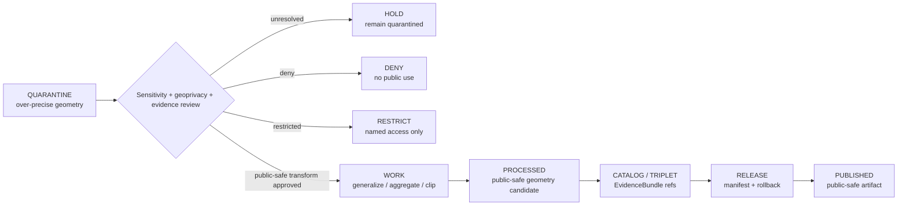

<!-- [KFM_META_BLOCK_V2]
doc_id: kfm://data/quarantine/habitat/over-precise-geometry/readme
name: Habitat Over-Precise Geometry Quarantine README
path: data/quarantine/habitat/over_precise_geometry/README.md
type: data-quarantine-lane-readme
version: v0.1.0
status: draft
owners:
  - <habitat-lane-steward>
  - <data-steward>
  - <sensitivity-reviewer>
  - <wildlife-steward>
  - <release-steward>
created: 2026-06-27
updated: 2026-06-27
policy_label: restricted-review
truth_posture: cite-or-abstain
lifecycle_phase: quarantine
responsibility_root: data/
domain: habitat
artifact_family: held-habitat-over-precise-geometry
sensitivity_posture: fail-closed; no-public-path; precision-degradation-required; geoprivacy-required; release-blocked
related:
  - ../README.md
  - ../ecoregions/README.md
  - ../land_cover/README.md
  - ../../README.md
  - ../../../README.md
  - ../../../processed/habitat/README.md
  - ../../../published/layers/habitat/README.md
  - ../../../../docs/domains/habitat/SENSITIVITY.md
  - ../../../../docs/domains/habitat/DATA_LIFECYCLE.md
  - ../../../../docs/domains/habitat/REASON_CODES.md
  - ../../../../docs/domains/habitat/sublanes/land_cover.md
  - ../../../../docs/domains/habitat/sublanes/ecoregions.md
  - ../../../../release/manifests/README.md
tags:
  - kfm
  - data
  - quarantine
  - habitat
  - over-precise-geometry
  - exact-harm-coordinates
  - geoprivacy
  - redaction
  - sensitive-joins
  - rare-species
  - fail-closed
  - evidence-first
notes:
  - "This README documents the quarantine lane for Habitat material whose geometry is too precise for its sensitivity, source-role, evidence, review, release tier, or public-safety posture."
  - "Habitat sensitivity is often join-induced; low-risk inputs can produce restricted or denied outputs when combined with sensitive Fauna, Flora, archaeology, stewardship, private-land, or infrastructure context."
  - "Exact generalization radii, grid sizes, and suppression parameters are deliberately not documented here; they belong in steward-gated policy bundles."
  - "Quarantine is a hold state, not a staging shortcut to processed, catalog, triplet, published, reports, layers, PMTiles, stories, graph/vector indexes, AI answers, or public UI."
  - "Actual payload presence, policy automation, validator wiring, CI enforcement, and review completion remain UNKNOWN unless verified."
[/KFM_META_BLOCK_V2] -->

<a id="top"></a>

# Habitat Over-Precise Geometry Quarantine

Held Habitat material whose geometry is too exact for its evidence, source role, sensitivity tier, geoprivacy posture, review state, release state, or intended public surface.

<p>
  
  
  
  
  
  
</p>

**Quick links:** [Scope](#scope) · [Repo fit](#repo-fit) · [Held material](#held-material) · [Inputs](#inputs) · [Exclusions](#exclusions) · [Directory map](#directory-map) · [Exit gates](#exit-gates) · [Forbidden shortcuts](#forbidden-shortcuts) · [Required checks](#required-checks-before-use) · [Status notes](#status-notes)

> [!CAUTION]
> `data/quarantine/habitat/over_precise_geometry/` is a no-public-path hold lane. Material here is not public, not processed truth, not catalog truth, not proof, not release authority, not policy authority, not habitat truth, not species occurrence truth, not rare-plant truth, not stewardship-zone truth, not private-land truth, and not an AI-answer source. Nothing in this lane may be consumed by public clients or normal UI surfaces until a governed exit transition leaves inspectable evidence.

---

## Scope

This directory may hold Habitat material when geometry is too precise for the claim, evidence, joined sensitivity, public tier, source terms, or release surface.

Typical reasons for quarantine include:

- a Habitat output is joined to or reveals sensitive Fauna occurrence context, such as nests, dens, roosts, hibernacula, spawning areas, migration endpoints, or rare-species concentrations;
- a Habitat output is joined to or reveals rare-plant records, culturally sensitive plants, archaeology, steward-withheld zones, private parcel context, agriculture operations, or infrastructure context;
- an ecoregion, land-cover, patch, suitability, connectivity, restoration, corridor, ecological-system, biotope, or critical-habitat candidate contains geometry finer than the allowed public tier;
- a model surface or suitability product could reconstruct sensitive training support or sensitive source geometry;
- a published-layer candidate, PMTiles/COG candidate, report, story, graph edge, vector index, search index, or AI-drafted answer would expose too-precise geometry or allow inference of a restricted location;
- the necessary `RedactionReceipt`, `AggregationReceipt`, `PolicyDecision`, `ReviewRecord`, `ReleaseManifest`, correction path, or rollback target is missing.

This lane preserves held material for review while preventing accidental promotion, publication, rendering, indexing, downloading, story playback, graph/vector use, or AI-answer use. Exact policy parameters are not documented here.

---

## Repo fit

| Field | Value |
|---|---|
| Path | `data/quarantine/habitat/over_precise_geometry/` |
| Responsibility root | `data/` |
| Lifecycle phase | `quarantine/` |
| Domain lane | `habitat` |
| Sublane | `over_precise_geometry` |
| Artifact role | Held Habitat material requiring precision degradation, geometry generalization, suppression, aggregation, clipping, or denial review |
| Public access posture | No public path; no normal UI; no governed-public API exposure |
| Exit posture | Only by explicit policy decision, sensitivity review, geoprivacy/redaction closure, evidence closure, required receipt closure, and corrected lifecycle placement |
| Release authority | `release/`, not this directory |
| Proof authority | `data/proofs/` and `data/receipts/`, not this directory |
| Catalog authority | `data/catalog/`, not this directory |
| Registry authority | `data/registry/`, not this directory |
| Policy authority | `policy/`, not this directory |
| Default failure posture | `HOLD`, `DENY`, `RESTRICT`, or `ABSTAIN` when geometry precision, source role, rights, evidence, sensitivity, geoprivacy, redaction, review, correction, or rollback support is insufficient |

---

## Held material

Material belongs here when geometry precision is not safe or sufficiently governed for `work`, `processed`, `catalog`, `published`, report, story, layer, graph, search, vector-index, or AI-answer use.

| Held family | Why it is held |
|---|---|
| Sensitive join geometries | Habitat × Fauna, Flora, archaeology, stewardship, private-land, agriculture, or infrastructure joins may create new exposure. |
| Exact-harm coordinate candidates | Any geometry that could enable harm, collection, harassment, trespass, disturbance, looting, or reverse engineering fails closed. |
| Patch / corridor / connectivity geometry | Endpoints, paths, narrow buffers, or polygons can imply sensitive sites or movement patterns. |
| Suitability or model surfaces | Modeled products may reconstruct sensitive training support or source geometry. |
| Ecoregion / land-cover derivative joins | Broad context layers can become sensitive when joined to restricted occurrence, rare-plant, archaeology, or private-land context. |
| Attribute or tile leakage candidates | Public tiles, COGs, PMTiles, exports, reports, or styles may preserve coordinates, IDs, links, or fields that defeat redaction. |
| Generated or indexed carriers | Search, vector, story, report, map, graph, or AI artifacts must not leak over-precise Habitat geometry. |

---

## Inputs

Accepted content is limited to held review material and quarantine-local sidecars such as:

- source pointers, geometry packets, join packets, habitat candidate packets, patch/corridor/suitability packets, ecoregion/land-cover derivative packets, redaction packets, sensitivity packets, or generated candidates that require quarantine;
- quarantine reason notes and `HOLD` / `DENY` / `RESTRICT` summaries;
- source-role, rights, sensitivity, geoprivacy, redaction, aggregation, clipping, model-support, geometry, reviewer, and steward notes;
- candidate receipt drafts, such as redaction, aggregation, representation, model-run, validation, citation-validation, source-role review, or policy-decision drafts;
- hash/digest sidecars used to preserve chain-of-custody for held material;
- quarantine-local README files that explain hold state without becoming proof, catalog, registry, policy, or release authority.

---

## Exclusions

| Do not place here | Correct authority home |
|---|---|
| Clean RAW source mirrors that have not triggered quarantine | `data/raw/habitat/` or source-specific intake |
| Ordinary WORK material that is safe to process under normal review | `data/work/habitat/` |
| Validated processed Habitat objects | `data/processed/habitat/` only after quarantine resolution |
| Catalog records, triplets, graph truth, or EvidenceBundle state | `data/catalog/`, triplet lanes, or proof lanes |
| EvidenceBundle / ProofPack | `data/proofs/` |
| Final validation, redaction, aggregation, representation, model-run, geoprivacy, AI, or release receipts | `data/receipts/` |
| Release manifests, promotion decisions, correction records, rollback records, or signatures | `release/` |
| Source descriptors, activation records, source registries, or registry truth | `data/registry/` |
| Public layers, PMTiles, COGs, reports, stories, API payloads, downloads, or published artifacts | `data/published/` only after release gates close |
| Exact Fauna, Flora, archaeology, land, infrastructure, or agriculture truth | Owning domain lane, not Habitat quarantine |
| Policy bundles, generalization parameters, schemas, validators, or enforcement rules | `policy/`, `schemas/`, `tools/`, or contract roots as appropriate |
| Normal public UI, search, vector-index, graph, or AI-answer material | Governed public lanes only after release; otherwise abstain or deny |

---

## Directory map

```text
data/quarantine/habitat/over_precise_geometry/
├── README.md
├── <hold_id>/
│   ├── geometry_packet.json
│   ├── source_refs.json
│   ├── quarantine_reason.md
│   ├── sensitivity_review.notes.md
│   ├── geoprivacy_review.notes.md
│   ├── redaction_review.notes.md
│   ├── model_support_review.notes.md
│   ├── policy_decision.draft.json
│   ├── receipt_closure.checklist.md
│   ├── geometry_packet.sha256
│   └── README.md
└── index.local.json
```

`index.local.json` is optional and must remain quarantine-local. It is not a public index, catalog record, release manifest, registry, graph edge source, layer/story/report pointer, search index, vector index, map source, tile source, or AI retrieval index.

---

## Exit gates

Over-precise Habitat geometry may leave this lane only when the exit path is explicit:

| Exit route | Minimum requirement |
|---|---|
| Stay held | Any unresolved source-role, rights, sensitivity, geoprivacy, geometry precision, evidence, validation, review, or policy question remains. |
| Deny | PolicyDecision says `DENY`; public/UI/AI surfaces abstain or deny. |
| Restrict | PolicyDecision and ReviewRecord identify allowed audience, purpose, terms, and correction path. |
| Return to work | Hold reason is resolved, but normal validation, transformation, redaction, aggregation, clipping, attribution, or EvidenceBundle work still remains. |
| Promote to processed/catalog/published | Only after required receipts, source descriptors, validation closure, evidence closure, public-safe geometry, release manifest, correction path, rollback path, and approved public-safe transform exist. |

A more public tier requires transform receipt and review record. A more restrictive correction can happen immediately when risk is discovered.

---

## Forbidden shortcuts

```text
data/quarantine/habitat/over_precise_geometry/
→ data/processed/habitat/
→ data/catalog/
→ data/published/
→ public API / MapLibre / PMTiles / COG / report / story / graph / vector index / AI answer
```

is forbidden unless the appropriate governed transition has actually happened and left inspectable evidence.



---

## Required checks before use

- [ ] Confirm the material is Habitat-domain material and belongs under `data/quarantine/habitat/over_precise_geometry/`.
- [ ] Confirm the hold reason is recorded using a governed reason code such as sensitivity unresolved, join-sensitive occurrence, review needed, or equivalent project-approved code.
- [ ] Confirm source descriptors, source roles, authority roles, rights posture, license, attribution, cadence, and current terms.
- [ ] Confirm whether the geometry is exact, inferred, modeled, joined, generalized, aggregated, clipped, suppressed, or already public-safe.
- [ ] Confirm whether the candidate reveals or narrows Fauna, Flora, archaeology, stewardship, private-land, agriculture, infrastructure, or other sensitive-domain locations.
- [ ] Confirm public-safe geometry exists whenever geoprivacy status, joined sensitivity, or source terms require it.
- [ ] Confirm no style-only hiding is used as a sensitivity control.
- [ ] Confirm required redaction, aggregation, model-run, representation, validation, and policy receipts are present or explicitly marked missing.
- [ ] Confirm PolicyDecision, ValidationReport, ReviewRecord where required, correction path, and rollback target before any exit.
- [ ] Confirm no public layer, PMTiles, COG, report, story, API payload, graph edge, search index, vector index, or AI answer uses over-precise geometry.

---

## Status notes

| Claim | Status |
|---|---|
| This README defines the requested quarantine path boundary. | **CONFIRMED authored** |
| The target path exists in the live repository as an empty file before this edit. | **CONFIRMED by GitHub contents API during this edit** |
| Habitat sensitivity doctrine says Habitat sensitivity is often join-induced and sensitive joins fail closed. | **CONFIRMED by GitHub contents API during this edit** |
| Habitat sensitivity doctrine says sensitive fauna-linked Habitat records require policy-controlled precision degradation, generalized geometry, or abstention before public exposure. | **CONFIRMED by GitHub contents API during this edit** |
| Habitat sensitivity doctrine says public-safe geometry is required when geoprivacy is obscured/private/generalized and exact geometry is never the published geometry. | **CONFIRMED by GitHub contents API during this edit** |
| Habitat sensitivity doctrine says style-only hiding is not a sensitivity control and public clients use governed APIs only. | **CONFIRMED by GitHub contents API during this edit** |
| The parent `data/quarantine/habitat/README.md` is currently only a greenfield stub. | **CONFIRMED by GitHub contents API during this edit** |
| Actual over-precise Habitat geometry payloads exist in this subtree. | **UNKNOWN** |
| Policy automation, validators, and CI checks enforce this exact quarantine lane. | **NEEDS VERIFICATION** |
| This README is proof, release, catalog, registry, policy, habitat truth, species occurrence truth, rare-plant truth, stewardship-zone truth, private-land truth, public artifact authority, or AI authority. | **DENY** |

---

## Related files

- [`../README.md`](../README.md)
- [`../ecoregions/README.md`](../ecoregions/README.md)
- [`../land_cover/README.md`](../land_cover/README.md)
- [`../../README.md`](../../README.md)
- [`../../../README.md`](../../../README.md)
- [`../../../processed/habitat/README.md`](../../../processed/habitat/README.md)
- [`../../../published/layers/habitat/README.md`](../../../published/layers/habitat/README.md)
- [`../../../../docs/domains/habitat/SENSITIVITY.md`](../../../../docs/domains/habitat/SENSITIVITY.md)
- [`../../../../docs/domains/habitat/DATA_LIFECYCLE.md`](../../../../docs/domains/habitat/DATA_LIFECYCLE.md)
- [`../../../../docs/domains/habitat/REASON_CODES.md`](../../../../docs/domains/habitat/REASON_CODES.md)
- [`../../../../docs/domains/habitat/sublanes/land_cover.md`](../../../../docs/domains/habitat/sublanes/land_cover.md)
- [`../../../../docs/domains/habitat/sublanes/ecoregions.md`](../../../../docs/domains/habitat/sublanes/ecoregions.md)
- [`../../../../release/manifests/README.md`](../../../../release/manifests/README.md)

---

KFM rule: this directory is a Habitat over-precise-geometry quarantine hold lane only. It is not source authority, proof authority, receipt authority, release authority, catalog authority, registry authority, policy authority, habitat truth, species occurrence truth, rare-plant truth, stewardship-zone truth, private-land truth, public artifact authority, UI authority, graph authority, vector-index authority, or AI truth.

[Back to top](#top)
