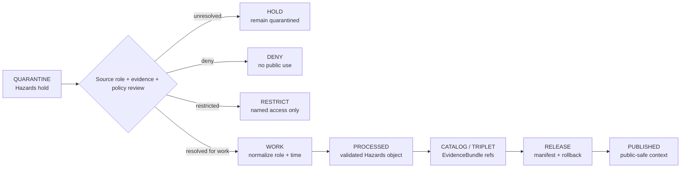

<!-- [KFM_META_BLOCK_V2]
doc_id: kfm://data/quarantine/hazards/readme
name: Hazards Quarantine README
path: data/quarantine/hazards/README.md
type: data-quarantine-index-readme
version: v0.1.0
status: draft
owners:
  - <hazards-lane-steward>
  - <data-steward>
  - <source-steward>
  - <policy-steward>
  - <release-steward>
created: 2026-06-27
updated: 2026-06-27
policy_label: restricted-review
truth_posture: cite-or-abstain
lifecycle_phase: quarantine
responsibility_root: data/
domain: hazards
artifact_family: held-hazards-material
sensitivity_posture: fail-closed; no-public-path; life-safety-boundary-required; source-role-preservation-required; freshness-required; release-blocked
related:
  - source_role_collapse/README.md
  - ../README.md
  - ../../README.md
  - ../../processed/hazards/README.md
  - ../../published/layers/hazards/README.md
  - ../../../docs/domains/hazards/ARCHITECTURE.md
  - ../../../docs/domains/hazards/PUBLICATION_AND_BOUNDARY.md
  - ../../../docs/architecture/source-role-anti-collapse.md
  - ../../../docs/architecture/source-roles.md
  - ../../../release/manifests/README.md
tags:
  - kfm
  - data
  - quarantine
  - hazards
  - source-role-collapse
  - knowledge-character-separation
  - warnings
  - advisories
  - forecasts
  - regulatory-context
  - remote-sensing-detection
  - modeled-derivative
  - life-safety-boundary
  - evidence-first
notes:
  - "This README replaces the greenfield stub and documents the parent Hazards quarantine lane."
  - "Confirmed child README lane in this session: source_role_collapse."
  - "Hazards quarantine is a hold area, not a staging shortcut to processed, catalog, triplet, published, reports, layers, PMTiles, stories, graph/vector indexes, AI answers, or public UI."
  - "KFM Hazards is not a life-safety alerting system; operational warnings/advisories/watches are context only and must redirect users to official sources."
  - "Actual held payload presence, policy automation, validator wiring, CI enforcement, and review completion remain UNKNOWN unless verified."
[/KFM_META_BLOCK_V2] -->

<a id="top"></a>

# Hazards Quarantine

Parent hold lane for Hazards material that is not safe or sufficiently governed for normal processing, cataloging, publication, reporting, map rendering, story playback, indexing, or AI-answer use.

<p>
  
  
  
  
  
  
</p>

**Quick links:** [Scope](#scope) · [Repo fit](#repo-fit) · [Confirmed child lanes](#confirmed-child-lanes) · [Proposed quarantine classes](#proposed-quarantine-classes) · [Inputs](#inputs) · [Exclusions](#exclusions) · [Directory map](#directory-map) · [Exit gates](#exit-gates) · [Forbidden shortcuts](#forbidden-shortcuts) · [Required checks](#required-checks-before-use) · [Status notes](#status-notes)

> [!CAUTION]
> `data/quarantine/hazards/` is a no-public-path hold lane. Material here is not public, not processed truth, not catalog truth, not proof, not release authority, not policy authority, not emergency alert authority, not life-safety instruction, not regulatory determination, not observed-hazard truth, not modeled-risk truth, and not an AI-answer source. Nothing in this subtree may be consumed by public clients or normal UI surfaces until a governed exit transition leaves inspectable evidence.

---

## Scope

This directory holds Hazards material when source role, knowledge character, life-safety boundary, evidence support, rights, sensitivity, source freshness, issue/expiry state, temporal role, validation, review record, policy decision, receipt closure, correction path, or rollback path is unresolved.

Hazards owns historical events, regulatory hazard context, operational warning/advisory/watch context, administrative declarations, scientific observations, remote-sensing detections, modeled derivatives, exposure summaries, and resilience timelines. Those knowledge characters are not interchangeable. A regulatory flood zone is not an observed flood, a remote-sensing detection is not confirmed ground truth, a model output is not a direct observation, and an operational warning is not a KFM life-safety instruction.

This parent lane does not make held content authoritative. It routes quarantine material so stewards can review, deny, restrict, return to work, or promote only through governed lifecycle transitions.

---

## Repo fit

| Field | Value |
|---|---|
| Path | `data/quarantine/hazards/` |
| Responsibility root | `data/` |
| Lifecycle phase | `quarantine/` |
| Domain lane | `hazards` |
| Artifact role | Parent hold lane for Hazards quarantine material and quarantine-local review sidecars |
| Public access posture | No public path; no normal UI; no governed-public API exposure |
| Exit posture | Only by explicit policy decision, source-role/evidence/freshness/rights/sensitivity closure, required receipt closure, and corrected lifecycle placement |
| Release authority | `release/`, not this directory |
| Proof authority | `data/proofs/` and `data/receipts/`, not this directory |
| Catalog authority | `data/catalog/`, not this directory |
| Registry authority | `data/registry/`, not this directory |
| Policy authority | `policy/`, not this directory |
| Default failure posture | `HOLD`, `DENY`, `RESTRICT`, or `ABSTAIN` when source role, knowledge character, life-safety boundary, evidence, rights, sensitivity, freshness, temporal state, review, correction, or rollback support is insufficient |

---

## Confirmed child lanes

The child lane below is a README path confirmed by current-session GitHub fetches or edits. This table does **not** prove held payloads exist under that lane.

| Child lane | Held material | Boundary |
|---|---|---|
| [`source_role_collapse/`](source_role_collapse/README.md) | Hazards material where source role, knowledge character, authority role, evidence role, operational-context role, regulatory role, observation role, model role, candidate role, or freshness/current-state role is unresolved or misapplied | No public path until role separation, evidence closure, freshness/expiry closure where applicable, receipts, review, release, correction, and rollback support exist. |

---

## Proposed quarantine classes

The Hazards architecture names or implies additional hold classes below. They are routing guidance, not proof that child README paths or payloads exist.

| Class | Status | Typical handling |
|---|---|---|
| Stale operational context | **PROPOSED / NEEDS VERIFICATION** | Hold expired warnings/advisories/watches unless explicitly reframed as historical context with source and expiry. |
| Life-safety boundary failure | **PROPOSED / NEEDS VERIFICATION** | Deny any KFM-as-alert-authority or emergency-instruction framing; redirect to official sources. |
| Rights unknown | **PROPOSED / NEEDS VERIFICATION** | Hold until source terms and redistribution posture are recorded. |
| Sensitivity unresolved | **PROPOSED / NEEDS VERIFICATION** | Hold critical infrastructure, dam-failure, archaeology, wildlife, private land, or living-person joins until owning-lane policy closes. |
| Evidence open | **PROPOSED / NEEDS VERIFICATION** | Build EvidenceBundle or deny/abstain. |
| Temporal role defect | **PROPOSED / NEEDS VERIFICATION** | Correct source, observed, valid, issue, expiry, retrieval, release, and correction times before exit. |
| Schema / geometry / source-version defect | **PROPOSED / NEEDS VERIFICATION** | Correct fields, geometry, versioning, effective dates, freshness, or source identity before work/processed promotion. |

> [!NOTE]
> Add child lanes only after confirming the risk class, responsibility-root fit, reviewer roles, receipt requirements, correction path, rollback target, and Directory Rules placement basis.

---

## Inputs

Accepted content is limited to held review material and quarantine-local sidecars such as:

- source pointers, hazard-event packets, warning/advisory/watch packets, regulatory-context packets, observation packets, remote-sensing packets, modeled-derivative packets, declaration packets, exposure packets, resilience packets, timeline packets, rights packets, sensitivity packets, freshness packets, or generated candidates that require quarantine;
- quarantine reason notes and `HOLD` / `DENY` / `RESTRICT` summaries;
- source-role, knowledge-character, authority-role, freshness/expiry, source-chain, upstream-citation, evidence-role, rights, sensitivity, temporal, reviewer, and steward notes;
- candidate receipt drafts, such as source-role review, citation-validation, validation, transform, redaction, freshness, temporal-role, authority-review, AI, or policy-decision drafts;
- hash/digest sidecars used to preserve chain-of-custody for held material;
- quarantine-local README files and local indexes that explain hold state without becoming proof, catalog, registry, policy, release authority, or life-safety authority.

---

## Exclusions

| Do not place here | Correct authority home |
|---|---|
| Clean RAW source mirrors that have not triggered quarantine | `data/raw/hazards/` or source-specific intake |
| Ordinary WORK material that is safe to process under normal review | `data/work/hazards/` |
| Validated processed Hazards objects | `data/processed/hazards/` only after quarantine resolution |
| Catalog records, triplets, graph truth, or EvidenceBundle state | `data/catalog/`, triplet lanes, or proof lanes |
| EvidenceBundle / ProofPack | `data/proofs/` |
| Final validation, transform, redaction, source-role-review, freshness, AI, or release receipts | `data/receipts/` |
| Release manifests, promotion decisions, correction records, rollback records, or signatures | `release/` |
| Source descriptors, activation records, source registries, or registry truth | `data/registry/` |
| Public layers, PMTiles, reports, stories, API payloads, downloads, or published artifacts | `data/published/` only after release gates close |
| Official emergency alerts, watches, warnings, advisories, or life-safety instructions | The issuing authority, not KFM |
| Hydrology, Atmosphere, Settlements/Infrastructure, Roads/Rail, Geology, Soil, Agriculture, Fauna, Archaeology, or People/Land canonical truth | Owning domain lane, not Hazards quarantine |
| Semantic contracts, schemas, validators, or policy rules | `contracts/`, `schemas/`, `tools/`, `policy/` |
| Normal public UI, search, vector-index, graph, or AI-answer material | Governed public lanes only after release; otherwise abstain or deny |

---

## Directory map

```text
data/quarantine/hazards/
├── README.md
├── source_role_collapse/
│   └── README.md
├── <future-risk-sublane>/
│   └── README.md
└── index.local.json
```

`index.local.json` is optional and must remain quarantine-local. It is not a public index, catalog record, release manifest, registry, graph edge source, layer/story/report pointer, search index, vector index, map source, alert feed, or AI retrieval index.

---

## Exit gates

Hazards material may leave quarantine only when the exit path is explicit:

| Exit route | Minimum requirement |
|---|---|
| Stay held | Any unresolved source-role, knowledge-character, upstream citation, freshness/expiry, rights, sensitivity, evidence, temporal, or policy question remains. |
| Deny | PolicyDecision says `DENY`; public/UI/AI surfaces abstain or deny, and life-safety requests redirect to official sources. |
| Restrict | PolicyDecision and ReviewRecord identify allowed audience, purpose, terms, and correction path. |
| Return to work | Hold reason is resolved, but normal validation, transformation, attribution, temporal handling, source-role review, or EvidenceBundle work still remains. |
| Promote to processed/catalog/published | Only after required receipts, source descriptors, source-role closure, validation closure, EvidenceBundle closure, release manifest, correction path, rollback path, and approved public-safe transform exist. |

Operational warning/advisory/watch material also requires issue time, expiry time, source identity, freshness state, and a visible not-for-life-safety boundary before any public-safe context surface.

---

## Forbidden shortcuts

```text
data/quarantine/hazards/
→ data/processed/hazards/
→ data/catalog/
→ data/published/
→ public API / MapLibre / PMTiles / report / story / graph / vector index / AI answer
```

is forbidden unless the appropriate governed transition has actually happened and left inspectable evidence.



---

## Required checks before use

- [ ] Confirm the material is Hazards-domain material and belongs under `data/quarantine/hazards/`.
- [ ] Confirm the correct child sublane: `source_role_collapse/` or a new documented sublane.
- [ ] Confirm the hold reason is recorded using a governed reason code.
- [ ] Confirm source descriptors, source roles, authority roles, upstream citation chain, rights posture, cadence, and current terms.
- [ ] Confirm claim type: historical event, operational warning/advisory/watch context, administrative declaration, regulatory context, scientific observation, remote-sensing detection, modeled derivative, exposure summary, resilience summary, timeline, or generated carrier.
- [ ] Confirm operational-context material carries source identity, issue time, expiry time, freshness state, and not-for-life-safety posture.
- [ ] Confirm regulatory context is not treated as observed event/forecast/model output; remote sensing is not treated as confirmed ground truth; model output is not treated as direct observation; administrative declarations are not overclaimed as observed condition proof.
- [ ] Confirm role inheritance across derivatives, joins, indexes, reports, stories, maps, graph edges, and AI carriers.
- [ ] Confirm required receipts are present or explicitly marked missing.
- [ ] Confirm PolicyDecision, source-role review, ValidationReport, ReviewRecord where required, correction path, and rollback target before any exit.
- [ ] Confirm no public layer, PMTiles, report, story, API payload, graph edge, search index, vector index, or AI answer uses quarantined material.

---

## Status notes

| Claim | Status |
|---|---|
| This README replaces the greenfield stub at `data/quarantine/hazards/README.md`. | **CONFIRMED authored** |
| The target path existed in the live repository as a greenfield stub before this edit. | **CONFIRMED by GitHub contents API during this edit** |
| `source_role_collapse/README.md` exists as a Hazards quarantine child-lane README. | **CONFIRMED by GitHub contents API during this edit** |
| Hazards architecture says KFM Hazards refuses to act as a life-safety alerting system. | **CONFIRMED by GitHub contents API during this edit** |
| Hazards architecture says source-role and knowledge-character labels are non-interchangeable. | **CONFIRMED by GitHub contents API during this edit** |
| Hazards architecture says unresolved source role is quarantined and never published. | **CONFIRMED by GitHub contents API during this edit** |
| Actual quarantined payloads exist under every listed child lane. | **UNKNOWN** |
| Policy automation, validators, and CI checks enforce every listed Hazards quarantine lane. | **NEEDS VERIFICATION** |
| This README is proof, release, catalog, registry, policy, emergency alert authority, life-safety instruction, regulatory determination, observed-hazard truth, modeled-risk truth, public artifact authority, or AI authority. | **DENY** |

---

## Related files

- [`source_role_collapse/README.md`](source_role_collapse/README.md)
- [`../README.md`](../README.md)
- [`../../README.md`](../../README.md)
- [`../../processed/hazards/README.md`](../../processed/hazards/README.md)
- [`../../published/layers/hazards/README.md`](../../published/layers/hazards/README.md)
- [`../../../docs/domains/hazards/ARCHITECTURE.md`](../../../docs/domains/hazards/ARCHITECTURE.md)
- [`../../../docs/domains/hazards/PUBLICATION_AND_BOUNDARY.md`](../../../docs/domains/hazards/PUBLICATION_AND_BOUNDARY.md)
- [`../../../docs/architecture/source-role-anti-collapse.md`](../../../docs/architecture/source-role-anti-collapse.md)
- [`../../../docs/architecture/source-roles.md`](../../../docs/architecture/source-roles.md)
- [`../../../release/manifests/README.md`](../../../release/manifests/README.md)

---

KFM rule: this directory is a Hazards quarantine hold index only. It is not source authority, proof authority, receipt authority, release authority, catalog authority, registry authority, policy authority, emergency alert authority, life-safety instruction, regulatory determination, observed-hazard truth, modeled-risk truth, public artifact authority, UI authority, graph authority, vector-index authority, or AI truth.

[Back to top](#top)
