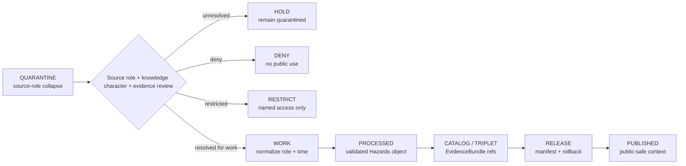

<!-- [KFM_META_BLOCK_V2]
doc_id: kfm://data/quarantine/hazards/source-role-collapse/readme
name: Hazards Source Role Collapse Quarantine README
path: data/quarantine/hazards/source_role_collapse/README.md
type: data-quarantine-lane-readme
version: v0.1.0
status: draft
owners:
  - <hazards-lane-steward>
  - <data-steward>
  - <source-steward>
  - <policy-steward>
  - <release-steward>
created: 2026-06-27
updated: 2026-06-27
policy_label: restricted-review
truth_posture: cite-or-abstain
lifecycle_phase: quarantine
responsibility_root: data/
domain: hazards
artifact_family: held-hazards-source-role-collapse-material
sensitivity_posture: source-role-collapse; fail-closed; no-public-path; life-safety-boundary-required; review-required; release-blocked
related:
  - ../README.md
  - ../../README.md
  - ../../../README.md
  - ../../../processed/hazards/README.md
  - ../../../published/layers/hazards/README.md
  - ../../../../docs/domains/hazards/ARCHITECTURE.md
  - ../../../../docs/domains/hazards/PUBLICATION_AND_BOUNDARY.md
  - ../../../../docs/architecture/source-role-anti-collapse.md
  - ../../../../docs/architecture/source-roles.md
  - ../../../../release/manifests/README.md
tags:
  - kfm
  - data
  - quarantine
  - hazards
  - source-role-collapse
  - knowledge-character-separation
  - warnings
  - advisories
  - forecasts
  - regulatory-context
  - remote-sensing-detection
  - modeled-derivative
  - life-safety-boundary
  - evidence-first
notes:
  - "This README documents the quarantine lane for Hazards material with source-role collapse, knowledge-character collapse, or forbidden role upcast/downcast risk."
  - "Hazards doctrine says observations, regulatory archives, model fields, remote-sensing detections, operational context, public reports, and resilience summaries are not interchangeable."
  - "KFM Hazards is not a life-safety alerting system; operational warnings/advisories/watches are context only and must redirect users to official sources."
  - "Quarantine is a hold state, not a staging shortcut to processed, catalog, triplet, published, reports, layers, PMTiles, stories, AI answers, or public UI."
  - "Actual payload presence, policy automation, validator wiring, CI enforcement, and review completion remain UNKNOWN unless verified."
[/KFM_META_BLOCK_V2] -->

<a id="top"></a>

# Hazards Source-Role-Collapse Quarantine

Held Hazards material where the source role, knowledge character, authority role, evidence role, operational-context role, regulatory role, observation role, model role, or candidate role is unresolved or misapplied.

<p>
  
  
  
  
  
  
</p>

**Quick links:** [Scope](#scope) · [Repo fit](#repo-fit) · [Held material](#held-material) · [Inputs](#inputs) · [Exclusions](#exclusions) · [Directory map](#directory-map) · [Exit gates](#exit-gates) · [Forbidden shortcuts](#forbidden-shortcuts) · [Required checks](#required-checks-before-use) · [Status notes](#status-notes)

> [!CAUTION]
> `data/quarantine/hazards/source_role_collapse/` is a no-public-path hold lane. Material here is not public, not processed truth, not catalog truth, not proof, not release authority, not policy authority, not emergency alert authority, not life-safety instruction, not regulatory determination, not observed-hazard truth, not modeled-risk truth, and not an AI-answer source. Nothing in this lane may be consumed by public clients or normal UI surfaces until a governed exit transition leaves inspectable evidence.

---

## Scope

This directory may hold Hazards material when source role or knowledge character is unresolved, contradicted, overclaimed, or collapsed across source families.

Typical reasons for quarantine include:

- an operational warning, advisory, or watch is presented as a KFM life-safety instruction or authoritative alert;
- an expired operational product is presented as current warning state instead of historical context;
- FEMA NFHL or another regulatory hazard layer is treated as observed flood extent, forecast, or model output;
- a remote-sensing detection, such as fire or smoke detection, is treated as confirmed ground truth before review;
- a modeled derivative, exposure surface, drought index, or risk surface is treated as direct observation;
- an administrative declaration is treated as proof of observed hazard conditions outside the declaration's authority;
- public reports, resilience summaries, aggregated timelines, or AI-drafted claims flatten observations, regulation, models, candidates, and operational context into a single undifferentiated hazard claim;
- the source role, EvidenceBundle, freshness/expiry state, rights posture, sensitivity state, policy decision, release state, correction path, or rollback target is missing.

This lane preserves held material for review without allowing accidental promotion, publication, indexing, rendering, downloading, story playback, graph/vector use, or AI-answer use.

---

## Repo fit

| Field | Value |
|---|---|
| Path | `data/quarantine/hazards/source_role_collapse/` |
| Responsibility root | `data/` |
| Lifecycle phase | `quarantine/` |
| Domain lane | `hazards` |
| Sublane | `source_role_collapse` |
| Artifact role | Held Hazards source-role-collapse material and quarantine-local review sidecars |
| Public access posture | No public path; no normal UI; no governed-public API exposure |
| Exit posture | Only by explicit source-role review, knowledge-character closure, evidence closure, freshness/expiry closure where applicable, policy decision, receipt closure, and corrected lifecycle placement |
| Release authority | `release/`, not this directory |
| Proof authority | `data/proofs/` and `data/receipts/`, not this directory |
| Catalog authority | `data/catalog/`, not this directory |
| Registry authority | `data/registry/`, not this directory |
| Policy authority | `policy/`, not this directory |
| Default failure posture | `HOLD`, `DENY`, `RESTRICT`, or `ABSTAIN` when source role, knowledge character, life-safety boundary, evidence, rights, sensitivity, freshness, review, correction, or rollback support is insufficient |

---

## Held material

Material belongs here when source role is not safe or sufficiently governed for `work`, `processed`, `catalog`, `published`, report, story, layer, graph, search, vector-index, or AI-answer use.

| Held family | Why it is held |
|---|---|
| Operational warning/advisory/watch role collapse | KFM may cite operational context but must not become alert authority or life-safety instruction. |
| Regulatory-context role collapse | NFHL and similar regulatory layers are regulatory context, not observed flood extent, forecast, or hydraulic-model output. |
| Remote-sensing detection collapse | Remote-sensing detections are candidates until reviewed and are not confirmed ground truth by themselves. |
| Modeled-derivative collapse | Model fields, indices, exposure surfaces, and risk surfaces must not be cited as direct observations. |
| Scientific-observation collapse | Instrumented observations must not be upcast into regulatory determinations or forecasts. |
| Administrative-declaration collapse | Declarations are authoritative about declarations, not automatic proof of observed conditions. |
| Stale/freshness collapse | Expired or stale operational material must not appear as current. |
| Generated or indexed role-collapsed carriers | Search, vector, story, report, map, graph, or AI artifacts must not leak overclaimed hazard roles. |

---

## Inputs

Accepted content is limited to held review material and quarantine-local sidecars such as:

- source pointers, warning/advisory/watch packets, regulatory-context packets, observation packets, remote-sensing packets, modeled-derivative packets, declaration packets, exposure packets, resilience packets, timeline packets, or generated candidates that require quarantine;
- quarantine reason notes and `HOLD` / `DENY` / `RESTRICT` summaries;
- source-role, knowledge-character, authority-role, freshness/expiry, source-chain, upstream-citation, evidence-role, rights, sensitivity, reviewer, and steward notes;
- candidate receipt drafts, such as source-role review, citation-validation, validation, transform, redaction, freshness, authority-review, or policy-decision drafts;
- hash/digest sidecars used to preserve chain-of-custody for held material;
- quarantine-local README files that explain hold state without becoming proof, catalog, registry, policy, release authority, or life-safety authority.

---

## Exclusions

| Do not place here | Correct authority home |
|---|---|
| Clean RAW source mirrors that have not triggered quarantine | `data/raw/hazards/` or source-specific intake |
| Ordinary WORK material that is safe to process under normal review | `data/work/hazards/` |
| Validated processed Hazards objects | `data/processed/hazards/` only after quarantine resolution |
| Catalog records, triplets, graph truth, or EvidenceBundle state | `data/catalog/`, triplet lanes, or proof lanes |
| EvidenceBundle / ProofPack | `data/proofs/` |
| Final validation, transform, redaction, source-role-review, freshness, AI, or release receipts | `data/receipts/` |
| Release manifests, promotion decisions, correction records, rollback records, or signatures | `release/` |
| Source descriptors, activation records, source registries, or registry truth | `data/registry/` |
| Public layers, PMTiles, reports, stories, API payloads, downloads, or published artifacts | `data/published/` only after release gates close |
| Official emergency alerts, watches, warnings, advisories, or life-safety instructions | The issuing authority, not KFM |
| Hydrology, Atmosphere, Settlements/Infrastructure, Roads/Rail, Geology, Soil, Agriculture, Fauna, Archaeology, or People/Land canonical truth | Owning domain lane, not Hazards quarantine |
| Semantic contracts, schemas, validators, or policy rules | `contracts/`, `schemas/`, `tools/`, `policy/` |
| Normal public UI, search, vector-index, graph, or AI-answer material | Governed public lanes only after release; otherwise abstain or deny |

---

## Directory map

```text
data/quarantine/hazards/source_role_collapse/
├── README.md
├── <hold_id>/
│   ├── source_role_packet.json
│   ├── source_refs.json
│   ├── upstream_citation_chain.json
│   ├── quarantine_reason.md
│   ├── source_role_review.notes.md
│   ├── knowledge_character_review.notes.md
│   ├── freshness_expiry_review.notes.md
│   ├── life_safety_boundary_review.notes.md
│   ├── policy_decision.draft.json
│   ├── receipt_closure.checklist.md
│   ├── source_role_packet.sha256
│   └── README.md
└── index.local.json
```

`index.local.json` is optional and must remain quarantine-local. It is not a public index, catalog record, release manifest, registry, graph edge source, layer/story/report pointer, search index, vector index, map source, alert feed, or AI retrieval index.

---

## Exit gates

Source-role-collapsed Hazards material may leave this lane only when the exit path is explicit:

| Exit route | Minimum requirement |
|---|---|
| Stay held | Any unresolved source-role, knowledge-character, upstream citation, freshness/expiry, rights, sensitivity, evidence, or policy question remains. |
| Deny | PolicyDecision says `DENY`; public/UI/AI surfaces abstain or deny, and life-safety requests redirect to official sources. |
| Restrict | PolicyDecision and ReviewRecord identify allowed audience, purpose, terms, and correction path. |
| Return to work | Source role is resolved, but normal validation, transformation, attribution, temporal handling, or EvidenceBundle work still remains. |
| Promote to processed/catalog/published | Only after required receipts, source descriptors, source-role closure, validation closure, EvidenceBundle closure, release manifest, correction path, rollback path, and approved public-safe transform exist. |

Operational warning/advisory/watch material also requires issue time, expiry time, source identity, freshness state, and a visible not-for-life-safety boundary before any public-safe context surface.

---

## Forbidden shortcuts

```text
data/quarantine/hazards/source_role_collapse/
→ data/processed/hazards/
→ data/catalog/
→ data/published/
→ public API / MapLibre / PMTiles / report / story / graph / vector index / AI answer
```

is forbidden unless the appropriate governed transition has actually happened and left inspectable evidence.



---

## Required checks before use

- [ ] Confirm the material is Hazards-domain material and belongs under `data/quarantine/hazards/source_role_collapse/`.
- [ ] Confirm the hold reason is recorded as source-role collapse, knowledge-character collapse, stale/current-state collapse, life-safety-boundary failure, or a compatible governed reason code.
- [ ] Confirm source descriptors, source roles, authority roles, upstream citation chain, rights posture, cadence, and current terms.
- [ ] Confirm claim type: historical event, operational warning/advisory/watch context, administrative declaration, regulatory context, scientific observation, remote-sensing detection, modeled derivative, exposure summary, resilience summary, timeline, or generated carrier.
- [ ] Confirm operational-context material carries source identity, issue time, expiry time, freshness state, and not-for-life-safety posture.
- [ ] Confirm regulatory context is not treated as observed event/forecast/model output; remote sensing is not treated as confirmed ground truth; model output is not treated as direct observation.
- [ ] Confirm role inheritance across derivatives, joins, indexes, reports, stories, maps, graph edges, and AI carriers.
- [ ] Confirm required receipts are present or explicitly marked missing.
- [ ] Confirm PolicyDecision, source-role review, ValidationReport, ReviewRecord where required, correction path, and rollback target before any exit.
- [ ] Confirm no public layer, PMTiles, report, story, API payload, graph edge, search index, vector index, or AI answer uses source-role-collapsed material.

---

## Status notes

| Claim | Status |
|---|---|
| This README defines the requested quarantine path boundary. | **CONFIRMED authored** |
| The target path exists in the live repository as an empty file before this edit. | **CONFIRMED by GitHub contents API during this edit** |
| Hazards architecture says KFM Hazards refuses to act as a life-safety alerting system. | **CONFIRMED by GitHub contents API during this edit** |
| Hazards architecture says source-role and knowledge-character labels are non-interchangeable. | **CONFIRMED by GitHub contents API during this edit** |
| Hazards architecture says remote-sensing detections, regulatory zones, and operational warnings cannot be collapsed into observed truth, model truth, or life-safety authority. | **CONFIRMED by GitHub contents API during this edit** |
| Hazards architecture says unresolved source role is quarantined and never published. | **CONFIRMED by GitHub contents API during this edit** |
| The parent `data/quarantine/hazards/README.md` is currently only a greenfield stub. | **CONFIRMED by GitHub contents API during this edit** |
| Actual source-role-collapse payloads exist in this subtree. | **UNKNOWN** |
| Policy automation, validators, and CI checks enforce this exact quarantine lane. | **NEEDS VERIFICATION** |
| This README is proof, release, catalog, registry, policy, emergency alert authority, life-safety instruction, regulatory determination, observed-hazard truth, modeled-risk truth, public artifact authority, or AI authority. | **DENY** |

---

## Related files

- [`../README.md`](../README.md)
- [`../../README.md`](../../README.md)
- [`../../../README.md`](../../../README.md)
- [`../../../processed/hazards/README.md`](../../../processed/hazards/README.md)
- [`../../../published/layers/hazards/README.md`](../../../published/layers/hazards/README.md)
- [`../../../../docs/domains/hazards/ARCHITECTURE.md`](../../../../docs/domains/hazards/ARCHITECTURE.md)
- [`../../../../docs/domains/hazards/PUBLICATION_AND_BOUNDARY.md`](../../../../docs/domains/hazards/PUBLICATION_AND_BOUNDARY.md)
- [`../../../../docs/architecture/source-role-anti-collapse.md`](../../../../docs/architecture/source-role-anti-collapse.md)
- [`../../../../docs/architecture/source-roles.md`](../../../../docs/architecture/source-roles.md)
- [`../../../../release/manifests/README.md`](../../../../release/manifests/README.md)

---

KFM rule: this directory is a Hazards source-role-collapse quarantine hold lane only. It is not source authority, proof authority, receipt authority, release authority, catalog authority, registry authority, policy authority, emergency alert authority, life-safety instruction, regulatory determination, observed-hazard truth, modeled-risk truth, public artifact authority, UI authority, graph authority, vector-index authority, or AI truth.

[Back to top](#top)
