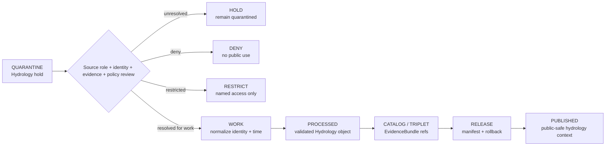

<!-- [KFM_META_BLOCK_V2]
doc_id: kfm://data/quarantine/hydrology/readme
name: Hydrology Quarantine README
path: data/quarantine/hydrology/README.md
type: data-quarantine-index-readme
version: v0.1.0
status: draft
owners:
  - <hydrology-lane-steward>
  - <data-steward>
  - <source-steward>
  - <sensitivity-reviewer>
  - <release-steward>
created: 2026-06-27
updated: 2026-06-27
policy_label: restricted-review
truth_posture: cite-or-abstain
lifecycle_phase: quarantine
responsibility_root: data/
domain: hydrology
artifact_family: held-hydrology-material
sensitivity_posture: fail-closed; no-public-path; source-role-preservation-required; nfhl-regulatory-not-observed; emergency-alert-boundary-required; release-blocked
related:
  - ../README.md
  - ../../README.md
  - ../../processed/hydrology/README.md
  - ../../published/layers/hydrology/README.md
  - ../../../docs/domains/hydrology/BOUNDARY.md
  - ../../../docs/domains/hydrology/SOURCE_REGISTRY.md
  - ../../../docs/domains/hydrology/IDENTITY_MODEL.md
  - ../../../docs/domains/hydrology/API_CONTRACTS.md
  - ../../../docs/domains/hydrology/VERIFICATION_BACKLOG.md
  - ../../../release/manifests/README.md
tags:
  - kfm
  - data
  - quarantine
  - hydrology
  - watershed
  - huc
  - reach-identity
  - gauge-site
  - water-observation
  - nfhl-context
  - source-role
  - emergency-alert-boundary
  - evidence-first
notes:
  - "This README replaces the greenfield stub and documents the parent Hydrology quarantine lane."
  - "No child quarantine README lanes were confirmed during this edit; proposed classes are routing guidance only."
  - "Hydrology quarantine is a hold area, not a staging shortcut to processed, catalog, triplet, published, reports, layers, PMTiles, stories, graph/vector indexes, AI answers, or public UI."
  - "NFHL is regulatory context only and must not be relabeled as observed flooding, real-time inundation, hydraulic-model output, or forecast."
  - "Actual held payload presence, policy automation, validator wiring, CI enforcement, and review completion remain UNKNOWN unless verified."
[/KFM_META_BLOCK_V2] -->

<a id="top"></a>

# Hydrology Quarantine

Parent hold lane for Hydrology material that is not safe or sufficiently governed for normal processing, cataloging, publication, reporting, map rendering, story playback, indexing, or AI-answer use.

<p>
  
  
  
  
  
  
</p>

**Quick links:** [Scope](#scope) · [Repo fit](#repo-fit) · [Confirmed child lanes](#confirmed-child-lanes) · [Proposed quarantine classes](#proposed-quarantine-classes) · [Inputs](#inputs) · [Exclusions](#exclusions) · [Directory map](#directory-map) · [Exit gates](#exit-gates) · [Forbidden shortcuts](#forbidden-shortcuts) · [Required checks](#required-checks-before-use) · [Status notes](#status-notes)

> [!CAUTION]
> `data/quarantine/hydrology/` is a no-public-path hold lane. Material here is not public, not processed truth, not catalog truth, not proof, not release authority, not policy authority, not emergency alert authority, not life-safety instruction, not NFHL-as-observed-flood truth, not gauge/station identity truth, not water-rights truth, not property-rights truth, and not an AI-answer source. Nothing in this subtree may be consumed by public clients or normal UI surfaces until a governed exit transition leaves inspectable evidence.

---

## Scope

This directory holds Hydrology material when source role, rights, sensitivity, gauge/station identity, reach identity, HUC/watershed identity, NFHL regulatory-context handling, observation semantics, geometry/CRS, units, datum, temporal state, evidence support, validation, review record, policy decision, receipt closure, correction path, or rollback path is unresolved.

Hydrology owns watershed/HUC, hydrofeature/reach, gauge, flow, water-level, water-quality, groundwater, regulatory flood-context, observed flood-event, hydrograph, and upstream-trace claims. Those object families stay separated by source role, evidence, time, and release state. NFHL is regulatory flood context only; it is not observed inundation, a forecast, real-time flood extent, or hydraulic-model output. Hydrology may lend context to Hazards, Habitat/Fauna/Flora, Soil, Agriculture, Settlements/Infrastructure, and Frontier Matrix lanes, but the owning lane's canonical claim is not overwritten.

This parent lane does not make held content authoritative. It routes quarantine material so stewards can review, deny, restrict, return to work, or promote only through governed lifecycle transitions.

---

## Repo fit

| Field | Value |
|---|---|
| Path | `data/quarantine/hydrology/` |
| Responsibility root | `data/` |
| Lifecycle phase | `quarantine/` |
| Domain lane | `hydrology` |
| Artifact role | Parent hold lane for Hydrology quarantine material and quarantine-local review sidecars |
| Public access posture | No public path; no normal UI; no governed-public API exposure |
| Exit posture | Only by explicit policy decision, source-role/evidence/rights/sensitivity/identity/temporal closure, required receipt closure, and corrected lifecycle placement |
| Release authority | `release/`, not this directory |
| Proof authority | `data/proofs/` and `data/receipts/`, not this directory |
| Catalog authority | `data/catalog/`, not this directory |
| Registry authority | `data/registry/`, not this directory |
| Policy authority | `policy/`, not this directory |
| Default failure posture | `HOLD`, `DENY`, `RESTRICT`, or `ABSTAIN` when source role, rights, sensitivity, evidence, identity, geometry, units, datum, temporal state, review, correction, or rollback support is insufficient |

---

## Confirmed child lanes

No Hydrology quarantine child-lane README paths were confirmed during this edit. This means the parent index is confirmed, but child routing remains proposed until a child README path is created and verified.

| Child lane | Status | Notes |
|---|---|---|
| `<none confirmed>` | **UNKNOWN** | Do not infer payloads, validators, or CI coverage from this parent README. |

---

## Proposed quarantine classes

The Hydrology boundary and source-registry doctrine names or implies the hold classes below. They are routing guidance, not proof that child README paths or payloads exist.

| Class | Status | Typical handling |
|---|---|---|
| Source-role collapse | **PROPOSED / NEEDS VERIFICATION** | Hold NFHL-as-observed, model-as-observation, candidate-as-verified, aggregate-as-site, or synthetic-as-real-world claims. |
| NFHL regulatory-context misuse | **PROPOSED / NEEDS VERIFICATION** | Deny when NFHL is presented as observed flooding, forecast, real-time inundation, or hydraulic-model output. |
| Emergency-alert boundary failure | **PROPOSED / NEEDS VERIFICATION** | Deny any KFM-as-life-safety-warning framing; redirect emergency use to official sources. |
| Gauge/station identity unresolved | **PROPOSED / NEEDS VERIFICATION** | Hold when station ID, operator, datum, parameter, units, location, or observation-series identity is unresolved. |
| Rights unknown | **PROPOSED / NEEDS VERIFICATION** | Hold until source terms, redistribution class, attribution, and permitted claims are recorded. |
| Sensitive private/infrastructure join | **PROPOSED / NEEDS VERIFICATION** | Hold private wells, water-use records, dams, levees, intakes, treatment plants, parcel joins, or critical-asset exposure until owning policy closes. |
| Evidence open | **PROPOSED / NEEDS VERIFICATION** | Build EvidenceBundle or deny/abstain. |
| Temporal / cadence / stale-state defect | **PROPOSED / NEEDS VERIFICATION** | Correct source, observed, valid, retrieval, release, correction, cadence, vintage, and freshness state before exit. |
| Schema / geometry / CRS / unit / datum defect | **PROPOSED / NEEDS VERIFICATION** | Correct fields, geometry, CRS, units, vertical datum, parameter code, HUC/reach binding, or digest closure before work/processed promotion. |

> [!NOTE]
> Add child lanes only after confirming the risk class, responsibility-root fit, reviewer roles, receipt requirements, correction path, rollback target, and Directory Rules placement basis.

---

## Inputs

Accepted content is limited to held review material and quarantine-local sidecars such as:

- source pointers, HUC/watershed packets, hydrofeature/reach packets, gauge/station packets, flow/water-level/water-quality observation packets, groundwater/well packets, NFHL/flood-context packets, observed-flood-event packets, hydrograph packets, upstream-trace packets, rights packets, sensitivity packets, source-role packets, or generated candidates that require quarantine;
- quarantine reason notes and `HOLD` / `DENY` / `RESTRICT` summaries;
- source-role, rights, sensitivity, station identity, reach identity, HUC identity, geometry, CRS, units, datum, parameter, cadence, freshness, temporal, reviewer, and steward notes;
- candidate receipt drafts, such as source-role review, citation-validation, validation, transform, redaction, aggregation, model-run, freshness, temporal-role, authority-review, AI, or policy-decision drafts;
- hash/digest sidecars used to preserve chain-of-custody for held material;
- quarantine-local README files and local indexes that explain hold state without becoming proof, catalog, registry, policy, release authority, or life-safety authority.

---

## Exclusions

| Do not place here | Correct authority home |
|---|---|
| Clean RAW source mirrors that have not triggered quarantine | `data/raw/hydrology/` or source-specific intake |
| Ordinary WORK material that is safe to process under normal review | `data/work/hydrology/` |
| Validated processed Hydrology objects | `data/processed/hydrology/` only after quarantine resolution |
| Catalog records, triplets, graph truth, or EvidenceBundle state | `data/catalog/`, triplet lanes, or proof lanes |
| EvidenceBundle / ProofPack | `data/proofs/` |
| Final validation, transform, redaction, source-role-review, freshness, AI, or release receipts | `data/receipts/` |
| Release manifests, promotion decisions, correction records, rollback records, or signatures | `release/` |
| Source descriptors, activation records, source registries, or registry truth | `data/registry/` |
| Public layers, PMTiles, reports, stories, API payloads, downloads, or published artifacts | `data/published/` only after release gates close |
| Official emergency alerts, flood warnings, evacuation instructions, operational water-management orders, engineering certifications, or legal/regulatory determinations | The issuing authority, not KFM |
| Soil, Agriculture, Habitat, Fauna, Flora, Hazards, Settlements/Infrastructure, Geology, Archaeology, or People/Land canonical truth | Owning domain lane, not Hydrology quarantine |
| Semantic contracts, schemas, validators, or policy rules | `contracts/`, `schemas/`, `tools/`, `policy/` |
| Normal public UI, search, vector-index, graph, or AI-answer material | Governed public lanes only after release; otherwise abstain or deny |

---

## Directory map

```text
data/quarantine/hydrology/
├── README.md
├── <future-risk-sublane>/
│   └── README.md
└── index.local.json
```

`index.local.json` is optional and must remain quarantine-local. It is not a public index, catalog record, release manifest, registry, graph edge source, layer/story/report pointer, search index, vector index, map source, alert feed, or AI retrieval index.

---

## Exit gates

Hydrology material may leave quarantine only when the exit path is explicit:

| Exit route | Minimum requirement |
|---|---|
| Stay held | Any unresolved source-role, rights, sensitivity, identity, geometry, units, datum, evidence, temporal, freshness, validation, review, or policy question remains. |
| Deny | PolicyDecision says `DENY`; public/UI/AI surfaces abstain or deny, and life-safety/emergency requests redirect to official sources. |
| Restrict | PolicyDecision and ReviewRecord identify allowed audience, purpose, terms, and correction path. |
| Return to work | Hold reason is resolved, but normal validation, transformation, attribution, temporal handling, source-role review, or EvidenceBundle work still remains. |
| Promote to processed/catalog/published | Only after required receipts, source descriptors, source-role closure, validation closure, EvidenceBundle closure, release manifest, correction path, rollback path, and approved public-safe transform exist. |

NFHL material also requires explicit regulatory-context labeling before public-safe use. Forecast, warning, and operational-notice context requires official-source identity, freshness/expiry state where applicable, and visible not-for-life-safety posture before any KFM public context surface.

---

## Forbidden shortcuts

```text
data/quarantine/hydrology/
→ data/processed/hydrology/
→ data/catalog/
→ data/published/
→ public API / MapLibre / PMTiles / report / story / graph / vector index / AI answer
```

is forbidden unless the appropriate governed transition has actually happened and left inspectable evidence.



---

## Required checks before use

- [ ] Confirm the material is Hydrology-domain material and belongs under `data/quarantine/hydrology/`.
- [ ] Confirm the hold reason is recorded using a governed reason code.
- [ ] Confirm source descriptors, source roles, authority roles, upstream citation chain, rights posture, cadence, and current terms.
- [ ] Confirm object class: watershed/HUC, hydrofeature, reach identity, gauge site, flow observation, water-level observation, water-quality observation, groundwater well, NFHL/flood context, observed flood event, hydrograph, upstream trace, or generated carrier.
- [ ] Confirm NFHL/regulatory context is not treated as observed event, forecast, real-time inundation, or model output.
- [ ] Confirm station identity, parameter, units, datum, geometry/CRS, observation time, retrieval time, release time, correction time, freshness, and source vintage where material.
- [ ] Confirm private-well, water-use, dam, levee, intake, treatment-plant, parcel, infrastructure, fauna/flora/habitat, agriculture, and archaeology joins follow the owning lane's policy.
- [ ] Confirm role inheritance across derivatives, joins, indexes, reports, stories, maps, graph edges, and AI carriers.
- [ ] Confirm required receipts are present or explicitly marked missing.
- [ ] Confirm PolicyDecision, source-role review, ValidationReport, ReviewRecord where required, correction path, and rollback target before any exit.
- [ ] Confirm no public layer, PMTiles, report, story, API payload, graph edge, search index, vector index, or AI answer uses quarantined material.

---

## Status notes

| Claim | Status |
|---|---|
| This README replaces the greenfield stub at `data/quarantine/hydrology/README.md`. | **CONFIRMED authored** |
| The target path existed in the live repository as a greenfield stub before this edit. | **CONFIRMED by GitHub contents API during this edit** |
| No Hydrology quarantine child-lane README path was confirmed during this edit. | **CONFIRMED by GitHub search/fetch during this edit** |
| Hydrology boundary doctrine says NFHL is regulatory context only and not observed flooding, forecast, or model output. | **CONFIRMED by GitHub contents API during this edit** |
| Hydrology boundary doctrine says KFM is not an emergency alert or life-safety authority. | **CONFIRMED by GitHub contents API during this edit** |
| Hydrology source-registry doctrine says unknown rights or unknown role fails closed, and role is fixed at admission. | **CONFIRMED by GitHub contents API during this edit** |
| Actual quarantined payloads exist under this subtree. | **UNKNOWN** |
| Policy automation, validators, and CI checks enforce every listed Hydrology quarantine class. | **NEEDS VERIFICATION** |
| This README is proof, release, catalog, registry, policy, emergency alert authority, life-safety instruction, NFHL-as-observed-flood truth, gauge/station identity truth, water-rights truth, property-rights truth, public artifact authority, or AI authority. | **DENY** |

---

## Related files

- [`../README.md`](../README.md)
- [`../../README.md`](../../README.md)
- [`../../processed/hydrology/README.md`](../../processed/hydrology/README.md)
- [`../../published/layers/hydrology/README.md`](../../published/layers/hydrology/README.md)
- [`../../../docs/domains/hydrology/BOUNDARY.md`](../../../docs/domains/hydrology/BOUNDARY.md)
- [`../../../docs/domains/hydrology/SOURCE_REGISTRY.md`](../../../docs/domains/hydrology/SOURCE_REGISTRY.md)
- [`../../../docs/domains/hydrology/IDENTITY_MODEL.md`](../../../docs/domains/hydrology/IDENTITY_MODEL.md)
- [`../../../docs/domains/hydrology/API_CONTRACTS.md`](../../../docs/domains/hydrology/API_CONTRACTS.md)
- [`../../../docs/domains/hydrology/VERIFICATION_BACKLOG.md`](../../../docs/domains/hydrology/VERIFICATION_BACKLOG.md)
- [`../../../release/manifests/README.md`](../../../release/manifests/README.md)

---

KFM rule: this directory is a Hydrology quarantine hold index only. It is not source authority, proof authority, receipt authority, release authority, catalog authority, registry authority, policy authority, emergency alert authority, life-safety instruction, NFHL-as-observed-flood truth, gauge/station identity truth, water-rights truth, property-rights truth, public artifact authority, UI authority, graph authority, vector-index authority, or AI truth.

[Back to top](#top)
