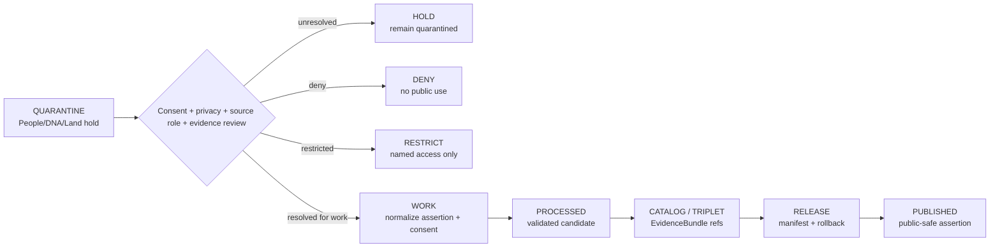

<!-- [KFM_META_BLOCK_V2]
doc_id: kfm://data/quarantine/people-dna-land/readme
name: People DNA Land Quarantine README
path: data/quarantine/people-dna-land/README.md
type: data-quarantine-index-readme
version: v0.1.0
status: draft
owners:
  - <people-dna-land-domain-steward>
  - <data-steward>
  - <privacy-reviewer>
  - <consent-reviewer>
  - <sensitivity-reviewer>
  - <release-steward>
created: 2026-06-27
updated: 2026-06-27
policy_label: restricted-review
truth_posture: cite-or-abstain
lifecycle_phase: quarantine
responsibility_root: data/
domain: people-dna-land
artifact_family: held-people-dna-land-material
sensitivity_posture: T4-default; fail-closed; no-public-path; living-person-deny-default; DNA-deny-default; private-person-parcel-join-deny-default; consent-review-required; release-blocked
related:
  - land-ownership/README.md
  - ../README.md
  - ../../README.md
  - ../../catalog/domain/people-dna-land/land-ownership/README.md
  - ../../../docs/domains/people-dna-land/SENSITIVITY.md
  - ../../../docs/domains/people-dna-land/SENSITIVITY_PROFILE.md
  - ../../../docs/domains/people-dna-land/SCOPE_AND_BOUNDARY.md
  - ../../../docs/domains/people-dna-land/sublanes/land.md
  - ../../../docs/domains/people-dna-land/sublanes/dna.md
  - ../../../docs/domains/people-dna-land/sublanes/genealogy.md
  - ../../../docs/domains/people-dna-land/SOURCE_REGISTRY.md
  - ../../../docs/domains/people-dna-land/API_CONTRACTS.md
  - ../../../packages/domains/people-dna-land/land-ownership/README.md
  - ../../../release/manifests/README.md
tags:
  - kfm
  - data
  - quarantine
  - people-dna-land
  - land-ownership
  - living-person
  - dna
  - genealogy
  - consent
  - privacy
  - person-parcel-join
  - evidence-first
notes:
  - "This README replaces the greenfield stub and documents the parent People/DNA/Land quarantine lane."
  - "Confirmed child README lane in this session: land-ownership."
  - "People/DNA/Land is a high-sensitivity lane; living-person, DNA/genomic, private person-parcel joins, and private land-ownership assertions fail closed by default."
  - "Quarantine is a hold area, not a staging shortcut to processed, catalog, triplet, published, reports, layers, PMTiles, stories, graph/vector indexes, AI answers, or public UI."
  - "Actual held payload presence, policy automation, validator wiring, CI enforcement, and review completion remain UNKNOWN unless verified."
[/KFM_META_BLOCK_V2] -->

<a id="top"></a>

# People/DNA/Land Quarantine

Parent hold lane for People/DNA/Land material that is not safe or sufficiently governed for normal processing, cataloging, publication, reporting, map rendering, story playback, graph/vector indexing, or AI-answer use.

<p>
  
  
  
  
  
  
</p>

**Quick links:** [Scope](#scope) · [Repo fit](#repo-fit) · [Confirmed child lanes](#confirmed-child-lanes) · [Proposed quarantine classes](#proposed-quarantine-classes) · [Inputs](#inputs) · [Exclusions](#exclusions) · [Directory map](#directory-map) · [Exit gates](#exit-gates) · [Forbidden shortcuts](#forbidden-shortcuts) · [Required checks](#required-checks-before-use) · [Status notes](#status-notes)

> [!CAUTION]
> `data/quarantine/people-dna-land/` is a no-public-path hold lane. Material here is not public, not processed truth, not catalog truth, not proof, not release authority, not policy authority, not consent authority, not legal/title authority, not parcel-boundary authority, not living-person truth, not DNA/genomic truth, not genealogy truth, not property-rights truth, and not an AI-answer source. Nothing in this subtree may be consumed by public clients or normal UI surfaces until a governed exit transition leaves inspectable evidence.

---

## Scope

This directory holds People/DNA/Land material when consent, privacy, source role, source rights, sensitivity, living-person status, DNA/genomic status, genealogy status, land-ownership status, person-parcel joins, title sensitivity, parcel geometry role, evidence support, validation, review record, policy decision, receipt closure, correction path, or rollback target is unresolved.

People/DNA/Land governs assertion-first person evidence, genealogy relationships, restricted DNA evidence, land instruments, ownership intervals, chain-of-title reasoning, consent, policy decisions, review, correction, graph projection, EvidenceBundle views, and rollback. This lane is high sensitivity because boundary errors can expose living people, raw DNA, private person-parcel joins, title-sensitive records, family relationships, or private holdings.

This parent lane does not make held content authoritative. It routes quarantine material so stewards can review, deny, restrict, return to work, or promote only through governed lifecycle transitions.

---

## Repo fit

| Field | Value |
|---|---|
| Path | `data/quarantine/people-dna-land/` |
| Responsibility root | `data/` |
| Lifecycle phase | `quarantine/` |
| Domain lane | `people-dna-land` |
| Artifact role | Parent hold lane for People/DNA/Land quarantine material and quarantine-local review sidecars |
| Public access posture | No public path; no normal UI; no governed-public API exposure |
| Exit posture | Only by explicit policy decision, consent/privacy/source-role/evidence closure, required receipt closure, and corrected lifecycle placement |
| Release authority | `release/`, not this directory |
| Proof authority | `data/proofs/` and `data/receipts/`, not this directory |
| Catalog authority | `data/catalog/`, not this directory |
| Registry authority | `data/registry/`, not this directory |
| Policy authority | `policy/`, not this directory |
| Consent authority | `policy/consent/` or accepted consent-control lane, not this directory |
| Default failure posture | `HOLD`, `DENY`, `RESTRICT`, or `ABSTAIN` when consent, privacy, source role, rights, evidence, sensitivity, living-person, DNA, genealogy, land-ownership, review, correction, or rollback support is insufficient |

---

## Confirmed child lanes

The child lane below is a README path confirmed by current-session GitHub fetches or edits. This table does **not** prove held payloads exist under that lane.

| Child lane | Held material | Boundary |
|---|---|---|
| [`land-ownership/`](land-ownership/README.md) | Land-ownership, parcel-context, title-sensitive, chain-of-title, assessor/tax, person-parcel, consent, and privacy-sensitive material | No public path until consent/privacy/source-role/evidence closure, receipts, review, release, correction, and rollback support exist. |

---

## Proposed quarantine classes

The People/DNA/Land doctrine and confirmed child-lane README imply additional hold classes below. They are routing guidance, not proof that child README paths or payloads exist.

| Class | Status | Typical handling |
|---|---|---|
| Living-person exposure | **PROPOSED / NEEDS VERIFICATION** | Hold when identity, residence, family relation, land holding, or contactable-person context could expose a living person. |
| DNA/genomic restriction | **PROPOSED / NEEDS VERIFICATION** | Hold raw DNA, kit tokens, segment data, DNA-derived hypotheses, or genetic relationship support unless consent/review explicitly permits use. |
| Consent unresolved | **PROPOSED / NEEDS VERIFICATION** | Hold until ConsentGrant, RevocationReceipt, allowed audience, purpose, retention, and correction path are resolved. |
| Genealogy relationship uncertainty | **PROPOSED / NEEDS VERIFICATION** | Preserve hypotheses, conflicts, and source-role limits; never collapse relationship hypotheses into person truth. |
| Private person-parcel join | **PROPOSED / NEEDS VERIFICATION** | Deny/restrict by default; public-safe path requires redaction/generalization, review, and receipt closure. |
| Land/title/parcel role collapse | **PROPOSED / NEEDS VERIFICATION** | Hold assessor-as-title, tax-as-owner, parcel-as-legal-boundary, bare map label, and silently bridged chain-of-title claims. |
| Rights unknown | **PROPOSED / NEEDS VERIFICATION** | Hold until source terms, redistribution posture, attribution, privacy terms, and permitted claims are recorded. |
| Evidence open | **PROPOSED / NEEDS VERIFICATION** | Build EvidenceBundle or deny/abstain. |
| Schema / temporal / identity defect | **PROPOSED / NEEDS VERIFICATION** | Correct person identity, assertion identity, source time, valid time, interval, retrieval time, correction time, legal-description, geometry-role, or digest closure before exit. |

> [!NOTE]
> Add child lanes only after confirming the risk class, responsibility-root fit, reviewer roles, receipt requirements, correction path, rollback target, and Directory Rules placement basis.

---

## Inputs

Accepted content is limited to held review material and quarantine-local sidecars such as:

- source pointers, person-assertion packets, identity-candidate packets, genealogy packets, relationship-hypothesis packets, DNA/genomic packets, consent packets, revocation packets, land-ownership packets, parcel-version packets, legal-description packets, chain-of-title packets, source-role packets, rights packets, sensitivity packets, or generated candidates that require quarantine;
- quarantine reason notes and `HOLD` / `DENY` / `RESTRICT` summaries;
- source-role, rights, consent, revocation, privacy, sensitivity, living-person-status, DNA/genomic-status, genealogy-status, evidence, title, geometry-role, legal-description, chain-gap, reviewer, and steward notes;
- candidate receipt drafts, such as source-role review, consent review, privacy review, redaction, validation, citation-validation, chain-of-title review, legal-description review, person-resolution review, DNA restriction review, or policy-decision drafts;
- hash/digest sidecars used to preserve chain-of-custody for held material;
- quarantine-local README files and local indexes that explain hold state without becoming proof, catalog, registry, policy, consent, release, title, parcel-boundary, person, DNA, genealogy, or AI authority.

---

## Exclusions

| Do not place here | Correct authority home |
|---|---|
| Clean RAW source mirrors that have not triggered quarantine | `data/raw/people-dna-land/` or source-specific intake |
| Ordinary WORK material that is safe to process under normal review | `data/work/people-dna-land/` |
| Validated processed People/DNA/Land objects | `data/processed/people-dna-land/` only after quarantine resolution |
| Catalog records, triplets, graph truth, or EvidenceBundle state | `data/catalog/`, triplet lanes, or proof lanes |
| EvidenceBundle / ProofPack | `data/proofs/` |
| Final validation, redaction, consent, privacy, source-role-review, DNA restriction, AI, or release receipts | `data/receipts/` |
| Release manifests, promotion decisions, correction records, rollback records, or signatures | `release/` |
| Source descriptors, activation records, source registries, or registry truth | `data/registry/` |
| Public layers, PMTiles, reports, stories, API payloads, downloads, or published artifacts | `data/published/` only after release gates close |
| Legal/title determinations, boundary certifications, marketable-title conclusions, legal advice, property-rights rulings, medical/genetic advice, or identity determinations | External authority, not KFM |
| Land-office/public-land panel data owned by Frontier Matrix | Frontier Matrix lane, not People/DNA/Land quarantine |
| Settlement, road, archaeology, hydrology, agriculture, geology, habitat, fauna, flora, soil, hazards, or infrastructure canonical truth | Owning domain lane, not People/DNA/Land quarantine |
| Semantic contracts, schemas, validators, or policy rules | `contracts/`, `schemas/`, `tools/`, `policy/` |
| Normal public UI, search, vector-index, graph, or AI-answer material | Governed public lanes only after release; otherwise abstain or deny |

---

## Directory map

```text
data/quarantine/people-dna-land/
├── README.md
├── land-ownership/
│   └── README.md
├── <future-risk-sublane>/
│   └── README.md
└── index.local.json
```

`index.local.json` is optional and must remain quarantine-local. It is not a public index, catalog record, release manifest, registry, graph edge source, layer/story/report pointer, search index, vector index, map source, title index, parcel-boundary authority, person index, DNA index, genealogy authority, or AI retrieval index.

---

## Exit gates

People/DNA/Land material may leave quarantine only when the exit path is explicit:

| Exit route | Minimum requirement |
|---|---|
| Stay held | Any unresolved source-role, consent, privacy, rights, sensitivity, living-person, DNA/genomic, genealogy, person-parcel, title, geometry-role, chain-of-title, legal-description, evidence, validation, review, or policy question remains. |
| Deny | PolicyDecision says `DENY`; public/UI/AI surfaces abstain or deny. |
| Restrict | PolicyDecision and ReviewRecord identify allowed audience, purpose, terms, consent state, redaction state, correction path, and rollback target. |
| Return to work | Hold reason is resolved, but normal validation, transformation, attribution, temporal handling, source-role review, consent review, privacy review, DNA restriction review, or EvidenceBundle work still remains. |
| Promote to processed/catalog/published | Only after required receipts, source descriptors, consent/privacy closure, source-role closure, validation closure, EvidenceBundle closure, release manifest, correction path, rollback path, and approved public-safe transform exist. |

A People/DNA/Land public surface must preserve assertion-first uncertainty, consent posture, review state, redaction state, and evidence support. It must not become legal title, legal boundary, property-rights advice, identity determination, genetic conclusion, living-person exposure surface, or unreviewed family/ownership graph.

---

## Forbidden shortcuts

```text
data/quarantine/people-dna-land/
→ data/processed/people-dna-land/
→ data/catalog/domain/people-dna-land/
→ data/published/
→ public API / MapLibre / PMTiles / report / story / graph / vector index / AI answer
```

is forbidden unless the appropriate governed transition has actually happened and left inspectable evidence.



---

## Required checks before use

- [ ] Confirm the material is People/DNA/Land-domain material and belongs under `data/quarantine/people-dna-land/`.
- [ ] Confirm the correct child sublane: `land-ownership/` or a new documented sublane.
- [ ] Confirm the hold reason is recorded using a governed reason code.
- [ ] Confirm source descriptors, source roles, authority roles, upstream citation chain, rights posture, cadence, and current terms.
- [ ] Confirm object class: Person Assertion, Person Identity Candidate, PersonCanonical candidate, NameAssertion, LifeEvent, Residence Event, Migration Event, Genealogy Relationship, Relationship Hypothesis, DNA Match Evidence, DNAKitToken, DNASegment, ConsentGrant, RevocationReceipt, Land Ownership Assertion, Ownership Interval, LandInstrument, Assessor Record, TaxRecord, Parcel Version, LandParcel, or generated carrier.
- [ ] Confirm living-person, person-parcel, DNA/genealogy, consent, revocation, and privacy overlays are checked.
- [ ] Confirm assessor/tax records are not treated as legal title and parcel geometry is not treated as a legal boundary determination.
- [ ] Confirm relationship hypotheses, chain-of-title gaps, corrected deeds, legal-description ambiguity, uncertainty, and conflicts remain visible.
- [ ] Confirm role inheritance across derivatives, joins, indexes, reports, stories, maps, graph edges, and AI carriers.
- [ ] Confirm required receipts are present or explicitly marked missing.
- [ ] Confirm PolicyDecision, consent/privacy review, ValidationReport, ReviewRecord where required, correction path, and rollback target before any exit.
- [ ] Confirm no public layer, PMTiles, report, story, API payload, graph edge, search index, vector index, or AI answer uses quarantined material.

---

## Status notes

| Claim | Status |
|---|---|
| This README replaces the greenfield stub at `data/quarantine/people-dna-land/README.md`. | **CONFIRMED authored** |
| The target path existed in the live repository as a greenfield stub before this edit. | **CONFIRMED by GitHub contents API during this edit** |
| `land-ownership/README.md` exists as a People/DNA/Land quarantine child-lane README. | **CONFIRMED by GitHub contents API during this edit** |
| People/DNA/Land boundary doctrine says the lane is T4 / deny-by-default for living people, DNA/genomic data, and private land-ownership assertions. | **CONFIRMED by GitHub contents API during this edit** |
| Land sublane doctrine says assessor/tax records and parcel geometry are not title truth, and ownership is a temporal evidence-bound assertion. | **CONFIRMED by GitHub contents API during this edit** |
| Land sublane doctrine says private person-parcel joins fail closed and require redaction/review for any lower-sensitivity path. | **CONFIRMED by GitHub contents API during this edit** |
| Actual quarantined payloads exist under every listed child lane. | **UNKNOWN** |
| Policy automation, validators, and CI checks enforce every listed People/DNA/Land quarantine lane. | **NEEDS VERIFICATION** |
| This README is proof, release, catalog, registry, policy, consent authority, legal/title authority, parcel-boundary authority, living-person truth, DNA/genomic truth, genealogy truth, property-rights truth, public artifact authority, or AI authority. | **DENY** |

---

## Related files

- [`land-ownership/README.md`](land-ownership/README.md)
- [`../README.md`](../README.md)
- [`../../README.md`](../../README.md)
- [`../../catalog/domain/people-dna-land/land-ownership/README.md`](../../catalog/domain/people-dna-land/land-ownership/README.md)
- [`../../../docs/domains/people-dna-land/SENSITIVITY.md`](../../../docs/domains/people-dna-land/SENSITIVITY.md)
- [`../../../docs/domains/people-dna-land/SENSITIVITY_PROFILE.md`](../../../docs/domains/people-dna-land/SENSITIVITY_PROFILE.md)
- [`../../../docs/domains/people-dna-land/SCOPE_AND_BOUNDARY.md`](../../../docs/domains/people-dna-land/SCOPE_AND_BOUNDARY.md)
- [`../../../docs/domains/people-dna-land/sublanes/land.md`](../../../docs/domains/people-dna-land/sublanes/land.md)
- [`../../../docs/domains/people-dna-land/sublanes/dna.md`](../../../docs/domains/people-dna-land/sublanes/dna.md)
- [`../../../docs/domains/people-dna-land/sublanes/genealogy.md`](../../../docs/domains/people-dna-land/sublanes/genealogy.md)
- [`../../../docs/domains/people-dna-land/SOURCE_REGISTRY.md`](../../../docs/domains/people-dna-land/SOURCE_REGISTRY.md)
- [`../../../docs/domains/people-dna-land/API_CONTRACTS.md`](../../../docs/domains/people-dna-land/API_CONTRACTS.md)
- [`../../../packages/domains/people-dna-land/land-ownership/README.md`](../../../packages/domains/people-dna-land/land-ownership/README.md)
- [`../../../release/manifests/README.md`](../../../release/manifests/README.md)

---

KFM rule: this directory is a People/DNA/Land quarantine hold index only. It is not source authority, proof authority, receipt authority, release authority, catalog authority, registry authority, policy authority, consent authority, legal/title authority, parcel-boundary authority, living-person truth, DNA/genomic truth, genealogy truth, property-rights truth, public artifact authority, UI authority, graph authority, vector-index authority, or AI truth.

[Back to top](#top)
