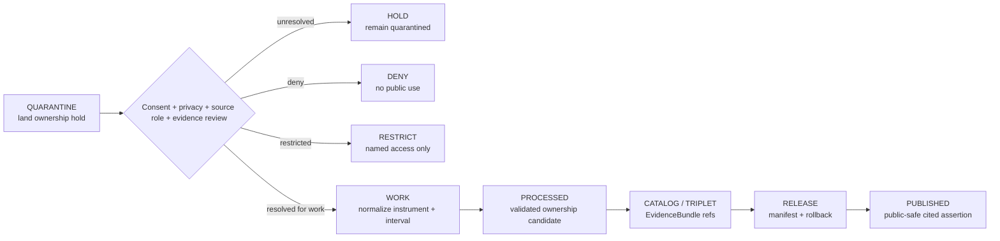

<!-- [KFM_META_BLOCK_V2]
doc_id: kfm://data/quarantine/people-dna-land/land-ownership/readme
name: People DNA Land Land Ownership Quarantine README
path: data/quarantine/people-dna-land/land-ownership/README.md
type: data-quarantine-lane-readme
version: v0.1.0
status: draft
owners:
  - <people-dna-land-domain-steward>
  - <land-ownership-steward>
  - <data-steward>
  - <privacy-reviewer>
  - <consent-reviewer>
  - <release-steward>
created: 2026-06-27
updated: 2026-06-27
policy_label: restricted-review
truth_posture: cite-or-abstain
lifecycle_phase: quarantine
responsibility_root: data/
domain: people-dna-land
sublane: land-ownership
artifact_family: held-land-ownership-material
sensitivity_posture: T4-default; fail-closed; no-public-path; living-person-deny-default; private-person-parcel-join-deny-default; consent-review-required; release-blocked
related:
  - ../README.md
  - ../../README.md
  - ../../../README.md
  - ../../../catalog/domain/people-dna-land/land-ownership/README.md
  - ../../../../docs/domains/people-dna-land/SENSITIVITY.md
  - ../../../../docs/domains/people-dna-land/SENSITIVITY_PROFILE.md
  - ../../../../docs/domains/people-dna-land/SCOPE_AND_BOUNDARY.md
  - ../../../../docs/domains/people-dna-land/sublanes/land.md
  - ../../../../docs/domains/people-dna-land/SOURCE_REGISTRY.md
  - ../../../../docs/domains/people-dna-land/API_CONTRACTS.md
  - ../../../../packages/domains/people-dna-land/land-ownership/README.md
  - ../../../../release/manifests/README.md
tags:
  - kfm
  - data
  - quarantine
  - people-dna-land
  - land-ownership
  - living-person
  - person-parcel-join
  - chain-of-title
  - assessor-not-title
  - parcel-not-boundary
  - consent
  - privacy
  - evidence-first
notes:
  - "This README documents the quarantine lane for People/DNA/Land land-ownership material."
  - "People/DNA/Land is a high-sensitivity lane; living-person, DNA, private person-parcel joins, and DNA-derived outputs fail closed by default."
  - "Assessor/tax records and parcel geometry are not title truth; ownership is temporal, interval-valued, evidence-bound, and not a bare map label."
  - "Quarantine is a hold state, not a staging shortcut to processed, catalog, triplet, published, reports, layers, PMTiles, stories, graph/vector indexes, AI answers, or public UI."
  - "Actual payload presence, policy automation, validator wiring, CI enforcement, and review completion remain UNKNOWN unless verified."
[/KFM_META_BLOCK_V2] -->

<a id="top"></a>

# People/DNA/Land Land-Ownership Quarantine

Held land-ownership, parcel-context, title-sensitive, chain-of-title, assessor/tax, person-parcel, consent, and privacy-sensitive material pending evidence, role, rights, consent, sensitivity, validation, review, release, correction, and rollback closure.

<p>
  
  
  
  
  
  
</p>

**Quick links:** [Scope](#scope) · [Repo fit](#repo-fit) · [Held material](#held-material) · [Inputs](#inputs) · [Exclusions](#exclusions) · [Directory map](#directory-map) · [Exit gates](#exit-gates) · [Forbidden shortcuts](#forbidden-shortcuts) · [Required checks](#required-checks-before-use) · [Status notes](#status-notes)

> [!CAUTION]
> `data/quarantine/people-dna-land/land-ownership/` is a no-public-path hold lane. Material here is not public, not processed truth, not catalog truth, not proof, not release authority, not policy authority, not consent authority, not legal/title authority, not parcel-boundary authority, not living-person truth, not DNA/genealogy truth, not property-rights truth, and not an AI-answer source. Nothing in this lane may be consumed by public clients or normal UI surfaces until a governed exit transition leaves inspectable evidence.

---

## Scope

This directory may hold People/DNA/Land land-ownership material when source role, source rights, living-person status, consent state, privacy posture, title sensitivity, chain-of-title continuity, parcel geometry role, legal-description interpretation, evidence support, validation, review record, policy decision, receipt closure, correction path, or rollback target is unresolved.

Typical reasons for quarantine include:

- an assessor or tax record is being used as legal title proof;
- parcel geometry is being treated as a legal boundary determination;
- a land-ownership claim appears as a bare map label without an `EvidenceBundle`, interval, source role, and uncertainty posture;
- a private person-parcel join exposes or narrows a living person's holdings, residence, family connection, or land interest;
- a DNA-supported person assertion, genealogy relationship, probate relation, heirship claim, or family hypothesis is being used to strengthen an ownership claim without consent, review, and evidence closure;
- a chain-of-title candidate silently bridges gaps, conflicts, ambiguous conveyances, corrected deeds, or unresolved legal descriptions;
- land-instrument, deed, title, tax, assessor, parcel, probate, mineral, water-right, easement, lease, mortgage, lien, or access records have unresolved source role, source terms, rights, or restrictions;
- a public layer, story, report, graph edge, vector index, search index, or AI-drafted answer could leak living-person, parcel, title, DNA/genealogy, ownership, or private-land context before release gates close.

This lane preserves held material for review without allowing accidental promotion, publication, rendering, indexing, downloading, story playback, graph/vector use, or AI-answer use.

---

## Repo fit

| Field | Value |
|---|---|
| Path | `data/quarantine/people-dna-land/land-ownership/` |
| Responsibility root | `data/` |
| Lifecycle phase | `quarantine/` |
| Domain lane | `people-dna-land` |
| Sublane | `land-ownership` |
| Artifact role | Held land-ownership, chain-of-title, parcel, title-sensitive, privacy-sensitive, and consent-sensitive material plus quarantine-local review sidecars |
| Public access posture | No public path; no normal UI; no governed-public API exposure |
| Exit posture | Only by explicit policy decision, consent/privacy/source-role/evidence closure, required receipt closure, and corrected lifecycle placement |
| Release authority | `release/`, not this directory |
| Proof authority | `data/proofs/` and `data/receipts/`, not this directory |
| Catalog authority | `data/catalog/`, not this directory |
| Registry authority | `data/registry/`, not this directory |
| Policy authority | `policy/`, not this directory |
| Consent authority | `policy/consent/` or accepted consent-control lane, not this directory |
| Default failure posture | `HOLD`, `DENY`, `RESTRICT`, or `ABSTAIN` when consent, privacy, source role, rights, evidence, sensitivity, title posture, geometry role, review, correction, or rollback support is insufficient |

---

## Held material

Material belongs here when land-ownership material is not safe or sufficiently governed for `work`, `processed`, `catalog`, `published`, report, story, layer, graph, search, vector-index, or AI-answer use.

| Held family | Why it is held |
|---|---|
| Assessor/tax-as-title candidates | Assessor and tax records are administrative context, not legal title truth. |
| Parcel-as-boundary candidates | Parcel polygons are administrative/cartographic footprints, not legal boundary determinations. |
| Bare ownership labels | Ownership claims require evidence, interval, source role, uncertainty, review, and release state. |
| Private person-parcel joins | Living-person holdings and residence/property links fail closed by default. |
| DNA/genealogy-derived ownership support | DNA and genealogy may support person assertions only under consent/review; they do not prove ownership or boundaries. |
| Chain-of-title gap candidates | Gaps, conflicts, corrected instruments, probate ambiguity, and legal-description uncertainty must remain visible. |
| Rights/consent/source-role unknown packets | Source terms, consent grants, revocations, permitted uses, or current terms are unresolved. |
| Generated or indexed carriers | Search, vector, story, report, map, graph, or AI artifacts must not leak restricted ownership or parcel context. |

---

## Inputs

Accepted content is limited to held review material and quarantine-local sidecars such as:

- source pointers, land-instrument packets, deed/title packets, assessor/tax packets, parcel-version packets, legal-description packets, ownership-assertion packets, ownership-interval packets, chain-of-title packets, consent packets, privacy packets, source-role packets, rights packets, sensitivity packets, or generated candidates that require quarantine;
- quarantine reason notes and `HOLD` / `DENY` / `RESTRICT` summaries;
- source-role, rights, consent, revocation, privacy, sensitivity, living-person-status, evidence, title, geometry-role, legal-description, chain-gap, reviewer, and steward notes;
- candidate receipt drafts, such as source-role review, consent review, privacy review, redaction, validation, citation-validation, chain-of-title review, legal-description review, or policy-decision drafts;
- hash/digest sidecars used to preserve chain-of-custody for held material;
- quarantine-local README files that explain hold state without becoming proof, catalog, registry, policy, consent, release, title, parcel-boundary, or AI authority.

---

## Exclusions

| Do not place here | Correct authority home |
|---|---|
| Clean RAW source mirrors that have not triggered quarantine | `data/raw/people-dna-land/` or source-specific intake |
| Ordinary WORK material that is safe to process under normal review | `data/work/people-dna-land/` |
| Validated processed People/DNA/Land objects | `data/processed/people-dna-land/` only after quarantine resolution |
| Catalog records, triplets, graph truth, or EvidenceBundle state | `data/catalog/`, triplet lanes, or proof lanes |
| EvidenceBundle / ProofPack | `data/proofs/` |
| Final validation, redaction, consent, privacy, source-role-review, AI, or release receipts | `data/receipts/` |
| Release manifests, promotion decisions, correction records, rollback records, or signatures | `release/` |
| Source descriptors, activation records, source registries, or registry truth | `data/registry/` |
| Public layers, PMTiles, reports, stories, API payloads, downloads, or published artifacts | `data/published/` only after release gates close |
| Legal/title determinations, boundary certifications, marketable-title conclusions, legal advice, or property-rights rulings | External legal/recording authority, not KFM |
| Land-office/public-land panel data owned by Frontier Matrix | Frontier Matrix lane, not land-ownership quarantine |
| Settlement, road, archaeology, hydrology, agriculture, geology, habitat, fauna, flora, or infrastructure canonical truth | Owning domain lane, not People/DNA/Land quarantine |
| Semantic contracts, schemas, validators, or policy rules | `contracts/`, `schemas/`, `tools/`, `policy/` |
| Normal public UI, search, vector-index, graph, or AI-answer material | Governed public lanes only after release; otherwise abstain or deny |

---

## Directory map

```text
data/quarantine/people-dna-land/land-ownership/
├── README.md
├── <hold_id>/
│   ├── land_ownership_packet.json
│   ├── source_refs.json
│   ├── quarantine_reason.md
│   ├── consent_review.notes.md
│   ├── privacy_review.notes.md
│   ├── source_role_review.notes.md
│   ├── title_boundary_review.notes.md
│   ├── chain_of_title_review.notes.md
│   ├── legal_description_review.notes.md
│   ├── policy_decision.draft.json
│   ├── receipt_closure.checklist.md
│   ├── land_ownership_packet.sha256
│   └── README.md
└── index.local.json
```

`index.local.json` is optional and must remain quarantine-local. It is not a public index, catalog record, release manifest, registry, graph edge source, layer/story/report pointer, search index, vector index, map source, title index, parcel-boundary authority, or AI retrieval index.

---

## Exit gates

Land-ownership material may leave this lane only when the exit path is explicit:

| Exit route | Minimum requirement |
|---|---|
| Stay held | Any unresolved source-role, consent, privacy, rights, sensitivity, living-person, person-parcel, title, geometry-role, chain-of-title, legal-description, evidence, validation, review, or policy question remains. |
| Deny | PolicyDecision says `DENY`; public/UI/AI surfaces abstain or deny. |
| Restrict | PolicyDecision and ReviewRecord identify allowed audience, purpose, terms, consent state, redaction state, correction path, and rollback target. |
| Return to work | Hold reason is resolved, but normal validation, transformation, attribution, temporal handling, source-role review, consent review, or EvidenceBundle work still remains. |
| Promote to processed/catalog/published | Only after required receipts, source descriptors, consent/privacy closure, source-role closure, validation closure, EvidenceBundle closure, release manifest, correction path, rollback path, and approved public-safe transform exist. |

A land-ownership public surface must preserve that ownership is an evidence-bound assertion with interval and uncertainty. It must not become legal title, legal boundary, property-rights advice, or a living-person exposure surface.

---

## Forbidden shortcuts

```text
data/quarantine/people-dna-land/land-ownership/
→ data/processed/people-dna-land/
→ data/catalog/domain/people-dna-land/land-ownership/
→ data/published/
→ public API / MapLibre / PMTiles / report / story / graph / vector index / AI answer
```

is forbidden unless the appropriate governed transition has actually happened and left inspectable evidence.



---

## Required checks before use

- [ ] Confirm the material is People/DNA/Land land-ownership material and belongs under `data/quarantine/people-dna-land/land-ownership/`.
- [ ] Confirm the hold reason is recorded using a governed reason code.
- [ ] Confirm source descriptors, source roles, authority roles, upstream citation chain, rights posture, cadence, and current terms.
- [ ] Confirm object class: Land Ownership Assertion, Ownership Interval, LandInstrument, Deed Instrument, Title Instrument, LegalDescription, Assessor Record, TaxRecord, Parcel Version, LandParcel, chain-of-title candidate, consent record, or generated carrier.
- [ ] Confirm assessor/tax records are not being treated as legal title.
- [ ] Confirm parcel geometry is not being treated as a legal boundary determination.
- [ ] Confirm living-person, person-parcel, DNA/genealogy, probate/heirship, consent, revocation, and privacy overlays are checked.
- [ ] Confirm chain-of-title gaps, corrected deeds, legal-description ambiguity, uncertainty, and conflicts remain visible.
- [ ] Confirm role inheritance across derivatives, joins, indexes, reports, stories, maps, graph edges, and AI carriers.
- [ ] Confirm required receipts are present or explicitly marked missing.
- [ ] Confirm PolicyDecision, consent/privacy review, ValidationReport, ReviewRecord where required, correction path, and rollback target before any exit.
- [ ] Confirm no public layer, PMTiles, report, story, API payload, graph edge, search index, vector index, or AI answer uses quarantined material.

---

## Status notes

| Claim | Status |
|---|---|
| This README defines the requested quarantine path boundary. | **CONFIRMED authored** |
| The target path exists in the live repository as an empty file before this edit. | **CONFIRMED by GitHub contents API during this edit** |
| The parent `data/quarantine/people-dna-land/README.md` is currently only a greenfield stub. | **CONFIRMED by GitHub contents API during this edit** |
| People/DNA/Land boundary doctrine says the lane is T4 / deny-by-default for living people, DNA/genomic data, and private land-ownership assertions. | **CONFIRMED by GitHub contents API during this edit** |
| Land sublane doctrine says assessor/tax records and parcel geometry are not title truth, and ownership is a temporal evidence-bound assertion. | **CONFIRMED by GitHub contents API during this edit** |
| Land sublane doctrine says private person-parcel joins fail closed and require redaction/review for any lower-sensitivity path. | **CONFIRMED by GitHub contents API during this edit** |
| Actual land-ownership quarantine payloads exist in this subtree. | **UNKNOWN** |
| Policy automation, validators, and CI checks enforce this exact quarantine lane. | **NEEDS VERIFICATION** |
| This README is proof, release, catalog, registry, policy, consent authority, legal/title authority, parcel-boundary authority, living-person truth, DNA/genealogy truth, property-rights truth, public artifact authority, or AI authority. | **DENY** |

---

## Related files

- [`../README.md`](../README.md)
- [`../../README.md`](../../README.md)
- [`../../../README.md`](../../../README.md)
- [`../../../catalog/domain/people-dna-land/land-ownership/README.md`](../../../catalog/domain/people-dna-land/land-ownership/README.md)
- [`../../../../docs/domains/people-dna-land/SENSITIVITY.md`](../../../../docs/domains/people-dna-land/SENSITIVITY.md)
- [`../../../../docs/domains/people-dna-land/SENSITIVITY_PROFILE.md`](../../../../docs/domains/people-dna-land/SENSITIVITY_PROFILE.md)
- [`../../../../docs/domains/people-dna-land/SCOPE_AND_BOUNDARY.md`](../../../../docs/domains/people-dna-land/SCOPE_AND_BOUNDARY.md)
- [`../../../../docs/domains/people-dna-land/sublanes/land.md`](../../../../docs/domains/people-dna-land/sublanes/land.md)
- [`../../../../docs/domains/people-dna-land/SOURCE_REGISTRY.md`](../../../../docs/domains/people-dna-land/SOURCE_REGISTRY.md)
- [`../../../../docs/domains/people-dna-land/API_CONTRACTS.md`](../../../../docs/domains/people-dna-land/API_CONTRACTS.md)
- [`../../../../packages/domains/people-dna-land/land-ownership/README.md`](../../../../packages/domains/people-dna-land/land-ownership/README.md)
- [`../../../../release/manifests/README.md`](../../../../release/manifests/README.md)

---

KFM rule: this directory is a People/DNA/Land land-ownership quarantine hold lane only. It is not source authority, proof authority, receipt authority, release authority, catalog authority, registry authority, policy authority, consent authority, legal/title authority, parcel-boundary authority, living-person truth, DNA/genealogy truth, property-rights truth, public artifact authority, UI authority, graph authority, vector-index authority, or AI truth.

[Back to top](#top)
