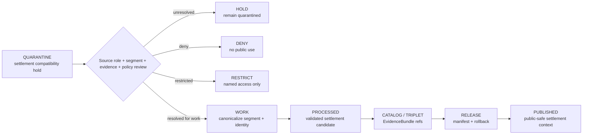

<!-- [KFM_META_BLOCK_V2]
doc_id: kfm://data/quarantine/settlement/readme
name: Settlement Quarantine Compatibility README
path: data/quarantine/settlement/README.md
type: data-quarantine-index-readme; compatibility-lane-readme
version: v0.1.0
status: draft
owners:
  - <settlements-infrastructure-lane-steward>
  - <settlement-identity-steward>
  - <data-steward>
  - <sensitivity-reviewer>
  - <release-steward>
created: 2026-06-27
updated: 2026-06-27
policy_label: restricted-review
truth_posture: cite-or-abstain
lifecycle_phase: quarantine
responsibility_root: data/
domain: settlement
canonical_domain_candidate: settlements-infrastructure
artifact_family: held-settlement-compatibility-material
sensitivity_posture: compatibility-path; segment-conflicted; fail-closed; no-public-path; source-role-preservation-required; release-blocked
related:
  - ../README.md
  - ../../README.md
  - ../settlements-infrastructure/README.md
  - ../../processed/settlement/README.md
  - ../../processed/settlements-infrastructure/README.md
  - ../../catalog/domain/settlements-infrastructure/README.md
  - ../../../docs/domains/settlements-infrastructure/CANONICAL_PATHS.md
  - ../../../docs/domains/settlements-infrastructure/DATA_LIFECYCLE.md
  - ../../../docs/domains/settlements-infrastructure/SOURCE_REGISTRY.md
  - ../../../docs/domains/settlements-infrastructure/API_CONTRACTS.md
  - ../../../docs/runbooks/settlements-infrastructure/PROMOTION_RUNBOOK.md
  - ../../../release/manifests/README.md
tags:
  - kfm
  - data
  - quarantine
  - settlement
  - settlements-infrastructure
  - compatibility-path
  - segment-conflict
  - settlement-identity
  - municipality
  - census-place
  - ghost-town
  - infrastructure-sensitivity
  - evidence-first
notes:
  - "This README documents the requested `data/quarantine/settlement/` path as a PROPOSED compatibility quarantine lane, not canonical domain authority."
  - "Current Settlements/Infrastructure doctrine documents a domain-segment conflict between `settlements-infrastructure` and `settlement`; this README must not create a parallel authority root."
  - "The canonical working domain slug in the visible doctrine is `settlements-infrastructure`, while `settlement` is a conflicted short form pending ADR/drift resolution."
  - "Quarantine is a hold area, not a staging shortcut to processed, catalog, triplet, published, reports, layers, PMTiles, stories, graph/vector indexes, AI answers, or public UI."
  - "Actual held payload presence, policy automation, validator wiring, CI enforcement, ADR resolution, and review completion remain UNKNOWN unless verified."
[/KFM_META_BLOCK_V2] -->

<a id="top"></a>

# Settlement Quarantine Compatibility Lane

Compatibility quarantine index for held settlement/place-identity material associated with the Settlements/Infrastructure domain, while the `settlement` versus `settlements-infrastructure` segment conflict remains unresolved.

<p>
  
  
  
  
  
  
</p>

**Quick links:** [Canonical path warning](#canonical-path-warning) · [Scope](#scope) · [Repo fit](#repo-fit) · [Confirmed child lanes](#confirmed-child-lanes) · [Proposed quarantine classes](#proposed-quarantine-classes) · [Inputs](#inputs) · [Exclusions](#exclusions) · [Directory map](#directory-map) · [Exit gates](#exit-gates) · [Forbidden shortcuts](#forbidden-shortcuts) · [Required checks](#required-checks-before-use) · [Status notes](#status-notes)

> [!CAUTION]
> `data/quarantine/settlement/` is a no-public-path compatibility hold lane. Material here is not public, not processed truth, not catalog truth, not proof, not release authority, not policy authority, not canonical settlement identity truth, not infrastructure asset truth, not legal-status authority, not emergency or critical-asset authority, and not an AI-answer source. Nothing in this subtree may be consumed by public clients or normal UI surfaces until a governed exit transition leaves inspectable evidence and the segment conflict is resolved or explicitly bridged by ADR.

---

## Canonical path warning

Visible Settlements/Infrastructure doctrine records a segment-name conflict:

- `settlements-infrastructure` is the working canonical domain segment in Directory Rules-derived domain documentation.
- `settlement` appears as a conflicted Atlas/crosswalk short form.
- This README therefore treats `data/quarantine/settlement/` as **PROPOSED compatibility**, not canonical authority.

The visible canonical/working quarantine target is:

```text
data/quarantine/settlements-infrastructure/
```

That parent path currently exists as a greenfield stub. This README must not harden `settlement/` into a parallel schema, contract, policy, source, registry, proof, release, or public lane.

---

## Scope

This directory may hold settlement/place-identity quarantine material only when the repository intentionally uses or preserves the singular `settlement/` segment as a compatibility bridge.

Typical reasons for quarantine include:

- settlement legal status is ambiguous or collapsed with CensusPlace, townsite, ghost-town, fort, mission, reservation-community, or historic-place context;
- census place and municipality records collide under one identifier;
- source role is unresolved, stale, overclaimed, or collapsed across legal authority, census geography, gazetteer, historic source, map label, model, aggregate, administrative record, candidate, or synthetic summary;
- source rights, current terms, attribution, redistribution, or source activation state is unresolved;
- geometry precision is too exact for a vulnerable facility, critical asset, cultural/archaeology adjacency, private-land/person relation, or other sensitivity tier;
- infrastructure, operator, condition-observation, dependency, service-area, or facility detail leaks into the settlement compatibility lane without the owning Settlements/Infrastructure controls;
- cited Roads/Rail, Hydrology, Hazards, People/Land, Archaeology, or other cross-lane evidence is stale, corrected, quarantined, restricted, missing, or not rebound;
- a public layer, story, report, graph edge, vector index, search index, or AI-drafted answer could leak unreleased settlement/place identity, over-precise geometry, critical-asset context, or unreviewed cross-lane claims.

This lane preserves held material for review without allowing accidental promotion, publication, rendering, indexing, downloading, story playback, graph/vector use, or AI-answer use.

---

## Repo fit

| Field | Value |
|---|---|
| Path | `data/quarantine/settlement/` |
| Responsibility root | `data/` |
| Lifecycle phase | `quarantine/` |
| Requested segment | `settlement` |
| Working canonical candidate | `settlements-infrastructure` |
| Segment status | **CONFLICTED / PROPOSED compatibility** pending ADR/drift resolution |
| Artifact role | Held settlement/place-identity compatibility material and quarantine-local review sidecars |
| Public access posture | No public path; no normal UI; no governed-public API exposure |
| Exit posture | Only by explicit policy decision, source-role/evidence/rights/sensitivity closure, required receipt closure, corrected lifecycle placement, and ADR-aware path handling |
| Release authority | `release/`, not this directory |
| Proof authority | `data/proofs/` and `data/receipts/`, not this directory |
| Catalog authority | `data/catalog/`, not this directory |
| Registry authority | `data/registry/`, not this directory |
| Policy authority | `policy/`, not this directory |
| Default failure posture | `HOLD`, `DENY`, `RESTRICT`, or `ABSTAIN` when source role, rights, evidence, sensitivity, geometry precision, identity, legal status, review, correction, rollback, or segment authority is insufficient |

---

## Confirmed child lanes

No `data/quarantine/settlement/` child-lane README paths were confirmed during this edit. This parent index is confirmed as authored, but child routing remains proposed until a child README path is created and verified.

| Child lane | Status | Notes |
|---|---|---|
| `<none confirmed>` | **UNKNOWN** | Do not infer payloads, validators, source descriptors, release gates, or CI coverage from this parent README. |

---

## Proposed quarantine classes

The Settlements/Infrastructure lifecycle doctrine and current compatibility-path evidence imply the hold classes below. They are routing guidance, not proof that child README paths or payloads exist.

| Class | Status | Typical handling |
|---|---|---|
| Rights unresolved | **PROPOSED / NEEDS VERIFICATION** | Hold until source terms, redistribution posture, attribution, and `SourceDescriptor` activation are resolved. |
| Legal-status ambiguous | **PROPOSED / NEEDS VERIFICATION** | Split legal municipality, CensusPlace, townsite, ghost-town, fort, mission, or historic-place roles. |
| Census-vs-municipality collision | **PROPOSED / NEEDS VERIFICATION** | Re-key with object-role distinction; do not force one shared ID. |
| Restricted geometry precision | **PROPOSED / NEEDS VERIFICATION** | Generalize, suppress, aggregate, or deny when exact geometry exceeds release tier. |
| Critical infrastructure unreviewed | **PROPOSED / NEEDS VERIFICATION** | Require ReviewRecord, PolicyDecision, redaction/generalization, and release approval before public use. |
| Operator identity disclosed | **PROPOSED / NEEDS VERIFICATION** | Redact, restrict, embargo, or deny operator-sensitive fields. |
| Cross-lane citation stale | **PROPOSED / NEEDS VERIFICATION** | Re-bind to current evidence or keep held when cited Roads/Rail, Hydrology, Hazards, People/Land, or Archaeology evidence is stale/quarantined/restricted. |
| Temporal collision | **PROPOSED / NEEDS VERIFICATION** | Separate source, observed, valid, retrieval, release, and correction times. |
| Segment conflict unresolved | **PROPOSED / NEEDS VERIFICATION** | Keep compatibility path non-authoritative until ADR or migration note resolves `settlement` vs `settlements-infrastructure`. |

> [!NOTE]
> Add child lanes only after confirming the risk class, responsibility-root fit, reviewer roles, receipt requirements, correction path, rollback target, and Directory Rules placement basis.

---

## Inputs

Accepted content is limited to held review material and quarantine-local sidecars such as:

- source pointers, settlement/place candidate packets, municipality packets, CensusPlace packets, townsite packets, ghost-town packets, fort/mission packets, reservation-community packets, geometry packets, rights packets, source-role packets, sensitivity packets, legal-status packets, temporal packets, cross-lane citation packets, or generated candidates that require quarantine;
- quarantine reason notes and `HOLD` / `DENY` / `RESTRICT` summaries;
- source-role, rights, source-version, identity, legal-status, geometry, sensitivity, redaction, aggregation, temporal, cross-lane evidence, reviewer, and steward notes;
- candidate receipt drafts, such as source-role review, rights review, validation, transform, redaction, aggregation, citation-validation, temporal-role review, authority-review, or policy-decision drafts;
- hash/digest sidecars used to preserve chain-of-custody for held material;
- quarantine-local README files and local indexes that explain hold state without becoming proof, catalog, registry, policy, release, canonical path, public-layer, or AI authority.

---

## Exclusions

| Do not place here | Correct authority home |
|---|---|
| Clean RAW source mirrors that have not triggered quarantine | `data/raw/settlements-infrastructure/` or source-specific intake |
| Ordinary WORK material that is safe to process under normal review | `data/work/settlements-infrastructure/` |
| Validated processed settlement/place objects | `data/processed/settlements-infrastructure/` or ADR-approved compatibility lane only after quarantine resolution |
| Catalog records, triplets, graph truth, or EvidenceBundle state | `data/catalog/`, triplet lanes, or proof lanes |
| EvidenceBundle / ProofPack | `data/proofs/` |
| Final validation, redaction, aggregation, source-role-review, AI, or release receipts | `data/receipts/` |
| Release manifests, promotion decisions, correction records, rollback records, or signatures | `release/` |
| Source descriptors, activation records, source registries, or registry truth | `data/registry/` |
| Public layers, PMTiles, reports, stories, API payloads, downloads, or published artifacts | `data/published/` only after release gates close |
| Critical infrastructure asset authority, condition-observation truth, dependency truth, operator-sensitive detail, or facility operations | Settlements/Infrastructure governed lanes and policy controls, not this compatibility path |
| Roads/Rail, Hydrology, Hazards, People/Land, Archaeology, Agriculture, Geology, Habitat, Fauna, Flora, Soil, or Frontier Matrix canonical truth | Owning domain lane, not Settlement quarantine compatibility |
| Semantic contracts, schemas, validators, or policy rules | `contracts/`, `schemas/`, `tools/`, `policy/` |
| Normal public UI, search, vector-index, graph, or AI-answer material | Governed public lanes only after release; otherwise abstain or deny |

---

## Directory map

```text
data/quarantine/settlement/
├── README.md
├── <future-risk-sublane>/
│   └── README.md
└── index.local.json
```

`index.local.json` is optional and must remain quarantine-local. It is not a public index, catalog record, release manifest, registry, graph edge source, layer/story/report pointer, search index, vector index, map source, canonical settlement index, critical-asset index, or AI retrieval index.

---

## Exit gates

Settlement compatibility material may leave quarantine only when the exit path is explicit:

| Exit route | Minimum requirement |
|---|---|
| Stay held | Any unresolved source-role, rights, sensitivity, identity, legal status, geometry precision, cross-lane evidence, temporal state, validation, review, policy, or segment-authority question remains. |
| Deny | PolicyDecision says `DENY`; public/UI/AI surfaces abstain or deny. |
| Restrict | PolicyDecision and ReviewRecord identify allowed audience, purpose, terms, redaction state, correction path, rollback target, and canonical path handling. |
| Return to work | Hold reason is resolved, but normal validation, transformation, attribution, temporal handling, source-role review, cross-lane evidence rebind, or EvidenceBundle work still remains. |
| Promote to processed/catalog/published | Only after required receipts, source descriptors, source-role closure, validation closure, EvidenceBundle closure, ReleaseManifest, correction path, rollback path, approved public-safe transform, and ADR-aware path decision exist. |

A more public tier requires transform receipt and review record. A more restrictive correction can happen immediately when risk is discovered.

---

## Forbidden shortcuts

```text
data/quarantine/settlement/
→ data/processed/settlement/ or data/processed/settlements-infrastructure/
→ data/catalog/
→ data/published/
→ public API / MapLibre / PMTiles / report / story / graph / vector index / AI answer
```

is forbidden unless the appropriate governed transition has actually happened and left inspectable evidence.



---

## Required checks before use

- [ ] Confirm the material is Settlement or Settlements/Infrastructure-domain material and belongs under this compatibility path rather than the canonical `settlements-infrastructure` lane.
- [ ] Confirm the segment conflict is recorded as `CONFLICTED` / compatibility and not silently promoted to canonical authority.
- [ ] Confirm the hold reason is recorded using a governed reason code.
- [ ] Confirm source descriptors, source roles, authority roles, upstream citation chain, rights posture, cadence, and current terms.
- [ ] Confirm object class: Settlement, Municipality, CensusPlace, Townsite, GhostTown, Fort, Mission, ReservationCommunity, or a generated settlement/place carrier.
- [ ] Confirm settlement legal status, census role, historic role, gazetteer role, geometry role, source vintage, and temporal scope remain distinct.
- [ ] Confirm critical-infrastructure, operator, facility, condition-observation, dependency, person/land, archaeology, hydrology, hazards, and roads/rail joins follow the owning lane's policy.
- [ ] Confirm public-safe geometry exists whenever sensitivity, cross-lane context, or source terms require it.
- [ ] Confirm no style-only hiding is used as a sensitivity control.
- [ ] Confirm required receipts are present or explicitly marked missing.
- [ ] Confirm PolicyDecision, ValidationReport, ReviewRecord where required, correction path, rollback target, and ADR-aware path handling before any exit.
- [ ] Confirm no public layer, PMTiles, report, story, API payload, graph edge, search index, vector index, or AI answer uses quarantined material.

---

## Status notes

| Claim | Status |
|---|---|
| This README defines the requested quarantine path boundary. | **CONFIRMED authored** |
| The target path exists in the live repository as an empty file before this edit. | **CONFIRMED by GitHub contents API during this edit** |
| Settlements/Infrastructure canonical-path doctrine identifies `settlements-infrastructure` as the working canonical domain segment and `settlement` as a conflicted short form. | **CONFIRMED by GitHub contents API during this edit** |
| `data/quarantine/settlements-infrastructure/README.md` exists but is currently only a greenfield stub. | **CONFIRMED by GitHub contents API during this edit** |
| `data/processed/settlement/README.md` exists and treats `settlement` as a PROPOSED compatibility path. | **CONFIRMED by GitHub contents API during this edit** |
| Settlements/Infrastructure lifecycle doctrine lists settlement/infrastructure quarantine reasons including rights, legal status ambiguity, census/municipality collision, restricted geometry, critical infrastructure, operator disclosure, stale cross-lane citations, and temporal collision. | **CONFIRMED by GitHub contents API during this edit** |
| Actual settlement quarantine payloads exist in this subtree. | **UNKNOWN** |
| Policy automation, validators, and CI checks enforce this exact quarantine compatibility lane. | **NEEDS VERIFICATION** |
| This README is proof, release, catalog, registry, policy, canonical path authority, settlement identity truth, infrastructure asset truth, legal-status authority, public artifact authority, or AI authority. | **DENY** |

---

## Related files

- [`../README.md`](../README.md)
- [`../../README.md`](../../README.md)
- [`../settlements-infrastructure/README.md`](../settlements-infrastructure/README.md)
- [`../../processed/settlement/README.md`](../../processed/settlement/README.md)
- [`../../processed/settlements-infrastructure/README.md`](../../processed/settlements-infrastructure/README.md)
- [`../../catalog/domain/settlements-infrastructure/README.md`](../../catalog/domain/settlements-infrastructure/README.md)
- [`../../../docs/domains/settlements-infrastructure/CANONICAL_PATHS.md`](../../../docs/domains/settlements-infrastructure/CANONICAL_PATHS.md)
- [`../../../docs/domains/settlements-infrastructure/DATA_LIFECYCLE.md`](../../../docs/domains/settlements-infrastructure/DATA_LIFECYCLE.md)
- [`../../../docs/domains/settlements-infrastructure/SOURCE_REGISTRY.md`](../../../docs/domains/settlements-infrastructure/SOURCE_REGISTRY.md)
- [`../../../docs/domains/settlements-infrastructure/API_CONTRACTS.md`](../../../docs/domains/settlements-infrastructure/API_CONTRACTS.md)
- [`../../../docs/runbooks/settlements-infrastructure/PROMOTION_RUNBOOK.md`](../../../docs/runbooks/settlements-infrastructure/PROMOTION_RUNBOOK.md)
- [`../../../release/manifests/README.md`](../../../release/manifests/README.md)

---

KFM rule: this directory is a Settlement quarantine compatibility hold lane only. It is not source authority, proof authority, receipt authority, release authority, catalog authority, registry authority, policy authority, canonical path authority, settlement identity truth, infrastructure asset truth, legal-status authority, public artifact authority, UI authority, graph authority, vector-index authority, or AI truth.

[Back to top](#top)
