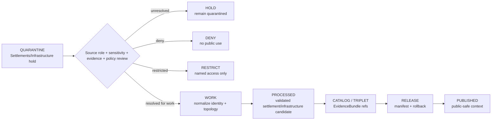

<!-- [KFM_META_BLOCK_V2]
doc_id: kfm://data/quarantine/settlements-infrastructure/readme
name: Settlements Infrastructure Quarantine README
path: data/quarantine/settlements-infrastructure/README.md
type: data-quarantine-index-readme
version: v0.1.0
status: draft
owners:
  - <settlements-infrastructure-lane-steward>
  - <settlement-identity-steward>
  - <infrastructure-sensitivity-reviewer>
  - <data-steward>
  - <release-steward>
created: 2026-06-27
updated: 2026-06-27
policy_label: restricted-review
truth_posture: cite-or-abstain
lifecycle_phase: quarantine
responsibility_root: data/
domain: settlements-infrastructure
artifact_family: held-settlements-infrastructure-material
sensitivity_posture: fail-closed; no-public-path; source-role-preservation-required; critical-infrastructure-review-required; public-safe-transform-required; release-blocked
related:
  - ../README.md
  - ../../README.md
  - ../settlement/README.md
  - ../../processed/settlements-infrastructure/README.md
  - ../../processed/settlement/README.md
  - ../../catalog/domain/settlements-infrastructure/README.md
  - ../../published/layers/settlements-infrastructure/README.md
  - ../../../docs/domains/settlements-infrastructure/CANONICAL_PATHS.md
  - ../../../docs/domains/settlements-infrastructure/DATA_LIFECYCLE.md
  - ../../../docs/domains/settlements-infrastructure/SOURCE_REGISTRY.md
  - ../../../docs/domains/settlements-infrastructure/API_CONTRACTS.md
  - ../../../docs/runbooks/settlements-infrastructure/PROMOTION_RUNBOOK.md
  - ../../../release/manifests/README.md
tags:
  - kfm
  - data
  - quarantine
  - settlements-infrastructure
  - settlement
  - infrastructure
  - municipality
  - census-place
  - ghost-town
  - critical-infrastructure
  - legal-status
  - source-role
  - evidence-first
notes:
  - "This README replaces the greenfield stub and documents the parent Settlements/Infrastructure quarantine lane."
  - "No child quarantine README lanes were confirmed during this edit; proposed classes are routing guidance only."
  - "The sibling `data/quarantine/settlement/` path is a documented PROPOSED compatibility lane, not a competing canonical authority."
  - "Settlements/Infrastructure quarantine is a hold area, not a staging shortcut to processed, catalog, triplet, published, reports, layers, PMTiles, stories, graph/vector indexes, AI answers, or public UI."
  - "Actual held payload presence, policy automation, validator wiring, CI enforcement, ADR resolution, and review completion remain UNKNOWN unless verified."
[/KFM_META_BLOCK_V2] -->

<a id="top"></a>

# Settlements/Infrastructure Quarantine

Parent hold lane for Settlements/Infrastructure material that is not safe or sufficiently governed for normal processing, cataloging, publication, reporting, map rendering, story playback, graph/vector indexing, or AI-answer use.

<p>
  
  
  
  
  
  
</p>

**Quick links:** [Scope](#scope) · [Repo fit](#repo-fit) · [Compatibility note](#compatibility-note) · [Confirmed child lanes](#confirmed-child-lanes) · [Proposed quarantine classes](#proposed-quarantine-classes) · [Inputs](#inputs) · [Exclusions](#exclusions) · [Directory map](#directory-map) · [Exit gates](#exit-gates) · [Forbidden shortcuts](#forbidden-shortcuts) · [Required checks](#required-checks-before-use) · [Status notes](#status-notes)

> [!CAUTION]
> `data/quarantine/settlements-infrastructure/` is a no-public-path hold lane. Material here is not public, not processed truth, not catalog truth, not proof, not release authority, not policy authority, not settlement legal-status authority, not critical-infrastructure authority, not operator authority, not condition-observation truth, not dependency truth, and not an AI-answer source. Nothing in this subtree may be consumed by public clients or normal UI surfaces until a governed exit transition leaves inspectable evidence.

---

## Scope

This directory holds Settlements/Infrastructure material when source role, rights, settlement/place identity, legal status, geometry precision, topology, source vintage, temporal state, sensitivity, critical-infrastructure review, operator disclosure, condition-observation review, dependency review, cross-lane evidence, validation, policy decision, receipt closure, correction path, or rollback target is unresolved.

Settlements/Infrastructure owns settlement and infrastructure object families such as Settlement, Municipality, CensusPlace, Townsite, GhostTown, Fort, Mission, ReservationCommunity, InfrastructureAsset, NetworkNode, NetworkSegment, Facility, ServiceArea, Operator, ConditionObservation, and Dependency. It cites but does not own Roads/Rail, Hydrology, Hazards, People/Land, Archaeology, and other domain truth. Cross-lane evidence that is stale, restricted, quarantined, corrected, missing, or unbound can hold a Settlements/Infrastructure artifact back.

This parent lane does not make held content authoritative. It routes quarantine material so stewards can review, deny, restrict, return to work, or promote only through governed lifecycle transitions.

---

## Repo fit

| Field | Value |
|---|---|
| Path | `data/quarantine/settlements-infrastructure/` |
| Responsibility root | `data/` |
| Lifecycle phase | `quarantine/` |
| Domain lane | `settlements-infrastructure` |
| Artifact role | Parent hold lane for Settlements/Infrastructure quarantine material and quarantine-local review sidecars |
| Public access posture | No public path; no normal UI; no governed-public API exposure |
| Exit posture | Only by explicit policy decision, source-role/evidence/rights/sensitivity closure, required receipt closure, corrected lifecycle placement, and release-state closure |
| Release authority | `release/`, not this directory |
| Proof authority | `data/proofs/` and `data/receipts/`, not this directory |
| Catalog authority | `data/catalog/`, not this directory |
| Registry authority | `data/registry/`, not this directory |
| Policy authority | `policy/`, not this directory |
| Default failure posture | `HOLD`, `DENY`, `RESTRICT`, or `ABSTAIN` when source role, rights, evidence, sensitivity, geometry precision, identity, legal status, topology, review, correction, or rollback support is insufficient |

---

## Compatibility note

Visible Settlements/Infrastructure doctrine records a segment-name conflict: `settlements-infrastructure` is the working canonical domain segment in Directory Rules-derived domain documentation, while `settlement` appears as a conflicted short form in Atlas/crosswalk material. The sibling path below is therefore a compatibility lane, not a competing canonical authority:

```text
data/quarantine/settlement/
```

Use `data/quarantine/settlements-infrastructure/` for the canonical parent quarantine posture unless an ADR or migration note says otherwise. Do not create parallel schema, contract, policy, source, registry, proof, release, or public homes from the singular compatibility segment.

---

## Confirmed child lanes

No `data/quarantine/settlements-infrastructure/` child-lane README paths were confirmed during this edit. This parent index is confirmed as authored, but child routing remains proposed until a child README path is created and verified.

| Child lane | Status | Notes |
|---|---|---|
| `<none confirmed>` | **UNKNOWN** | Do not infer payloads, validators, source descriptors, release gates, or CI coverage from this parent README. |

---

## Proposed quarantine classes

The Settlements/Infrastructure lifecycle doctrine names or implies the hold classes below. They are routing guidance, not proof that child README paths or payloads exist.

| Class | Status | Typical handling |
|---|---|---|
| Rights unresolved | **PROPOSED / NEEDS VERIFICATION** | Hold until source terms, redistribution posture, attribution, and `SourceDescriptor` activation are resolved. |
| Legal-status ambiguous | **PROPOSED / NEEDS VERIFICATION** | Split legal municipality, CensusPlace, townsite, ghost-town, fort, mission, reservation community, and historic-place roles. |
| Census-vs-municipality collision | **PROPOSED / NEEDS VERIFICATION** | Re-key with object-role distinction; do not force one shared ID. |
| Topology invalid | **PROPOSED / NEEDS VERIFICATION** | Hold invalid network nodes, network segments, dependencies, or service-area topology until corrected. |
| Condition observation undated | **PROPOSED / NEEDS VERIFICATION** | Recover or record observation time; otherwise hold. |
| Restricted geometry precision | **PROPOSED / NEEDS VERIFICATION** | Generalize, suppress, aggregate, or deny exact facility or vulnerable-asset geometry exceeding release tier. |
| Critical infrastructure unreviewed | **PROPOSED / NEEDS VERIFICATION** | Require ReviewRecord, PolicyDecision, redaction/generalization, and release approval before public use. |
| Operator identity disclosed | **PROPOSED / NEEDS VERIFICATION** | Redact, restrict, embargo, or deny operator-sensitive fields. |
| Cross-lane citation stale | **PROPOSED / NEEDS VERIFICATION** | Re-bind to current evidence or keep held when cited Roads/Rail, Hydrology, Hazards, People/Land, or Archaeology evidence is stale/quarantined/restricted. |
| Temporal collision | **PROPOSED / NEEDS VERIFICATION** | Separate source, observed, valid, retrieval, release, and correction times. |
| Segment conflict unresolved | **PROPOSED / NEEDS VERIFICATION** | Keep singular `settlement/` compatibility paths non-authoritative until ADR or migration note resolves the conflict. |

> [!NOTE]
> Add child lanes only after confirming the risk class, responsibility-root fit, reviewer roles, receipt requirements, correction path, rollback target, and Directory Rules placement basis.

---

## Inputs

Accepted content is limited to held review material and quarantine-local sidecars such as:

- source pointers, settlement/place candidate packets, municipality packets, CensusPlace packets, townsite packets, ghost-town packets, fort/mission packets, reservation-community packets, infrastructure-asset packets, network-node/segment packets, facility packets, service-area packets, operator packets, condition-observation packets, dependency packets, geometry packets, rights packets, source-role packets, sensitivity packets, legal-status packets, temporal packets, cross-lane citation packets, or generated candidates that require quarantine;
- quarantine reason notes and `HOLD` / `DENY` / `RESTRICT` summaries;
- source-role, rights, source-version, identity, legal-status, geometry, topology, sensitivity, critical-infrastructure, operator, redaction, aggregation, temporal, cross-lane evidence, reviewer, and steward notes;
- candidate receipt drafts, such as source-role review, rights review, validation, transform, redaction, aggregation, citation-validation, temporal-role review, authority-review, critical-infrastructure review, or policy-decision drafts;
- hash/digest sidecars used to preserve chain-of-custody for held material;
- quarantine-local README files and local indexes that explain hold state without becoming proof, catalog, registry, policy, release, canonical path, public-layer, or AI authority.

---

## Exclusions

| Do not place here | Correct authority home |
|---|---|
| Clean RAW source mirrors that have not triggered quarantine | `data/raw/settlements-infrastructure/` or source-specific intake |
| Ordinary WORK material that is safe to process under normal review | `data/work/settlements-infrastructure/` |
| Validated processed settlement/place or infrastructure objects | `data/processed/settlements-infrastructure/` only after quarantine resolution |
| Compatibility processed settlement derivatives | `data/processed/settlement/` only if ADR/migration permits the compatibility lane |
| Catalog records, triplets, graph truth, or EvidenceBundle state | `data/catalog/`, triplet lanes, or proof lanes |
| EvidenceBundle / ProofPack | `data/proofs/` |
| Final validation, redaction, aggregation, source-role-review, AI, or release receipts | `data/receipts/` |
| Release manifests, promotion decisions, correction records, rollback records, or signatures | `release/` |
| Source descriptors, activation records, source registries, or registry truth | `data/registry/` |
| Public layers, PMTiles, reports, stories, API payloads, downloads, or published artifacts | `data/published/` only after release gates close |
| Roads/Rail, Hydrology, Hazards, People/Land, Archaeology, Agriculture, Geology, Habitat, Fauna, Flora, Soil, or Frontier Matrix canonical truth | Owning domain lane, not Settlements/Infrastructure quarantine |
| Semantic contracts, schemas, validators, or policy rules | `contracts/`, `schemas/`, `tools/`, `policy/` |
| Normal public UI, search, vector-index, graph, or AI-answer material | Governed public lanes only after release; otherwise abstain or deny |

---

## Directory map

```text
data/quarantine/settlements-infrastructure/
├── README.md
├── <future-risk-sublane>/
│   └── README.md
└── index.local.json
```

`index.local.json` is optional and must remain quarantine-local. It is not a public index, catalog record, release manifest, registry, graph edge source, layer/story/report pointer, search index, vector index, map source, canonical settlement index, critical-asset index, or AI retrieval index.

---

## Exit gates

Settlements/Infrastructure material may leave quarantine only when the exit path is explicit:

| Exit route | Minimum requirement |
|---|---|
| Stay held | Any unresolved source-role, rights, sensitivity, identity, legal status, geometry precision, topology, cross-lane evidence, temporal state, validation, review, policy, or release question remains. |
| Deny | PolicyDecision says `DENY`; public/UI/AI surfaces abstain or deny. |
| Restrict | PolicyDecision and ReviewRecord identify allowed audience, purpose, terms, redaction state, correction path, rollback target, and canonical path handling. |
| Return to work | Hold reason is resolved, but normal validation, transformation, attribution, temporal handling, source-role review, cross-lane evidence rebind, or EvidenceBundle work still remains. |
| Promote to processed/catalog/published | Only after required receipts, source descriptors, source-role closure, validation closure, EvidenceBundle closure, ReleaseManifest, correction path, rollback path, and approved public-safe transform exist. |

A more public tier requires transform receipt and review record. A more restrictive correction can happen immediately when risk is discovered.

---

## Forbidden shortcuts

```text
data/quarantine/settlements-infrastructure/
→ data/processed/settlements-infrastructure/
→ data/catalog/
→ data/published/
→ public API / MapLibre / PMTiles / report / story / graph / vector index / AI answer
```

is forbidden unless the appropriate governed transition has actually happened and left inspectable evidence.



---

## Required checks before use

- [ ] Confirm the material is Settlements/Infrastructure-domain material and belongs under `data/quarantine/settlements-infrastructure/` rather than a compatibility path.
- [ ] Confirm any use of `settlement/` compatibility paths is recorded as `CONFLICTED` / compatibility and not silently promoted to canonical authority.
- [ ] Confirm the hold reason is recorded using a governed reason code.
- [ ] Confirm source descriptors, source roles, authority roles, upstream citation chain, rights posture, cadence, and current terms.
- [ ] Confirm object class: Settlement, Municipality, CensusPlace, Townsite, GhostTown, Fort, Mission, ReservationCommunity, InfrastructureAsset, NetworkNode, NetworkSegment, Facility, ServiceArea, Operator, ConditionObservation, Dependency, or generated carrier.
- [ ] Confirm settlement legal status, census role, historic role, gazetteer role, infrastructure role, geometry role, source vintage, and temporal scope remain distinct.
- [ ] Confirm critical-infrastructure, operator, facility, condition-observation, dependency, person/land, archaeology, hydrology, hazards, and roads/rail joins follow the owning lane's policy.
- [ ] Confirm public-safe geometry exists whenever sensitivity, cross-lane context, or source terms require it.
- [ ] Confirm no style-only hiding is used as a sensitivity control.
- [ ] Confirm required receipts are present or explicitly marked missing.
- [ ] Confirm PolicyDecision, ValidationReport, ReviewRecord where required, correction path, rollback target, and ADR-aware path handling before any exit.
- [ ] Confirm no public layer, PMTiles, report, story, API payload, graph edge, search index, vector index, or AI answer uses quarantined material.

---

## Status notes

| Claim | Status |
|---|---|
| This README replaces the greenfield stub at `data/quarantine/settlements-infrastructure/README.md`. | **CONFIRMED authored** |
| The target path existed in the live repository as a greenfield stub before this edit. | **CONFIRMED by GitHub contents API during this edit** |
| No `data/quarantine/settlements-infrastructure/` child-lane README path was confirmed during this edit. | **CONFIRMED by GitHub search/fetch during this edit** |
| Settlements/Infrastructure canonical-path doctrine identifies `settlements-infrastructure` as the working canonical domain segment and `settlement` as a conflicted short form. | **CONFIRMED by GitHub contents API during this edit** |
| `data/quarantine/settlement/README.md` exists and treats `settlement` as a PROPOSED compatibility quarantine lane. | **CONFIRMED by GitHub contents API during this edit** |
| Settlements/Infrastructure lifecycle doctrine lists quarantine reasons including rights, legal status ambiguity, census/municipality collision, restricted geometry, critical infrastructure, operator disclosure, stale cross-lane citations, temporal collision, topology invalid, and undated condition observations. | **CONFIRMED by GitHub contents API during this edit** |
| Actual quarantined payloads exist under this subtree. | **UNKNOWN** |
| Policy automation, validators, and CI checks enforce every listed Settlements/Infrastructure quarantine class. | **NEEDS VERIFICATION** |
| This README is proof, release, catalog, registry, policy, canonical path authority, settlement identity truth, infrastructure asset truth, legal-status authority, public artifact authority, or AI authority. | **DENY** |

---

## Related files

- [`../README.md`](../README.md)
- [`../../README.md`](../../README.md)
- [`../settlement/README.md`](../settlement/README.md)
- [`../../processed/settlements-infrastructure/README.md`](../../processed/settlements-infrastructure/README.md)
- [`../../processed/settlement/README.md`](../../processed/settlement/README.md)
- [`../../catalog/domain/settlements-infrastructure/README.md`](../../catalog/domain/settlements-infrastructure/README.md)
- [`../../published/layers/settlements-infrastructure/README.md`](../../published/layers/settlements-infrastructure/README.md)
- [`../../../docs/domains/settlements-infrastructure/CANONICAL_PATHS.md`](../../../docs/domains/settlements-infrastructure/CANONICAL_PATHS.md)
- [`../../../docs/domains/settlements-infrastructure/DATA_LIFECYCLE.md`](../../../docs/domains/settlements-infrastructure/DATA_LIFECYCLE.md)
- [`../../../docs/domains/settlements-infrastructure/SOURCE_REGISTRY.md`](../../../docs/domains/settlements-infrastructure/SOURCE_REGISTRY.md)
- [`../../../docs/domains/settlements-infrastructure/API_CONTRACTS.md`](../../../docs/domains/settlements-infrastructure/API_CONTRACTS.md)
- [`../../../docs/runbooks/settlements-infrastructure/PROMOTION_RUNBOOK.md`](../../../docs/runbooks/settlements-infrastructure/PROMOTION_RUNBOOK.md)
- [`../../../release/manifests/README.md`](../../../release/manifests/README.md)

---

KFM rule: this directory is a Settlements/Infrastructure quarantine hold index only. It is not source authority, proof authority, receipt authority, release authority, catalog authority, registry authority, policy authority, canonical path authority, settlement identity truth, infrastructure asset truth, legal-status authority, public artifact authority, UI authority, graph authority, vector-index authority, or AI truth.

[Back to top](#top)
