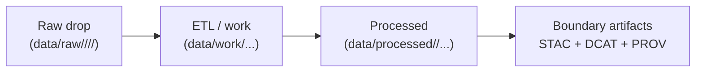

<a id="top"></a>

<div align="center">

# 📥 Raw Dataset Intake — `<dataset_slug>` (`data/raw/<domain>/<dataset_slug>/`)


**This folder is the immutable “as‑received” intake boundary for one upstream dataset.**  
It exists to make provenance boring: **receipts + checksums + append‑only drops** ✅🧾🔑

</div>

> [!IMPORTANT]
> **If you changed bytes, it’s not raw anymore.**  
> OCR, reprojection, resampling, cleanup, schema edits, tiling, “make it Parquet/COG” → `data/work/` (intermediate) or `data/processed/` (publishable).

---

## ⚡ Quick links

- ⬆️ Back to domain intake → [`../README.md`](../README.md)
- ⬆️ Back to raw root rules → [`../../README.md`](../../README.md)
- 🧾 Source manifests (pointer-first receipts) → [`../../../sources/`](../../../sources/) *(if present)*
- 🧪 Workbench / ETL sandbox → [`../../../work/`](../../../work/)
- 📦 Processed outputs (publishable) → [`../../../processed/`](../../../processed/)
- 🛰️ STAC (assets) → [`../../../stac/`](../../../stac/)
- 🗂️ DCAT (discovery) → [`../../../catalog/dcat/`](../../../catalog/dcat/)
- 🧬 PROV (lineage) → [`../../../prov/`](../../../prov/)
- 📑 Reports (reviewable outputs) → [`../../../reports/`](../../../reports/)
- 🔐 Security policy → [`../../../../SECURITY.md`](../../../../SECURITY.md) *(or `../../../../.github/SECURITY.md`)*

---

<details>
<summary><strong>📌 Table of contents</strong></summary>

- [🎯 What this dataset folder is](#-what-this-dataset-folder-is)
- [🧾 Dataset identity card](#-dataset-identity-card)
- [🗂️ Folder layout (with emojis)](#️-folder-layout-with-emojis)
- [📦 Drop registry (append-only)](#-drop-registry-append-only)
- [🧾 Receipts & provenance (source.json)](#-receipts--provenance-sourcejson)
- [🔑 Integrity (checksums)](#-integrity-checksums)
- [🧰 Intake SOP (add a new drop)](#-intake-sop-add-a-new-drop)
- [🧭 Downstream mapping (processed → STAC/DCAT/PROV)](#-downstream-mapping-processed--stacdcatprov)
- [🔐 Governance, classification, sovereignty](#-governance-classification-sovereignty)
- [✅ QA & CI expectations](#-qa--ci-expectations)
- [🙃 Common pitfalls](#-common-pitfalls)
- [📚 Reference shelf](#-reference-shelf)

</details>

---

## 🎯 What this dataset folder is

### ✅ This folder **IS**
- a **single-dataset intake boundary** (one upstream dataset → many immutable drops)
- the home for **as‑received bytes** and **receipts** that describe them
- the upstream anchor for later **PROV lineage** (raw → work → processed)

### ❌ This folder is **NOT**
- a workspace (`data/work/`)
- a publishing area (`data/processed/`)
- a catalog (`data/stac/`, `data/catalog/dcat/`)
- a place to “fix” or “normalize” inputs

> [!TIP]
> This folder should make it easy to answer in <10 seconds:
> **“Where did these bytes come from, under what terms, and can we verify them?”** 🧾🔍

---

## 🧾 Dataset identity card

Fill this once and keep it current. This becomes the “front of the binder” for the dataset. 📘

| Field | Value |
|---|---|
| **Domain** | `<domain>` |
| **Dataset slug** | `<dataset_slug>` |
| **Human title** | `<fill>` |
| **Upstream publisher** | `<fill>` |
| **Upstream landing page** | `<fill>` |
| **License / terms** | `<SPDX or URL or statement>` |
| **Redistribution allowed?** | `yes/no/partial` |
| **Default classification** | `public/internal/confidential/restricted` |
| **CARE label** | `TBD` |
| **Jurisdiction** | `US-KS` *(or more specific)* |
| **Update cadence** | `one-time | annual | monthly | daily | irregular` |
| **Primary formats** | `GeoTIFF / SHP / CSV / PDF / ...` |
| **Expected coverage** | `Kansas statewide | counties | AOI | ...` |
| **Source manifest ref** | `data/sources/<domain>/<dataset_slug>.json` *(if used)* |

> [!IMPORTANT]
> If the dataset is restricted or culturally sensitive:
> - keep receipts **minimal** (no precise sensitive coordinates)
> - store bytes in governed storage
> - link access rules instead of leaking detail here

---

## 🗂️ Folder layout (with emojis)

```text
📁 data/
└── 📁 raw/
    └── 📁 <domain>/
        └── 📁 <dataset_slug>/                       👈 you are here
            ├── 📄 README.md                          🧾 dataset identity + drop registry
            ├── 📄 drops_index.md                     ⭐ optional: human list of drops
            ├── 📄 drops_registry.csv                 🤖 optional: machine registry of drops
            └── 📁 <drop_id>/                         🧱 immutable intake boundary (append-only)
                ├── 📄 README.md                      🧾 drop summary (what/why/notes)
                ├── 📄 source.json                    🧾 machine receipt (license/retrieval/classification)
                ├── 🔑 checksums.sha256               🔒 integrity (sha256)
                ├── 📁 original/                      📦 as received (preferred)
                ├── 📁 extracted/                     🧩 lossless unpack only (optional)
                ├── 📁 receipts/                      🧾 request/response proofs (redacted; optional)
                └── 📁 notes/                         📝 human notes (NO secrets)
```

---

## 📦 Drop registry (append-only)

This dataset is **append-only**. New pull/delivery = new `<drop_id>/` folder. Never overwrite.

### ✅ Recommended: maintain a registry

If this dataset will have multiple drops, keep a quick registry right here:

- `drops_index.md` ⭐ (human-friendly)
- `drops_registry.csv` 🤖 (machine-friendly)

Suggested `drops_registry.csv` columns:
```csv
drop_id,retrieved_at_utc,upstream_version,license,classification,in_git,external_location,sha256_verified,notes
```

### 🗓️ Drop table (starter)

| Drop ID | Retrieved (UTC) | Upstream version | Bytes location | Integrity | Notes |
|---|---:|---|---|---|---|
| `<YYYY-MM-DD>` | `<fill>` | `<fill>` | `📦 in-git` / `🔒 external` | `✅ verified` / `⚠️ pending` | `<fill>` |
| `<vX>` | `<fill>` | `<fill>` | `📦 in-git` / `🔒 external` | `✅ verified` / `⚠️ pending` | `<fill>` |

> [!TIP]
> “Registry drift” is how teams lose track of what’s real. Keep it boring and current. ✅

---

## 🧾 Receipts & provenance (`source.json`)

Each drop must include `source.json` as the **machine receipt** for provenance.

### What `source.json` must make obvious
- who the upstream publisher is
- what the license/terms are
- when/how retrieval occurred (and by whom)
- what classification/sensitivity applies
- where bytes live (in repo vs governed external storage)
- where request receipts are stored *(if applicable)*

> [!CAUTION]
> Never store secrets in receipts (headers, bearer tokens, cookies). Redact before commit. 🔐

<details>
<summary><strong>🧾 Drop README template (copy/paste)</strong></summary>

```markdown
# 📦 Raw Drop — <dataset_slug> / <drop_id>

## What this is
- **Upstream name:**  
- **Publisher:**  
- **Retrieved:**  
- **Files:** (what’s inside)

## Why we pulled it
- What question or pipeline needs this?

## Terms / license
- SPDX/URL + any redistribution constraints

## Integrity
- `checksums.sha256` generated: ✅/⚠️
- `sha256sum -c` verified: ✅/⚠️

## Notes / caveats
- Known schema quirks, missing fields, weird encoding, etc.

## Next steps
- Expected ETL work package:
  - `data/work/...`
- Expected processed destination:
  - `data/processed/<domain>/...`
```

</details>

---

## 🔑 Integrity (checksums)

Checksums are required for every drop.

### Generate (macOS/Linux)
```bash
# from inside the drop directory: .../<drop_id>/
find . -type f \
  ! -name 'checksums.sha256' \
  -print0 | sort -z | xargs -0 sha256sum > checksums.sha256
```

### Verify
```bash
sha256sum -c checksums.sha256
```

> [!NOTE]
> Checksums provide tamper-evidence and a clean way to detect “silent drift” across pulls. 🔒

---

## 🧰 Intake SOP (add a new drop)

### 1) Create a new drop folder 🧱
```text
data/raw/<domain>/<dataset_slug>/<drop_id>/
```
Examples:
- `2026-01-12/`
- `v3/`
- `run-20260112-153012Z/`

### 2) Place upstream bytes (or pointers) 📥
- Preferred: put upstream delivery in `📁 original/`
- Optional: losslessly unpack into `📁 extracted/`
- If bytes cannot be stored in Git:
  - store in approved governed storage
  - record `external_location` in `source.json`
  - keep receipts in-repo

### 3) Write receipts 🧾
- `📄 README.md` (human)
- `📄 source.json` (machine)

### 4) Generate + verify checksums 🔑
- create `🔑 checksums.sha256`
- run verification locally

### 5) Update dataset-level registry 📌
- update the Drop table above
- if you use `drops_registry.csv`, update it too

### 6) Open a PR ✅
Include:
- why the new drop exists
- license/classification notes
- how to reproduce retrieval (if applicable)

---

## 🧭 Downstream mapping (processed → STAC/DCAT/PROV)

Raw is the start; “published” begins only after boundary artifacts exist.

### Canonical order


### Promotion intent (fill when known)

| Target artifact | Expected ID / path |
|---|---|
| 📦 Processed dataset root | `data/processed/<domain>/<product_slug>/...` |
| 🛰️ STAC Collection ID | `<fill>` |
| 🛰️ STAC Item pattern | `<collection>__<time_or_tile>...` |
| 🗂️ DCAT dataset record | `data/catalog/dcat/<dataset_id>.jsonld` |
| 🧬 PROV bundle pattern | `data/prov/<run_id>/prov.jsonld` |
| 📑 Report bundle (if needed) | `data/reports/<domain>/<date>__<slug>__vX/` |

> [!TIP]
> When this dataset becomes decision-significant, add a short link to its **first** processed release + STAC/DCAT/PROV IDs here. That’s how we keep provenance navigable. 🧭

---

## 🔐 Governance, classification, sovereignty

### Minimum rule set
- classification is declared **at ingest time** in each drop’s `source.json`
- no classification downgrade across the pipeline
- sensitive locations: do not leak precise coordinates in public receipts
- culturally sensitive sources: follow sovereignty policy and review gates

> [!IMPORTANT]
> If there’s any chance this dataset touches protected resources, communities, or person-adjacent inference:
> escalate early, keep receipts minimal, and enforce access via the API boundary. 🛡️

---

## ✅ QA & CI expectations

**For PRs touching this dataset folder:**
- [ ] append-only (no editing old drops)
- [ ] each new drop contains `README.md`, `source.json`, `checksums.sha256`
- [ ] checksums verify
- [ ] license + classification are present
- [ ] secrets scan passes (no tokens in receipts)

**Recommended additional gates (fast, high value):**
- [ ] validate `source.json` against a schema (if you add one under `schemas/sources/`)
- [ ] naming lint (`dataset_slug`, `drop_id`)
- [ ] restricted redistribution respected (receipt-only pattern)

---

## 🙃 Common pitfalls

- “I fixed something in the raw drop” → ❌ create a new drop; fix in `data/work/`
- “I only kept the extracted files” → ❌ also keep the original archive in `original/`
- “I stored a token in receipts” → ❌ redact + rotate + follow `SECURITY.md`
- “I can’t remember where this came from” → ❌ update receipts immediately; provenance is not optional

---

## 📚 Reference shelf

<details>
<summary><strong>📖 Project library (influence map)</strong></summary>

> ⚠️ These references inform rigor (provenance, validation, governance) and may have licenses different from repo code/data.

### 🧭 Core KFM system + governance framing
- `Kansas Frontier Matrix (KFM) – Comprehensive Technical Documentation.docx`
- `🌟 Kansas Frontier Matrix – Latest Ideas & Future Proposals.docx`

### 🗺️ GIS + mapping + file formats
- `python-geospatial-analysis-cookbook.pdf`
- `PostgreSQL Notes for Professionals - PostgreSQLNotesForProfessionals.pdf`
- `making-maps-a-visual-guide-to-map-design-for-gis.pdf`
- `Mobile Mapping_ Space, Cartography and the Digital - 9789048535217.pdf`
- `compressed-image-file-formats-jpeg-png-gif-xbm-bmp.pdf`

### 🛰️ Remote sensing
- `Cloud-Based Remote Sensing with Google Earth Engine-Fundamentals and Applications.pdf`

### 📈 Statistical integrity + experiments
- `Understanding Statistics & Experimental Design.pdf`
- `regression-analysis-with-python.pdf`
- `Regression analysis using Python - slides-linear-regression.pdf`
- `graphical-data-analysis-with-r.pdf`
- `think-bayes-bayesian-statistics-in-python.pdf`

### 🧪 Simulation & modeling discipline
- `Scientific Modeling and Simulation_ A Comprehensive NASA-Grade Guide.pdf`

### ⚙️ Systems, scaling, interoperability
- `Scalable Data Management for Future Hardware.pdf`
- `Data Spaces.pdf`
- `concurrent-real-time-and-distributed-programming-in-java-threads-rtsj-and-rmi.pdf`

### 🌐 Web + visualization (downstream consumers)
- `responsive-web-design-with-html5-and-css3.pdf`
- `webgl-programming-guide-interactive-3d-graphics-programming-with-webgl.pdf`

### ❤️ Ethics + autonomy + AI law
- `Introduction to Digital Humanism.pdf`
- `Principles of Biological Autonomy - book_9780262381833.pdf`
- `On the path to AI Law’s prophecies and the conceptual foundations of the machine learning age.pdf`

### 🛡️ Security (defensive mindset only)
- `ethical-hacking-and-countermeasures-secure-network-infrastructures.pdf`
- `Gray Hat Python - Python Programming for Hackers and Reverse Engineers (2009).pdf`

### 🧰 General programming shelf (bundles)
- `A programming Books.pdf`
- `B-C programming Books.pdf`
- `D-E programming Books.pdf`
- `F-H programming Books.pdf`
- `I-L programming Books.pdf`
- `M-N programming Books.pdf`
- `O-R programming Books.pdf`
- `S-T programming Books.pdf`
- `U-X programming Books.pdf`
- `Deep Learning for Coders with fastai and PyTorch - Deep.Learning.for.Coders.with.fastai.and.PyTorchpdf` *(filename as provided)*

</details>

---

<p align="right"><a href="#top">⬆️ Back to top</a></p>

