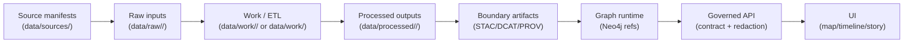

<a id="top"></a>

<div align="center">

# 📥 Raw Domain Intake — `<domain>` (`data/raw/<domain>/`)


**This directory holds immutable, as‑received inputs for the `<domain>` domain.**  
Raw is where KFM starts building trust: **receipts → checksums → deterministic ETL**. 🧾🔑🛠️

</div>

> [!IMPORTANT]
> **If you changed bytes, it’s not raw anymore.**  
> Reprojection, OCR, resampling, schema edits, normalization, tiling, format conversion → `data/work/` (intermediate) or `data/processed/` (publishable).

---

## ⚡ Quick links (domain-local)

- 🧭 Back to raw root rules → [`../README.md`](../README.md)
- 🧾 Source manifests (external dataset receipts) → [`../../sources/`](../../sources/) *(if present)*
- 🧪 Work / ETL sandbox → [`../../work/`](../../work/)
- 📦 Certified outputs → [`../../processed/`](../../processed/)
- 🛰️ STAC boundary (assets) → [`../../stac/`](../../stac/)
- 🗂️ DCAT boundary (discovery) → [`../../catalog/dcat/`](../../catalog/dcat/)
- 🧬 PROV boundary (lineage) → [`../../prov/`](../../prov/)
- 🔐 Security policy → [`../../../SECURITY.md`](../../../SECURITY.md) *(or `../../../.github/SECURITY.md`)*

---

<details>
<summary><strong>📌 Table of contents</strong></summary>

- [🎯 What this folder is](#-what-this-folder-is)
- [🧭 Where this domain fits in the pipeline](#-where-this-domain-fits-in-the-pipeline)
- [🗂️ Domain registry (recommended)](#️-domain-registry-recommended)
- [🧱 Directory contract](#-directory-contract)
- [🧾 Drop contract (required receipts)](#-drop-contract-required-receipts)
- [🧰 Intake SOP (domain)](#-intake-sop-domain)
- [🧭 Domain-specific notes (pick what applies)](#-domain-specific-notes-pick-what-applies)
- [🔐 Governance, classification, sovereignty](#-governance-classification-sovereignty)
- [✅ QA & CI gates (raw-stage)](#-qa--ci-gates-raw-stage)
- [🙃 Common anti-patterns](#-common-anti-patterns)
- [📚 Reference shelf (project library)](#-reference-shelf-project-library)

</details>

---

## 🎯 What this folder is

### ✅ This folder **IS**
- the canonical home for **as‑received input snapshots** for the `<domain>` domain
- the place we record **retrieval receipts** + **licensing** + **classification** up front
- the anchor for **deterministic ETL** and future **PROV lineage**

### ❌ This folder is **NOT**
- a scratchpad (`data/work/`)
- a publishing location (`data/processed/`)
- a catalog (`data/stac/`, `data/catalog/dcat/`)
- a “helpful conversions” folder (COG/Parquet/OCR/tiles → not raw)

> [!TIP]
> Raw is allowed to look messy. It is **not** allowed to be mysterious.

---

## 🧭 Where this domain fits in the pipeline

**Canonical order (non‑negotiable):**  
**Raw → Work/ETL → Processed → STAC/DCAT/PROV → Graph → API → UI → Story Nodes → Focus Mode**



---

## 🗂️ Domain registry (recommended)

To keep raw discoverable (without becoming a second catalog), this domain should maintain:

```text
data/raw/<domain>/
├─ README.md                          👈 you are here
├─ datasets_index.md                  ⭐ human-friendly list (recommended)
├─ datasets_registry.csv              ⭐ machine-friendly index (recommended)
└─ <dataset_slug>/...                 📦 actual raw drops
```

### `datasets_index.md` (suggested columns)
- dataset slug → link to folder
- upstream publisher
- license
- typical update cadence
- classification (public/internal/confidential/restricted)
- “where it becomes real” (processed dataset id / STAC collection id)

### `datasets_registry.csv` (suggested columns)
```csv
dataset_slug,publisher,license,classification,update_cadence,last_drop_id,notes
```

> [!NOTE]
> This registry is an **intake index**, not a replacement for DCAT/STAC.  
> It helps humans find inputs and helps CI enforce “no mystery sources.”

---

## 🧱 Directory contract

Organize raw inputs by **dataset → immutable drop**:

```text
data/raw/<domain>/
└── <dataset_slug>/
    └── <drop_id>/
        ├── README.md
        ├── source.json
        ├── checksums.sha256
        ├── original/                 # as received (preferred)
        ├── extracted/                # optional lossless unpack only
        ├── receipts/                 # optional request/response metadata (redacted)
        └── notes/                    # optional human notes (no secrets)
```

### Naming rules (practical)
- `<dataset_slug>`: `kebab-case`, stable, no dates inside
- `<drop_id>`: `YYYY-MM-DD` or `vX` or `run-YYYYMMDD-HHMMSSZ`
- Never overwrite: new pull/delivery → new drop folder

---

## 🧾 Drop contract (required receipts)

Every drop must include:

| Item | Required | Why |
|---|---:|---|
| `README.md` | ✅ | human context (what/where/why, caveats) |
| `source.json` | ✅ | machine receipt (license, retrieval, classification, extents, pointers) |
| `checksums.sha256` | ✅ | integrity + tamper evidence |
| `original/` | ◻️ | as-received bytes (preferred) |
| `extracted/` | ◻️ | lossless unpack only (optional) |
| `receipts/` | ◻️ | deterministic retrieval proof (optional) |

> [!CAUTION]
> If redistribution is restricted, commit only the receipts (README + `source.json` + checksums) and store bytes in approved restricted storage.

---

## 🧰 Intake SOP (domain)

### 1) Create the dataset folder (if new)
```text
data/raw/<domain>/<dataset_slug>/
```
- add a short dataset-level `README.md` **inside** `<dataset_slug>/` if the dataset is complex *(recommended)*

### 2) Add a new immutable drop
```text
data/raw/<domain>/<dataset_slug>/<drop_id>/
```

### 3) Place bytes (or pointers)
- preferred: put upstream delivery in `original/`
- optionally unpack losslessly into `extracted/`
- if bytes can’t be stored here: store externally and point to them in `source.json` (and optionally `data/sources/`)

### 4) Write receipts
- `README.md`: what it is + what’s inside + caveats + known issues
- `source.json`: license + retrieval method + classification + extents

### 5) Generate checksums
- generate `checksums.sha256` and verify locally
- if you later discover an error: create a **new** drop (never edit the old one)

### 6) Update the domain registry
- add/update `datasets_index.md` and `datasets_registry.csv`

---

## 🧭 Domain-specific notes (pick what applies)

> [!TIP]
> Keep this section “choose-your-own-domain.” Delete what doesn’t apply or keep it as a checklist for future maintainers.

### 🛰️ If `<domain>` is remote sensing / imagery
- ✅ keep original metadata sidecars (MTL, manifests, XML)
- ✅ preserve original tiling/granules (don’t mosaic in raw)
- ✅ store request receipts for API pulls (AOI, date range, collection id)
- ❌ don’t convert to COG/tiles/PMTiles here (do that in `data/work/`)

### 🗺️ If `<domain>` is vector GIS / boundaries / administrative data
- ✅ preserve whole delivery sets (e.g., full Shapefile set, not just `.shp`)
- ✅ preserve encoding + schema (watch `.cpg`)
- ❌ don’t repair geometry or reproject here

### 🧾 If `<domain>` is documents / scans / historical maps
- ✅ keep the original PDF/TIFF/JPEG masters unchanged
- ✅ keep any “as delivered” index spreadsheets (if provided)
- ❌ don’t OCR in place (OCR outputs go to `data/work/`; publishable OCR goes to `data/processed/` + catalogs)

### 🌊 If `<domain>` is time-series / sensors / real-time feeds
- ✅ treat each pull as a drop (append-only snapshots)
- ✅ record retrieval receipts (query params, time window, endpoint)
- ✅ document update cadence + known latency
- ❌ don’t aggregate or “fix timestamps” in raw

### 🧊 If `<domain>` includes 3D assets / binary formats
- ✅ treat as untrusted input; store unchanged; scan/sandbox parsers during ETL
- ✅ store file format/version notes in `README.md`
- ❌ don’t run “conversion tools” inside raw

---

## 🔐 Governance, classification, sovereignty

### Classification (minimum policy)
- declare classification in every `source.json`
- **no classification downgrade** across the pipeline
- if restricted: prefer receipt-only + governed access paths

### Sensitive locations & cultural sovereignty
- don’t publish precise restricted coordinates in public receipts
- prefer generalized coverage (county/Kansas-level) in raw receipts when needed
- route review through governance docs and follow `SECURITY.md` if risk exists

### Supply chain mindset (raw is an attack surface)
- treat all external files as untrusted (especially office docs, PDFs, binaries)
- scan where policy allows; never execute embedded macros/scripts from a drop
- keep receipts of scanning/validation in `notes/` (no secrets)

---

## ✅ QA & CI gates (raw-stage)

### Minimum PR gates for `data/raw/<domain>/**`
- [ ] append-only: no edits to existing drops
- [ ] receipts present: `README.md`, `source.json`, `checksums.sha256`
- [ ] checksums verify locally
- [ ] license + classification present in `source.json`
- [ ] secrets scan passes
- [ ] restricted redistribution handled (receipt-only if required)

### Recommended gates (fast, high value)
- [ ] `source.json` validates against a schema (if you add one under `schemas/sources/`)
- [ ] `dataset_slug` and `drop_id` naming lint
- [ ] “policy pack” checks (classification consistency, sensitive-location safeguards)
- [ ] if the PR also updates catalogs: run catalog QA (links + required fields)

---

## 🙃 Common anti-patterns

- “I fixed the CSV in place” → **new drop**; cleanup happens in `data/work/`
- “I reprojected it so it lines up” → `data/work/` / `data/processed/`
- “I renamed files for convenience” → keep originals; map names later
- “I committed a token in a script” → rotate + remove; use `.env` + secret store
- “I added derived previews into raw” → previews belong in work/processed with lineage

---

## 📚 Reference shelf (project library)

> ⚠️ Reference PDFs may have licenses different from repository code/data.  
> Treat this as a **reading pack / influence map** for rigor, not a redistribution mandate. 📚

<details>
<summary><strong>📖 Core KFM docs (system + governance context)</strong></summary>

- `Kansas Frontier Matrix (KFM) – Comprehensive Technical Documentation.docx`
- `🌟 Kansas Frontier Matrix – Latest Ideas & Future Proposals.docx`

</details>

<details>
<summary><strong>🗺️ GIS, cartography, formats (helps avoid raw-stage “oops”)</strong></summary>

- `python-geospatial-analysis-cookbook.pdf`
- `PostgreSQL Notes for Professionals - PostgreSQLNotesForProfessionals.pdf`
- `making-maps-a-visual-guide-to-map-design-for-gis.pdf`
- `Mobile Mapping_ Space, Cartography and the Digital - 9789048535217.pdf`
- `compressed-image-file-formats-jpeg-png-gif-xbm-bmp.pdf`

</details>

<details>
<summary><strong>🛰️ Remote sensing</strong></summary>

- `Cloud-Based Remote Sensing with Google Earth Engine-Fundamentals and Applications.pdf`

</details>

<details>
<summary><strong>📈 Statistics, experiments, reproducibility discipline</strong></summary>

- `Understanding Statistics & Experimental Design.pdf`
- `regression-analysis-with-python.pdf`
- `Regression analysis using Python - slides-linear-regression.pdf`
- `graphical-data-analysis-with-r.pdf`
- `think-bayes-bayesian-statistics-in-python.pdf`

</details>

<details>
<summary><strong>🧪 Modeling, simulation, uncertainty</strong></summary>

- `Scientific Modeling and Simulation_ A Comprehensive NASA-Grade Guide.pdf`
- `Generalized Topology Optimization for Structural Design.pdf`
- `Spectral Geometry of Graphs.pdf`

</details>

<details>
<summary><strong>⚙️ Systems, scale, interoperability</strong></summary>

- `Scalable Data Management for Future Hardware.pdf`
- `Data Spaces.pdf`
- `concurrent-real-time-and-distributed-programming-in-java-threads-rtsj-and-rmi.pdf`

</details>

<details>
<summary><strong>🌐 Web & 3D visualization (input formats + downstream consumers)</strong></summary>

- `responsive-web-design-with-html5-and-css3.pdf`
- `webgl-programming-guide-interactive-3d-graphics-programming-with-webgl.pdf`

</details>

<details>
<summary><strong>❤️ Ethics, autonomy, AI law</strong></summary>

- `Introduction to Digital Humanism.pdf`
- `Principles of Biological Autonomy - book_9780262381833.pdf`
- `On the path to AI Law’s prophecies and the conceptual foundations of the machine learning age.pdf`

</details>

<details>
<summary><strong>🛡️ Security (defensive mindset only)</strong></summary>

- `ethical-hacking-and-countermeasures-secure-network-infrastructures.pdf`
- `Gray Hat Python - Python Programming for Hackers and Reverse Engineers (2009).pdf`

> These are used to inform **defensive controls** (threat modeling, incident response, secure coding).  
> They are **not** a request for offensive tooling contributions.

</details>

<details>
<summary><strong>🧰 General programming shelf (bundles)</strong></summary>

- `A programming Books.pdf`
- `B-C programming Books.pdf`
- `D-E programming Books.pdf`
- `F-H programming Books.pdf`
- `I-L programming Books.pdf`
- `M-N programming Books.pdf`
- `O-R programming Books.pdf`
- `S-T programming Books.pdf`
- `U-X programming Books.pdf`
- `Deep Learning for Coders with fastai and PyTorch - Deep.Learning.for.Coders.with.fastai.and.PyTorchpdf` *(filename as provided)*

</details>

---

## ✅ Domain README “Definition of Done”

- [ ] `<domain>` description filled in (what counts as this domain)
- [ ] domain registry created (`datasets_index.md` + `datasets_registry.csv`) *(recommended)*
- [ ] intake SOP matches how the team actually works (scripts, contacts, access policy)
- [ ] classification defaults (if any) documented without leaking sensitive detail
- [ ] linked from `data/raw/README.md` *(recommended)*

<p align="right"><a href="#top">⬆️ Back to top</a></p>

