# 🧱 `data/raw/<domain>/` — Raw Data (Immutable Source Snapshots)


> 🧊 **Rule #1: Raw is read-only.** This folder stores **original, unmodified** source snapshots for `<domain>`.  
> 🧭 Everything downstream must be reproducible from what’s stored here.

---

## 🗺️ The “Truth Path” (How raw becomes trusted)

```mermaid
flowchart LR
  A["🗃️ data/raw/<domain><br/>Raw snapshots (you are here)"] --> B["🏗️ data/work/<domain><br/>Intermediate outputs"]
  B --> C["✅ data/processed/<domain><br/>Final standardized datasets"]
  C --> D["🧾 data/stac/*<br/>STAC Items + Collections"]
  C --> E["📚 data/catalog/dcat/*<br/>DCAT JSON-LD dataset entries"]
  C --> F["🧬 data/prov/*<br/>PROV lineage bundles"]
  C --> G["🗺️ Runtime Stores<br/>PostGIS · Graph · Search"]
  G --> H["🌐 API Layer<br/>policy + contracts"]
  H --> I["🖥️ UI / 🤖 AI<br/>maps · stories · Focus Mode"]
```



**Why it matters:** no dataset is “publishable” until it has **processed outputs + STAC/DCAT metadata + PROV lineage** (and passes policy gates). ✅

---

## 🎯 Purpose of `data/raw/<domain>/`

Raw data is for:

- 📥 **Original downloads / exports** from authoritative sources (APIs, portals, archives, partner drops)
- 🧾 **Evidence artifacts** that must remain untouched (e.g., PDFs, scans, original CSV dumps)
- 🧊 **Reproducibility anchors** for ETL pipelines (the pipeline reads raw; it never edits raw)

Raw data is **NOT** for:

- 🚫 Cleaned/standardized files (put those in `data/processed/<domain>/`)
- 🚫 Intermediate transformations (put those in `data/work/<domain>/`)
- 🚫 Derived analytics / AI outputs (those are first-class datasets → `data/processed/...`)
- 🚫 Secrets, credentials, tokens, or private keys (never commit)
- 🚫 Sensitive personal data without explicit approval + labeling (see governance section)

---

## 📁 Recommended folder layout (inside `<domain>`)

Use a structure that makes **source + dataset + version** obvious at a glance:

```text
data/raw/<domain>/
├── 📁 <source_org_or_program>/
│   ├── 📁 <dataset_id>/
│   │   ├── 📁 vYYYY-MM-DD/                     # retrieval/version stamp
│   │   │   ├── 📄 original.<ext>               # file(s) exactly as obtained
│   │   │   ├── 📄 checksums.sha256             # hashes for integrity
│   │   │   └── 📄 source.manifest.yml          # required metadata (see below)
│   │   └── 📁 vYYYY-MM-DD/...
│   └── 📁 <dataset_id>/...
└── 📄 README.md                                 # this file
```

### ✅ Naming conventions
- Use **lowercase-kebab-case** for folder names: `kansas-dasc`, `usgs-3dep`, `census-1900`
- Use **stable dataset ids**: `hydrology-streamgages`, `land-patents-glo`, `sentinel-2-scenes`
- Version folders should be **date-stamped** (`v2026-02-03`) or semver if the source provides it.

---

## 🧾 Required metadata per dataset version

Every dataset version folder **must** include:

### 1) `source.manifest.yml` (required)
A minimal manifest that answers: **what is this, where did it come from, what license governs it, and how do we verify integrity?**

```yaml
dataset_id: "<dataset_id>"
domain: "<domain>"
title: "Human friendly title"
description: "1–3 sentences describing what the raw snapshot contains."

source:
  organization: "<source_org_or_program>"
  url: "https://example.source/download/or/api"
  retrieved_at: "YYYY-MM-DD"
  retrieval_method: "manual | script | api | partner_drop"
  contact: "name/email if available"

license:
  spdx: "CC-BY-4.0 | CC0-1.0 | ODC-BY-1.0 | Public-Domain | UNKNOWN"
  license_url: "https://..."
  attribution: "Required attribution text (if any)"

coverage:
  spatial:
    bbox_wgs84: [minLon, minLat, maxLon, maxLat]   # if known
    region: "Kansas"                                # or county/area
  temporal:
    start: "YYYY-MM-DD"
    end: "YYYY-MM-DD"

files:
  - path: "original.<ext>"
    sha256: "<sha256>"
    size_bytes: 123456
    media_type: "text/csv | application/pdf | image/tiff | application/zip"
notes:
  sensitivity: "public | restricted | confidential"
  pii: false
  indigenous_cultural_sensitivity: false
```

### 2) `checksums.sha256` (required)
Store hashes for **every** file in the version folder.

```bash
# example format
<sha256>  original.csv
<sha256>  supplementary.zip
```

### 3) Optional (recommended)
- `README.source.md` — human notes about quirks / parsing gotchas
- `download.sh` or `download.py` — deterministic retrieval script (preferred if legal/feasible)
- `CITATION.txt` — if the source provides a preferred citation

---

## 🔐 Governance, security, and “fail closed” rules

### 🧷 Sensitivity labeling
All raw datasets must be labeled in the manifest as one of:
- **public** (safe to expose broadly after processing + policy gates)
- **restricted** (limited access; may require redaction/aggregation)
- **confidential** (generally not publishable; requires explicit approval)

### 🧑‍⚖️ License is mandatory
If the license is missing or unclear:
- set `license.spdx: "UNKNOWN"`
- document what you checked in `notes`
- expect policy gates / CI to block publication until resolved ✅

### 🧼 Privacy/ethics checklist (raw stage)
- [ ] No secrets or credentials included
- [ ] No accidental PII (names, addresses, phone numbers) unless explicitly approved + classified
- [ ] Any culturally sensitive data (e.g., sacred locations) is flagged and treated as restricted/confidential

---

## 🧰 How to add a new raw dataset (quick checklist)

1. 📁 Create folder: `data/raw/<domain>/<source>/<dataset_id>/vYYYY-MM-DD/`
2. 📥 Place the original file(s) **unchanged** in that version folder
3. 🔎 Generate hashes → write `checksums.sha256`
4. 🧾 Create `source.manifest.yml` (license + retrieval date are non-negotiable)
5. 🏗️ Run the domain pipeline (outputs must land in `data/work/` and `data/processed/`)
6. 🧬 Ensure publication artifacts exist (downstream of raw):
   - `data/stac/collections/…` + `data/stac/items/…`
   - `data/catalog/dcat/…`
   - `data/prov/…`
7. ✅ Open PR with a clear description + screenshots/summary (if map layers change)

---

## 🧠 FAQ

### “Can I fix a typo in a raw CSV?”
**No.** Raw stays immutable.  
✅ Add a new version folder with a new retrieval date **only if** the upstream publisher changed it, or store corrections as a processing step (documented + reproducible) into `data/processed/<domain>/`.

### “Where do AI-derived layers go?”
Treat them like first-class datasets:
- store outputs in `data/processed/<domain>/...`
- generate full STAC/DCAT/PROV like any other dataset

### “Do we store large raw files in Git?”
Prefer governance-friendly approaches:
- keep only small/medium raw files in Git
- for large assets, use a data remote (e.g., DVC/object storage) and keep **pointers + manifests** here  
(Your repo’s contribution rules decide the exact mechanism.)

---

## 🔗 Related paths (for maintainers)

- `data/work/<domain>/` — intermediate outputs (scratch + staging)
- `data/processed/<domain>/` — final standardized datasets
- `data/stac/collections/` + `data/stac/items/` — STAC metadata
- `data/catalog/dcat/` — DCAT dataset entries
- `data/prov/` — PROV lineage bundles (inputs → activities → outputs)

---

## 🧩 Domain profile (fill this in)

| Field | Value |
|---|---|
| Domain | `<domain>` |
| Owner / Maintainer | `@<github-handle>` |
| Primary sources | `<source_orgs>` |
| Default CRS (if spatial) | `EPSG:4326 (unless specified)` |
| Processing entrypoint | `src/pipelines/<domain>/...` |
| Publication review gates | `docs/governance/REVIEW_GATES.md` |

> ✅ Keep this README updated as the domain grows (new sources, new pipelines, new governance constraints).