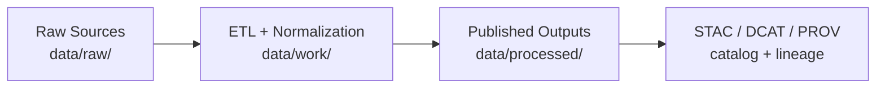

# 🗃️ `data/raw/` — Raw Data (Immutable Inputs)


Raw data is the **first boundary** of the KFM pipeline: we ingest external sources here, keep them **as raw as possible**, and only then run deterministic ETL into `data/work/` and publish outputs in `data/processed/`. 📦➡️🛠️➡️✅ [oai_citation:0‡MARKDOWN_GUIDE_v13.md.gdoc](file-service://file-UYVruFXfueR8veHMUKeugU) [oai_citation:1‡Kansas Frontier Matrix (KFM) – Comprehensive Technical Documentation.pdf](file-service://file-Bro83fTiCi9UUVVno1fL6L)

> 🧊 **Rule of thumb:** If you changed bytes, *it’s not raw anymore* — it belongs in `data/work/` or `data/processed/`.

---

## 🎯 What belongs in `data/raw/`

✅ **Allowed**
- Vendor dumps, agency downloads, scans, exports, archives, sensor drops
- API pulls (when you can persist the response payloads without semantic edits)
- Delivered bundles in their **original format** (ZIP/TAR, GeoTIFF, CSV, JSON, PDF, etc.)
- Lossless extraction output (unzip/untar) **without transformation** (see `extracted/` rules)

❌ **Not allowed**
- Reprojected rasters, cleaned/normalized tables, renamed columns, “fixed” geometries
- Re-encoded/converted formats (COG conversion, Parquet conversion, OCR text, etc.)
- Anything that is an **analysis/evidence artifact** (those are first-class datasets in `data/processed/`) [oai_citation:2‡MARKDOWN_GUIDE_v13.md.gdoc](file-service://file-UYVruFXfueR8veHMUKeugU)

---

## 🗂️ Folder layout (recommended)

Raw data should be **organized by domain**, then **dataset**, then **version/date**.

```text
data/raw/
└── <domain>/                      # e.g., land_treaties, imagery, census, hydro, documents, sensors
    └── <dataset_slug>/            # kebab-case, stable ID
        └── <YYYY-MM-DD_or_vX>/    # immutable drop boundary
            ├── 📄 README.md
            ├── 📄 source.json
            ├── 📄 checksums.sha256
            ├── 📁 original/       # optional: the exact upstream archive(s) or delivered bundle
            └── 📁 extracted/      # optional: extraction output (ONLY lossless unpacking; no transforms)
```

### 🏷️ Naming rules (keep it boring = keep it reproducible)
- **`<domain>/`**: short, meaningful bucket (team-agreed). Don’t overfit.
- **`<dataset_slug>/`**: `kebab-case`, stable identifier (no dates inside the slug).
- **`<YYYY-MM-DD_or_vX>/`**: immutable “drop boundary”
  - Use `YYYY-MM-DD` when the source is a dated pull/delivery.
  - Use `vX` when the upstream has explicit releases (or you’re mirroring a versioned archive).
  - If you re-pull the same upstream date, create a new boundary: `YYYY-MM-DDb` (or bump `vX`), don’t overwrite.

---

## 📄 Raw drop contract (what every drop MUST contain)

Each immutable drop is a **contract boundary**: a human can understand it and a machine can validate it. This matches KFM’s **contract-first** and **deterministic pipeline** expectations. [oai_citation:3‡MARKDOWN_GUIDE_v13.md.gdoc](file-service://file-UYVruFXfueR8veHMUKeugU)

| Artifact | Required | Why it exists | “Good enough” contents |
|---|---:|---|---|
| 📄 `README.md` | ✅ | Human context & caveats | what it is, where it came from, what’s inside, how to reproduce |
| 📄 `source.json` | ✅ | Machine-readable provenance | source URLs, license, retrieval method/time, classification, extents |
| 📄 `checksums.sha256` | ✅ | Integrity & tamper-evidence | sha256 over all files in the drop (excluding itself) |
| 📁 `original/` | ◻️ | Exact upstream bundle | ZIP/TAR/PDFs, vendor delivery, “as received” |
| 📁 `extracted/` | ◻️ | Lossless unpack only | unzip/untar output ONLY (no reprojection, no cleaning) |

> ⚠️ **Append-only policy:** never mutate an existing drop. If something changes, create a new drop boundary and document why.

---

## 🧾 `source.json` template (recommended)

`source.json` is the “receipt” 🧾 — it should let future-you re-acquire and re-verify the same raw inputs.

```json
{
  "dataset_id": "<domain>/<dataset_slug>",
  "domain": "<domain>",
  "dataset_slug": "<dataset_slug>",
  "drop_id": "<YYYY-MM-DD_or_vX>",

  "title": "Human-friendly dataset name",
  "description": "What this drop contains (1–3 sentences).",

  "upstream": {
    "publisher": "Agency / org / vendor",
    "source_urls": ["https://…"],
    "retrieved_from": "https://…",
    "license": "SPDX or link / statement",
    "citation": "Preferred citation string (if provided)"
  },

  "retrieval": {
    "retrieved_at": "YYYY-MM-DDTHH:MM:SSZ",
    "method": "manual|script|api|mirror",
    "performed_by": "name_or_handle",
    "tooling": {
      "script_path": "tools/fetch/<something>.sh",
      "container": "docker image tag (if used)",
      "commit": "git commit hash (if applicable)"
    }
  },

  "coverage": {
    "spatial": {
      "crs": "EPSG:4326 (if known; otherwise 'unknown')",
      "bbox_wgs84": [-180.0, -90.0, 180.0, 90.0]
    },
    "temporal": {
      "start": "YYYY-MM-DD",
      "end": "YYYY-MM-DD"
    }
  },

  "sensitivity": {
    "classification": "public|restricted|confidential",
    "notes": "Anything about privacy, sovereignty, access constraints, redactions."
  },

  "files": [
    {
      "path": "original/source_bundle.zip",
      "media_type": "application/zip",
      "size_bytes": 0,
      "sha256": "<optional duplicate of checksums.sha256>"
    }
  ]
}
```

> 🧠 Tip: keep **README.md human**, keep **source.json machine**. Don’t hide critical licensing/sensitivity notes in prose only.

---

## 🔑 `checksums.sha256` (how to generate + verify)

### Generate (macOS/Linux)
```bash
# from inside the drop directory (…/<YYYY-MM-DD_or_vX>/)
find . -type f \
  ! -name 'checksums.sha256' \
  -print0 | sort -z | xargs -0 sha256sum > checksums.sha256
```

### Verify (macOS/Linux)
```bash
sha256sum -c checksums.sha256
```

### Windows (PowerShell)
```powershell
Get-ChildItem -Recurse -File |
  Where-Object { $_.Name -ne "checksums.sha256" } |
  ForEach-Object {
    $h = (Get-FileHash $_.FullName -Algorithm SHA256).Hash.ToLower()
    "$h  $($_.FullName.Replace((Get-Location).Path + '\','').Replace('\','/'))"
  } | Set-Content checksums.sha256
```

---

## 📦 Large files (recommended: DVC)

For big rasters / imagery / long time-series, prefer **DVC** so Git stays fast while datasets remain reproducible. The project design explicitly suggests DVC for large artifacts and reproducible data versioning. [oai_citation:4‡Kansas-Frontier-Matrix_ Open-Source Geospatial Historical Mapping Hub Design.pdf](file-service://file-64djFYQUCmxN1h6L6X7KUw) [oai_citation:5‡Scientific Method _ Research _ Master Coder Protocol Documentation.pdf](file-service://file-HTpax4QbDgguDwxwwyiS32)

**Pattern**
- Keep `source.json` + `checksums.sha256` **in Git**
- Store heavy binaries in DVC remote (or equivalent artifact storage)
- Treat each `<drop_id>/` as immutable even when tracked by DVC

> 🧯 If the upstream license forbids redistribution: store *only* metadata + retrieval instructions in Git, and keep the data in restricted storage.

---

## 🗺️ Geospatial specifics (raw-stage rules)

### ✅ In raw
- Keep original CRS, resolution, and encoding (“as delivered”)
- Store upstream metadata sidecars exactly (e.g., `.xml`, `.aux`, `.tfw`)
- Record bbox/time coverage in `source.json`

### ❌ Not in raw
- Reprojection, resampling, tiling, simplification, topology repair
- “Make it a COG” conversions
- “Cleaned” geometries or normalized attribute schemas

When publishing, KFM expects metadata boundary artifacts (STAC/DCAT/PROV) **before** downstream use. [oai_citation:6‡MARKDOWN_GUIDE_v13.md.gdoc](file-service://file-UYVruFXfueR8veHMUKeugU)

---

## 🧬 Metadata, standards, and interoperability

Good raw stewardship starts with **metadata discipline**:
- Metadata categories commonly include: identification, distribution, data quality, spatial reference, entity/attribute information, and metadata reference info. [oai_citation:7‡making-maps-a-visual-guide-to-map-design-for-gis.pdf](file-service://file-51FgWTn7uFXenxztXw29bP)
- Interoperability is the ability of systems to exchange information and then use it (not just “send files”). [oai_citation:8‡making-maps-a-visual-guide-to-map-design-for-gis.pdf](file-service://file-51FgWTn7uFXenxztXw29bP)

### 📜 Copyright & licensing (common gotcha)
A key distinction in cartography is between:
- the **data** (facts/coordinates), and
- the **map** as a **cartographic representation** (creative work). This affects what you can redistribute and how you cite/attribute. [oai_citation:9‡making-maps-a-visual-guide-to-map-design-for-gis.pdf](file-service://file-51FgWTn7uFXenxztXw29bP)

---

## 🔐 Privacy, security, sovereignty (FAIR+CARE mindset)

Geospatial and historical data can carry real-world risk:
- Digital geographic data can implicate **locational privacy** (e.g., data from phones/vehicles/sensors). Treat raw drops as potentially sensitive by default. [oai_citation:10‡making-maps-a-visual-guide-to-map-design-for-gis.pdf](file-service://file-51FgWTn7uFXenxztXw29bP)
- Security is commonly framed around protecting **confidentiality, integrity, availability**; privacy includes the right to determine/limit access to personal information. [oai_citation:11‡Introduction to Digital Humanism.pdf](file-service://file-HC311tLjkcn1yRbyTBLJQQ)

KFM also expects governance and sovereignty considerations to be stated explicitly (FAIR/CARE alignment). [oai_citation:12‡MARKDOWN_GUIDE_v13.md.gdoc](file-service://file-UYVruFXfueR8veHMUKeugU)

### 🛡️ CI / review expectations (don’t skip)
The repo standards include automated scanning for:
- secrets,
- PII/sensitive data,
- classification downgrade issues, etc. [oai_citation:13‡MARKDOWN_GUIDE_v13.md.gdoc](file-service://file-UYVruFXfueR8veHMUKeugU)

---

## 🧰 Intake workflow (drop SOP)

### 1) Create the directory 🧱
- Choose `<domain>/` and `<dataset_slug>/`
- Create the immutable drop boundary folder

### 2) Acquire upstream data 📥
- Put delivered bundle(s) in `original/` (recommended)
- If you extract, extract **losslessly** into `extracted/`

### 3) Document it 🧾
- Write dataset-drop `README.md`
- Create `source.json` (include license + sensitivity)

### 4) Lock integrity 🔒
- Generate `checksums.sha256`
- If large: DVC-track the data files (keep manifests in Git)

### 5) Submit for review ✅
Open a PR with:
- What changed (new drop, new domain, license notes)
- Any sensitivity/sovereignty flags
- Reproduction steps (how to re-download / re-verify)

> 🧪 Design reminder: the project audit calls out missing reproducibility workflows as a risk; this SOP is the antidote. 🧯 [oai_citation:14‡Kansas-Frontier-Matrix Design Audit – Gaps and Enhancement Opportunities.pdf](file-service://file-TkRzAfTnxCYDUHauCf1NcH)

---

## 🧭 Where does raw data go next?

KFM uses required staging:
- `data/raw/<domain>/` → `data/work/<domain>/` → `data/processed/<domain>/` [oai_citation:15‡MARKDOWN_GUIDE_v13.md.gdoc](file-service://file-UYVruFXfueR8veHMUKeugU)

And publication requires boundary metadata outputs:
- STAC, DCAT, PROV (catalog + lineage) [oai_citation:16‡MARKDOWN_GUIDE_v13.md.gdoc](file-service://file-UYVruFXfueR8veHMUKeugU)



---

## 🚫 Common anti-patterns (please don’t 🙃)

- “I fixed the CSV in place” (➡️ new drop boundary instead)
- “I reprojected it so it lines up” (➡️ do it in `data/work/` / `data/processed/`)
- “I renamed files for convenience” (➡️ keep original names; add a mapping doc elsewhere)
- “I added a secret token to a download script” (➡️ use `.env`, never commit secrets)
- “I copied sensitive coordinates into a public drop” (➡️ classify + restrict + review gates)

---

## 📚 Project reference shelf (local library)

<details>
<summary><b>Open the project library 📚 (reference PDFs & design docs)</b></summary>

### 🧱 KFM architecture & governance
- KFM Technical Documentation  [oai_citation:17‡Kansas Frontier Matrix (KFM) – Comprehensive Technical Documentation.pdf](file-service://file-Bro83fTiCi9UUVVno1fL6L)  
- KFM Open-Source Geospatial Historical Mapping Hub Design  [oai_citation:18‡Kansas-Frontier-Matrix_ Open-Source Geospatial Historical Mapping Hub Design.pdf](file-service://file-64djFYQUCmxN1h6L6X7KUw)  
- KFM Master Guide v13 (repo + pipeline standards)  [oai_citation:19‡MARKDOWN_GUIDE_v13.md.gdoc](file-service://file-UYVruFXfueR8veHMUKeugU)  
- KFM Design Audit (gaps & enhancements)  [oai_citation:20‡Kansas-Frontier-Matrix Design Audit – Gaps and Enhancement Opportunities.pdf](file-service://file-TkRzAfTnxCYDUHauCf1NcH)  
- Scientific Method / Research MCP (experiment + versioning discipline)  [oai_citation:21‡Scientific Method _ Research _ Master Coder Protocol Documentation.pdf](file-service://file-HTpax4QbDgguDwxwwyiS32)  

### 🗺️ GIS / mapping / geospatial processing
- Making Maps (map design, metadata, copyright)  [oai_citation:22‡making-maps-a-visual-guide-to-map-design-for-gis.pdf](file-service://file-51FgWTn7uFXenxztXw29bP)  
- Python Geospatial Analysis Cookbook  [oai_citation:23‡python-geospatial-analysis-cookbook.pdf](file-service://file-HT14njz1MhrTZCE7Pwm5Cu)  
- Geoprocessing with Python
- Geographic Information System Basics
- Google Maps API Succinctly
- Google Maps JavaScript API Cookbook

### 🌍 Remote sensing / Earth Engine
- Cloud-Based Remote Sensing with Google Earth Engine  [oai_citation:24‡Cloud-Based Remote Sensing with Google Earth Engine-Fundamentals and Applications.pdf](file-service://file-CXGLTw8wpR4uKWWqjrGkyk)  
- Google Earth Engine Applications

### 📊 Stats / ML (keep raw clean so analysis stays honest)
- Data Science & Machine Learning (Math & Stats Methods)  [oai_citation:25‡Data Science &-  Machine Learning (Mathematical & Statistical Methods).pdf](file-service://file-MRNb2uGPEwpkSDsxF983PC)  
- Statistics Done Wrong
- Regression Analysis with Python
- Bayesian Computational Methods
- Understanding Statistics & Experimental Design
- Graphical Data Analysis with R
- Deep Learning in Python (prereqs)
- Artificial Neural Networks (intro)
- AI Foundations of Computational Agents (3rd ed.)
- Data Mining: Concepts & Applications

### 🧰 Engineering / systems / tooling
- Command Line Kung Fu (shell + one-liners)
- Introduction to Docker
- Clean Architectures in Python  [oai_citation:26‡clean-architectures-in-python.pdf](file-service://file-6YHot4AqfpdbcrdfiYfpHM)  
- Scalable Data Management for Future Hardware
- PostgreSQL / MySQL / Node.js Notes for Professionals
- Implementing Programming Languages (compilers/interpreters)

### 🎨 Web / visualization / graphics (downstream of processed data)
- Responsive Web Design with HTML5 & CSS3
- WebGL Programming Guide
- Computer Graphics using Java 2D & 3D

### 🧑‍⚖️ Ethics / human-centered constraints
- Introduction to Digital Humanism  [oai_citation:27‡Introduction to Digital Humanism.pdf](file-service://file-HC311tLjkcn1yRbyTBLJQQ)  
- Principles of Biological Autonomy

</details>

---

## 🧷 Footnotes (evidence anchors)

[^pipeline]: KFM’s repo standards require raw → work → processed staging, and emphasize deterministic, contract-first data handling. [oai_citation:28‡MARKDOWN_GUIDE_v13.md.gdoc](file-service://file-UYVruFXfueR8veHMUKeugU) [oai_citation:29‡MARKDOWN_GUIDE_v13.md.gdoc](file-service://file-UYVruFXfueR8veHMUKeugU)

[^kfmraw]: KFM ingestion guidance explicitly emphasizes keeping data as raw as possible and storing raw data reliably before transformations. [oai_citation:30‡Kansas Frontier Matrix (KFM) – Comprehensive Technical Documentation.pdf](file-service://file-Bro83fTiCi9UUVVno1fL6L)

[^catalogs]: At publication boundaries, datasets produce STAC/DCAT/PROV artifacts for discovery and provenance tracing. [oai_citation:31‡MARKDOWN_GUIDE_v13.md.gdoc](file-service://file-UYVruFXfueR8veHMUKeugU)

[^dvc]: The project design + MCP guidance both support dataset versioning and using tools like DVC for large artifacts and reproducibility. [oai_citation:32‡Kansas-Frontier-Matrix_ Open-Source Geospatial Historical Mapping Hub Design.pdf](file-service://file-64djFYQUCmxN1h6L6X7KUw) [oai_citation:33‡Scientific Method _ Research _ Master Coder Protocol Documentation.pdf](file-service://file-HTpax4QbDgguDwxwwyiS32)

[^privacy]: Security and privacy framing (CIA + privacy as control of personal info) aligns with digital humanism’s human-centered approach and is relevant to raw data handling. [oai_citation:34‡Introduction to Digital Humanism.pdf](file-service://file-HC311tLjkcn1yRbyTBLJQQ)

[^maps]: GIS metadata categories, interoperability expectations, and copyright distinctions matter for how we store and redistribute cartographic data. [oai_citation:35‡making-maps-a-visual-guide-to-map-design-for-gis.pdf](file-service://file-51FgWTn7uFXenxztXw29bP) [oai_citation:36‡making-maps-a-visual-guide-to-map-design-for-gis.pdf](file-service://file-51FgWTn7uFXenxztXw29bP)

[^scans]: KFM repo standards call for automated scanning for secrets/PII/sensitive data and classification consistency to prevent leaks and unsafe publication. [oai_citation:37‡MARKDOWN_GUIDE_v13.md.gdoc](file-service://file-UYVruFXfueR8veHMUKeugU)