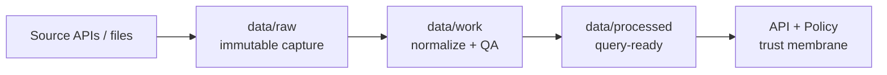

# 🧱 `data/raw/` — Immutable Raw Data (Evidence Zone)


> [!IMPORTANT]
> `data/raw/` is the **staging area for input data exactly as obtained from original sources**.
> Treat raw files as evidence: **write-once, then read-only**.

---

## Purpose

`data/raw/` exists to preserve **source-of-truth artifacts** so that any processed dataset can be traced back to the original inputs and re-processed reproducibly (even years later).

Raw-zone examples include:
- Agency/archival file drops (ZIPs, shapefiles, CSV/JSON exports)
- Scraped or fetched exports (CSV snapshots, HTML captures)
- Documents & media used as evidence (PDF scans, images)

---

## Truth path



> [!NOTE]
> Nothing in `data/raw/` is served directly to users. Serving happens from **processed** artifacts via governed APIs.

---

## Zone rules

| Zone | Purpose | Allowed operations | Not allowed | Promotion prerequisites |
|---|---|---|---|---|
| **Raw** | Immutable capture of source-of-truth data | Append-only writes | Transforms, normalization | **Checksums + raw manifest**; license captured |
| **Work** | Repeatable transformations + QA staging | Derivation, normalization, enrichment | Ad-hoc undocumented steps | PROV activity + QA/validation reports |
| **Processed** | Query-ready datasets exposed via API | Read-optimized storage + indexing | Policy-bypassing publication | DCAT dataset; STAC (if spatial); PROV chain; policy labels |

---

## Non-negotiables

### ✅ Do
- Keep raw **exactly as obtained** (no manual edits, no “quick fixes”)
- Record **source URI/file** and **license** in a manifest
- Use **checksums** to guarantee repeatability and detect drift
- Set and respect **sensitivity classification**
- Route sensitive/sensitive-location triggers to governance review before any promotion

### ❌ Don’t
- Commit secrets (API keys, tokens) anywhere under `data/raw/`
- Put cleaned/normalized outputs here (belongs in `data/work/` or `data/processed/`)
- “Overwrite history” without leaving evidence (prefer new files/versions + manifest updates)

---

## Directory conventions

Recommended: one folder per dataset intake (dataset-oriented).

```text
data/raw/
├── README.md
├── <dataset_id>/
│   ├── manifest.yml
│   └── <original files as acquired>
└── ...
```

Also acceptable: group by source/topic (source-oriented).

```text
data/raw/<source_or_topic>/<dataset_id>/...
```

> [!TIP]
> Prefer stable, human-readable folder names for `<dataset_id>` so reviewers can reason about provenance quickly.

---

## Required: `manifest.yml`

Each dataset intake must include a manifest that CI can validate.  
This manifest is part of the evidence chain and should remain stable for a given dataset version.

### Minimal manifest shape (recommended)

```yaml
dataset_id: example_dataset
source:
  type: http        # http | file | api | scrape | ...
  uri: "https://example.org/path/to/source.zip"
license: "CC-BY-4.0"
expected_files:
  - name: "source.zip"
    sha256: "<sha256-of-exact-bytes>"
sensitivity_level: "public"  # public | restricted | sensitive-location
```

### Rules
- `expected_files[*].sha256` must match the **exact bytes** stored in `data/raw/<dataset_id>/`.
- **No secrets** in the manifest. If auth is required, credentials belong in the project’s secret store (vault), not git.
- Sensitivity classification must be explicit; when in doubt, classify conservatively and route to review.

---

## Ingest workflow

1. Add raw files + `manifest.yml` under `data/raw/<dataset_id>/`.
2. Run the **containerized ingest pipeline**.
3. The pipeline must produce:
   - `data/work/<dataset_id>/validation_report.json`
   - `data/work/<dataset_id>/run_record.json`
   - initial PROV activity artifacts (example location: `data/catalog/prov/<dataset_id>/...`)
4. If sensitive flags trigger, **stop promotion** and route to governance review.

---

## Definition of Done for a raw intake PR

- [ ] Source URI/file exists and is reachable (or included in PR)
- [ ] License is **known** and recorded in `manifest.yml`
- [ ] Contributor has permission to ingest (documented in PR)
- [ ] Manifest passes schema validation in CI
- [ ] Checksums exist and match raw files
- [ ] Validation report includes license and sensitivity classification
- [ ] Run record includes hashes for inputs/outputs

---

## Sensitivity and culturally restricted data

Some domains (notably heritage/archaeology) can include sensitive locations or legally protected details.

**Fail-closed policy for sensitive-location:**
- Classify in `manifest.yml` (`sensitivity_level: sensitive-location`)
- Produce public derivatives with generalized coordinates and separate provenance chains
- Never publish exact protected locations in processed/public layers without governance approval

---

## Handling corrections

If a raw data error is discovered:
- Prefer adding a corrected file/version **without destroying evidence**
- Update the manifest and/or create a new dataset version
- Preserve the ability to reproduce prior processed releases from prior raw inputs

---

## Large files

KFM versions datasets in git, but size constraints may apply.

If raw artifacts are too large for normal git workflows, use the repo’s approved large-file strategy (e.g., DVC pointers, object-store-backed artifacts, or other governed mechanism), while still maintaining:
- deterministic manifests
- checksums
- provenance/run receipts