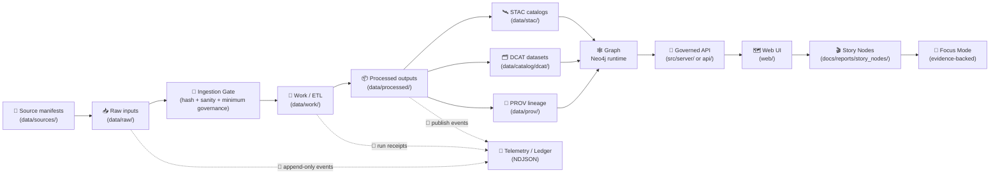
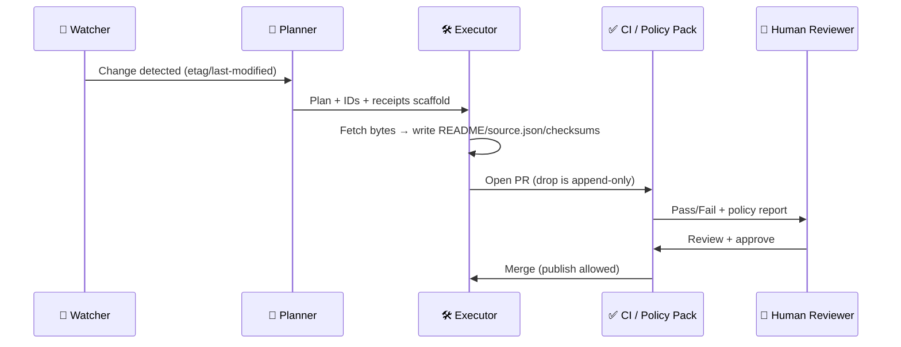

<div align="center">

# 📥 `data/raw/` — Raw Data (Immutable Inputs)


**Raw data is KFM’s first trust boundary.**  
We ingest external sources here **as‑received**, preserve them **immutably**, validate at an **ingestion gate**, then run deterministic ETL in `data/work/` and publish stable products in `data/processed/`. 🧾➡️🚦➡️🛠️➡️📦

</div>

> [!IMPORTANT]
> **If you changed bytes, it’s not raw anymore.**  
> Reprojection, cleanup, OCR, tiling, resampling, column edits, format conversion → belongs in `data/work/` (intermediate) or `data/processed/` (publishable).

> [!IMPORTANT]
> **KFM is “catalog-driven” + “evidence-first.”**  
> If a raw drop lacks receipts (license + provenance + integrity), it’s not eligible for graph, API, UI, Story Nodes, or Focus Mode. ✅🧬

---

## 🔗 Quick links

- 🧭 Repo overview → `../../README.md`
- 📘 Master Guide (pipeline invariants) → `../../docs/MASTER_GUIDE_v13.md` *(if present)*
- 🧾 Source manifests (pointer-first intake) → [`../sources/`](../sources/) *(if present)*
- 🚦 Ingestion runbooks → `../../docs/guides/pipelines/` *(if present)*
- 🧪 Intermediate artifacts → [`../work/`](../work/)
- 📦 Final products → [`../processed/`](../processed/)
- 🧪 Catalogs & lineage:
  - 🛰️ STAC → [`../stac/`](../stac/) *(often `../stac/collections/` + `../stac/items/`)*
  - 🗂️ DCAT → [`../catalog/dcat/`](../catalog/dcat/) *(if present)*
  - 🧬 PROV → [`../prov/`](../prov/)
- 🕸️ Graph import artifacts → [`../graph/`](../graph/) *(e.g., `../graph/csv/` if used)*
- 🧪 QA runbooks & validators → [`../../tools/validation/`](../../tools/validation/) *(recommended home)*
- ⚖️ Policy Pack (OPA / Conftest) → `../../api/scripts/policy/` *(if present)*
- 🛡️ Vulnerability reporting → `../../SECURITY.md` *(or `../../.github/SECURITY.md`)*
- ⚖️ Governance & review gates → `../../docs/governance/ROOT_GOVERNANCE.md` · `../../docs/governance/REVIEW_GATES.md` *(if present)*

---

<details>
<summary><strong>📌 Table of contents</strong></summary>

- [🧭 Where raw fits in the KFM pipeline](#pipeline)
- [🧾 Source manifests (`data/sources/`) — when bytes can’t live in Git](#sources)
- [✅ What belongs here](#allowed)
- [🚫 What does NOT belong here](#not-allowed)
- [⭐ Raw-stage non-negotiables](#non-negotiables)
- [🗂️ Directory layout](#layout)
- [🆔 Identity & naming](#identity)
- [🧾 Raw drop contract](#drop-contract)
- [📄 `source.json` template](#source-json)
- [🔑 Checksums](#checksums)
- [🚦 Ingestion gate (basic validation)](#ingestion-gate)
- [🧾 Telemetry & audit ledger](#telemetry)
- [🤖 Automation: Watcher → Planner → Executor](#wpe)
- [⚖️ Policy Pack (OPA + Conftest)](#policy-pack)
- [♻️ Rollback & incident response](#rollback)
- [📦 Large files & restricted redistribution](#large-files)
- [🗺️ Geospatial + document specifics](#geo-specifics)
- [🔐 Security, privacy, sovereignty](#security)
- [🧪 QA & CI expectations](#qa)
- [🧰 Intake SOP: add a new raw drop](#sop)
- [🙃 Common anti-patterns](#anti-patterns)
- [📚 Project reference shelf](#reference-shelf)
- [✅ Definition of Done (for this README)](#dod)
- [🕰️ Version history](#history)

</details>

---

<a id="pipeline"></a>

## 🧭 Where raw fits in the KFM pipeline

**Canonical ordering (non‑negotiable):**  
**Source Manifests → Raw → Ingestion Gate → Work/ETL → Processed → STAC/DCAT/PROV → Graph → API → UI → Story Nodes → Focus Mode**

### 🧭 Pipeline Flow (Mermaid-safe)



> [!NOTE]
> Raw is not “less important.” It’s the foundation for **reproducibility**, **auditability**, **tamper-evidence**, and **governance enforcement** across catalogs, models, and narratives. 🧱✨

---

<a id="sources"></a>

## 🧾 Source manifests (`data/sources/`) — when bytes can’t live in Git

KFM supports a **pointer-first intake** pattern for cases where the raw bytes are:
- too large for Git,
- restricted for redistribution,
- stored in an external object store / partner system.

In that case:
- `data/sources/` holds **machine-readable manifests** (URLs, licensing, retrieval method, access constraints, expected extents).
- `data/raw/` holds either:
  - the actual **as-received bytes** *(preferred when possible)*, **or**
  - a **receipt-only drop** (README + `source.json` + checksums for receipts/pointers) describing where the bytes live and how to retrieve them.

> [!TIP]
> Treat `data/sources/` as the “catalog of inputs” and `data/raw/` as the “evidence snapshots / receipts” that pipelines can anchor to. 🧾🧲

---

<a id="allowed"></a>

## ✅ What belongs here

**Allowed raw inputs (as-received):**
- 📦 Vendor/agency deliveries (ZIP/TAR bundles, exports, archives)
- 🗺️ Original GIS deliveries (GeoTIFF, SHP, GPKG, CSV, JSON, KML, etc.)
- 🧾 Documents & scans (PDFs, TIFF/JPEG/PNG masters)
- 🛰️ Remote sensing exports / pulls where you can persist **the exported files** and/or **the original response payload**
- 🧪 Sensor dumps / logs (when permitted) — stored “as recorded”
- 🧑‍🤝‍🧑 Community contributions (photos, field notes exports, volunteered data) **only if** you capture:
  - contributor consent/rights (license),
  - moderation status (draft → reviewed → published),
  - sensitivity flags (PII, protected locations, cultural protocols)

**Also allowed (with strict rules):**
- 📁 **Lossless extraction** into `extracted/` **only if** you also keep the original archive in `original/`
  - unzip/untar is allowed; *editing content is not*
- 🧾 Retrieval receipts (headers, request params, query JSON) stored as sidecars in the drop (**NO secrets**)
- 🧾 Ingestion summaries produced *at drop creation time* (e.g., a validation report) **as sidecars only**

---

<a id="not-allowed"></a>

## 🚫 What does NOT belong here

**Not allowed in `data/raw/`:**
- 🧼 Cleaned tables, renamed columns, changed encodings
- 🧭 Reprojection, resampling, tiling, simplification, topology repair
- 🧊 “Make it a COG”, “make it Parquet”, “make it GeoJSON”
- 🧠 Analysis outputs / model outputs / simulation outputs / reports  
  → these are first-class artifacts in `data/processed/` (and/or `data/reports/`) and must ship with **STAC/DCAT/PROV** if they are used downstream
- 🤖 AI-generated “helpful guesses” that change meaning (e.g., inferred licenses, inferred sensitive site coordinates)

> [!WARNING]
> If the only explanation for a file is “trust me,” it will fail review (and often CI). 😅🚫

---

<a id="non-negotiables"></a>

## ⭐ Raw-stage non-negotiables

These rules keep the pipeline deterministic and governance-safe:

- 🧱 **Append-only**: never mutate an existing drop; new pull → new folder
- 🧊 **Bytes preserved**: keep originals + sidecars; don’t “helpfully convert”
- 🧾 **Receipts required**: every drop has `README.md`, `source.json`, `checksums.sha256`
- 🧾 **Telemetry recorded**: ingestion events are logged (append-only) for audits & dashboards
- 🏷️ **Stable identity**: `kfm_dataset_id` + `drop_id` become PROV keys and graph IDs later
- 🚦 **Fail-closed gate**: if integrity/governance minimums fail, the pipeline stops (no silent partial publish)
- 🛡️ **Governance up front**: license, classification, sensitivity declared at ingest time
- 🔐 **No secrets in Git**: use `.env` + secret stores; rotate if exposed
- 🚫 **No classification downgrade**: outputs must not become less restricted than inputs
- 🔌 **No bypass of governance layer**: UI does not directly query graph/DB; API enforces redaction and access controls

---

<a id="layout"></a>

## 🗂️ Directory layout

Organize raw data by **domain → dataset → immutable drop**:

```text
📁 data/
└── 📁 raw/
    └── 📁 <domain>/                         # imagery, hydro, census, docs, etc.
        └── 📁 <dataset_slug>/               # kebab-case, stable (no dates inside)
            └── 📁 <drop_id>/                # YYYY-MM-DD | vX | YYYY-MM-DDa | run-YYYYMMDD-HHMMSSZ
                ├── 📄 README.md
                ├── 📄 source.json
                ├── 🔑 checksums.sha256
                ├── 📁 original/             # upstream bundle(s) exactly as received
                ├── 📁 extracted/            # optional: lossless unpack output (no transforms)
                ├── 📁 receipts/             # optional: request params, headers, landing-page HTML (NO secrets)
                ├── 📁 policy/               # optional: conftest/policy outputs captured at creation time
                └── 📁 notes/                # optional: human notes (NO secrets)
```

### 🏷️ Naming guidance

- `<domain>`: broad, stable bucket (don’t overfit)
- `<dataset_slug>`: stable handle (`kebab-case`)
- `<drop_id>`:
  - `YYYY-MM-DD` for dated pulls/deliveries
  - `vX` for upstream versioned releases
  - if re-pulling “the same” drop: `YYYY-MM-DDa`, `YYYY-MM-DDb` (never overwrite)
  - for pipeline-fetched drops: `run-YYYYMMDD-HHMMSSZ` *(guarantees uniqueness)*

> [!TIP]
> “Boring naming” is a feature: it makes automation, QA, and provenance simpler. 😌✅

---

<a id="identity"></a>

## 🆔 Identity & naming

KFM uses **stable IDs** so that a file in `data/raw/` can be traced through **processed outputs**, **catalogs**, the **graph**, the **API**, and into **Story Nodes / Focus Mode**.

### ✅ Recommended identity fields (minimum)
- `kfm_dataset_id` (canonical) — used across STAC/DCAT/PROV and the graph  
- `dataset_path_id` (filesystem) — maps to folder layout (`<domain>/<dataset_slug>`)  
- `drop_id` (immutable drop boundary) — maps to the actual drop folder  

### 🧩 Example mapping

| Concept | Example |
|---|---|
| `dataset_path_id` | `hydro/usgs-nwis-gauges` |
| `kfm_dataset_id` | `kfm.ks.hydro.usgs_nwis_gauges.v1` |
| `drop_id` | `2026-01-18` |
| Drop folder | `data/raw/hydro/usgs-nwis-gauges/2026-01-18/` |

> [!NOTE]
> In KFM catalogs, STAC Items/Collections should carry a `kfm:dataset_id` and `kfm:classification` property (per KFM profile expectations). The raw `source.json` is the “seed” for those values. 🌱🛰️

---

<a id="drop-contract"></a>

## 🧾 Raw drop contract

Every raw drop is a **reviewable, machine-validatable boundary**.

| Artifact | Required | Why it exists | Minimum contents |
|---|---:|---|---|
| 📄 `README.md` | ✅ | Human context | what it is, where it came from, what’s inside, caveats |
| 📄 `source.json` | ✅ | Machine provenance | URLs, license, retrieval time/method, classification, extents, IDs |
| 🔑 `checksums.sha256` | ✅ | Integrity + tamper evidence | sha256 of all files in the drop (except itself) |
| 📁 `original/` | ◻️ | “As received” archive(s) | ZIP/TAR/PDF bundles, vendor deliveries |
| 📁 `extracted/` | ◻️ | Lossless unpack only | unzip/untar output (no semantic changes) |
| 📁 `receipts/` | ◻️ | Deterministic retrieval proof | request JSON, query params, response headers (redacted) |
| 📁 `policy/` | ◻️ | Snapshot of gate verdicts | optional: conftest output / validation report captured at creation time |

> [!CAUTION]
> If redistribution is restricted: keep **only receipts** (README + `source.json` + checksums for receipts/pointers) in Git, store bytes in restricted storage, and document access clearly. 🔒🧾

---

<a id="source-json"></a>

## 📄 `source.json` template

`source.json` is the raw-stage **receipt** 🧾 — it should let a reviewer (or future-you) re-acquire and re-verify the same inputs.

```json
{
  "receipt_version": "v1",

  "identity": {
    "dataset_path_id": "<domain>/<dataset_slug>",
    "kfm_dataset_id": "kfm.ks.<domain>.<dataset_slug>.v1",
    "domain": "<domain>",
    "dataset_slug": "<dataset_slug>",
    "drop_id": "<YYYY-MM-DD_or_vX_or_run-*>",
    "jurisdiction": "US-KS"
  },

  "links": {
    "source_manifest_ref": "data/sources/<domain>/<dataset_slug>.json",
    "governance_ref": "docs/governance/ROOT_GOVERNANCE.md"
  },

  "title": "Human-friendly dataset name",
  "description": "What this drop contains (1–3 sentences).",

  "upstream": {
    "publisher": "Agency / org / vendor / community",
    "source_urls": ["https://…"],
    "retrieved_from": "https://…",
    "license": "SPDX id or URL or text statement",
    "citation": "Preferred citation string (if provided)",
    "terms_notes": "Redistribution limits / constraints.",
    "attribution_required": true
  },

  "retrieval": {
    "retrieved_at": "YYYY-MM-DDTHH:MM:SSZ",
    "method": "manual|script|api|mirror",
    "performed_by": "name_or_handle",

    "http": {
      "etag": "<optional>",
      "last_modified": "<optional>",
      "status": 200
    },

    "tooling": {
      "script_path": "tools/fetch/<something>.sh",
      "container_image": "ghcr.io/...@sha256:<digest> (if used)",
      "commit": "<git commit hash (if applicable)>"
    },

    "request_receipts": [
      "receipts/request.json",
      "receipts/response_headers.txt"
    ]
  },

  "coverage": {
    "spatial": {
      "crs": "EPSG:4326 | unknown",
      "bbox_wgs84": [-102.05, 36.99, -94.59, 40.00]
    },
    "temporal": {
      "start": "YYYY-MM-DD",
      "end": "YYYY-MM-DD"
    }
  },

  "sensitivity": {
    "classification": "public|internal|confidential|restricted",
    "care_label": "Public|TBD|culturally_sensitive|sovereign_restricted",
    "pii_risk": "none|low|medium|high",
    "sensitive_locations": "none|possible|confirmed",
    "handling_notes": "Sovereignty, sensitive sites, PII risk, redaction expectations."
  },

  "governance": {
    "review_required": false,
    "review_gate_ref": "docs/governance/REVIEW_GATES.md",
    "ethics_ref": "docs/governance/ETHICS.md",
    "sovereignty_policy_ref": "docs/governance/SOVEREIGNTY.md"
  },

  "storage": {
    "in_git": true,
    "dvc_tracked": false,
    "external_location": "s3://… or gs://… or partner system ref (if bytes not in repo)",
    "external_access_notes": "How a reviewer can request access (if restricted)."
  },

  "telemetry": {
    "ledger_event_id": "ledger:kfm:ingest:<uuid-or-ulid>",
    "ledger_path_hint": "data/telemetry/ingest_ledger.ndjson (if present)",
    "policy_verdict": "pass|fail|unknown"
  },

  "files": [
    {
      "path": "original/source_bundle.zip",
      "media_type": "application/zip",
      "size_bytes": 0,
      "sha256": "<optional duplicate of checksums.sha256>"
    }
  ]
}
```

> [!TIP]
> Keep `README.md` **human**, keep `source.json` **machine**. Don’t hide licensing or sensitivity only in prose. 🧾🤝

---

<a id="checksums"></a>

## 🔑 Checksums

### Generate (macOS/Linux)

```bash
# from inside the drop directory: .../<drop_id>/
find . -type f \
  ! -name 'checksums.sha256' \
  -print0 | sort -z | xargs -0 sha256sum > checksums.sha256
```

> [!NOTE]
> macOS may not ship `sha256sum` by default. If needed:
> - use `shasum -a 256` (different output format), or
> - install coreutils and use `gsha256sum`.

### Verify (macOS/Linux)

```bash
sha256sum -c checksums.sha256
```

### Windows (PowerShell)

```powershell
Get-ChildItem -Recurse -File |
  Where-Object { $_.Name -ne "checksums.sha256" } |
  ForEach-Object {
    $h = (Get-FileHash $_.FullName -Algorithm SHA256).Hash.ToLower()
    "$h  $($_.FullName.Replace((Get-Location).Path + '\','').Replace('\','/'))"
  } | Set-Content checksums.sha256
```

> [!NOTE]
> Checksums are practical tamper-evidence **and** a fast way to debug data drift. 🕵️‍♀️🔒

---

<a id="ingestion-gate"></a>

## 🚦 Ingestion gate (basic validation)

Before heavy ETL, KFM runs a **minimum, fast validation pass** at the ingestion gate. The goal is to stop bad or risky inputs early. ✅

**Gate checks (minimum):**
- 🔑 **File integrity**: compute SHA-256 (or multi-hash) for downloaded files and record in `checksums.sha256`
- 🧩 **Format sanity**: ensure JSON/CSV parses, shapefile set is complete, archives are readable (not corrupt)
- ⚖️ **Governance lite**: license present; classification + care label set; sensitivity notes provided
- 🧾 **Telemetry log**: append a ledger event with outcome (pass/fail) and drop identifiers

**Fail-closed rule:** if the gate fails, processing stops. No partial publish, no “close enough.” 🚫

> [!TIP]
> The ingestion gate is intentionally *lightweight*. Deep geospatial QA (valid geometries, CRS correctness, domain rules) belongs in `data/work/` and `data/processed/`. 🛠️🧪

---

<a id="telemetry"></a>

## 🧾 Telemetry & audit ledger

KFM benefits from **telemetry-driven governance**: not just “what exists,” but **what happened**, **when**, and **why something was blocked**. 📒✨

### Suggested pattern (append-only NDJSON)

- Location (recommended): `data/telemetry/ingest_ledger.ndjson` *(if present)*
- Each line: one JSON event record (append-only)

```json
{"ts":"2026-01-19T03:41:22Z","event":"raw_drop_added","kfm_dataset_id":"kfm.ks.hydro.usgs_nwis_gauges.v1","dataset_path_id":"hydro/usgs-nwis-gauges","drop_id":"2026-01-18","bytes":1234567,"outcome":"success","policy_verdict":"pass","actor":"@contributor","source_urls":["https://example.gov/..."],"drop_path":"data/raw/hydro/usgs-nwis-gauges/2026-01-18/"}
```

### What telemetry should capture (high value)
- ✅ ingestion gate verdict (pass/fail + policy IDs)
- 🔒 redaction events (when sensitive content is removed/generalized downstream)
- 🚫 publication blocked (why + which governance rule)
- 📦 publish events (processed + catalog IDs released)

> [!NOTE]
> Telemetry should never contain secrets, raw tokens, or personal data. Redact aggressively. 🔐✂️

---

<a id="wpe"></a>

## 🤖 Automation: Watcher → Planner → Executor

KFM supports automation patterns, but **automation is still governed**. Bots can propose; humans approve. 👀🧠🛠️👤

### ✅ Roles
- 👀 **Watcher**: detects source changes (ETag/Last-Modified, new release page, partner drop)
- 🧠 **Planner**: drafts a plan + receipts scaffold (IDs, licensing checklist, expected files)
- 🛠️ **Executor**: fetches bytes, writes receipts, generates checksums, opens a PR

> [!IMPORTANT]
> Automation **must not** self-merge data PRs. All merges are review-gated. ✅🔒

### Mermaid (sequence)



---

<a id="policy-pack"></a>

## ⚖️ Policy Pack (OPA + Conftest)

KFM treats governance as **policy-as-code**: machine-checkable rules enforced in CI. 🧾🤖✅

### Typical checks (examples)
- ✅ Raw drop contract present (`README.md` + `source.json` + `checksums.sha256`)
- ✅ `source.json` includes license + classification (no “unknown” for publishable data)
- ✅ Secrets scanning (fail if tokens/keys committed)
- ✅ “No classification downgrade” across raw → processed → catalogs
- ✅ Provenance-first publishing: data cannot be used in graph/UI unless lineage exists

### Local run (example)
```bash
# Example only — adjust to your repo layout
conftest test data/raw --policy api/scripts/policy
```

> [!TIP]
> Keep policy outputs (if captured) under `receipts/` or `policy/` inside the drop **at creation time**. After merge, the drop remains immutable. 🧊

---

<a id="rollback"></a>

## ♻️ Rollback & incident response

Mistakes happen. KFM’s design favors **traceability + reversibility**.

### If a raw drop is wrong (bytes incorrect, license mismatch, secret leak)
- 🚨 **Stop**: halt any downstream processing/publishing
- 🧯 **Contain**: rotate secrets immediately if exposed; remove from history if required by policy
- 🧾 **Record**: add a governance/telemetry event describing what happened (no sensitive details)
- ↩️ **Rollback**:
  - revert the PR/commit that introduced the drop, **or**
  - if retention is required, keep the drop but mark it **deprecated / blocked** in catalogs and governance
- 🔎 **Re-issue**: create a new drop (`YYYY-MM-DDa`) with corrected bytes/receipts

> [!WARNING]
> Never “quietly fix” a raw drop in place. That breaks reproducibility and auditability. 🚫🧊

---

<a id="large-files"></a>

## 📦 Large files & restricted redistribution

Raw often includes huge rasters and long time-series.

### Recommended patterns
- 🧳 **Small/medium files**: store directly in Git (still include checksums)
- 🧱 **Large binaries**: use DVC or Git LFS (repo policy-dependent) with receipts in `data/raw/`
- ☁️ **Object storage**: store heavy artifacts on disk/S3/GCS; API can serve via signed URLs (keep receipts + checksums in repo)
- 🔒 **Redistribution restricted**: keep only receipts in Git; store bytes in restricted storage; reference via `data/sources/` manifests

> [!IMPORTANT]
> The **drop folder** remains the contract boundary even if bytes live elsewhere. 🧱

---

<a id="geo-specifics"></a>

## 🗺️ Geospatial + document specifics

### 🛰️ Raster deliveries (GeoTIFF/IMG/etc.)
✅ Raw: keep “as delivered,” including `.aux.xml`, `.tfw`, metadata sidecars  
❌ Not raw: COG conversion, resampling, overviews, tiling (do this in `data/work/`)

### 🧭 Vector deliveries (SHP/GPKG/GeoJSON/CSV)
✅ Raw: keep as delivered, preserve encoding + schema  
❌ Not raw: reprojection, geometry fixes, attribute normalization

> [!TIP]
> For Shapefiles: keep the *whole set* (`.shp`, `.shx`, `.dbf`, `.prj`, and any `.cpg`, `.sbn/.sbx`, etc.). Checksums should cover all of them. 🧩

### 🧾 Documents & scans (PDF/JPEG/PNG/TIFF)
✅ Raw: keep original masters (don’t OCR in place)  
❌ Not raw: OCR text outputs, rotated/cleaned images, compressed previews  
➡️ Put OCR + derivatives in `data/work/` (publish in `data/processed/` if they ship)

### 🧊 3D / graphics assets (glTF / 3D Tiles / meshes)
Treat as **untrusted inputs**:
- store raw assets unchanged
- validate parsers and conversion steps in `data/work/`
- never execute embedded scripts/macros; strip or sandbox during ETL

### 🛰️ API pulls (remote sensing, web services, streaming)
If you pull via API:
- store the **raw payload** (or exported files) if possible
- store the **exact request parameters** (query, filters, time window) in `receipts/`
- store the script path + commit hash in `source.json`
- redact headers that could contain tokens

> [!TIP]
> “Reproducible retrieval” is part of provenance. If a pull can’t be repeated, document why (rate limits, paid access, ephemeral tokens, etc.). 🧾⏱️

---

<a id="security"></a>

## 🔐 Security, privacy, sovereignty

Geospatial raw data can carry real-world risk. KFM treats this as a **first-class design constraint**.

### Hard rules
- 🔐 **No secrets in Git**: tokens/keys go in `.env` + secret stores
- 🧍 **No PII in public repos** unless explicitly governed and approved
- 🧭 **No restricted coordinates** in public drops when locations are sensitive
- 🏷️ **Declare classification** in `source.json` (and don’t “downgrade” later)
- 🔌 **Access via API only** for redaction/permission enforcement (no direct UI→DB/graph access)

### Sovereignty-aware patterns (recommended)
- 🪶 **Cultural protocols**: label culturally sensitive knowledge; record access constraints in receipts
- 🏷️ **Labels**: use `care_label` and sensitivity fields to drive downstream access control
- 🌫️ **Generalization**: for sensitive points, store precise geometry in restricted storage; publish generalized/blurred extents publicly (document rule in `handling_notes`)

> [!WARNING]
> “Processed outputs can still leak.” Even aggregated or derived data can reveal sensitive patterns. Raw discipline is the first step; policy-enforced APIs are the last. 🧠🔒

---

<a id="qa"></a>

## 🧪 QA & CI expectations

Raw changes should be easy to validate automatically.

### Minimum checks for PRs touching `data/raw/**`
- [ ] Drop is append-only (no edits to existing drops)
- [ ] `README.md`, `source.json`, `checksums.sha256` exist
- [ ] `checksums.sha256` verifies locally
- [ ] `source.json` includes **license + classification + care_label**
- [ ] No secrets/credentials committed (scan)
- [ ] Sensitive data is flagged and handled per governance (no restricted location leakage)
- [ ] Ingestion gate verdict is **pass** (or PR clearly states why it’s blocked/draft)

### Recommended additional CI gates (fast, high-value)
- [ ] Policy Pack (OPA/Conftest) across raw/work/processed/catalogs
- [ ] “No classification downgrade” checks across raw → processed → catalogs
- [ ] Sensitive-location safeguards (no precise restricted coordinates in public metadata)
- [ ] Link/receipt linting: `source_manifest_ref` resolves *(if used)*
- [ ] If the PR also updates STAC/DCAT/PROV: run `tools/validation/catalog_qa/` *(if present)*

> [!NOTE]
> Deeper geospatial QA (CRS checks, geometry validity, bounds) usually happens in `data/work/` and `data/processed/`—but raw must still declare what it *claims* to be. 🧭

---

<a id="sop"></a>

## 🧰 Intake SOP: add a new raw drop

### 1) Create the drop boundary 🧱
- choose `<domain>/<dataset_slug>/<drop_id>/`
- never overwrite an existing drop

### 2) Acquire upstream bytes 📥
- place the upstream bundle in `original/`
- optional: losslessly extract into `extracted/`

> If bytes can’t be stored in Git:
> - store them in approved restricted storage
> - include receipts and pointers in `source.json`
> - (recommended) add/update a `data/sources/` manifest

### 3) Write the receipts 🧾
- `README.md` (human: what/where/why/caveats)
- `source.json` (machine: IDs, license, retrieval, classification, extents, pointers)

### 4) Lock integrity 🔒
- generate `checksums.sha256`
- verify it locally

### 5) Run the ingestion gate 🚦
- sanity checks (parseability, completeness)
- policy pack (if available)
- append telemetry event (if ledger exists)

### 6) Open a PR ✅
Include:
- what changed (new dataset vs new drop)
- any licensing/sensitivity concerns
- how to reproduce retrieval (if applicable)
- whether this is ready to publish or intentionally blocked/draft

---

<a id="anti-patterns"></a>

## 🙃 Common anti-patterns

- “I fixed the CSV in place” → new drop; do cleanup in `data/work/`
- “I reprojected it so it lines up” → `data/work/` / `data/processed/`
- “I renamed files for convenience” → keep originals; map names in docs
- “I let AI guess the license / source” → AI may draft, humans verify (no guessing)
- “I added a token to a download script” → use `.env`; rotate exposed tokens
- “I posted sensitive coordinates in a public drop” → stop, remove, report privately

---

<a id="reference-shelf"></a>

## 📚 Project reference shelf

<details>
<summary><strong>📖 Reference library (project files)</strong></summary>

> ⚠️ Reference PDFs may have licenses different from repository code.  
> Prefer `docs/library/` / `docs/specs/` for references (or keep them outside the repo) and respect upstream terms.

### 🧭 Core KFM system + protocols
- `Kansas Frontier Matrix (KFM) – Comprehensive Technical Documentation.pdf`
- `Kansas Frontier Matrix (KFM) – Comprehensive Architecture, Features, and Design.pdf`
- `Kansas Frontier Matrix (KFM) – AI System Overview 🧭🤖.pdf`
- `Kansas Frontier Matrix – Comprehensive UI System Overview.pdf`
- `📚 Kansas Frontier Matrix (KFM) Data Intake – Technical & Design Guide.pdf`
- `🌟 Kansas Frontier Matrix – Latest Ideas & Future Proposals.docx.pdf`
- `Innovative Concepts to Evolve the Kansas Frontier Matrix (KFM).pdf`
- `Kansas-Frontier-Matrix_ Open-Source Geospatial Historical Mapping Hub Design.pdf`

### ✍️ Markdown & documentation standards
- `MARKDOWN_GUIDE_v13.md.gdoc` *(or `docs/MASTER_GUIDE_v13.md` in-repo)*
- `Comprehensive Markdown Guide_ Syntax, Extensions, and Best Practices.docx.pdf`

### 🧠 Data, governance, analytics (supporting references)
- `Data Mining Concepts & Applications.pdf`
- `KFM- python-geospatial-analysis-cookbook-over-60-recipes-to-work-with-topology-overlays-indoor-routing-and-web-application-analysis-with-python.pdf`

### 📦 Bundled portfolios (may not render in all viewers)
- `AI Concepts & more.pdf` *(portfolio bundle)*
- `Maps-GoogleMaps-VirtualWorlds-Archaeological-Computer Graphics-Geospatial-webgl.pdf` *(portfolio bundle)*
- `Data Managment-Theories-Architures-Data Science-Baysian Methods-Some Programming Ideas.pdf` *(portfolio bundle)*
- `Various programming langurages & resources 1.pdf` *(portfolio bundle)*

</details>

---

<a id="dod"></a>

## ✅ Definition of Done (for this README)

- [x] “Raw means bytes preserved” rule is explicit
- [x] Append-only + checksums + receipts contract defined
- [x] Pointer-first intake (`data/sources/`) documented
- [x] Ingestion gate + telemetry expectations documented
- [x] Identity scheme (`kfm_dataset_id` + `drop_id`) clarified
- [x] Policy Pack + W→P→E automation hooks documented
- [x] Security/privacy/sovereignty guardrails included
- [ ] Linked from `data/README.md` (recommended)
- [ ] Reviewed by maintainers / data stewards (recommended)

---

<a id="history"></a>

## 🕰️ Version history

| Version | Date | Change |
|---|---|---|
| v1.0.0 | 2025-12-26 | Initial `data/raw/` README scaffold |
| v1.1.0 | 2026-01-12 | Align raw intake with `data/sources/` manifests + CI/review-gate expectations; expand receipts/pointer patterns |
| v1.2.0 | 2026-01-19 | Add ingestion gate + telemetry ledger guidance; align identity with `kfm:dataset_id` + classification; document Policy Pack + W→P→E automation; expand sovereignty/community contribution patterns |

<p align="right"><a href="#pipeline">⬆️ Back to top</a></p>