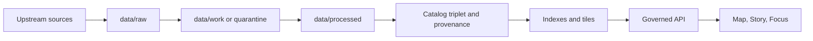

# `data/raw/`
Immutable acquisition zone for KFM (original artifacts + manifest + checksums).

**Status:** Canonical • Append-only • No edits  
**Owners:** Data Stewards (policy/rights) + Pipeline Operators (ingest runs)  
**Badges:** `zone:raw` `append-only` `evidence` `checksums-required` `license-snapshot-required`

**Quick nav**
- [Purpose](#purpose)
- [Non-negotiable rules](#non-negotiable-rules)
- [What belongs here](#what-belongs-here)
- [What does not belong here](#what-does-not-belong-here)
- [Recommended layout](#recommended-layout)
- [Acquisition manifest](#acquisition-manifest)
- [Checksums](#checksums)
- [Governance and safety](#governance-and-safety)
- [Promotion and next zones](#promotion-and-next-zones)
- [Checklist](#checklist)

---

## Purpose

`data/raw/` is the **RAW zone (immutable acquisition)** in the KFM “truth path” lifecycle: upstream sources → RAW → WORK/QUARANTINE → PROCESSED → catalogs/provenance → governed surfaces. [oai_citation:1‡KFM_Source_Snapshots_Bundle_from_vNext1_tables_fixed.pdf](sediment://file_00000000510071fda62c8325d7097fa2) [oai_citation:2‡KFM_Source_Snapshots_Bundle_from_vNext1_tables_fixed.pdf](sediment://file_00000000510071fda62c8325d7097fa2)

RAW exists to preserve **verbatim evidence** so all downstream outputs (maps, stories, Focus Mode answers, exports) can be traced back to what was actually acquired.



---

## Non-negotiable rules

### 1) Append-only, never edit
- RAW is **append-only**.
- You **do not edit** raw artifacts in-place; you **supersede** them by adding a new acquisition (new snapshot + new manifest). [oai_citation:3‡KFM_Source_Snapshots_Bundle_from_vNext1_tables_fixed.pdf](sediment://file_00000000510071fda62c8325d7097fa2)

### 2) No direct client access
RAW is a canonical store, but **clients must never access storage directly**. All access must flow through governed interfaces that apply policy, redaction obligations, and logging (the “trust membrane”). [oai_citation:4‡KFM_Source_Snapshots_Bundle_from_vNext1_tables_fixed.pdf](sediment://file_00000000510071fda62c8325d7097fa2)

### 3) Evidence needs checksums and terms captured at ingest
Every acquisition must include:
- **checksums for every raw artifact**
- a **license/terms snapshot** (or a clear note that reuse is restricted/unknown)
- minimal “what/where/when” metadata for repeatability [oai_citation:5‡KFM_Source_Snapshots_Bundle_from_vNext1_tables_fixed.pdf](sediment://file_00000000510071fda62c8325d7097fa2)

---

## What belongs here

RAW contains (minimum):
- **Acquisition manifest**: what was fetched, from where, and under what terms
- **Raw artifacts**: original files, API responses, scrape snapshots
- **Checksums** for every raw artifact
- **Minimal metadata**: time fetched, source, license/terms snapshot [oai_citation:6‡KFM_Source_Snapshots_Bundle_from_vNext1_tables_fixed.pdf](sediment://file_00000000510071fda62c8325d7097fa2)

Practical examples include ZIPs, PDFs, shapefiles, CSVs, and captured responses; organization may be by **source** or **topic** (e.g., `data/raw/usgs_water/`, `data/raw/historical_maps/`). [oai_citation:7‡Kansas Frontier Matrix (KFM) – Comprehensive Technical Blueprint.pdf](sediment://file_000000006dbc71f89a5094ce310a452d)

---

## What does not belong here

- Any “cleaned”, “normalized”, “joined”, “geocoded”, “tiling”, “reprojected”, “generalized”, or otherwise **transformed** outputs  
  → those belong in `data/work/` or `data/processed/`.
- Any hand-edited values in raw artifacts (even “small fixes”)  
  → if a correction is needed, add a new acquisition + document it in the manifest.
- Secrets, credentials, private keys, or access tokens (ever).

---

## Recommended layout

RAW may be organized by **source** or **domain**, but it should always be obvious:
1) what the source is
2) which acquisition (snapshot) you are looking at
3) where the manifest + checksums are

A pragmatic default:

```
data/raw/
  <source_or_domain>/
    <acquisition_id>/               # e.g., 2026-02-22T031500Z, or source-release tag
      manifest.json                 # acquisition manifest (required)
      artifacts/                    # raw files (verbatim)
      checksums.sha256              # sha256 per artifact (required)
      terms/                        # license/terms snapshot (html/pdf/txt) (recommended)
      notes.md                      # optional: human notes, not a substitute for manifest
```

> TIP: If you must extract an archive (e.g., unzip shapefiles), keep the **original archive** in `artifacts/` and record the extraction step in the manifest as a “verbatim extract” convenience. The archive remains the primary evidence.

---

## Acquisition manifest

The manifest is a **required** RAW artifact.

It must answer (minimum):
- *what was fetched*
- *from where*
- *under what terms*
- *when it was fetched* [oai_citation:8‡KFM_Source_Snapshots_Bundle_from_vNext1_tables_fixed.pdf](sediment://file_00000000510071fda62c8325d7097fa2)

### Template (recommended, may evolve)
```json
{
  "source_name": "USGS WaterData NWIS",
  "source_authority": "USGS",
  "fetched_at": "2026-02-22T03:15:00Z",
  "acquisition_id": "2026-02-22T031500Z",
  "access_method": "bulk|api|scrape|manual",
  "upstream_refs": [
    { "type": "url", "value": "…" }
  ],
  "license_terms_snapshot": {
    "captured_at": "2026-02-22T03:15:00Z",
    "artifact_path": "terms/terms.html",
    "notes": "…"
  },
  "artifacts": [
    { "path": "artifacts/data.zip", "sha256": "…" }
  ],
  "policy": {
    "policy_label": "public|public_generalized|restricted|restricted_sensitive_location|internal|embargoed|quarantine",
    "notes": "If restricted, include the reason and any obligations."
  }
}
```

---

## Checksums

Every raw artifact must have a checksum recorded in a stable format (default: **sha256**). [oai_citation:9‡KFM_Source_Snapshots_Bundle_from_vNext1_tables_fixed.pdf](sediment://file_00000000510071fda62c8325d7097fa2)

Recommended file format:
- `checksums.sha256` (one line per file): `<sha256>  <relative_path>`

---

## Governance and safety

### Licensing and rights
- Capture license/rights signals at ingest; **promotion blocks when license is unknown/forbidden**. [oai_citation:10‡KFM_Source_Snapshots_Bundle_from_vNext1_tables_fixed.pdf](sediment://file_00000000510071fda62c8325d7097fa2)
- “Online availability does not equal permission to reuse.” Treat rights metadata as a **policy input**, not paperwork.

### Sensitive locations and restricted datasets
Defaults aligned to KFM posture include:
- default deny for sensitive-location/restricted datasets
- if any public representation is allowed, publish a **public_generalized** derivative
- never leak restricted metadata through error responses
- treat redaction/generalization as a first-class transform recorded in provenance [oai_citation:11‡KFM_Source_Snapshots_Bundle_from_vNext1_tables_fixed.pdf](sediment://file_00000000510071fda62c8325d7097fa2)

RAW may contain restricted artifacts, but they must be handled as **restricted from the moment of acquisition** (policy label + access controls), and they must **not** be promoted or served without meeting policy + promotion gates.

---

## Promotion and next zones

From RAW, work proceeds to:
- `data/work/` for normalization and QA (and `quarantine/` for failures, unclear licensing, sensitivity concerns, etc.)
- `data/processed/` for publishable artifacts
- catalogs/provenance outputs (DCAT/STAC/PROV + run receipts) before anything reaches governed runtime surfaces [oai_citation:12‡KFM_Source_Snapshots_Bundle_from_vNext1_tables_fixed.pdf](sediment://file_00000000510071fda62c8325d7097fa2) [oai_citation:13‡KFM_Source_Snapshots_Bundle_from_vNext1_tables_fixed.pdf](sediment://file_00000000510071fda62c8325d7097fa2)

Promotion is **fail-closed**: a dataset version promotion must be blocked unless required artifacts exist and validate. [oai_citation:14‡KFM_Source_Snapshots_Bundle_from_vNext1_tables_fixed.pdf](sediment://file_00000000510071fda62c8325d7097fa2)

---

## Checklist

When adding a new acquisition under `data/raw/`:

- [ ] Store the **original artifacts** exactly as acquired (no edits)
- [ ] Add an **acquisition manifest** (what/where/when/terms)
- [ ] Generate and commit **sha256 checksums** for each artifact
- [ ] Capture a **license/terms snapshot** (or mark for quarantine if unclear)
- [ ] Assign a **policy label** (public/restricted/etc.); default to restrictive when uncertain
- [ ] Ensure downstream workflows treat RAW as **read-only**
- [ ] If the source is sensitive or rights-restricted, document the intended public representation (e.g., public_generalized) before any promotion

---

## Notes

- RAW is canonical evidence. If an artifact can be cited by Story Nodes or Focus Mode, it must remain reproducible and traceable through manifests, checksums, and downstream provenance.
