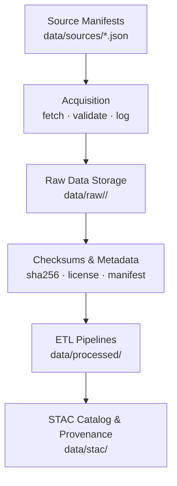

<div align="center">

# 🗃️ Kansas Frontier Matrix — Raw Data Directory

`data/raw/`

**Mission:** Preserve and document all **immutable, original datasets** downloaded or collected
from verified external sources — providing the foundational inputs for every ETL,
validation, and scientific workflow in the **Kansas Frontier Matrix (KFM)**.

[](../../.github/workflows/site.yml)
[](../../docs/)
[](../../LICENSE)
[](../../LICENSE)

</div>

---

## 🧩 Versioning

| Field            | Value                                                                            |
| :--------------- | :------------------------------------------------------------------------------- |
| **Version**      | `v1.0.1`                                                                         |
| **Status**       | Stable                                                                           |
| **Maintainer**   | KFM Data Acquisition & Provenance Team                                           |
| **Last Updated** | 2025-10-12                                                                       |
| **Scope**        | Immutable source datasets (`terrain`, `hydrology`, `landcover`, `climate`, etc.) |
| **Compliance**   | MCP v1.0 · STAC 1.0.0 · Provenance Verified                                      |

---

## 📚 Overview

The `data/raw/` directory contains **original, unmodified datasets** acquired from
registered external sources listed in `data/sources/`.
These represent the **ground truth inputs** for all downstream processing, validation,
and derived data products within KFM.

**Key Characteristics**

* 🧩 **Immutable** — no manual editing, reformatting, or manipulation
* 🔁 **Reproducible** — each file corresponds to a manifest in `data/sources/`
* 🔗 **Traceable** — origin, license, retrieval method, and checksum recorded
* ✅ **Validated** — verified SHA-256 checksum and metadata logged on acquisition

> ⚠️ **Do not modify files inside `data/raw/`.**
> To update a dataset, fetch a new copy via its source manifest and re-ingest it through ETL.

---

## 🗂️ Directory Layout

```bash
data/raw/
├── README.md
├── terrain/             # LiDAR DEMs, USGS 3DEP data
│   ├── ks_3dep_tiles.zip
│   └── lidar_tile_index.geojson
├── hydrology/           # NHD, WBD, NFHL datasets
│   ├── nhd_flowlines.zip
│   ├── wbd_huc12.zip
│   └── fema_nfhl.zip
├── landcover/           # NLCD, CDL, vegetation maps
│   ├── nlcd_1992_2021.zip
│   └── usda_cdl_2020.tif
├── climate/             # Daymet, NOAA, Drought Monitor
│   ├── daymet_1980_2024.nc
│   ├── noaa_normals_1991_2020.csv
│   └── drought_monitor_2000_2025.zip
├── hazards/             # Tornado, flood, wildfire, drought sources
│   ├── noaa_storm_events.csv
│   ├── usgs_wildfire_perimeters.zip
│   └── fema_flood_events.geojson
├── tabular/             # Census, USDA, BEA, BLS datasets
│   ├── census_population_1860_2020.csv
│   ├── usda_agriculture_production.csv
│   └── bea_economic_indicators.csv
└── text/                # OCR documents, transcripts, treaties, newspapers
    ├── loc_chronicling_america.zip
    ├── kshs_oral_histories.json
    └── yale_avalon_treaties.txt
```

Each domain mirrors the **KFM data taxonomy**, directly tied to manifests in `data/sources/`.

---

## ⚙️ Acquisition Workflow

All raw data are acquired automatically using **source manifests** that define URLs, metadata, and retrieval protocols.

### Makefile Target

```bash
make fetch-raw
```

### Python Command

```bash
python src/utils/fetch_data.py --manifest data/sources/hydrology/usgs_nhd_flowlines.json
```

### Workflow Steps

1. Validate manifest (`data/sources/*.json`).
2. Fetch via HTTPS, API, or FTP.
3. Save to `data/raw/<domain>/` with standardized filenames.
4. Generate `.sha256` checksum + metadata JSON.
5. Log acquisition event in `data/checksums/` and `data/sources/`.

---

## 🧭 Mermaid Acquisition Flow



---

## 🧾 Raw Data Metadata Schema

| Field              | Description                     | Example                      |
| :----------------- | :------------------------------ | :--------------------------- |
| `source_id`        | Unique ID from `data/sources/`. | `usgs_3dep_dem`              |
| `retrieved_on`     | ISO 8601 timestamp.             | `2025-10-04T12:30:00Z`       |
| `checksum`         | SHA-256 digest of file.         | `b8494a...3b61cb6ac8d`       |
| `file_size`        | File size in MB.                | `1420.5`                     |
| `license`          | Data usage license.             | `Public Domain (USGS)`       |
| `retrieval_method` | Transfer method.                | `REST API`                   |
| `linked_pipeline`  | Downstream ETL script.          | `terrain_pipeline.py`        |
| `notes`            | Additional comments.            | `Fetched via USGS 3DEP API.` |

---

## 🧩 Integration with KFM Pipelines

| Linked Component              | Purpose                                    |
| :---------------------------- | :----------------------------------------- |
| `data/sources/`               | Defines provenance + acquisition metadata. |
| `src/pipelines/*`             | ETL scripts transforming raw → processed.  |
| `data/processed/`             | Repository of standardized outputs.        |
| `data/checksums/`             | Tracks download integrity.                 |
| `.github/workflows/fetch.yml` | CI/CD automation for fetch validation.     |

---

## 🧹 Cleanup & Validation

Although raw datasets are immutable, they may be **revalidated or refreshed** when a source is updated.

### Revalidate

```bash
make validate-raw
```

### Refresh from Source

```bash
make fetch-raw-refresh
```

### Manual Cleanup *(rarely used)*

```bash
rm -rf data/raw/<domain>/*
```

---

## 🧠 MCP Compliance Summary

| MCP Principle       | Implementation                                     |
| :------------------ | :------------------------------------------------- |
| Documentation-first | README defines structure and workflow.             |
| Reproducibility     | Deterministic acquisition from manifests.          |
| Open Standards      | All datasets use open formats/APIs.                |
| Provenance          | Full lineage traceable to source manifest.         |
| Auditability        | CI/CD logs each acquisition + checksum validation. |

---

## 📎 Related Directories

| Path                       | Description                                   |
| :------------------------- | :-------------------------------------------- |
| `data/sources/`            | Source manifests defining dataset origins.    |
| `data/checksums/`          | Integrity validation for raw/processed files. |
| `data/processed/`          | Cleaned, validated, and derived datasets.     |
| `data/processed/metadata/` | STAC metadata linking raw → processed.        |

---

## 📅 Version History

| Version   | Date       | Summary                                                |
| :-------- | :--------- | :----------------------------------------------------- |
| **1.0.1** | 2025-10-12 | Added version metadata + Mermaid flow + MCP alignment. |
| **1.0.0** | 2025-10-04 | Initial raw data documentation + acquisition workflow. |

---

<div align="center">

> **Kansas Frontier Matrix — “Every Dataset Begins Here: Untouched, Immutable, and Proven.”**
> 📍 [`data/raw/`](.) · Archive of all original, verifiable datasets powering the Kansas Frontier Matrix.

</div>
