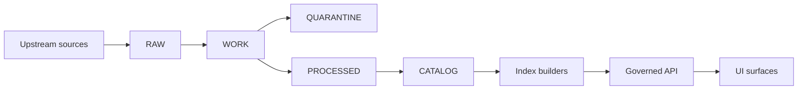

<!-- [KFM_META_BLOCK_V2]
doc_id: kfm://doc/9a5e3b0b-1e65-4a5f-8f7c-3e4c0a8d0d5b
title: data/raw — Immutable acquisition zone
type: standard
version: v1
status: draft
owners: TBD
created: 2026-02-22
updated: 2026-02-22
policy_label: public
related:
  - kfm://concept/truth-path
  - kfm://policy/promotion-contract
tags:
  - kfm
  - data
  - raw
notes:
  - Defines the repository contract for RAW (immutable acquisition).
[/KFM_META_BLOCK_V2] -->

# data/raw — Immutable acquisition zone

Source snapshots and acquisition manifests. **Append-only. No transforms.**


## Navigation

- [Purpose](#purpose)
- [Scope](#scope)
- [Truth path context](#truth-path-context)
- [Rules](#rules)
- [What belongs here](#what-belongs-here)
- [What does not belong here](#what-does-not-belong-here)
- [Directory layout](#directory-layout)
- [Required records](#required-records)
- [Acquisition manifest template](#acquisition-manifest-template)
- [Checksums](#checksums)
- [License and terms snapshot](#license-and-terms-snapshot)
- [Add a new acquisition](#add-a-new-acquisition)
- [Governance and sensitivity](#governance-and-sensitivity)
- [Promotion out of RAW](#promotion-out-of-raw)
- [Definition of done](#definition-of-done)

---

## Purpose

The `data/raw/` area is the **immutable acquisition zone** for Kansas Frontier Matrix.

It exists to:

- Preserve **exact upstream artifacts** (files, API responses, scrape snapshots).
- Provide **reproducible inputs** for pipelines.
- Make provenance and governance enforceable by requiring:
  - an acquisition manifest,
  - per-artifact checksums,
  - a license/terms snapshot,
  - minimal acquisition metadata.

---

## Scope

This README defines **what RAW is** and **how to add to it safely**.

It does not define:

- Transformation logic (belongs in WORK / QUARANTINE pipelines).
- Published formats (belongs in PROCESSED).
- Runtime access, policy enforcement details, or API routes (belongs at the governed boundary).

---

## Truth path context

RAW is one stage in KFM’s end-to-end “truth path”.



---

## Rules

**1) RAW is append-only**  
Do not edit or rewrite RAW artifacts in place. If something changes upstream, **create a new acquisition** (new folder) and keep the prior snapshot intact.

**2) No transforms in RAW**  
RAW is for original materials only. Any parsing, normalization, OCR, reprojection, deduplication, or redaction work happens later.

**3) Every artifact has a checksum**  
If an artifact is in RAW, it must be covered by `checksums.sha256` (or equivalent).

**4) Every acquisition has minimal metadata**  
At minimum: when fetched, where from, and the terms under which it was fetched.

> **WARNING**
> If you cannot capture license/terms or the source is unstable/unreproducible, treat the dataset as **not promotable** until resolved.

---

## What belongs here

RAW should contain:

- **Acquisition manifest**  
  What was fetched, from where, when, and under what terms.

- **Raw artifacts**  
  Original files, API payloads, scrape snapshots, exports, emails-as-source (if governed), etc.

- **Checksums**  
  A digest for every raw artifact.

- **Minimal metadata**  
  Time fetched, source identity, and license/terms snapshot.

---

## What does not belong here

Do not place any of the following in RAW:

- Cleaned or normalized copies of source data
- Converted formats (CSV→Parquet, GeoJSON→GeoParquet, SHP→GeoPackage, etc.)
- Derived spatial products (tiles, COGs, PMTiles)
- Feature engineering outputs, indexes, caches
- Redacted or generalized public representations
- Anything produced by a pipeline “step” after acquisition

Those belong in WORK / QUARANTINE or PROCESSED.

---

## Directory layout

KFM commonly uses a domain-first layout such as:

- `data/<domain>/raw/`
- `data/<domain>/work/`
- `data/<domain>/processed/`

If this repository uses a **central** `data/raw/`, organize by domain and dataset.

Recommended structure for this folder:

```text
data/raw/
  <domain>/
    <dataset_slug>/
      <acquisition_id>/
        acquisition.manifest.json
        checksums.sha256
        license.snapshot.txt
        artifacts/
          <original files>
        notes.md
```

### Naming rules

- `<domain>`: a stable domain folder name (kebab-case), e.g. `historical`, `hydrology`, `air-quality`
- `<dataset_slug>`: stable dataset identifier (kebab-case)
- `<acquisition_id>`: a sortable acquisition identifier:
  - preferred: `YYYY-MM-DDTHHMMSSZ`
  - acceptable: `YYYY-MM-DD` when time precision is not available

---

## Required records

Every `<acquisition_id>/` folder must include:

1. `acquisition.manifest.json`  
2. `checksums.sha256`  
3. `license.snapshot.txt`  
4. `artifacts/` directory with the referenced files

Optional but strongly recommended:

- `notes.md` with human context and known issues
- `robots.txt` or request headers snapshot if scraping was required
- a `README.md` under dataset folder for dataset-specific runbook

---

## Acquisition manifest template

Use JSON for machine readability and future schema validation.

```json
{
  "kfm_acquisition_manifest_version": "v1",
  "domain": "<domain>",
  "dataset_slug": "<dataset_slug>",
  "acquisition_id": "<YYYY-MM-DDTHHMMSSZ>",
  "fetched_at": "YYYY-MM-DDTHHMMSSZ",
  "source": {
    "name": "<source system or publisher>",
    "type": "download|api|scrape|manual",
    "uri": "<source URL or stable identifier>",
    "retrieval_method": "<tool + parameters summary>"
  },
  "terms": {
    "license": "<spdx or textual>",
    "rights_holder": "<if known>",
    "terms_uri": "<terms page URL if applicable>",
    "snapshot_file": "license.snapshot.txt"
  },
  "artifacts": [
    {
      "path": "artifacts/<filename>",
      "media_type": "<mime type if known>",
      "sha256": "<hex or sha256:...>",
      "size_bytes": 0
    }
  ],
  "notes": {
    "known_issues": [],
    "sensitivity_notes": ""
  }
}
```

---

## Checksums

Use `sha256` and store checksums relative to the acquisition directory.

Example:

```text
# checksums.sha256
<sha256-hex>  artifacts/source.csv
<sha256-hex>  artifacts/source.zip
<sha256-hex>  license.snapshot.txt
<sha256-hex>  acquisition.manifest.json
```

Rules:

- Checksums must match the current file bytes exactly.
- If any artifact changes, create a new acquisition folder. Do not rewrite past checksums.

---

## License and terms snapshot

`license.snapshot.txt` is a “frozen” copy of the terms that applied at acquisition time.

Include:

- The license or terms text (or an excerpt plus link when copying is not permitted)
- The terms page URI
- The date/time captured
- Any required attribution statements

Do not assume that a public URL implies reuse permission.

---

## Add a new acquisition

1. Choose domain and dataset slug
   - Confirm you are not duplicating an existing dataset slug.
2. Create a new acquisition folder
   - `data/raw/<domain>/<dataset_slug>/<acquisition_id>/`
3. Add raw artifacts to `artifacts/`
   - Keep originals as-is.
4. Capture license/terms
   - Write `license.snapshot.txt` with date/time and source URI.
5. Write `acquisition.manifest.json`
   - List every artifact and how it was obtained.
6. Generate `checksums.sha256`
   - Include the manifest and license snapshot too.
7. Add minimal human notes
   - `notes.md` with known issues, coverage, and any sensitivities.
8. Open a PR
   - Treat the PR description as part of the audit trail.

---

## Governance and sensitivity

RAW may contain sensitive materials.

Hard rules:

- Do not publish or mirror restricted materials outside governed controls.
- Do not add secrets or credentials to RAW.
- If content includes sensitive locations, private individuals, or culturally restricted sites:
  - mark it for restricted handling in manifest notes,
  - avoid “easy-to-copy” coordinate lists in human notes,
  - plan for a generalized/redacted derivative later as a separate promoted dataset version.

---

## Promotion out of RAW

Promotion is governed and fail-closed.

RAW acquisitions move to WORK / QUARANTINE for:

- normalization,
- QA and validation reports,
- candidate redactions/generalizations.

Only after passing gates do artifacts become PROCESSED and receive catalog/provenance outputs.

---

## Definition of done

A RAW acquisition is acceptable when:

- [ ] `acquisition.manifest.json` exists and lists all artifacts
- [ ] `license.snapshot.txt` exists and contains capture date/time + source reference
- [ ] `checksums.sha256` exists and covers all artifacts + manifest + license snapshot
- [ ] RAW artifacts are original and unmodified
- [ ] No derived/processed files are present
- [ ] Notes identify any sensitivity or licensing uncertainty
- [ ] The acquisition is append-only and does not overwrite prior acquisitions

---

<sub><a href="#dataraw--immutable-acquisition-zone">Back to top</a></sub>
