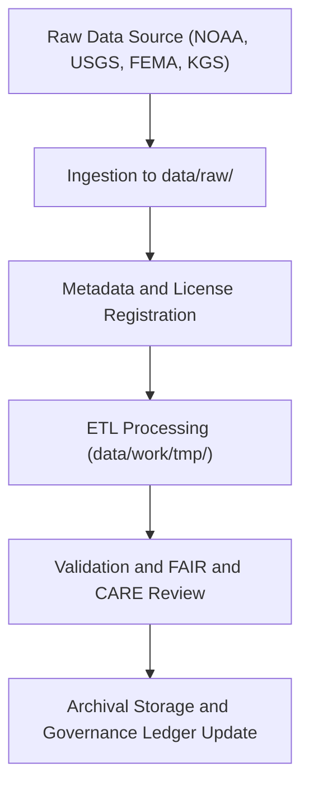

<div align="center">

# 📦 Kansas Frontier Matrix — **Raw Data Repository**
`data/raw/README.md`

**Purpose:** Contains unaltered source datasets ingested from verified scientific, governmental, and archival repositories.  
All files within this directory serve as the immutable foundation for ETL pipelines, validation workflows, and FAIR+CARE governance processes in Kansas Frontier Matrix (KFM).

[](../../docs/contracts/data-contract-v3.json)
[](../../.github/workflows/stac-validate.yml)
[](../../docs/standards/faircare-validation.md)
[](../../docs/architecture/repo-focus.md)

</div>

---

## 📚 Overview

The `data/raw/` directory stores **immutable copies** of all datasets used in KFM ETL pipelines.  
Each dataset is stored exactly as received from its original source and is accompanied by metadata describing its provenance, license, and access history.  

Raw data is never modified directly — all transformations occur within the `data/work/` layer under governed ETL and validation procedures.  
This directory supports **data reproducibility, lineage tracking, and source transparency** under FAIR+CARE governance.

---

## 🗂️ Directory Layout

```plaintext
data/raw/
├── README.md                        # This file — overview of raw data storage
│
├── usgs/                            # U.S. Geological Survey data
│   ├── elevation_models/            # DEM and LiDAR datasets
│   ├── groundwater_levels/          # Aquifer observation wells
│   ├── metadata.json
│   └── license.txt
│
├── fema/                            # FEMA National Flood Hazard Layer and disaster declarations
│   ├── flood_zones/
│   ├── disaster_declarations/
│   ├── metadata.json
│   └── license.txt
│
├── noaa/                            # NOAA and NCEI datasets for weather and climate
│   ├── storm_events/
│   ├── drought_monitor/
│   ├── temperature_anomalies/
│   ├── metadata.json
│   └── license.txt
│
└── kgs/                             # Kansas Geological Survey and state-level geodata
    ├── hydrology/
    ├── wells/
    ├── lithologic_logs/
    ├── metadata.json
    └── license.txt
```

---

## ⚙️ Data Governance Workflow



### Process Summary:
1. **Ingestion:** Datasets fetched directly from verified APIs or FTP endpoints.  
2. **Registration:** Metadata, checksum, and source license recorded in `metadata.json`.  
3. **ETL Transformation:** Processing conducted under reproducible scripts in `/src/pipelines/etl/`.  
4. **Validation:** Schema and FAIR+CARE conformance validated automatically.  
5. **Governance Logging:** Provenance recorded in `data/reports/audit/data_provenance_ledger.json`.

---

## 🧩 Metadata Standards

All raw datasets include a companion metadata file conforming to **STAC 1.0** and **DCAT 3.0** specifications.

### Example `metadata.json`
```json
{
  "id": "noaa_storm_events_2025",
  "title": "NOAA Storm Events Database (Kansas)",
  "description": "Official NOAA dataset of severe weather events affecting Kansas counties.",
  "source_url": "https://www.ncdc.noaa.gov/stormevents/",
  "provider": "NOAA National Centers for Environmental Information",
  "license": "Public Domain",
  "checksum": "sha256:a2d5efc392b5c65d9b0eab8a55e334e13e456b0d...",
  "spatial_extent": [-102.05, 36.99, -94.61, 40.00],
  "temporal_extent": ["1950-01-01", "2025-12-31"]
}
```

---

## ⚖️ Licensing Overview

| Source | License | Usage Notes |
|---------|----------|-------------|
| **NOAA** | Public Domain (U.S. Government Works) | Free for all research and educational use. |
| **USGS** | Public Domain / USGS Data Policy | Attribution required for derivative works. |
| **FEMA** | Open Data (Creative Commons 0 / Public Domain) | Use permitted with citation. |
| **KGS** | CC-BY 4.0 | Attribution required to Kansas Geological Survey. |

Each subdirectory includes a `license.txt` specifying applicable usage restrictions.

---

## 🔍 Data Provenance & Integrity

- **Checksum Verification:** SHA-256 hashes generated at ingestion and logged in `releases/v9.3.2/manifest.zip`.  
- **Provenance Ledger:** Each file linked to governance record in `data/reports/audit/data_provenance_ledger.json`.  
- **Version Control:** Data sources versioned via tag references (e.g., `noaa_2025Q3`, `usgs_2024H2`).  
- **Access Logs:** Ingestion logs retained under `data/reports/lineage/etl_job_history.json`.

---

## 🧠 FAIR+CARE Compliance for Raw Data

| Principle | Implementation |
|------------|----------------|
| **Findable** | Each dataset indexed with unique ID in STAC catalog. |
| **Accessible** | Stored in open, non-proprietary formats. |
| **Interoperable** | Metadata adheres to STAC/DCAT standards. |
| **Reusable** | Includes license, checksum, and provenance metadata. |
| **Collective Benefit** | Promotes transparent access to foundational datasets. |
| **Authority to Control** | Source organizations acknowledged and preserved. |
| **Responsibility** | Ingestion validated under ethical and technical governance. |
| **Ethics** | No sensitive or restricted data stored without permission. |

---

## ⚙️ Related Workflows

| Workflow | Function | Output |
|-----------|-----------|---------|
| `.github/workflows/etl-ingest.yml` | Automates raw data ingestion | `data/raw/*/metadata.json` |
| `.github/workflows/stac-validate.yml` | Validates STAC and schema metadata | `data/reports/validation/stac_validation_report.json` |
| `.github/workflows/governance-ledger.yml` | Logs ingestion provenance and checksum | `data/reports/audit/data_provenance_ledger.json` |

---

## 🧾 Citation Example

```text
Kansas Frontier Matrix (2025). Kansas Raw Data Repository (v9.3.2).
Unaltered foundational datasets ingested from NOAA, USGS, FEMA, and KGS under FAIR+CARE governance.
Available at: https://github.com/bartytime4life/Kansas-Frontier-Matrix/tree/main/data/raw
License: Source-specific (see metadata and license files).
```

---

## 🧾 Version Notes

| Version | Date | Notes |
|----------|------|--------|
| v9.3.2 | 2025-10-28 | Added new NOAA and FEMA datasets; validated checksum and metadata schema. |
| v9.2.0 | 2024-07-15 | Introduced KGS lithologic and hydrology datasets. |
| v9.0.0 | 2023-01-10 | Established base raw data structure for ETL pipelines. |

---

<div align="center">

**Kansas Frontier Matrix** · *Raw Data × Provenance × FAIR+CARE Transparency*  
[🔗 Repository](https://github.com/bartytime4life/Kansas-Frontier-Matrix) • [🧭 Docs Portal](../../docs/) • [⚖️ Governance Ledger](../../docs/standards/governance/)

</div>
