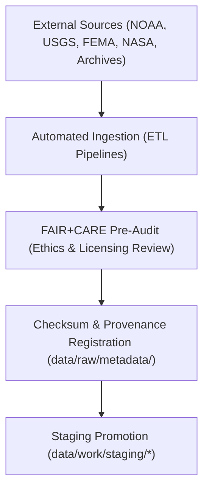

<div align="center">

# 📥 Kansas Frontier Matrix — **Raw Data Layer**
`data/raw/README.md`

**Purpose:**  
This layer contains **unaltered, source-level datasets** collected from verified public, academic, and governmental data providers.  
The Raw Data Layer is the **foundation of the Kansas Frontier Matrix (KFM)**, supporting transparent ingestion pipelines, provenance validation, and FAIR+CARE-compliant data lifecycle tracking.

[](../../docs/standards/faircare-validation.md)
[]()
[]()
[](../../LICENSE)

</div>

---

## 📚 Overview

The **Raw Data Layer** serves as the immutable repository for all input datasets utilized by KFM’s ETL and AI workflows.  
Each source dataset is stored in its **original format**, accompanied by governance metadata and checksums to preserve provenance, reproducibility, and licensing integrity.

### Core Functions
- Store **unaltered source datasets** with metadata and licensing.  
- Document **source provenance and acquisition method** for transparency.  
- Maintain **checksum validation** for data integrity and reproducibility.  
- Facilitate FAIR+CARE ethics alignment during ingestion and staging.  
- Provide immutable baselines for all downstream transformations.  

---

## 🗂️ Directory Layout

```plaintext
data/raw/
├── README.md                            # This file — overview of the raw data layer
│
├── climate/                             # NOAA, NIDIS, and CPC datasets for temperature, drought, and precipitation
├── hazards/                             # FEMA, USGS, and NOAA hazard event data (floods, tornadoes, droughts)
├── hydrology/                           # USGS streamflow, aquifer, and watershed datasets
├── landcover/                           # MODIS, Landsat, NLCD, and vegetation classification datasets
├── tabular/                             # Historical, census, and administrative datasets in tabular format
├── terrain/                             # DEMs, slope, and elevation rasters for Kansas terrain analysis
├── text/                                # OCR-scanned documents, archival texts, and reports
└── metadata/                            # Source provenance metadata, checksums, and data contracts
```

---

## 🧭 Data Acquisition Workflow



### Workflow Steps
1. **Acquisition:** Datasets are retrieved via official APIs, FTP, or repositories.  
2. **Verification:** Source checksums validated and licensing verified.  
3. **Pre-Audit:** FAIR+CARE ethics and attribution metadata appended.  
4. **Registration:** Provenance records stored in governance ledger.  
5. **Promotion:** Data moved to staging for transformation and validation.

---

## 🧩 Example Source Metadata Record

```json
{
  "id": "noaa_temperature_1900_2025_raw",
  "domain": "climate",
  "source_url": "https://www.ncdc.noaa.gov/cdo-web/",
  "provider": "NOAA National Centers for Environmental Information",
  "license": "Public Domain",
  "records_fetched": 125480,
  "schema_version": "v3.0.1",
  "checksum_sha256": "sha256:aaf87123e5c16bcae094a9c71e2d93b09c29a38cf7d5b1e07c187a9127f84a53",
  "fetched_on": "2025-11-03T19:22:00Z",
  "validator": "@kfm-etl-ops",
  "governance_ref": "data/reports/audit/data_provenance_ledger.json"
}
```

---

## ⚙️ FAIR+CARE Source Governance Matrix

| Principle | Implementation | Oversight |
|------------|----------------|------------|
| **Findable** | Indexed via STAC and DCAT metadata in `data/raw/metadata/`. | @kfm-data |
| **Accessible** | Openly stored under public data licenses. | @kfm-accessibility |
| **Interoperable** | Retains native formats for reproducibility (CSV, GeoTIFF, NetCDF, JSON). | @kfm-architecture |
| **Reusable** | Metadata includes source, schema, and licensing. | @kfm-design |
| **Collective Benefit** | Contributes to public and environmental knowledge. | @faircare-council |
| **Authority to Control** | FAIR+CARE Council validates ethical and attribution compliance. | @kfm-governance |
| **Responsibility** | Source validators document ingestion and verification results. | @kfm-security |
| **Ethics** | Sensitive or restricted content redacted per governance policy. | @kfm-ethics |

Governance results are logged in:  
`data/reports/audit/data_provenance_ledger.json` and `data/reports/fair/faircare_summary.json`

---

## 🧠 Data Integrity Verification

| Process | Description | Output |
|----------|--------------|---------|
| **Checksum Verification** | Validates raw dataset integrity using SHA-256 hashing. | `data/raw/metadata/checksums.json` |
| **Provenance Logging** | Records acquisition metadata for governance traceability. | `data/raw/metadata/provenance.json` |
| **FAIR+CARE Pre-Audit** | Validates ethical and licensing compliance. | `data/raw/metadata/faircare_preaudit.json` |
| **Ledger Registration** | Links dataset lineage to the governance ledger. | `data/reports/audit/data_provenance_ledger.json` |

---

## 📊 Example Checksum Record

```json
{
  "file": "data/raw/hazards/flood_zones_fema_2025.geojson",
  "checksum_sha256": "sha256:5c14a98df17b98a472fd8ea94c29deeb1bdf23a8a6c7f9158b1e58f0e567c9a3",
  "validated": true,
  "verified_on": "2025-11-03T19:24:00Z",
  "source_ref": "FEMA NFHL Flood Zones API",
  "ledger_ref": "data/reports/audit/data_provenance_ledger.json"
}
```

---

## ⚖️ Preservation & Retention Policy

| Category | Retention Duration | Policy |
|-----------|--------------------|--------|
| Raw Data Files | Permanent | Immutable archival for provenance assurance. |
| Metadata | Permanent | Retained under ISO 19115 and FAIR+CARE governance. |
| Checksum Records | Permanent | Stored for reproducibility and auditing. |
| FAIR+CARE Pre-Audits | 5 Years | Archived for licensing and attribution review. |
| Logs | 365 Days | Rotated annually for compliance tracking. |

All retention workflows managed by `raw_data_retention.yml`.

---

## 🌱 Sustainability Practices

| Practice | Description | Standard |
|-----------|--------------|-----------|
| **Immutable Storage** | All raw data stored on certified long-term archival infrastructure. | ISO 16363 |
| **Renewable Compute** | Ingestion pipelines powered by RE100-compliant energy sources. | ISO 14064 |
| **Open Source Reuse** | All ingestion tools open-licensed for community extension. | FAIR+CARE |
| **Governance Transparency** | Audit reports publicly accessible through GitHub repository. | MCP-DL v6.3 |

Telemetry logs recorded in:  
`releases/v9.6.0/focus-telemetry.json`

---

## 🧾 Internal Use Citation

```text
Kansas Frontier Matrix (2025). Raw Data Layer (v9.6.0).
Immutable FAIR+CARE-certified repository for unaltered source datasets from NOAA, USGS, FEMA, NASA, and public archives.
Implements checksum validation, ISO 19115 provenance logging, and open data ethics under MCP-DL v6.3 compliance.
```

---

## 🧾 Version Notes

| Version | Date | Notes |
|----------|------|--------|
| v9.6.0 | 2025-11-03 | Added checksum registry automation and FAIR+CARE licensing metadata. |
| v9.5.0 | 2025-11-02 | Integrated provenance logs with governance ledger sync. |
| v9.3.2 | 2025-10-28 | Established baseline raw data structure and FAIR+CARE pre-audit protocol. |

---

<div align="center">

**Kansas Frontier Matrix** · *Open Data Integrity × FAIR+CARE Governance × Provenance Accountability*  
[🔗 Repository](https://github.com/bartytime4life/Kansas-Frontier-Matrix) • [🧭 Governance Ledger](../../docs/standards/governance/DATA-GOVERNANCE.md) • [📊 FAIR+CARE Reports](../../data/reports/fair/faircare_summary.json)

</div>