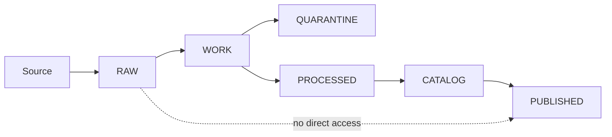

<!-- [KFM_META_BLOCK_V2]
doc_id: kfm://doc/NEEDS_VERIFICATION
title: data/raw/
type: standard
version: v1
status: draft
owners: @bartytime4life
created: YYYY-MM-DD
updated: YYYY-MM-DD
policy_label: NEEDS_VERIFICATION
related: [../README.md, ../registry/README.md, ../work/README.md, ../quarantine/README.md, ../processed/README.md, ../catalog/README.md, ../receipts/README.md, ../published/README.md, ../proofs/README.md, ../../contracts/README.md, ../../schemas/README.md, ../../policy/README.md, ../../tests/README.md, ../../tools/README.md, ../../.github/workflows/README.md]
tags: [kfm, data, raw, truth-path]
notes: [Owner grounded to current public CODEOWNERS coverage for /data/; UUID, dates, and policy label still need verification.]
[/KFM_META_BLOCK_V2] -->

<a id="top"></a>
<a id="dataraw"></a>

# `data/raw/`

Immutable, source-native intake zone for KFM evidence-bearing inputs.

> [!IMPORTANT]
> **Status:** experimental  
> **Doc state:** draft  
> **Owners:** `@bartytime4life` *(current public `/data/` CODEOWNERS coverage)*  
> **Path target:** `data/raw/README.md`  
> **Quick jump:** [Scope](#scope) · [Evidence snapshot](#current-public-evidence-snapshot) · [Repo fit](#repo-fit) · [Accepted inputs](#accepted-inputs) · [Exclusions](#exclusions) · [Directory tree](#directory-tree) · [Quickstart](#quickstart) · [Usage](#usage) · [Diagram](#diagram) · [Tables](#tables) · [Task list](#task-list) · [FAQ](#faq) · [Appendix](#appendix)  
>      

> [!IMPORTANT]
> Read this README in four layers:
>
> - **CONFIRMED doctrine** — `RAW` is the source-native intake stage in the KFM truth path  
> - **CONFIRMED public tree** — `data/raw/` exists and currently shows `README.md` only  
> - **PROPOSED structure** — acquisition folders, manifests, checksums, rights snapshots  
> - **UNKNOWN / NEEDS VERIFICATION** — branch-local tooling, schema wiring, and real subtree contents  

> [!WARNING]
> `data/raw/` is upstream capture. It is **not the public edge**, **not the trust membrane**, and **not a transform or delivery surface**.

---

## Scope

`data/raw/` is where upstream material lands **before any transformation, normalization, enrichment, or publication**.

KFM truth path:

```
Source edge → RAW → WORK / QUARANTINE → PROCESSED → CATALOG → PUBLISHED
```

This zone preserves the earliest trustworthy capture so downstream stages can answer:

- What exactly arrived?
- From where?
- Under what request, terms, or boundary?
- With what integrity evidence?
- Which downstream artifact was derived from it?

RAW is both:
- a storage surface
- a provenance memory surface

---

## Current public evidence snapshot

| Signal | Status | Meaning |
|---|---|---|
| `data/raw/README.md` exists | **CONFIRMED** | RAW is a real top-level lifecycle lane |
| Current inventory | **CONFIRMED** | Public `main` shows README-only |
| `/data/` ownership | **CONFIRMED** | `@bartytime4life` via CODEOWNERS |
| Adjacent lifecycle docs | **CONFIRMED** | `work/`, `quarantine/`, `processed/`, `catalog/`, etc. exist |
| Deeper raw structure | **UNKNOWN / NEEDS VERIFICATION** | No checked-in subtree is proven |

---

## Repo fit

**Path:** `data/raw/README.md`  
**Role:** source-native intake and immutability boundary

### Lifecycle adjacency

| Relation | Surface | Status | Why |
|---|---|---|---|
| Parent | [`../README.md`](../README.md) | **CONFIRMED** | Defines lifecycle law |
| Lateral | [`../registry/README.md`](../registry/README.md) | **CONFIRMED** | Source identity lives there |
| Lateral | [`../work/README.md`](../work/README.md) | **CONFIRMED** | Transform staging happens there |
| Lateral | [`../quarantine/README.md`](../quarantine/README.md) | **CONFIRMED** | Blocked material goes there |
| Downstream | [`../processed/README.md`](../processed/README.md) | **CONFIRMED** | Stable artifacts belong there |
| Downstream | [`../catalog/README.md`](../catalog/README.md) | **CONFIRMED** | Closure happens there |
| Downstream | [`../receipts/README.md`](../receipts/README.md) | **CONFIRMED** | Process memory |
| Downstream | [`../proofs/README.md`](../proofs/README.md) | **CONFIRMED** | Release evidence |
| Shared control | [`../../contracts/`](../../contracts/) · [`../../schemas/`](../../schemas/) · [`../../policy/`](../../policy/) | **CONFIRMED** | Authority boundaries |
| Tooling | [`../../tools/`](../../tools/) | **CONFIRMED** | Helper lane |
| Workflows | [`../../.github/workflows/`](../../.github/workflows/) | **CONFIRMED path / UNKNOWN depth** | Automation uncertain |

### Repo-fit summary

| Question | Answer |
|---|---|
| What belongs here? | Source-native bytes + acquisition context |
| What must not happen? | Transformation, mutation, or publication |
| Core rule | Land first, interpret later |

---

## Accepted inputs

| Input | Why |
|---|---|
| Original files | Preserve upstream reality |
| API snapshots | Enable replay |
| Archive bundles | Preserve package boundaries |
| Raw tabular / spatial / media files | Format-agnostic intake |
| Checksums | Integrity proof |
| Rights snapshots | Legal context |
| Request context | Replay + provenance |
| Intake notes | Prevent tribal memory loss |

---

## Exclusions

| Does NOT belong | Goes to |
|---|---|
| Cleaned / normalized data | `work/` or `processed/` |
| Derived outputs | downstream zones |
| Blocked material | `quarantine/` |
| Catalog artifacts | `catalog/` |
| Proof / release artifacts | `proofs/` |
| Schemas / contracts | shared surfaces |
| Policy logic | `policy/` |
| Public-serving data | governed API layer |

> [!CAUTION]
> If it has already been transformed for usefulness, it is no longer RAW.

---

## Directory tree

### Current public state

```text
data/raw/
└── README.md
```

### Proposed starter structure

```text
data/raw/
└── <source_id>/
    └── <acquisition_id>/
        ├── manifest.json
        ├── checksums.sha256
        ├── rights_snapshot/
        ├── request/
        └── payload/
```

### Example

```text
data/raw/
└── usgs_nwis/
    └── 2026-03-22T180000Z/
        ├── manifest.json
        ├── checksums.sha256
        ├── rights_snapshot/
        │   └── terms.html
        ├── request/
        │   └── query.json
        └── payload/
            └── observations.json
```

---

## Quickstart

### Inspect zone

```bash
find data/raw -maxdepth 3 -print | sort
```

### Create intake

```bash
SOURCE_ID="example"
ACQ_ID="2026-04-16"

mkdir -p data/raw/$SOURCE_ID/$ACQ_ID/{payload,request,rights_snapshot}

sha256sum data/raw/$SOURCE_ID/$ACQ_ID/payload/* > data/raw/$SOURCE_ID/$ACQ_ID/checksums.sha256
```

---

## Usage

### Rules

1. Land bytes first
2. Preserve acquisition context
3. Snapshot rights early
4. Avoid mutation
5. Move transforms downstream
6. Escalate ambiguity to quarantine

### Practical handling

| Situation | Action |
|---|---|
| Bad source file | Preserve original, fix downstream |
| Terms changed | Capture new snapshot separately |
| Need preview | Generate downstream |
| Wrong file fetched | Supersede visibly |
| Blocked batch | Route to quarantine |

> [!IMPORTANT]
> Never overwrite silently.

---

## Diagram


```mermaid
flowchart LR
    S[Source] --> R[RAW]
    R --> W[WORK]
    W --> Q[QUARANTINE]
    W --> P[PROCESSED]
    P --> C[CATALOG]
    C --> U[PUBLISHED]

    R -. no direct access .-> U
```

---

## Tables

### Minimum raw pack

| Artifact | Purpose |
|---|---|
| payload | actual source data |
| checksums | integrity |
| manifest | context |
| rights_snapshot | legal |
| request | replay |

### RAW do / do not

| Do | Do not |
|---|---|
| preserve bytes | mutate data |
| record context | assume memory |
| capture rights | defer legality |
| keep packages | flatten silently |
| supersede visibly | overwrite |

---

## Task list

- [ ] Meta block verified
- [ ] RAW immutability enforced
- [ ] Lifecycle positioning clear
- [ ] No transform logic implied
- [ ] Starter structure marked PROPOSED

---

## FAQ

### Is RAW public?
No.

### Can I edit RAW?
Prefer supersede, not modify.

### Can UI read RAW?
No.

### Can RAW hold derived data?
No.

---

## Appendix

<details>
<summary>Glossary</summary>

| Term | Meaning |
|---|---|
| RAW | source-native intake |
| WORK | transform staging |
| QUARANTINE | fail-closed |
| PROCESSED | stable output |
| CATALOG | closure |
| PUBLISHED | public |

</details>

[Back to top](#top)
