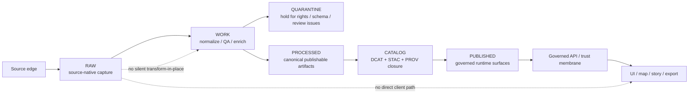

<!-- [KFM_META_BLOCK_V2]
doc_id: kfm://doc/NEEDS_VERIFICATION
title: data/raw/
type: standard
version: v1
status: draft
owners: @bartytime4life
created: YYYY-MM-DD
updated: YYYY-MM-DD
policy_label: NEEDS_VERIFICATION
related: [../README.md, ../registry/README.md, ../work/README.md, ../quarantine/README.md, ../processed/README.md, ../catalog/README.md, ../receipts/README.md, ../published/README.md, ../proofs/README.md, ../../contracts/README.md, ../../schemas/README.md, ../../policy/README.md, ../../tests/README.md, ../../tools/README.md, ../../.github/workflows/README.md]
tags: [kfm, data, raw, truth-path]
notes: [Owner grounded to current public CODEOWNERS coverage for /data/; UUID, dates, and policy label still need verification.]
[/KFM_META_BLOCK_V2] -->

# data/raw/

Immutable, source-native intake zone for KFM evidence-bearing inputs.

> **Status:** experimental  
> **Doc state:** draft  
> **Owners:** `@bartytime4life` *(current public `/data/` CODEOWNERS coverage)*  
> **Path target:** `data/raw/README.md`  
> [](#scope)
> [](#scope)
> [](#scope)
> [](#directory-tree)
> [](#repo-fit)
> [](#usage)  
> **Quick jump:** [Scope](#scope) · [Current public evidence snapshot](#current-public-evidence-snapshot) · [Repo fit](#repo-fit) · [Accepted inputs](#accepted-inputs) · [Exclusions](#exclusions) · [Directory tree](#directory-tree) · [Quickstart](#quickstart) · [Usage](#usage) · [Diagram](#diagram) · [Tables](#tables) · [Task list](#task-list) · [FAQ](#faq) · [Appendix](#appendix)

> [!IMPORTANT]
> Read this README in four layers:
> - **CONFIRMED doctrine** — `RAW` is the source-native intake stage in the KFM truth path.
> - **CONFIRMED current public tree** — `data/raw/` exists on public `main` and currently contains `README.md` only.
> - **PROPOSED starter shape** — per-source and per-acquisition folders, manifests, checksums, request context, and rights snapshots.
> - **UNKNOWN / NEEDS VERIFICATION** — branch-only contents, exact canonical filenames, validator wiring, emitted receipt inventory, and any path not visible in the current public tree.

> [!NOTE]
> `data/raw/` is upstream capture. It is **not** the public edge, **not** the trust membrane, and **not** a normal client-read surface.

---

## Scope

`data/raw/` is where upstream material lands **before** normalization, repair, enrichment, policy-shaped derivation, catalog closure, or publication.

In KFM terms, this zone exists to preserve the earliest trustworthy capture of a source so later stages can still answer simple but consequential questions:

- What exactly arrived?
- From where?
- Under what terms, request context, or package boundary?
- With what integrity evidence?
- Which later artifact or claim was derived from it?

That makes RAW a memory surface as much as a storage surface.

### What this README is for

This file is meant to help maintainers do four things quickly:

1. understand what belongs in `data/raw/`,
2. separate **CONFIRMED** public-tree facts from **PROPOSED** starter structure,
3. keep intake responsibilities separate from contracts, policy, tests, tooling, and publication surfaces,
4. extend the tree without quietly weakening KFM’s trust posture.

### What this README is not for

This file is **not**:

- a source-specific ingest runbook,
- a schema registry,
- a policy bundle,
- a public API contract,
- a release manifest,
- a shortcut around review, catalog closure, or governed publication.

### Evidence posture used here

| Label | Meaning in this README |
|---|---|
| **CONFIRMED** | Directly supported by current public repo evidence or stable KFM doctrine already surfaced in adjacent project materials |
| **INFERRED** | A conservative reading that follows strongly from confirmed repo evidence and doctrine, but is not proven by a populated `data/raw/` subtree |
| **PROPOSED** | Commit-ready starter guidance that fits KFM doctrine without claiming to be current checked-in branch reality |
| **NEEDS VERIFICATION** | A detail that should be checked before merge or release |
| **UNKNOWN** | Not supported strongly enough in this session to present as current repo fact |

## Current public evidence snapshot

| Signal | Status | What it means here |
|---|---|---|
| `data/raw/README.md` on public `main` | **CONFIRMED** | The raw-zone guide is a live checked-in file |
| Current `data/raw/` inventory | **CONFIRMED** | Public `main` currently shows `README.md` only |
| `/data/` owner routing | **CONFIRMED** | Current public `.github/CODEOWNERS` routes `/data/` to `@bartytime4life` |
| Adjacent lifecycle docs | **CONFIRMED** | Public `main` exposes sibling README surfaces for `work/`, `quarantine/`, `processed/`, `catalog/`, `receipts/`, `published/`, `proofs/`, and `registry/` |
| Shared boundary docs | **CONFIRMED** | Public `main` exposes `contracts/README.md`, `schemas/README.md`, `policy/README.md`, `tests/README.md`, `tools/README.md`, and `.github/workflows/README.md` |
| Deeper raw-batch layout and emitted artifacts | **NEEDS VERIFICATION** | No checked-in public subtree currently proves per-source folders, canonical filenames, or real raw payload packs |

## Repo fit

**Path:** `data/raw/README.md`  
**Zone role:** source-native intake and immutability guardrail for the `RAW` stage of the KFM truth path.

In lifecycle terms, this README sits under the same dependency-ordered model already used across the `data/` surface:

```text
Source edge -> RAW -> WORK / QUARANTINE -> PROCESSED -> CATALOG -> PUBLISHED
```

### Path and adjacent surfaces

| Relation | Surface | Status | Why it matters |
|---|---|---|---|
| Parent | [`../README.md`](../README.md) | **CONFIRMED** | Governs the broader `data/` lifecycle and explains how RAW fits into adjacent zones |
| Lateral | [`../registry/README.md`](../registry/README.md) | **CONFIRMED** | Source registration and source-admission records belong there; raw batch folders should preserve acquisition evidence, not replace stable source identity |
| Lateral | [`../work/README.md`](../work/README.md) | **CONFIRMED** | Repeatable transforms, QA staging, and normalization must not happen in place under RAW |
| Lateral | [`../quarantine/README.md`](../quarantine/README.md) | **CONFIRMED** | Rights, schema, policy, or review ambiguity should fail closed there rather than be hidden by RAW edits |
| Downstream | [`../processed/README.md`](../processed/README.md) | **CONFIRMED** | Publishable canonical artifacts belong there, not here |
| Downstream | [`../catalog/README.md`](../catalog/README.md) | **CONFIRMED** | `DCAT + STAC + PROV` closure belongs there after capture and transform proof exist |
| Downstream | [`../receipts/README.md`](../receipts/README.md) | **CONFIRMED** | Cross-stage receipts and validation memory should remain queryable without being buried in ad hoc raw batch folders |
| Release-adjacent | [`../published/README.md`](../published/README.md) | **CONFIRMED** | Published surfaces are downstream of promotion and policy, never direct reads from RAW |
| Release-adjacent | [`../proofs/README.md`](../proofs/README.md) | **CONFIRMED** | Release evidence, attestations, and rollback-ready proof packs belong there, not in raw intake folders |
| Shared contract surface | [`../../contracts/README.md`](../../contracts/README.md) | **CONFIRMED** | Human-readable contract law belongs there rather than being reinvented in a storage zone |
| Shared schema boundary | [`../../schemas/README.md`](../../schemas/README.md) | **CONFIRMED** | Keep schema-home ambiguity explicit; do not invent raw-local schema authority |
| Shared policy lane | [`../../policy/README.md`](../../policy/README.md) | **CONFIRMED** | Rights, sensitivity, deny-by-default behavior, and obligations are enforced through policy, not folder naming |
| Shared verification lane | [`../../tests/README.md`](../../tests/README.md) | **CONFIRMED** | Validators and negative-path checks should prove RAW assumptions rather than leaving them as prose only |
| Shared helper lane | [`../../tools/README.md`](../../tools/README.md) | **CONFIRMED** | Link checkers, catalog QA, probes, and helper CLIs belong there rather than inside raw captures |
| Workflow / control lane | [`../../.github/workflows/README.md`](../../.github/workflows/README.md) | **CONFIRMED path / NEEDS VERIFICATION enforcement depth** | Public workflow documentation exists, but current public `main` remains README-only in `.github/workflows/` |

### Repo-fit summary

| Question | Answer |
|---|---|
| What belongs here? | Source-native bytes plus the minimum context needed to prove how they arrived |
| What does **not** belong here? | Normalized outputs, catalog closure, release proof, shared schemas, executable policy, or public-serving assets |
| What is the working rule? | Land bytes first, interpret later, and move all transforms out of RAW |
| What is the downstream expectation? | A later reviewer should be able to move from raw capture -> validation/receipt memory -> processed version -> catalog closure -> proof and publication surfaces |

## Accepted inputs

The rule of thumb is simple: **if it is the source-native thing you acquired, or the minimum evidence required to prove how you acquired it, it probably belongs here.**

| Belongs here | Why |
|---|---|
| Original downloaded files | They preserve the closest repo-visible copy of the upstream artifact |
| API response snapshots | They make later replay, diffing, and provenance reconstruction possible |
| Vendor archive bundles (`.zip`, `.tar`, etc.) | Package boundaries can carry meaning; preserve them when they are part of the source reality |
| Source-native tabular, vector, raster, document, or media files | RAW is format-agnostic; the criterion is source-native status, not extension |
| Checksums and raw manifests | RAW without integrity evidence weakens downstream trust |
| Rights / terms snapshots | Legal and publication context can drift outside the payload itself |
| Request context snapshots | Query parameters, endpoint references, and acquisition timestamps help make replay legible |
| Minimal intake notes tied to the acquisition event | Small, factual capture notes can prevent future tribal-knowledge failure |

## Exclusions

The easiest way to damage this zone is to let it quietly become a convenience workspace.

| Does **not** belong here | Put it here instead |
|---|---|
| Normalized or cleaned outputs | [`../work/README.md`](../work/README.md) during transformation, then [`../processed/README.md`](../processed/README.md) when canonical and publishable |
| Reprojected, re-encoded, tiled, generalized, or enriched artifacts | `../work/` or `../processed/`, depending on stage |
| Shared source-registration entries or admission records | [`../registry/README.md`](../registry/README.md) |
| Catalog closure artifacts (`DCAT / STAC / PROV`) | [`../catalog/README.md`](../catalog/README.md) |
| Release manifests, proof packs, or publication evidence | [`../receipts/README.md`](../receipts/README.md), [`../proofs/README.md`](../proofs/README.md), or release-oriented surfaces |
| Shared schemas, vocabularies, or contract definitions | [`../../contracts/README.md`](../../contracts/README.md) and [`../../schemas/README.md`](../../schemas/README.md) |
| Executable policy, decision tests, or helper tooling | [`../../policy/README.md`](../../policy/README.md), [`../../tests/README.md`](../../tests/README.md), and [`../../tools/README.md`](../../tools/README.md) |
| UI-facing delivery assets or direct client-read payloads | governed APIs and release-backed runtime surfaces downstream |
| Detached release evidence, rollback packs, or attestations | [`../proofs/README.md`](../proofs/README.md) and governed release lanes |

> [!WARNING]
> Do **not** use `data/raw/` as a quiet shortcut around the truth path.  
> If a file has already been “made useful” for search, map delivery, API response shaping, narrative consumption, or public-facing export, it is almost certainly no longer raw.

## Directory tree

### Confirmed current public sibling excerpt

```text
data/
├── catalog/
├── processed/
├── proofs/
├── published/
├── quarantine/
├── raw/
├── receipts/
├── registry/
├── work/
└── README.md
```

### Current public `data/raw/` snapshot — CONFIRMED

```text
data/raw/
└── README.md
```

### Doctrine-aligned starter layout — PROPOSED

```text
data/raw/
└── <source_id>/
    └── <acquisition_date_or_event_id>/
        ├── manifest.json
        ├── checksums.sha256
        ├── rights_snapshot/
        │   └── <captured-terms-or-license-artifacts>
        ├── request/
        │   └── <request-context-if-applicable>
        └── payload/
            └── <source-native-files-as-acquired>
```

### Example shape — PROPOSED

```text
data/raw/
└── usgs_nwis/
    └── 2026-03-22T180000Z/
        ├── manifest.json
        ├── checksums.sha256
        ├── rights_snapshot/
        │   └── terms.html
        ├── request/
        │   └── query.json
        └── payload/
            └── observations.json
```

> [!TIP]
> If an upstream package arrives as a ZIP, TAR, file geodatabase export, or similar bundle, preserve the bundle boundary or document the exact unpack step beside it. Unpacking should not become silent normalization.

## Quickstart

Use these commands to verify the live zone first, then extend it carefully.

```bash
# inspect the current zone
find data/raw -maxdepth 4 -print 2>/dev/null | sort

# read this README in context
sed -n '1,260p' data/raw/README.md

# compare adjacent lifecycle lanes
for p in \
  data/raw \
  data/work \
  data/quarantine \
  data/processed \
  data/catalog \
  data/receipts \
  data/published \
  data/proofs \
  data/registry
do
  echo
  echo "== $p =="
  find "$p" -maxdepth 2 -print 2>/dev/null | sort
done
```

A lightweight starter pass before adding anything:

```bash
SOURCE_ID="<source_id>"
ACQ_ID="<acquisition_date_or_event_id>"

mkdir -p "data/raw/${SOURCE_ID}/${ACQ_ID}"/{payload,request,rights_snapshot}

# example only: record checksums for newly landed source-native payloads
sha256sum "data/raw/${SOURCE_ID}/${ACQ_ID}/payload/"* \
  > "data/raw/${SOURCE_ID}/${ACQ_ID}/checksums.sha256"
```

A sanity rule worth keeping in mind:

```bash
# transformed outputs should usually appear in work/ or processed/, not be created ad hoc in raw/
find data/raw -type f 2>/dev/null | sort
```

> [!NOTE]
> Use the checked-out command set documented in [`../../tools/`](../../tools/) and [`../../scripts/`](../../scripts/) only after those lanes are verified on the active branch. Do not assume an unverified intake CLI exists just because doctrine or planning documents mention one.

## Usage

### Working rules

1. **Land bytes first, interpret later.**  
   The first job of RAW is capture, not improvement.

2. **Preserve acquisition context beside the payload.**  
   If a future reviewer cannot tell what endpoint, archive, date, or request shape produced a batch, the raw capture is weaker than it should be.

3. **Snapshot rights when feasible.**  
   Rights drift is real. If publication later depends on a terms page, capture the terms page now.

4. **Treat RAW as write-once in spirit.**  
   Prefer a new acquisition event, visible supersession note, or manifest update over quiet byte replacement.

5. **Move all transformations out of RAW.**  
   Reprojection, schema normalization, denormalized joins, tiling, text cleanup, redaction, enrichment, and summary extraction belong in `../work/` or later zones.

6. **Use QUARANTINE for ambiguity, not RAW edits for convenience.**  
   If the problem is rights, sensitivity, schema, or review uncertainty, route it into governed holding surfaces rather than mutating the original capture in place.

### Practical handling guidance

| Situation | Preferred handling |
|---|---|
| Upstream file was malformed | Preserve the original capture; document the problem; perform fixes in `../work/` |
| Upstream terms changed after acquisition | Preserve the old terms snapshot; capture the new one in a later acquisition event |
| You need a quick map preview | Generate it downstream; do not repurpose RAW as a preview cache |
| You need search-ready text | Extract it downstream and keep the raw document intact |
| You discovered the wrong file was fetched | Record the failure clearly and supersede it with a new acquisition event |
| A batch is blocked by rights, sensitivity, or review | Keep the original capture intact and route the blocked path visibly toward `../quarantine/` or the appropriate review surface |

> [!IMPORTANT]
> Silent overwrite is the most common RAW-zone trust failure.  
> If a correction matters, it should leave a legible trail.

## Diagram


```mermaid
flowchart LR
    S[Source edge] --> R[RAW<br/>source-native capture]
    R --> W[WORK<br/>normalize / QA / enrich]
    W --> Q[QUARANTINE<br/>hold for rights / schema / review issues]
    W --> P[PROCESSED<br/>canonical publishable artifacts]
    P --> C[CATALOG<br/>DCAT + STAC + PROV closure]
    C --> U[PUBLISHED<br/>governed runtime surfaces]

    API[Governed API / trust membrane]
    UI[UI / map / story / export]

    U --> API --> UI

    R -. no direct client path .-> UI
    R -. no silent transform-in-place .-> W
```

## Tables

### Minimum raw pack

| Artifact | Status | Why it exists | Fail-closed consequence if missing |
|---|---|---|---|
| `payload/` | Required | Holds the source-native bytes or files | No meaningful raw capture exists |
| `checksums.sha256` | Strongly recommended | Proves integrity at capture time | Replay and later provenance weaken |
| `manifest.json` | Strongly recommended | Records what arrived and how to reason about the batch | Batch context becomes guesswork |
| `rights_snapshot/` | Conditional but high-value | Preserves publication-relevant terms and license evidence | Later rights review may become incomplete |
| `request/` | Conditional | Preserves API/query/archive context when acquisition was parameterized | Re-fetch and replay become harder to verify |
| intake note | Optional | Captures factual intake caveats | Troubleshooting gets slower and more tribal |

### RAW do / do not

| Do | Do not |
|---|---|
| preserve exact upstream bytes | silently “clean up” raw files in place |
| record checksums and batch context | assume Git history alone is enough metadata |
| keep rights evidence near intake | defer all terms capture until publication review |
| treat source package boundaries as meaningful | flatten archive or package context without a note |
| route transforms to `work/` | let RAW become a hidden scratchpad |
| supersede visibly | rewrite history quietly |

### RAW-stage doctrinal touchpoints

| Concern | Closest doctrinal object family | Current reading | Why it matters |
|---|---|---|---|
| Stable source identity and onboarding posture | `SourceDescriptor` | **CONFIRMED** as a doctrine-level family; **NEEDS VERIFICATION** for exact checked-in schema home | Raw batch folders should point toward stable source identity, not replace it |
| Fetch / landing proof | `IngestReceipt` | **CONFIRMED** as a doctrine-level family; **NEEDS VERIFICATION** for exact artifact shape and placement | A later reviewer should be able to prove that a landing event occurred |
| Structural, rights, or policy checks | `ValidationReport` | **CONFIRMED** as a doctrine-level family; exact raw-zone wiring still needs verification | Failures should route visibly into hold, review, or quarantine behavior |
| Stable downstream subject set | `DatasetVersion` | **CONFIRMED** as a doctrine-level family; not a raw-zone artifact | RAW is capture, not the authoritative processed release subject |
| Outward metadata closure | `CatalogClosure` | **CONFIRMED** as a doctrine-level family; downstream only | Reminds maintainers that raw intake is upstream of `DCAT + STAC + PROV` closure |

### Path certainty matrix

| Path pattern | Confidence | Notes |
|---|---|---|
| `data/raw/README.md` | **CONFIRMED** | Live public `main` path reviewed |
| `data/raw/<source_id>/...` | **PROPOSED** | Starter convention only; not directly proven as the current checked-in branch standard |
| `manifest.json` / `checksums.sha256` filenames | **PROPOSED** | Useful defaults; exact canonical naming still needs repo verification |
| per-batch `rights_snapshot/` and `request/` folders | **PROPOSED** | Included to operationalize intake traceability without overclaiming mounted practice |
| exact emitted receipt or validation-memory placement | **NEEDS VERIFICATION** | Adjacent `receipts/` and `proofs/` lanes exist, but current public tree does not prove live raw-zone emitters |

## Task list

### Definition of done for this README

- [ ] Distinguishes **CONFIRMED** live repo facts from **PROPOSED** starter layout below the zone level
- [ ] States clearly that RAW is source-native and immutable in role
- [ ] Names what belongs here and what does not
- [ ] Links upstream, lateral, and downstream repo surfaces
- [ ] Includes at least one meaningful lifecycle diagram
- [ ] Gives maintainers a quick verification workflow
- [ ] Avoids claiming mounted substructure that was not directly verified

### Review checks before merge

- [ ] Replace remaining metadata placeholders (`doc_id`, dates, `policy_label`) if authoritative values are available
- [ ] Confirm whether the repository wants this meta block on README-like docs in committed form
- [ ] Verify whether `manifest.json` and `checksums.sha256` are the preferred canonical filenames
- [ ] Verify whether rights snapshots are mandatory for all raw batches or only for source classes that need them
- [ ] Confirm whether source-admission packets link from `data/raw/` via `data/registry/`, shared contracts, or both
- [ ] Confirm whether any checked-in raw intake helpers now exist under `tools/`, `scripts/`, or workflow lanes before adding command claims

## FAQ

### Can RAW contain ZIPs, PDFs, images, shapefiles, CSVs, GeoJSON, or rasters?

Yes. RAW is format-agnostic. The deciding question is not “what extension is this?” but “is this the source-native artifact as acquired?”

### Can I unpack an archive in RAW?

Sometimes, but treat it as preservation, not normalization. If unpacking changes naming, encoding, geometry, schema, or package meaning, that work belongs downstream.

### Can I fix a bad file directly in RAW?

Prefer a new acquisition event or visible supersession trail. Corrections should remain legible.

### Does the UI, API, or map runtime read directly from RAW?

It should not. RAW is upstream capture, not the trust membrane and not the public delivery surface.

### Where do derived previews, vector tiles, cleaned tables, and search indexes go?

Downstream. Use `work/`, `processed/`, catalog surfaces, and governed runtime layers as appropriate.

### Does every raw batch need a manifest and rights snapshot?

Not yet as a checked-in public-main rule. They are strong starter defaults here, but their exact canonical status still needs branch-side verification.

## Appendix

<details>
<summary><strong>Glossary + starter manifest hints</strong></summary>

### Quick glossary

| Term | Meaning here |
|---|---|
| source-native | The artifact as acquired from the source, before KFM reshapes it |
| RAW | Intake stage for immutable capture and earliest integrity evidence |
| WORK | Repeatable transform and QA stage |
| QUARANTINE | Hold zone for failed checks, unclear rights, or review-needed material |
| PROCESSED | Canonical, standardized, publishable artifact stage |
| catalog closure | Outward `DCAT / STAC / PROV` linkage that makes a release discoverable and explainable |
| truth membrane | The governed interface boundary normal clients should use instead of direct reads from internal or canonical stores |

### Starter manifest hints — PROPOSED

A minimal `manifest.json` can stay intentionally small:

```json
{
  "source_id": "NEEDS_VERIFICATION",
  "acquired_at": "YYYY-MM-DDTHH:MM:SSZ",
  "acquisition_mode": "download | api | export | upload",
  "payload_count": 0,
  "checksum_file": "checksums.sha256",
  "rights_snapshot_present": false,
  "notes": "factual intake-only note"
}
```

### Questions worth answering per raw batch

- What source produced this?
- When was it fetched or exported?
- What exact payload boundary was captured?
- Which checksum file proves integrity?
- Were terms or license context captured?
- What downstream work item, receipt, or review record should later point back here?

</details>

[Back to top](#top)