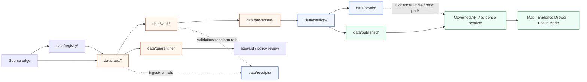

<!-- [KFM_META_BLOCK_V2]
doc_id: kfm://doc/NEEDS-VERIFICATION
title: data/raw/
type: standard
version: v1
status: draft
owners: @bartytime4life
created: YYYY-MM-DD
updated: YYYY-MM-DD
policy_label: NEEDS_VERIFICATION
related: [../README.md, ../registry/README.md, ../work/README.md, ../quarantine/README.md, ../processed/README.md, ../catalog/README.md, ../receipts/README.md, ../published/README.md, ../proofs/README.md, ../../contracts/README.md, ../../schemas/README.md, ../../policy/README.md, ../../tests/README.md, ../../tools/README.md, ../../.github/workflows/README.md]
tags: [kfm, data, raw, truth-path, intake]
notes: [doc_id, created, updated, and policy_label require mounted-repo or document-registry verification; owner follows existing KFM data-lane README pattern; related paths should be link-checked in the active branch before merge.]
[/KFM_META_BLOCK_V2] -->

<a id="top"></a>

# data/raw/

Immutable, source-native intake zone for KFM evidence-bearing inputs.

> **Status:** experimental  
> **Doc state:** draft  
> **Owners:** `@bartytime4life`  
> **Path:** `data/raw/README.md`  
> **Repo fit:** child lifecycle lane under [`../README.md`](../README.md), upstream of [`../work/README.md`](../work/README.md), [`../quarantine/README.md`](../quarantine/README.md), [`../processed/README.md`](../processed/README.md), and downstream proof/catalog surfaces  
> **Quick jump:** [Scope](#scope) · [Repo fit](#repo-fit) · [Accepted inputs](#accepted-inputs) · [Exclusions](#exclusions) · [Directory tree](#directory-tree) · [Quickstart](#quickstart) · [Usage](#usage) · [Diagram](#diagram) · [Reference tables](#reference-tables) · [Task list](#task-list--definition-of-done) · [FAQ](#faq) · [Appendix](#appendix)

[](#scope)
[](#scope)
[](#scope)
[](#usage)
[](#task-list--definition-of-done)
[](#reference-tables)

> [!IMPORTANT]
> `data/raw/` is a capture boundary, not a convenience folder.
>
> Use it to preserve what arrived from a source, with enough context for future replay, audit, rights review, sensitivity review, and downstream evidence resolution. Do not use it for cleaned data, public files, ad hoc derived joins, or UI-ready products.

> [!NOTE]
> Active-branch inventory, exact validator wiring, emitted receipt locations, and any checked-in payload policy remain **NEEDS VERIFICATION** unless the mounted repo proves them directly.

---

## Scope

`data/raw/` is where source material lands **before** normalization, repair, enrichment, policy-shaped derivation, catalog closure, or publication.

In KFM terms, this zone preserves the earliest trustworthy capture of an upstream source so later stages can still answer:

- what exactly arrived,
- where it came from,
- when and how it was acquired,
- what rights, sensitivity, and request context applied,
- what checksums or package boundaries prove integrity,
- which later work, processed artifact, catalog record, proof object, or claim derived from it.

RAW is therefore both a storage surface and a memory surface.

### Evidence posture used here

| Label | Meaning in this README |
|---|---|
| **CONFIRMED** | Supported by KFM doctrine or by a directly inspected repo/document surface. |
| **INFERRED** | Conservative repo guidance that follows from confirmed lifecycle doctrine but is not branch-proven here. |
| **PROPOSED** | Commit-ready starter guidance that fits KFM doctrine without claiming current implementation maturity. |
| **NEEDS VERIFICATION** | Must be checked in the active branch before stronger claims, automation, or release. |
| **UNKNOWN** | Not supported strongly enough to present as current repo fact. |

[Back to top](#top)

---

## Repo fit

`data/raw/` sits at the front of the governed data lifecycle:

```text
SOURCE EDGE -> RAW -> WORK / QUARANTINE -> PROCESSED -> CATALOG / TRIPLET -> PUBLISHED
```

### Path and neighboring surfaces

| Relation | Surface | Role |
|---|---|---|
| Parent lifecycle index | [`../README.md`](../README.md) | Data-zone overview and lifecycle fit. |
| Source registry | [`../registry/README.md`](../registry/README.md) | Source identity, cadence, access posture, and onboarding state. |
| Next transform lane | [`../work/README.md`](../work/README.md) | Normalization, repair, temporary joins, QA, and transform outputs. |
| Hold / failure lane | [`../quarantine/README.md`](../quarantine/README.md) | Rights-unclear, malformed, sensitive, blocked, or review-needed material. |
| Stable candidate lane | [`../processed/README.md`](../processed/README.md) | Validated processed artifacts with stable identity; not public by default. |
| Catalog closure | [`../catalog/README.md`](../catalog/README.md) | STAC, DCAT, and PROV records for release-ready scope. |
| Process memory | [`../receipts/README.md`](../receipts/README.md) | Run, ingest, validation, transform, and replay/correction receipts. |
| Release proof | [`../proofs/README.md`](../proofs/README.md) | EvidenceBundles, proof packs, attestations, and release-significant evidence. |
| Public-safe release | [`../published/README.md`](../published/README.md) | Promoted artifacts and aliases behind governed surfaces. |
| Contracts / schemas | [`../../contracts/README.md`](../../contracts/README.md) · [`../../schemas/README.md`](../../schemas/README.md) | Machine-readable shape authority and human-readable contract law. |
| Policy | [`../../policy/README.md`](../../policy/README.md) | Rights, sensitivity, release, and access policy. |
| Validation | [`../../tools/README.md`](../../tools/README.md) · [`../../tests/README.md`](../../tests/README.md) | Validator tooling, fixtures, and verification expectations. |

> [!WARNING]
> Public clients, map layers, Focus Mode, and normal UI surfaces should not read `data/raw/` directly. They should consume governed APIs, released artifacts, catalog records, and EvidenceBundle-backed payloads.

[Back to top](#top)

---

## Accepted inputs

The following belong in `data/raw/` when KFM intake discipline is being honored.

| Accepted input | Why it belongs here | Required companion evidence |
|---|---|---|
| Source-native payloads | Preserves the upstream package before interpretation. | `manifest.json`, checksums, source descriptor reference. |
| Downloaded files, API snapshots, exports, archives, rasters, vectors, tabular files, PDFs, or media | Keeps the acquisition boundary reviewable. | Payload hashes, media type, byte counts where available. |
| Upstream package boundaries | Prevents silent normalization during unpacking. | Bundle hash and explicit unpack note if unpacked later. |
| Request context | Makes the fetch replayable or explainable. | URL, endpoint, query, headers safe to store, cursor, time window, or export settings. |
| Rights and terms snapshots | Supports future licensing and redistribution review. | Captured terms/license page, source terms version, attribution note. |
| Source metadata as received | Keeps source-native context available even if normalized metadata later differs. | Upstream metadata payload, readme, data dictionary, or service capability response. |
| Small pointer files to external governed storage | Supports large or restricted raw bytes when repo policy disallows committing payloads. | Object URI or storage key, digest, access class, retention note, and receipt reference. |
| Intake notes for controlled or sensitive sources | Records why a capture is restricted or blocked from publication. | Policy label, sensitivity flags, steward/review note, quarantine reference if needed. |

> [!CAUTION]
> Do not commit credentials, tokens, private keys, signed URLs, cookies, personal secrets, or machine-local dumps. If a source requires secrets, store only redacted request context and link to the approved secret-management path.

[Back to top](#top)

---

## Exclusions

The following do **not** belong in `data/raw/` as their primary home.

| Excluded | Put it here instead | Why |
|---|---|---|
| Normalized, cleaned, reprojected, deduplicated, or enriched data | [`../work/README.md`](../work/README.md) or [`../processed/README.md`](../processed/README.md) | RAW preserves acquisition state; transformation belongs downstream. |
| Failed transform outputs, malformed records, review-blocked materials, unresolved rights, or sensitive public-release blockers | [`../quarantine/README.md`](../quarantine/README.md) | Quarantine records obligations and disposition. |
| Stable publishable dataset versions | [`../processed/README.md`](../processed/README.md) | Processed artifacts need stable schema, identity, and validation references. |
| STAC, DCAT, or PROV catalog records | [`../catalog/README.md`](../catalog/README.md) | Catalog closure is a later boundary. |
| Run receipts, ingest receipts, validation reports, transform receipts | [`../receipts/README.md`](../receipts/README.md) | Receipts are process memory; RAW may link to them but should not replace them. |
| EvidenceBundles, release proof packs, integrity bundles, attestations | [`../proofs/README.md`](../proofs/README.md) | Proof objects are release/review surfaces, not raw payloads. |
| Public PMTiles, COGs, GeoJSON, TileJSON, dashboards, or aliases | [`../published/README.md`](../published/README.md) | Publication requires promotion and governed access. |
| Source descriptors and registry indexes | [`../registry/README.md`](../registry/README.md) | Source identity and activation posture belong in the registry. |
| JSON Schemas, OpenAPI, controlled vocabularies, DTOs | [`../../schemas/README.md`](../../schemas/README.md) or [`../../contracts/README.md`](../../contracts/README.md) | Shape authority should not fork into RAW. |
| Policy bundles, allow/deny rules, review gates | [`../../policy/README.md`](../../policy/README.md) | Policy must remain independently reviewable. |
| AI summaries, Focus narratives, story text, map popups | Governed API / app surfaces | Generated language is downstream interpretation, not raw evidence. |

[Back to top](#top)

---

## Directory tree

### Minimum target lane

```text
data/
└── raw/
    └── README.md
```

### Doctrine-aligned starter layout — PROPOSED

```text
data/raw/
└── <source_id>/
    └── <acquisition_date_or_event_id>/
        ├── manifest.json
        ├── checksums.sha256
        ├── rights_snapshot/
        │   └── <captured-terms-or-license-artifacts>
        ├── request/
        │   └── <request-context-if-applicable>
        └── payload/
            └── <source-native-files-as-acquired>
```

### Example shape — illustrative

```text
data/raw/
└── usgs_nwis/
    └── 2026-03-22T180000Z/
        ├── manifest.json
        ├── checksums.sha256
        ├── rights_snapshot/
        │   └── terms.html
        ├── request/
        │   └── query.json
        └── payload/
            └── observations.json
```

> [!TIP]
> If an upstream package arrives as a ZIP, TAR, file geodatabase export, or similar bundle, preserve the bundle boundary or record the exact unpack step downstream. Unpacking should not become silent normalization.

[Back to top](#top)

---

## Quickstart

### 1. Inspect the live lane before editing

```bash
git status --short

find data/raw -maxdepth 4 -print 2>/dev/null | sort
sed -n '1,260p' data/raw/README.md
```

### 2. Compare adjacent lifecycle lanes

```bash
for p in \
  data/registry \
  data/raw \
  data/work \
  data/quarantine \
  data/processed \
  data/catalog \
  data/receipts \
  data/proofs \
  data/published
do
  echo
  echo "== $p =="
  find "$p" -maxdepth 2 -print 2>/dev/null | sort
done
```

### 3. Create a small raw capture shell

```bash
SOURCE_ID="<source_id>"
ACQ_ID="<acquisition_date_or_event_id>"

mkdir -p "data/raw/${SOURCE_ID}/${ACQ_ID}/payload"
mkdir -p "data/raw/${SOURCE_ID}/${ACQ_ID}/request"
mkdir -p "data/raw/${SOURCE_ID}/${ACQ_ID}/rights_snapshot"

# Place source-native files in payload/ using the repo's approved intake method.
# Then record hashes for the payload files.
sha256sum "data/raw/${SOURCE_ID}/${ACQ_ID}/payload/"* \
  > "data/raw/${SOURCE_ID}/${ACQ_ID}/checksums.sha256"
```

### 4. Recheck for boundary mistakes

```bash
# Transformed outputs should usually appear in work/ or processed/, not raw/.
find data/raw -type f 2>/dev/null | sort

# Secrets should never be committed.
grep -RInE "(token|secret|password|api[_-]?key|Authorization:|Bearer )" data/raw 2>/dev/null || true
```

> [!NOTE]
> Use checked-in repo tooling only after verifying it on the active branch. Do not assume an intake CLI, validator command, or workflow exists just because planning documents mention one.

[Back to top](#top)

---

## Usage

### Working rules

1. **Land bytes first, interpret later.**  
   RAW capture should preserve source-native evidence before KFM reshapes it.

2. **Preserve acquisition context beside the payload.**  
   A future reviewer should be able to reconstruct the endpoint, archive, export, query, time window, and source package boundary.

3. **Never overwrite in place.**  
   A changed upstream payload should create a new acquisition event or versioned capture.

4. **Keep terms and rights visible.**  
   Capture licenses, terms, attribution requirements, redistribution limits, and access restrictions when they affect downstream publication.

5. **Treat sensitivity as intake evidence, not UI decoration.**  
   If a source may contain sensitive locations, restricted heritage/cultural information, living-person data, protected species, critical infrastructure, or controlled records, mark that posture immediately.

6. **Link receipts; do not hide process memory in prose.**  
   RAW should point to ingest/run receipts where the repo supports them. Receipts themselves belong in the receipt lane unless the active branch defines a different canonical pattern.

7. **Fail closed on ambiguity.**  
   Unknown rights, missing checksums, unclear source role, unresolved sensitivity, schema drift, or suspicious payload mismatch blocks promotion.

8. **No direct public access.**  
   `data/raw/` is not a public runtime, map, story, API, or Focus Mode source.

### Minimal `manifest.json` expectations

A raw manifest should make the capture self-describing enough for validation and replay.

| Field family | Examples | Status |
|---|---|---|
| Identity | `source_id`, `acquisition_id`, `dataset_id`, `upstream_id` | PROPOSED |
| Acquisition | `fetched_at`, `actor`, `tool`, `method`, `request_ref` | PROPOSED |
| Payload inventory | filenames, media types, byte counts, hashes, package boundary | PROPOSED |
| Rights and sensitivity | `policy_label`, license/terms refs, attribution, sensitivity flags | PROPOSED |
| Source registry links | `source_descriptor_ref`, `source_version`, cadence or cursor | PROPOSED |
| Evidence chain links | `run_receipt_ref`, `quarantine_ref`, downstream refs when known | PROPOSED |
| Integrity | `checksums_ref`, algorithm, validation status | PROPOSED |

[Back to top](#top)

---

## Diagram


```mermaid
flowchart LR
  SE["Source edge"] --> REG["data/registry/<source>"]
  REG --> RAW["data/raw/<source>/<acquisition>/"]
  SE --> RAW

  RAW --> WORK["data/work/"]
  RAW --> Q["data/quarantine/"]

  WORK --> PROC["data/processed/"]
  Q --> REVIEW["steward / policy review"]

  PROC --> CAT["data/catalog/<stac|dcat|prov>/"]
  CAT --> PROOFS["data/proofs/"]
  CAT --> PUB["data/published/"]

  RAW -. "ingest/run refs" .-> REC["data/receipts/"]
  WORK -. "validation/transform refs" .-> REC
  PROOFS -. "EvidenceBundle / proof pack" .-> API["Governed API / evidence resolver"]
  PUB --> API
  API --> UI["Map · Evidence Drawer · Focus Mode"]

  classDef guarded fill:#fff7ed,stroke:#c2410c,stroke-width:1px;
  classDef public fill:#ecfdf5,stroke:#15803d,stroke-width:1px;
  classDef memory fill:#eff6ff,stroke:#1d4ed8,stroke-width:1px;

  class RAW,WORK,Q,PROC guarded;
  class PUB,API,UI public;
  class REC,PROOFS,CAT memory;
```

[Back to top](#top)

---

## Reference tables

### Boundary matrix

| Question | RAW answer | Downstream owner |
|---|---|---|
| Did we preserve the upstream payload? | Yes, if payload or approved object-storage ref is captured with checksums. | RAW |
| Did we normalize, repair, or reproject it? | No. | WORK / PROCESSED |
| Did we decide it can be published? | No. | Promotion / proof / policy gates |
| Did we capture source rights? | Yes, as intake evidence. | Registry / policy / catalog decide consequences |
| Did we emit a public API payload? | No. | Governed API / published / EvidenceBundle |
| Did we produce a citation-ready claim? | Not by itself. | EvidenceBundle + release/proof surfaces |

### Raw intake checklist by artifact

| Artifact | Required? | Keep in RAW? | Notes |
|---|---:|---:|---|
| Source-native payload | Yes, unless external governed storage is required | Yes or pointer | Preserve as acquired. |
| `manifest.json` | Yes | Yes | The small anchor record for the capture. |
| `checksums.sha256` | Yes | Yes | One checksum list per acquisition event is the starter default. |
| Request context | When applicable | Yes | Redact secrets. Keep replay-relevant parameters. |
| Rights snapshot | When applicable | Yes | Store terms/license artifacts or durable references. |
| Run / ingest receipt | Usually | Link preferred | Primary receipt home is `data/receipts/` unless repo convention says otherwise. |
| Validation report | No | Link only | Primary home belongs with work/receipts/validators. |
| Processed artifact | No | No | Use `data/processed/`. |
| Published artifact | No | No | Use `data/published/`. |

### Naming guidance

| Component | Suggested pattern | Why |
|---|---|---|
| `source_id` | stable, lowercase, source-scoped | Keeps acquisition families grouped. |
| `acquisition_id` | UTC timestamp or event id | Separates immutable captures. |
| `payload/` | source-native filenames when safe | Reduces accidental transformation. |
| `request/` | `query.json`, `headers.redacted.json`, `export-settings.json` | Preserves context without leaking secrets. |
| `rights_snapshot/` | `terms.html`, `license.txt`, `attribution.md` | Keeps release review from depending on memory. |

[Back to top](#top)

---

## Task list / definition of done

A raw intake change is reviewable when the PR can answer every item below.

- [ ] Source identity is registered or explicitly marked **NEEDS VERIFICATION**.
- [ ] Every acquisition has a stable `source_id` and `acquisition_id`.
- [ ] Source-native payloads or approved external object references are present.
- [ ] Payload checksums are recorded with a clear algorithm.
- [ ] Request/export context is captured and redacted.
- [ ] Rights, license, attribution, or terms evidence is captured when applicable.
- [ ] Sensitivity posture is recorded early enough to prevent accidental public exposure.
- [ ] No secrets, tokens, local credentials, private keys, or signed URLs are committed.
- [ ] No cleaned, normalized, reprojected, enriched, or public-ready derivative is stored as RAW.
- [ ] The next lifecycle destination is clear: WORK, QUARANTINE, or documented no-op.
- [ ] Receipts, validation reports, catalog objects, proof objects, and release candidates are linked rather than collapsed into RAW.
- [ ] Links to neighboring README files resolve in the active branch.
- [ ] Any **UNKNOWN** or **NEEDS VERIFICATION** item is called out in the PR body.

[Back to top](#top)

---

## FAQ

### Can I clean or reproject a file in `data/raw/`?

No. Put transformed output in `data/work/` or `data/processed/`, and keep the original capture stable.

### Can a source-specific folder contain unpacked files?

Yes, when unpacking is necessary for preservation or inspection, but document the package boundary and checksum both the original bundle and unpacked contents where practical. Silent unpacking is a normalization risk.

### What happens when rights are unknown?

Do not promote. Preserve only what policy permits, mark the uncertainty, and route the issue through source registry, quarantine, policy, or steward review. Unknown rights are a blocker for public release.

### What if the raw payload is too large for Git?

Use the project’s approved large-object or object-storage pattern when verified. The repo should still keep enough metadata, checksums, storage references, and receipts to preserve auditability.

### Can the UI, Focus Mode, or map popups cite RAW directly?

No. Public and role-limited runtime surfaces should cite EvidenceBundle-backed, policy-checked, release-aware support. RAW can be part of the evidence chain, but it is not the runtime contract.

### Should old raw captures be deleted after processing?

Not silently. RAW is part of the audit trail. Retention, storage tiering, withdrawal, and controlled deletion require documented policy and correction/rollback awareness.

[Back to top](#top)

---

## Appendix

<details>
<summary>Illustrative manifest skeleton</summary>

```json
{
  "source_id": "example_source",
  "acquisition_id": "2026-04-22T000000Z",
  "dataset_id": "example_dataset",
  "fetched_at": "2026-04-22T00:00:00Z",
  "actor": "NEEDS_VERIFICATION",
  "method": "manual-or-automated",
  "source_descriptor_ref": "data/registry/sources/example_source.yaml",
  "request_ref": "request/query.json",
  "rights_snapshot_ref": "rights_snapshot/terms.html",
  "payload": [
    {
      "path": "payload/source-native-file.json",
      "media_type": "application/json",
      "bytes": 0,
      "sha256": "NEEDS_VERIFICATION"
    }
  ],
  "checksums_ref": "checksums.sha256",
  "policy_label": "NEEDS_VERIFICATION",
  "sensitivity": {
    "classification": "NEEDS_VERIFICATION",
    "notes": "Review before publication."
  },
  "run_receipt_ref": "NEEDS_VERIFICATION",
  "quarantine_ref": null,
  "notes": [
    "Illustrative starter shape. Confirm active repo schema before enforcing."
  ]
}
```

</details>

<details>
<summary>Pre-merge review prompts</summary>

- What source descriptor or intake note explains why this source belongs in KFM?
- Is the payload source-native, or has someone already changed it?
- Are checksums reproducible from the files in the branch or approved object store?
- Are request parameters and source timestamps preserved?
- Are rights, attribution, and sensitivity visible enough for downstream gates?
- Is anything in this folder actually a WORK, PROCESSED, CATALOG, PROOF, or PUBLISHED artifact?
- Could a public client accidentally read this path?
- Does the PR body list every unresolved **NEEDS VERIFICATION** item?

</details>

<details>
<summary>Glossary</summary>

| Term | Working meaning |
|---|---|
| RAW | Immutable source-native capture zone. |
| Source edge | Upstream provider, archive, API, export, survey, or file source before KFM intake. |
| SourceDescriptor | Registry object that declares source identity, role, access, rights, cadence, and publication intent. |
| IngestReceipt | Process-memory object proving what one fetch or admission run captured. |
| Manifest | Small capture-level inventory linking payload, request, rights, checksums, and refs. |
| QUARANTINE | Hold state for rights uncertainty, validation failure, sensitivity concern, or review-blocking ambiguity. |
| EvidenceBundle | Downstream support package that lets outward claims resolve to admissible evidence, release basis, policy posture, and correction state. |
| Promotion | Governed state transition into publication scope; not a file move. |

</details>

[Back to top](#top)
