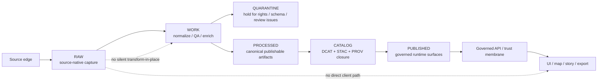

<!-- [KFM_META_BLOCK_V2]
doc_id: kfm://doc/NEEDS_VERIFICATION
title: data/raw/
type: standard
version: v1
status: draft
owners: NEEDS_VERIFICATION
created: YYYY-MM-DD
updated: YYYY-MM-DD
policy_label: NEEDS_VERIFICATION
related: [../README.md, ../work/README.md, ../quarantine/README.md, ../processed/README.md, ../catalog/README.md, ../receipts/README.md, ../published/README.md, ../proofs/README.md, ../../contracts/README.md, ../../policy/README.md]
tags: [kfm, data, raw, truth-path]
notes: [Metadata placeholders retained where live repo evidence did not confirm UUID, owners, dates, or policy label.]
[/KFM_META_BLOCK_V2] -->

# data/raw/

Immutable, source-native intake zone for KFM evidence-bearing inputs.

> **Status:** experimental  
> **Doc state:** draft  
> **Owners:** NEEDS VERIFICATION  
> **Path target:** `data/raw/README.md`  
>       
> **Quick jump:** [Scope](#scope) · [Repo fit](#repo-fit) · [Accepted inputs](#accepted-inputs) · [Exclusions](#exclusions) · [Directory tree](#directory-tree) · [Quickstart](#quickstart) · [Usage](#usage) · [Diagram](#diagram) · [Tables](#tables) · [Task list](#task-list) · [FAQ](#faq) · [Appendix](#appendix)

> [!IMPORTANT]
> This README keeps three layers separate on purpose:
> - **CONFIRMED** current repo fact: `data/raw/` exists as a live top-level zone in the `data/` surface.
> - **CONFIRMED** KFM doctrine already surfaced in adjacent docs: RAW is the source-native, immutable intake stage in the truth path.
> - **PROPOSED** lower-level batch layout inside `data/raw/`: per-source folders, manifests, checksums, and rights snapshots. Treat those as starter patterns until a mounted checkout or ADR proves a stricter convention.

> [!NOTE]
> `data/raw/` is part of the governed truth path, but it is **not** the public edge, **not** the trust membrane, and **not** a direct client-read surface.

---

## Scope

`data/raw/` is where upstream material lands **before** normalization, repair, enrichment, policy-shaped derivation, catalog closure, or publication.

In KFM terms, this directory exists to preserve the earliest trustworthy capture of a source so later stages can answer simple but consequential questions:

- What exactly arrived?
- From where?
- Under what terms, request context, or package boundary?
- With what integrity evidence?
- Which later artifact or claim was derived from it?

That makes RAW a memory surface as much as a storage surface.

## Repo fit

**Path:** `data/raw/README.md`  
**Zone role:** source-native intake and immutability guardrail for the RAW stage of the KFM truth path.

| Relation | Surface | Why it matters here |
|---|---|---|
| Upstream | [`../README.md`](../README.md) | Governs the broader `data/` lifecycle and explains how RAW fits into adjacent zones. |
| Lateral | [`../work/README.md`](../work/README.md) | Use `work/` for repeatable transforms, QA staging, and normalization work that must **not** happen in place under RAW. |
| Lateral | [`../quarantine/README.md`](../quarantine/README.md) | Use `quarantine/` when rights, schema, policy, or review ambiguity blocks safe forward movement. |
| Downstream | [`../processed/README.md`](../processed/README.md) | Publishable canonical artifacts belong there, not here. |
| Downstream | [`../catalog/README.md`](../catalog/README.md) | DCAT/STAC/PROV closure belongs there, after raw capture and transform proof exist. |
| Downstream | [`../receipts/README.md`](../receipts/README.md) | Cross-stage receipts and emitted proof objects live alongside, not inside, ad hoc raw batch folders. |
| Release-adjacent | [`../published/README.md`](../published/README.md) | Published surfaces are downstream of promotion and policy, never direct reads from RAW. |
| Release-adjacent | [`../proofs/README.md`](../proofs/README.md) | Proof packs and release evidence are downstream trust objects, not raw intake material. |
| Shared contract surface | [`../../contracts/README.md`](../../contracts/README.md) | Machine-readable contract law belongs in `contracts/`, even when it describes raw-stage objects. |
| Shared governance surface | [`../../policy/README.md`](../../policy/README.md) | Rights, sensitivity, obligations, and default-deny behavior are enforced through policy, not folder naming. |

## Accepted inputs

The rule of thumb is simple: **if it is the source-native thing you acquired, or the minimum evidence required to prove how you acquired it, it probably belongs here.**

| Belongs here | Why |
|---|---|
| Original downloaded files | They preserve the closest repo-visible copy of the upstream artifact. |
| API response snapshots | They make later replay, diffing, and provenance reconstruction possible. |
| Vendor archive bundles (`.zip`, `.tar`, etc.) | Package boundaries can carry meaning; preserve them when they are part of the source reality. |
| Source-native tabular, vector, raster, document, or media files | RAW is format-agnostic; the criterion is source-native status, not extension. |
| Checksums and raw manifests | RAW without integrity evidence weakens downstream trust. |
| Rights / terms snapshots | Legal and publication context can drift outside the payload itself. |
| Request context snapshots | Query parameters, endpoint references, and acquisition timestamps help make replay legible. |
| Minimal intake notes tied to the acquisition event | Small, factual capture notes can prevent future tribal-knowledge failure. |

## Exclusions

The easiest way to damage this zone is to let it quietly become a convenience workspace.

| Does **not** belong here | Put it here instead |
|---|---|
| Normalized or cleaned outputs | [`../work/README.md`](../work/README.md) during transformation, then [`../processed/README.md`](../processed/README.md) when canonical and publishable |
| Reprojected, re-encoded, tiled, generalized, or enriched artifacts | `../work/` or `../processed/`, depending on stage |
| Catalog closure artifacts (DCAT / STAC / PROV) | [`../catalog/README.md`](../catalog/README.md) |
| Release manifests, proof packs, or publication evidence | `../receipts/`, `../proofs/`, or release-oriented surfaces |
| Shared schemas, vocabularies, or contract definitions | [`../../contracts/README.md`](../../contracts/README.md) |
| Policy bundles, deny/allow rules, or obligation vocabularies | [`../../policy/README.md`](../../policy/README.md) |
| UI-facing delivery assets or direct client-read payloads | downstream governed API and publication surfaces |

> [!WARNING]
> Do **not** use `data/raw/` as a quiet shortcut around the truth path.  
> If a file has already been “made useful” for search, map delivery, API response shaping, or narrative consumption, it is almost certainly no longer raw.

## Directory tree

### Current live review snapshot — CONFIRMED

```text
data/raw/
└── README.md
```

### Doctrine-aligned starter layout — PROPOSED

```text
data/raw/
└── <source_id>/
    └── <acquisition_date_or_event_id>/
        ├── manifest.json
        ├── checksums.sha256
        ├── rights_snapshot/
        │   └── <captured-terms-or-license-artifacts>
        ├── request/
        │   └── <request-context-if-applicable>
        └── payload/
            └── <source-native-files-as-acquired>
```

### Example shape — PROPOSED

```text
data/raw/
└── usgs_nwis/
    └── 2026-03-22T180000Z/
        ├── manifest.json
        ├── checksums.sha256
        ├── rights_snapshot/
        │   └── terms.html
        ├── request/
        │   └── query.json
        └── payload/
            └── observations.json
```

> [!TIP]
> If an upstream package arrives as a ZIP, TAR, file geodatabase export, or similar bundle, preserve the bundle boundary or document the exact unpack step beside it. Unpacking should not become silent normalization.

## Quickstart

Use these commands to verify the live zone first, then extend it carefully.

```bash
# inspect the current zone
find data/raw -maxdepth 4 -print | sort

# read this README in-context
sed -n '1,240p' data/raw/README.md

# compare adjacent lifecycle zones
for p in data/raw data/work data/quarantine data/processed data/catalog data/receipts; do
  echo
  echo "== $p =="
  find "$p" -maxdepth 2 -print | sort
done
```

A lightweight review pass before adding anything:

```bash
# create a candidate intake folder (example only)
mkdir -p data/raw/<source_id>/<acquisition_date_or_event_id>/{payload,request,rights_snapshot}

# record checksums for newly landed source-native payloads
sha256sum data/raw/<source_id>/<acquisition_date_or_event_id>/payload/* \
  > data/raw/<source_id>/<acquisition_date_or_event_id>/checksums.sha256
```

A sanity rule worth keeping in mind:

```bash
# transformed outputs should usually appear in work/ or processed/, not be created ad hoc in raw/
find data/raw -type f | sort
```

## Usage

### Working rules

1. **Land bytes first, interpret later.**  
   The first job of RAW is capture, not improvement.

2. **Preserve acquisition context beside the payload.**  
   If a future reviewer cannot tell what endpoint, archive, date, or request shape produced a batch, the raw capture is weaker than it should be.

3. **Snapshot rights when feasible.**  
   Rights drift is real. If publication later depends on a terms page, capture the terms page now.

4. **Treat RAW as write-once in spirit.**  
   Prefer a new acquisition event, visible supersession note, or manifest update over quiet byte replacement.

5. **Move all transformations out of RAW.**  
   Reprojection, schema normalization, denormalized joins, tiling, text cleanup, redaction, and enrichment belong in `../work/` or later zones.

6. **Use QUARANTINE for ambiguity, not RAW edits for convenience.**  
   If the problem is rights, sensitivity, schema, or review uncertainty, route the issue forward into governed holding surfaces rather than mutating the original capture in place.

### Practical handling guidance

| Situation | Preferred handling |
|---|---|
| Upstream file was malformed | Preserve the original capture; document the problem; perform fixes in `../work/` |
| Upstream terms changed after acquisition | Preserve the old terms snapshot; capture the new one in a later acquisition event |
| You need a quick map preview | Generate it downstream; do not repurpose RAW as a preview cache |
| You need search-ready text | Extract it downstream and keep the raw document intact |
| You discovered the wrong file was fetched | Record the failure clearly and supersede with a new acquisition event |

> [!IMPORTANT]
> Silent overwrite is the most common RAW-zone trust failure.  
> If a correction matters, it should leave a legible trail.

## Diagram


```mermaid
flowchart LR
    S[Source edge] --> R[RAW<br/>source-native capture]
    R --> W[WORK<br/>normalize / QA / enrich]
    W --> Q[QUARANTINE<br/>hold for rights / schema / review issues]
    W --> P[PROCESSED<br/>canonical publishable artifacts]
    P --> C[CATALOG<br/>DCAT + STAC + PROV closure]
    C --> U[PUBLISHED<br/>governed runtime surfaces]

    API[Governed API / trust membrane]
    UI[UI / map / story / export]

    U --> API --> UI

    R -. no direct client path .-> UI
    R -. no silent transform-in-place .-> W
```

## Tables

### Minimum raw pack

| Artifact | Status | Why it exists | Fail-closed consequence if missing |
|---|---|---|---|
| `payload/` | Required | Holds the source-native bytes or files | No meaningful raw capture exists |
| `checksums.sha256` | Strongly recommended | Proves integrity at capture time | Replay and later provenance weaken |
| `manifest.json` | Strongly recommended | Records what arrived and how to reason about the batch | Batch context becomes guesswork |
| `rights_snapshot/` | Conditional but high-value | Preserves publication-relevant terms and license evidence | Later rights review may become incomplete |
| `request/` | Conditional | Preserves API/query/archive context when acquisition was parameterized | Re-fetch and replay become harder to verify |
| acquisition note | Optional | Captures factual intake caveats | Troubleshooting gets slower and more tribal |

### RAW do / do not

| Do | Do not |
|---|---|
| preserve exact upstream bytes | silently “clean up” raw files in place |
| record checksums and batch context | assume Git history alone is enough metadata |
| keep rights evidence near intake | defer all terms capture until publication review |
| treat source package boundaries as meaningful | flatten archive/package context without a note |
| route transforms to `work/` | let RAW become a hidden scratchpad |
| supersede visibly | rewrite history quietly |

### Path certainty matrix

| Path pattern | Confidence | Notes |
|---|---|---|
| `data/raw/README.md` | CONFIRMED | Live repo path reviewed |
| `data/raw/<source_id>/...` | PROPOSED | Starter convention only; not directly proven as the mounted standard |
| `manifest.json` / `checksums.sha256` filenames | PROPOSED | Useful defaults; exact canonical naming still needs repo verification |
| per-batch `rights_snapshot/` and `request/` folders | PROPOSED | Included to operationalize intake traceability without overclaiming mounted practice |

## Task list

### Definition of done for this README

- [ ] Distinguishes **CONFIRMED** live repo facts from **PROPOSED** starter layout below the zone level
- [ ] States clearly that RAW is source-native and immutable in role
- [ ] Names what belongs here and what does not
- [ ] Links upstream and downstream repo surfaces
- [ ] Includes at least one meaningful lifecycle diagram
- [ ] Gives maintainers a quick verification workflow
- [ ] Avoids claiming mounted substructure that was not directly verified

### Review checks before merge

- [ ] Replace `NEEDS VERIFICATION` metadata placeholders if authoritative values are available
- [ ] Confirm whether the repository wants this meta block on README-like docs in committed form
- [ ] Verify whether `manifest.json` and `checksums.sha256` are the preferred canonical filenames
- [ ] Verify whether rights snapshots are mandatory for all raw batches or only for source classes that need them
- [ ] Confirm whether a source-admission packet is referenced from `data/raw/` directly or only via adjacent contract surfaces

## FAQ

### Can RAW contain ZIPs, PDFs, images, shapefiles, CSVs, GeoJSON, or rasters?

Yes. RAW is format-agnostic. The deciding question is not “what extension is this?” but “is this the source-native artifact as acquired?”

### Can I unpack an archive in RAW?

Sometimes, but treat it as preservation, not normalization. If unpacking changes naming, encoding, geometry, schema, or package meaning, that work belongs downstream.

### Can I fix a bad file directly in RAW?

Prefer a new acquisition event or visible supersession trail. Corrections should remain legible.

### Does the UI, API, or map runtime read directly from RAW?

It should not. RAW is upstream capture, not the trust membrane and not the public delivery surface.

### Where do derived previews, vector tiles, cleaned tables, and search indexes go?

Downstream. Use `work/`, `processed/`, catalog surfaces, and governed runtime layers as appropriate.

## Appendix

<details>
<summary>Glossary + starter manifest hints</summary>

### Quick glossary

| Term | Meaning here |
|---|---|
| source-native | The artifact as acquired from the source, before KFM reshapes it |
| RAW | Intake stage for immutable capture and earliest integrity evidence |
| WORK | Repeatable transform and QA stage |
| QUARANTINE | Hold zone for failed checks, unclear rights, or review-needed material |
| PROCESSED | Canonical, standardized, publishable artifact stage |
| catalog closure | Outward DCAT / STAC / PROV linkage that makes a release discoverable and explainable |

### Starter manifest hints — PROPOSED

A minimal `manifest.json` can stay intentionally small:

```json
{
  "source_id": "NEEDS_VERIFICATION",
  "acquired_at": "YYYY-MM-DDTHH:MM:SSZ",
  "acquisition_mode": "download | api | export | upload",
  "payload_count": 0,
  "checksum_file": "checksums.sha256",
  "rights_snapshot_present": false,
  "notes": "factual intake-only note"
}
```

### Questions worth answering per raw batch

- What source produced this?
- When was it fetched or exported?
- What exact payload boundary was captured?
- Which checksum file proves integrity?
- Were terms or license context captured?
- What downstream work item or receipt should later point back here?

</details>

[Back to top](#dataraw)
