# 📥 `data/raw/` — Immutable Source Snapshots


Raw data is **evidence**. This folder stores **exact, unmodified** source artifacts as obtained from the world (downloads, scans, exports, scraped files, etc.) so the rest of KFM can always answer: **“What did we start from?”** 🧾🗺️

---

## 🧭 The Canonical Data Flow

> **Do not shortcut the pipeline.** Raw data becomes trustworthy knowledge only after processing + metadata + provenance.

```mermaid
flowchart LR
  A["📥 data/raw — immutable inputs"] --> B["🧪 pipelines/ — ETL + normalization"]
  B --> C["✅ data/processed — ready-to-serve outputs"]
  C --> D["🧾 data/catalog + data/provenance (or data/stac + data/prov)"]
  D --> E["🗄️ Spatial/Graph DBs"]
  E --> F["🌐 API"]
  F --> G["🗺️ UI / Stories / Focus Mode"]
```



---

## ✅ What belongs in `data/raw/`

Typical raw artifacts (examples, not exhaustive):

- 🧾 **Tabular:** `.csv`, `.tsv`, `.xlsx` (only if that’s how the source ships)
- 🗺️ **Vector:** shapefiles (`.shp/.dbf/.shx/.prj` + friends), `.geojson` (if delivered as GeoJSON)
- 🛰️ **Raster:** `.tif/.tiff`, imagery exports, DEMs, scanned maps
- 📄 **Documents:** `.pdf`, `.txt`, `.xml`, `.html` (source docs to be OCR’d / parsed)
- 📦 **Archives:** `.zip`, `.7z` (especially when sources distribute bundles)

**Rule of thumb:** if a source gives it to you *that way*, it can live here.

---

## ❌ What does *not* belong in `data/raw/`

- 🚫 Cleaned/standardized outputs (those go in `data/processed/`)
- 🚫 Intermediate scratch files (use `data/work/` if present)
- 🚫 Hand-edited “fixes” to raw evidence (fix in pipeline logic instead)
- 🚫 Anything that can’t be redistributed (license/permissions issue) — store a **fetch script + checksum** instead

---

## 🧱 Folder conventions

Raw can be grouped **by topic** or **by source**. Keep it predictable and greppable.

### Recommended patterns

**Option A — by domain then dataset (preferred for scaling):**
```
data/raw/
  weather/ 🌦️
    rainfall_1850_2020/
      rainfall_1850_2020.csv
      checksums.sha256
      SOURCE.md
```

**Option B — by source system (often best for agencies/vendors):**
```
data/raw/
  usgs_water/ 💧
    ...
  noaa_climate/ 🌪️
    ...
```

**Option C — by artifact type (good for scanned map libraries):**
```
data/raw/
  historical_maps/ 🗺️
    1930_county_map.pdf
    1885_rr_atlas.tif
```

---

## 🔒 Immutability rules (non‑negotiable)

### 🔐 Raw is write-once, then read-only

- **Pipelines must never edit raw files.**
- Treat raw as *sacrosanct evidence* — the “map behind the map.” 🧭

### 🧯 If a raw error is discovered

Pick one path:

1) ✅ **Preferred:** Fix the pipeline to handle the issue (nulls, outliers, projection quirks, etc.)  
2) 🟡 If the source itself was wrong and later corrected:
   - Replace raw with the corrected version **and** document the change (Git history is part of the audit trail)
   - Ensure provenance reflects the update

---

## 🏷️ Naming conventions

Keep names boring and durable:

- `snake_case` only
- Include year ranges when relevant: `rainfall_1850_2020`
- Avoid spaces, avoid “final_v3_reallyfinal” 😅
- Preserve original filenames *inside* the folder when they matter, but keep the folder name stable

**Good**
- `census_1900/`
- `rainfall_1850_2020/`
- `historical_maps/1930_county_map.pdf`

**Avoid**
- `Stuff/`
- `new data/`
- `Map (Kansas) FINAL!!.tif`

---

## 🧾 Minimum “source context” you should include

For each dataset folder, add **at least one** of these:

- `SOURCE.md` (human-friendly)
- `source.json` / `source.yml` (machine-friendly)
- `checksums.sha256` (recommended)

### Example `SOURCE.md` template

```md
# Source

- **Title:** <dataset title>
- **Publisher / Owner:** <agency/org/person>
- **Retrieved:** <YYYY-MM-DD>
- **Source URL(s):**
  - <url>
- **License:** <license name / link>
- **Notes:** <anything weird about formats/fields/projection>
```

### Example `checksums.sha256`

```bash
# generate (from repo root)
sha256sum data/raw/<domain>/<dataset>/* > data/raw/<domain>/<dataset>/checksums.sha256
```

---

## 🧪 Contributor checklist: adding a new dataset

> Raw is only step 1. A “real” dataset lands with processed outputs + metadata + provenance.

- [ ] Add raw source files under `data/raw/<...>/`
- [ ] Add `SOURCE.md` and (ideally) `checksums.sha256`
- [ ] Create/extend a deterministic pipeline in `pipelines/`  
- [ ] Run the pipeline locally (Docker-first if that’s the standard setup)
- [ ] Produce outputs in `data/processed/<domain>/...`
- [ ] Generate/update metadata:
  - STAC + DCAT (where applicable)
  - PROV lineage (required)
- [ ] Open a PR with raw + processed + metadata/prov changes together ✅

---

## 🌧️ Worked example: “Rainfall 1850–2020” (shape of the workflow)

```text
data/raw/rainfall/
  rainfall_1850_2020.csv

pipelines/
  import_rainfall.py

data/processed/weather/
  rainfall_1850_2020.geojson   (or parquet/csv depending on design)

data/catalog/  +  data/provenance/
  rainfall_1850_2020.(stac json / dcat ttl / prov json)
```

---

## 🧠 Sensitive / restricted data

KFM is **provenance-first**, not “upload-first.” If the dataset contains:

- 🧍 personally identifying info (PII)
- 🏛️ culturally sensitive records
- 🔐 restricted/contracted data

…then it may **not** belong in `data/raw/` at all. Prefer:
- redacted derivative outputs (with documented rules), or
- secure external storage with **access-controlled** fetch processes

When in doubt, **escalate before committing**.

---

## 🧰 Helpful links (repo-relative)

- 🧪 Pipelines: `../../pipelines/`
- ✅ Processed outputs: `../processed/`
- 🧾 Catalog/metadata (varies by module): `../catalog/`, `../stac/`
- 🧾 Provenance (varies by module): `../provenance/`, `../prov/`

---

## 🧩 Philosophy (why we’re strict)

Raw data is the bedrock that lets KFM stay transparent and reproducible:
- Anyone can inspect the original artifact 🧾
- Anyone can rerun the pipeline 🧪
- Everyone can trust the lineage 🧬

If you’re ever tempted to “just tweak the CSV”… resist 😄 — write a pipeline step instead.
